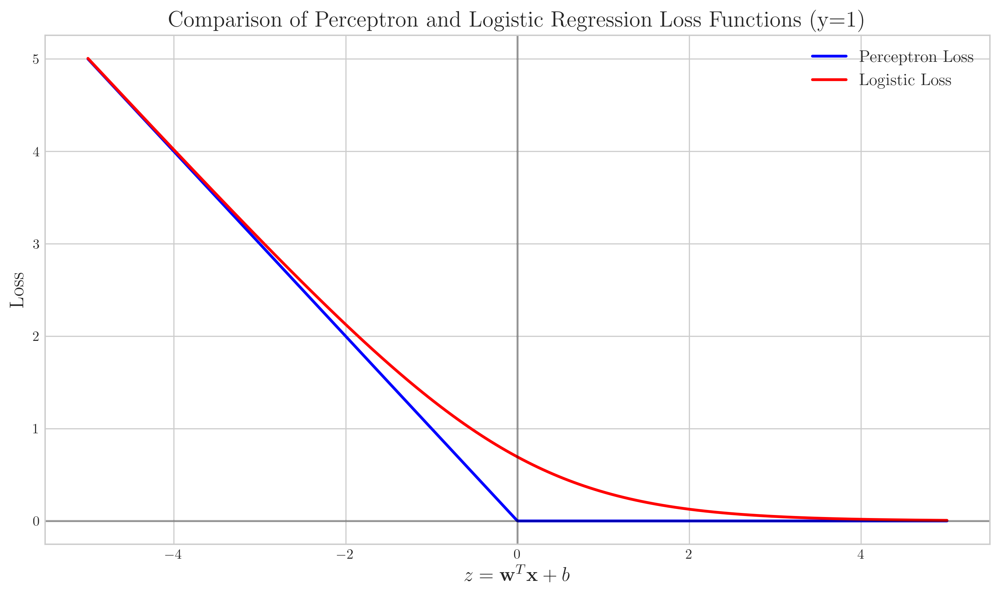
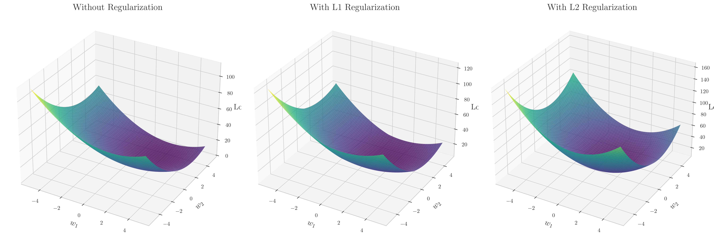
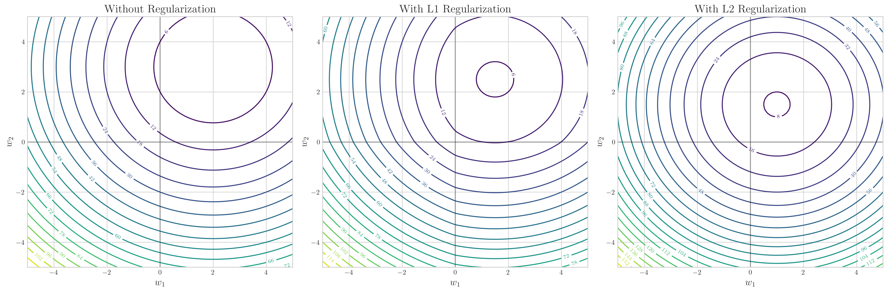
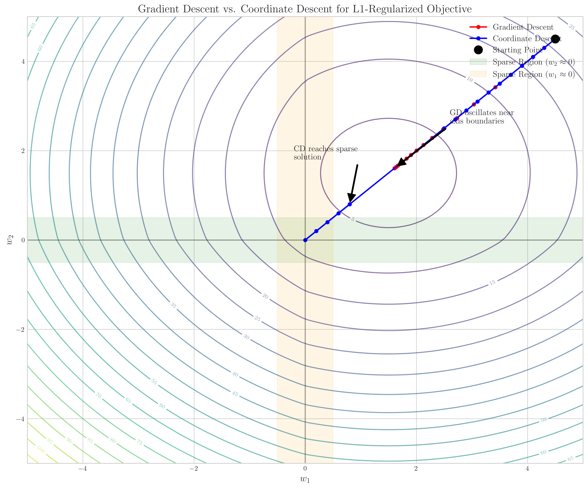
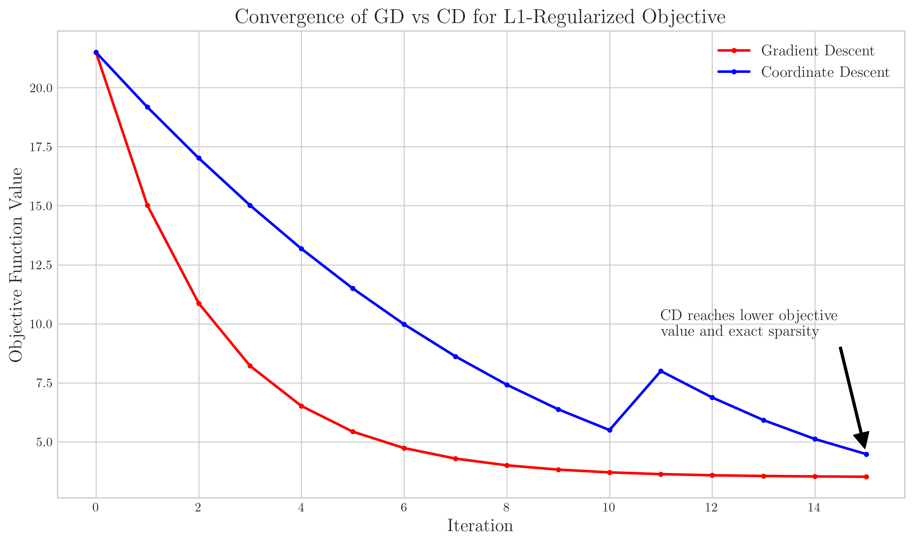

# Question 10: Optimization Objectives for Linear Classifiers

## Problem Statement
Consider different optimization objectives for linear classifiers.

### Task
1. Compare the optimization objectives of the perceptron algorithm and logistic regression in one sentence each
2. How does adding L1 regularization affect the optimization landscape? Answer in one sentence
3. How does adding L2 regularization affect the optimization landscape? Answer in one sentence
4. Why might coordinate descent be preferable to gradient descent for L1-regularized objectives? Answer in one sentence

## Understanding the Problem
This question asks us to compare different optimization objectives used in machine learning models, particularly for linear classifiers. We need to understand how perceptron and logistic regression differ in their loss functions, how regularization changes the optimization landscape, and the advantages of different optimization algorithms.

## Solution

### Step 1: Compare Perceptron and Logistic Regression Objectives

#### One-sentence answers:
1. **Perceptron**: The perceptron objective minimizes the number of misclassification errors with a hinge loss that becomes zero for correctly classified points.
2. **Logistic Regression**: Logistic regression minimizes the negative log-likelihood with a loss that continues to improve the model's confidence even for correctly classified points.

Let's examine the loss functions for perceptron and logistic regression:

The perceptron algorithm uses a hinge loss function:
$$L_{perceptron}(y, z) = \max(0, -y \cdot z)$$

where $y \in \{-1, 1\}$ is the true label and $z = w^Tx + b$ is the model's prediction before activation.

Logistic regression uses a log loss function:
$$L_{logistic}(y, z) = \log(1 + \exp(-y \cdot z))$$

Here's a visualization of both loss functions for a positive example ($y=1$):

The key difference is that the perceptron loss becomes zero once a point is correctly classified (when $y \cdot z > 0$), while the logistic loss continues to decrease (approaching zero) as the confidence in the correct prediction increases. This means the perceptron algorithm stops updating weights once all points are correctly classified, while logistic regression continues to improve the model's confidence in its predictions.

### Step 2: Examine the Effect of L1 Regularization

#### One-sentence answer:
**L1 Regularization Effect**: L1 regularization creates corners and edges in the optimization landscape, making it non-differentiable at zero and promoting sparse solutions by pushing parameters exactly to zero.

L1 regularization adds the term $\lambda ||w||_1 = \lambda \sum_i |w_i|$ to the objective function.

Let's visualize how this affects the optimization landscape:

The L1 regularization changes the smooth bowl-shaped loss surface to one with corners and edges. The most notable effect is at the axes, where the regularization term creates sharp points. These areas correspond to sparse solutions where some weights are exactly zero.

Here are contour plots to better visualize this effect:

Note how the contour lines for L1 regularization form diamond shapes with corners along the axes. These corners create regions where the gradient points toward setting one or more parameters exactly to zero, promoting sparsity in the solution.

### Step 3: Examine the Effect of L2 Regularization

#### One-sentence answer:
**L2 Regularization Effect**: L2 regularization maintains a smooth, differentiable optimization landscape while making it more bowl-shaped, shrinking weights proportionally but rarely setting any to exactly zero.

L2 regularization adds the term $\lambda ||w||_2^2 = \lambda \sum_i w_i^2$ to the objective function.

Looking at the same visualizations (above), we can see that L2 regularization maintains the smooth, differentiable nature of the optimization landscape but makes it more "bowl-shaped" with a stronger pull toward the origin. This shrinks all weights proportionally but rarely sets any to exactly zero.

The contour plot shows that L2 regularization produces circular contours around the minimum, resulting in weights being shrunk proportionally in all directions.

### Step 4: Compare Coordinate Descent vs. Gradient Descent for L1 Regularization

#### One-sentence answer:
**Coordinate Descent for L1**: Coordinate descent is preferable to gradient descent for L1-regularized objectives because it can move exactly to zero along one coordinate, naturally handles the non-differentiability of the L1 term, and avoids the zigzag pattern that gradient descent exhibits when approaching sparse solutions.

Let's see how these optimization algorithms perform on an L1-regularized objective:

The key difference is that coordinate descent updates one parameter at a time, allowing it to move directly along coordinate axes. This is particularly advantageous for L1-regularized problems because:

1. It can set a parameter exactly to zero in one step
2. It naturally handles the non-differentiability of the L1 term at zero
3. It avoids the "zigzagging" behavior of gradient descent near the axes

Looking at the convergence plot:

We can see that coordinate descent typically reaches a lower objective value and finds sparser solutions more efficiently than gradient descent for L1-regularized problems.

## Mathematical Analysis

### Perceptron vs. Logistic Regression
From a mathematical perspective, the perceptron update rule is:
$$w \leftarrow w + \eta y x \text{ if } y(w^Tx) \leq 0$$

This only updates weights when points are misclassified. For logistic regression, the gradient is:
$$\nabla_w L = -\frac{yx}{1 + e^{yw^Tx}}$$

This gradient is always non-zero (though approaches zero for confident predictions), leading to continuous updates.

### L1 Regularization
With L1 regularization, the objective function becomes:
$$J(w) = L(w) + \lambda ||w||_1$$

The gradient (or subgradient) at each dimension is:
$$\frac{\partial J}{\partial w_i} = \frac{\partial L}{\partial w_i} + \lambda \text{sign}(w_i)$$

This creates a discontinuity at $w_i = 0$, leading to the "corners" in the optimization landscape.

### L2 Regularization
With L2 regularization, the objective function becomes:
$$J(w) = L(w) + \lambda ||w||_2^2$$

The gradient at each dimension is:
$$\frac{\partial J}{\partial w_i} = \frac{\partial L}{\partial w_i} + 2\lambda w_i$$

This adds a smooth, continuous pull toward zero.

### Coordinate Descent for L1
For coordinate descent with L1 regularization, we optimize one parameter at a time:
$$w_i \leftarrow \text{arg min}_{w_i} \left[ L(w) + \lambda |w_i| \right]$$

For certain loss functions, this can be solved in closed-form using the soft-thresholding operator:
$$w_i = \text{S}_{\lambda}(u_i) = \text{sign}(u_i) \max(|u_i| - \lambda, 0)$$

where $u_i$ is what $w_i$ would be without regularization.

## Key Insights

### Optimization Objectives
- **Perceptron**: Uses hinge loss which becomes zero for correctly classified points, meaning the algorithm stops updating once all points are correctly classified.
- **Logistic Regression**: Uses log loss which always has non-zero gradients even for correctly classified points, allowing the model to continue improving its confidence.

### Regularization Effects
- **L1 Regularization**: Creates corners and edges in the loss landscape, making it non-differentiable at zero and promoting sparse solutions by pushing parameters exactly to zero.
- **L2 Regularization**: Creates a smoother, more bowl-shaped loss landscape that remains differentiable everywhere, shrinking weights proportionally but rarely setting any to exactly zero.

### Optimization Algorithms
- **Gradient Descent**: Updates all parameters simultaneously using gradient information, but can oscillate near the axes for L1-regularized problems.
- **Coordinate Descent**: Updates one parameter at a time, can set parameters exactly to zero, and naturally handles the non-differentiability of L1-regularized problems.

## Conclusion

1. **Perceptron vs. Logistic Regression**: The perceptron objective minimizes the number of misclassification errors with a hinge loss that becomes zero for correctly classified points, while logistic regression minimizes the negative log-likelihood with a loss that continues to improve the model's confidence even for correctly classified points.

2. **L1 Regularization Effect**: L1 regularization creates corners and edges in the optimization landscape, making it non-differentiable at zero and promoting sparse solutions by pushing parameters exactly to zero.

3. **L2 Regularization Effect**: L2 regularization maintains a smooth, differentiable optimization landscape while making it more bowl-shaped, shrinking weights proportionally but rarely setting any to exactly zero.

4. **Coordinate Descent for L1**: Coordinate descent is preferable to gradient descent for L1-regularized objectives because it can move exactly to zero along one coordinate, naturally handles the non-differentiability of the L1 term, and avoids the zigzag pattern that gradient descent exhibits when approaching sparse solutions. 