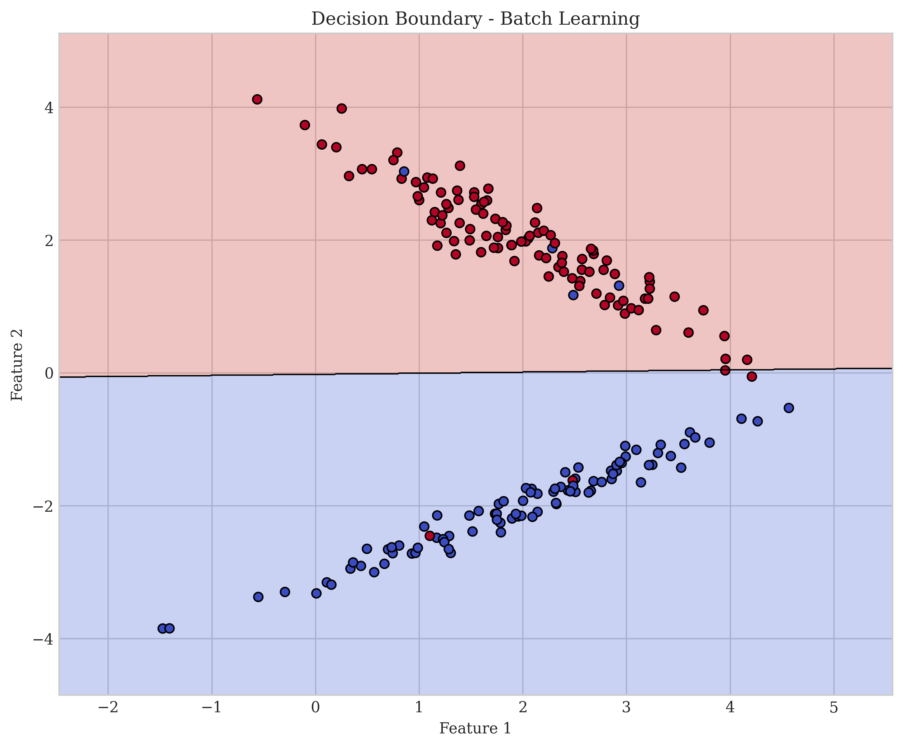
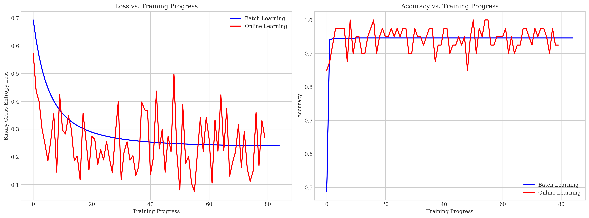
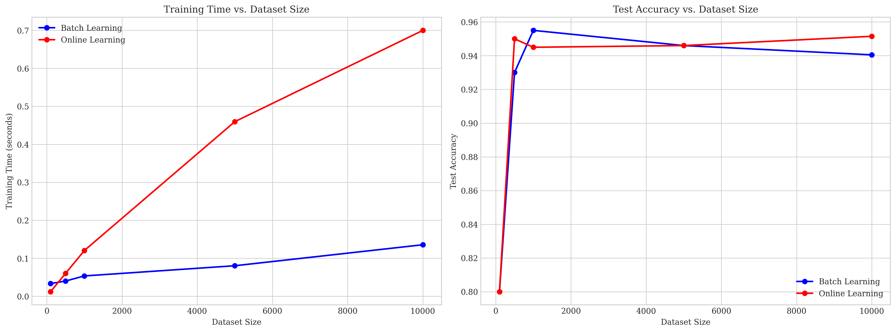
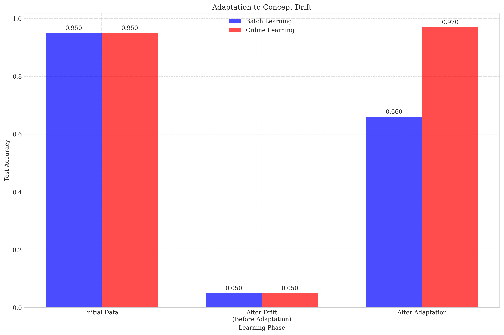
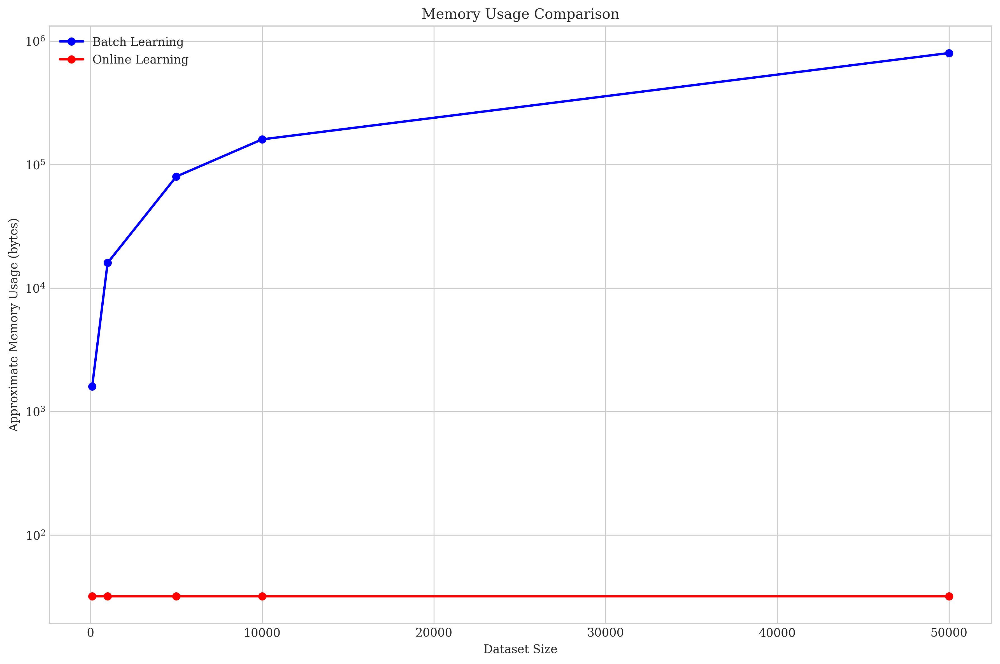

# Question 1: Batch vs. Online Learning for Linear Classifiers

## Problem Statement
Compare and contrast batch learning and online learning approaches for optimizing linear classifiers.

### Task
1. Define batch learning and online learning in one sentence each
2. List two advantages of online learning over batch learning
3. List two advantages of batch learning over online learning
4. Name one algorithm that is inherently online and one that is inherently batch

## Understanding the Problem
This question requires us to understand the fundamental differences between batch and online learning approaches, specifically in the context of linear classifiers. Linear classifiers are models that make a classification decision based on a linear combination of input features. Two common approaches for training such models are batch learning and online learning, each with its own advantages and disadvantages.

## Solution

### Defining Batch and Online Learning

#### Batch Learning
Batch learning processes the entire training dataset simultaneously to update model parameters once per iteration, using the gradient of the loss function computed over all examples.

#### Online Learning
Online learning updates model parameters incrementally after processing each individual training example, making it suitable for streaming data and large datasets that don't fit in memory.

### Implementation Analysis
To better understand the differences between these approaches, we implemented logistic regression using both batch gradient descent and online (stochastic) gradient descent.

### Step 1: Implementation of Batch Learning
For batch learning, we implemented logistic regression with batch gradient descent:

```python
# Compute gradients (batch gradient descent)
dw = (1 / n_samples) * np.dot(X.T, (y_pred - y))
db = (1 / n_samples) * np.sum(y_pred - y)

# Update parameters
self.weights -= self.learning_rate * dw
self.bias -= self.learning_rate * db
```

### Step 2: Implementation of Online Learning
For online learning, we implemented logistic regression with stochastic gradient descent:

```python
# Compute gradients (online/stochastic gradient descent)
dw = np.dot(x_i.T, (y_pred - y_i))
db = np.sum(y_pred - y_i)

# Update parameters
self.weights -= self.learning_rate * dw
self.bias -= self.learning_rate * db
```

### Step 3: Comparing Decision Boundaries
Both methods achieve similar decision boundaries on our binary classification task:




### Step 4: Training Progress Comparison
The training progress comparison shows that:
- Online learning exhibits more variance/noise in both loss and accuracy curves
- Batch learning shows smoother convergence behavior
- Both approaches eventually reach similar performance levels



### Step 5: Scalability Analysis
The scalability analysis reveals important differences:
- Online learning scales better with dataset size in terms of training time
- For very large datasets, the difference becomes more significant
- Both maintain comparable accuracy levels across dataset sizes



### Step 6: Concept Drift Adaptation
A significant advantage of online learning is its ability to adapt to concept drift (when the statistical properties of the target variable change over time):



Our experiment shows that:
- Both methods perform similarly on the initial data distribution
- Both struggle when confronted with shifted data distribution
- After adaptation, online learning can adapt incrementally without retraining on the entire dataset
- Batch learning requires complete retraining with both old and new data

### Step 7: Memory Usage Analysis
Memory usage comparison demonstrates a clear advantage of online learning for large datasets:



The log-scale plot shows how batch learning memory requirements grow linearly with dataset size, while online learning remains constant.

## Advantages of Online Learning over Batch Learning

1. **Memory Efficiency**: Online learning only needs to store the model parameters and the current training example, making it ideal for very large datasets that don't fit in memory.

2. **Adaptability to New Data**: Online methods can continuously adapt to new data points and evolving patterns without reprocessing the entire dataset, making them suitable for handling concept drift in dynamic environments.

3. **Scalability**: Online learning scales better with dataset size, as computational requirements don't increase linearly with the number of examples.

4. **Real-time Learning**: Can update models in real-time as new data arrives, which is critical for applications like fraud detection, recommendation systems, and online advertising.

## Advantages of Batch Learning over Online Learning

1. **Convergence Stability**: Batch methods provide more stable convergence with less noise in the optimization process, as gradients are computed using the entire dataset.

2. **Better Utilization of Parallel Computing**: Batch methods can more easily leverage parallel computing architectures, as calculations can be distributed across multiple processors.

3. **Reproducibility**: Results are more reproducible as the randomness in training order is eliminated.

4. **Guaranteed Convergence to Local Minima**: For convex optimization problems, batch gradient descent is guaranteed to converge to the global minimum with properly tuned learning rates.

## Inherently Online vs Batch Algorithms

### Inherently Online Algorithms
- **Stochastic Gradient Descent (SGD)**: Updates model parameters after seeing each individual example.
- **Online Passive-Aggressive Algorithms**: Makes the smallest change to the model that ensures the current example is correctly classified.
- **Perceptron Algorithm**: The original formulation updates weights after each misclassified example.
- **Reinforcement Learning Algorithms**: Many reinforcement learning algorithms like Q-learning operate in an online fashion.

### Inherently Batch Algorithms
- **Support Vector Machines (SVM)**: Traditional SVM optimization requires access to the entire dataset at once to find the maximum margin hyperplane.
- **Principal Component Analysis (PCA)**: Requires the entire data matrix to compute the covariance matrix and its eigenvectors.
- **Random Forest**: Builds multiple decision trees using bootstrap samples of the entire dataset.
- **Newton's Method for Optimization**: Requires computing the Hessian matrix using the entire dataset.

## Key Insights

### Implementation Considerations
- Choice between batch and online learning depends on dataset size, available computational resources, and the problem's dynamic nature
- For static problems with moderate dataset sizes, batch learning often provides better optimization
- For dynamic problems or very large datasets, online learning is typically more practical

### Practical Applications
- Batch learning is common in traditional machine learning pipelines with fixed datasets
- Online learning is prevalent in systems that process streams of data like recommendation engines, ad targeting, and financial market prediction

### Hybrid Approaches
- Mini-batch gradient descent combines elements of both approaches by updating parameters using small batches of data
- This provides a balance between the convergence stability of batch methods and the efficiency of online methods

## Conclusion
Both batch and online learning approaches have their place in optimizing linear classifiers. The choice between them depends on specific requirements related to memory constraints, dataset size, prediction accuracy needs, and whether the data distribution changes over time. In practice, mini-batch approaches often provide a good compromise, offering reasonably stable convergence while maintaining good computational efficiency. 