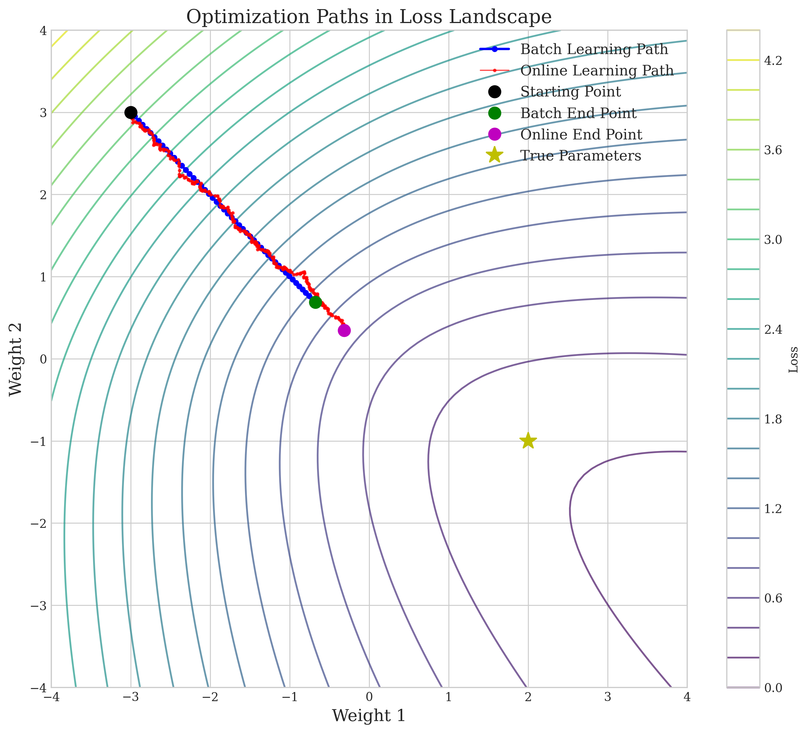

# Question 1: Batch vs. Online Learning for Linear Classifiers

## Problem Statement
Compare and contrast batch learning and online learning approaches for optimizing linear classifiers.

### Task
1. Define batch learning and online learning in one sentence each
2. List two advantages of online learning over batch learning
3. List two advantages of batch learning over online learning
4. Name one algorithm that is inherently online and one that is inherently batch

## Understanding the Problem
This question requires us to understand the fundamental differences between batch and online learning approaches, specifically in the context of linear classifiers. Linear classifiers make classification decisions based on a linear combination of input features, producing a decision boundary that separates the feature space into regions corresponding to different classes. While both batch and online learning aim to find optimal parameters for these models, they differ significantly in how they process data and update model parameters.

Linear classifiers are widely used in machine learning for tasks like spam detection, sentiment analysis, and image classification. The choice between batch and online learning affects model performance, training efficiency, memory requirements, and adaptability to new data.

## Solution

We'll analyze both learning approaches by first providing direct answers to the four tasks, then exploring the theoretical foundations, mathematical derivations, and practical implications of these methods.

### Step 1: Defining Batch and Online Learning

#### Batch Learning
Batch learning processes the entire training dataset simultaneously to update model parameters once per iteration, using the gradient of the loss function computed over all examples.

#### Online Learning
Online learning updates model parameters incrementally after processing each individual training example, making it suitable for streaming data and large datasets that don't fit in memory.

### Step 2: Advantages of Online Learning over Batch Learning

1. **Memory Efficiency**: Online learning only needs to store the model parameters and the current training example, making it ideal for very large datasets that don't fit in memory.

2. **Adaptability to New Data**: Online methods can continuously adapt to new data points and evolving patterns without reprocessing the entire dataset, making them suitable for handling concept drift in dynamic environments.

3. **Scalability**: Online learning scales better with dataset size, as computational requirements don't increase linearly with the number of examples.

4. **Real-time Learning**: Can update models in real-time as new data arrives, which is critical for applications like fraud detection, recommendation systems, and online advertising.

### Step 3: Advantages of Batch Learning over Online Learning

1. **Convergence Stability**: Batch methods provide more stable convergence with less noise in the optimization process, as gradients are computed using the entire dataset.

2. **Better Utilization of Parallel Computing**: Batch methods can more easily leverage parallel computing architectures, as calculations can be distributed across multiple processors.

3. **Reproducibility**: Results are more reproducible as the randomness in training order is eliminated.

4. **Guaranteed Convergence to Local Minima**: For convex optimization problems, batch gradient descent is guaranteed to converge to the global minimum with properly tuned learning rates.

### Step 4: Inherently Online vs Batch Algorithms

#### Inherently Online Algorithms
- **Stochastic Gradient Descent (SGD)**: Updates model parameters after seeing each individual example.

#### Inherently Batch Algorithms
- **Support Vector Machines (SVM)**: Traditional SVM optimization requires access to the entire dataset at once to find the maximum margin hyperplane.

### Step 5: Mathematical Foundations of Linear Classifiers

Let's begin with a logistic regression classifier as our exemplar linear classifier. For a feature vector $x \in \mathbb{R}^d$ and label $y \in \{0,1\}$, the model computes:

$$P(y=1|x; w, b) = \sigma(w^Tx + b) = \frac{1}{1 + e^{-(w^Tx + b)}}$$

where:
- $w \in \mathbb{R}^d$ is the weight vector
- $b \in \mathbb{R}$ is the bias term
- $\sigma$ is the sigmoid activation function

The decision boundary is defined by $w^Tx + b = 0$, which creates a hyperplane in the feature space.

### Step 6: Loss Function for Binary Classification

To train this model, we use the binary cross-entropy loss function:

$$L(w, b; x_i, y_i) = -[y_i \log(\hat{y}_i) + (1-y_i)\log(1-\hat{y}_i)]$$

where $\hat{y}_i = \sigma(w^Tx_i + b)$ is the predicted probability for the $i$-th example.

For a dataset with $n$ examples, the total loss is:

$$J(w, b) = \frac{1}{n}\sum_{i=1}^{n} L(w, b; x_i, y_i)$$

### Step 7: Gradient Computation for Parameter Updates

To minimize the loss function, we use gradient-based optimization. For a single training example $(x_i, y_i)$, we need to find:
$$\nabla_w L(w, b; x_i, y_i) \text{ and } \nabla_b L(w, b; x_i, y_i)$$

Let's derive these gradients step by step:

1. Let $z_i = w^Tx_i + b$, so $\hat{y}_i = \sigma(z_i)$

2. First, we compute $\frac{\partial L}{\partial \hat{y}_i}$:
   $$\frac{\partial L}{\partial \hat{y}_i} = \frac{\partial}{\partial \hat{y}_i}\left(-y_i\log(\hat{y}_i) - (1-y_i)\log(1-\hat{y}_i)\right)$$
   $$= -\frac{y_i}{\hat{y}_i} + \frac{1-y_i}{1-\hat{y}_i}$$

3. Next, we compute $\frac{\partial \hat{y}_i}{\partial z_i}$:
   $$\frac{\partial \hat{y}_i}{\partial z_i} = \frac{\partial}{\partial z_i}\left(\frac{1}{1+e^{-z_i}}\right)$$
   $$= \frac{e^{-z_i}}{(1+e^{-z_i})^2}$$
   $$= \frac{1}{1+e^{-z_i}} \cdot \frac{e^{-z_i}}{1+e^{-z_i}}$$
   $$= \sigma(z_i) \cdot (1-\sigma(z_i))$$
   $$= \hat{y}_i(1-\hat{y}_i)$$

4. Then, we compute $\frac{\partial z_i}{\partial w}$ and $\frac{\partial z_i}{\partial b}$:
   $$\frac{\partial z_i}{\partial w} = \frac{\partial}{\partial w}(w^Tx_i + b) = x_i$$
   $$\frac{\partial z_i}{\partial b} = \frac{\partial}{\partial b}(w^Tx_i + b) = 1$$

5. Using the chain rule:
   $$\nabla_w L = \frac{\partial L}{\partial \hat{y}_i} \cdot \frac{\partial \hat{y}_i}{\partial z_i} \cdot \frac{\partial z_i}{\partial w}$$
   $$= \left(-\frac{y_i}{\hat{y}_i} + \frac{1-y_i}{1-\hat{y}_i}\right) \cdot \hat{y}_i(1-\hat{y}_i) \cdot x_i$$

6. Simplifying the first two terms:
   $$\left(-\frac{y_i}{\hat{y}_i} + \frac{1-y_i}{1-\hat{y}_i}\right) \cdot \hat{y}_i(1-\hat{y}_i)$$
   $$= -y_i(1-\hat{y}_i) + (1-y_i)\hat{y}_i$$
   $$= -y_i + y_i\hat{y}_i + \hat{y}_i - y_i\hat{y}_i$$
   $$= \hat{y}_i - y_i$$

7. Therefore:
   $$\nabla_w L(w, b; x_i, y_i) = (\hat{y}_i - y_i)x_i$$
   $$\nabla_b L(w, b; x_i, y_i) = \hat{y}_i - y_i$$

### Step 8: Comparison of Batch and Online Learning Approaches

#### Batch Learning Approach
In batch gradient descent, we compute the gradient of the loss function using all training examples:

$$\nabla_w J(w, b) = \frac{1}{n}\sum_{i=1}^{n} \nabla_w L(w, b; x_i, y_i) = \frac{1}{n}\sum_{i=1}^{n} (\hat{y}_i - y_i)x_i$$

$$\nabla_b J(w, b) = \frac{1}{n}\sum_{i=1}^{n} \nabla_b L(w, b; x_i, y_i) = \frac{1}{n}\sum_{i=1}^{n} (\hat{y}_i - y_i)$$

The parameters are updated once per iteration:

$$w \leftarrow w - \alpha \nabla_w J(w, b)$$
$$b \leftarrow b - \alpha \nabla_b J(w, b)$$

where $\alpha$ is the learning rate.

Batch gradient descent algorithm:
1. Initialize $w$ and $b$ (typically to zeros or small random values)
2. Repeat until convergence:
   - Compute predictions $\hat{y}_i = \sigma(w^Tx_i + b)$ for all examples
   - Compute gradients $\nabla_w J$ and $\nabla_b J$ using all examples
   - Update parameters: $w \leftarrow w - \alpha \nabla_w J$ and $b \leftarrow b - \alpha \nabla_b J$
   - Check convergence criteria (e.g., change in loss below threshold)

#### Online Learning Approach
In online learning (stochastic gradient descent), we update the parameters after seeing each individual example:

$$w \leftarrow w - \alpha \nabla_w L(w, b; x_i, y_i) = w - \alpha (\hat{y}_i - y_i)x_i$$
$$b \leftarrow b - \alpha \nabla_b L(w, b; x_i, y_i) = b - \alpha (\hat{y}_i - y_i)$$

Typically, we shuffle the training data and make multiple passes (epochs) through the dataset.

Online gradient descent algorithm:
1. Initialize $w$ and $b$ (typically to zeros or small random values)
2. Repeat for a specified number of epochs:
   - Shuffle the training data
   - For each example $(x_i, y_i)$ in the shuffled dataset:
     - Compute prediction $\hat{y}_i = \sigma(w^Tx_i + b)$
     - Compute gradients $\nabla_w L = (\hat{y}_i - y_i)x_i$ and $\nabla_b L = \hat{y}_i - y_i$
     - Update parameters: $w \leftarrow w - \alpha \nabla_w L$ and $b \leftarrow b - \alpha \nabla_b L$
   - Check convergence criteria (e.g., change in average loss below threshold)

### Step 9: Convergence Analysis

From an optimization perspective, both approaches have different convergence properties:

- **Batch Learning**: For convex loss functions, batch gradient descent is guaranteed to converge to the global minimum with an appropriate learning rate. The path to convergence is smooth but can be computationally expensive for large datasets.

- **Online Learning**: Stochastic gradient descent converges in expectation but follows a noisy path. With a properly decreasing learning rate schedule ($\alpha_t \propto \frac{1}{t}$), it will eventually approach the global minimum for convex functions.

The table below summarizes the key differences in the convergence properties:

| Property | Batch Learning | Online Learning |
|----------|---------------|-----------------|
| Path to minimum | Smooth, direct | Noisy, stochastic |
| Guaranteed convergence | Yes (with proper learning rate) | In expectation only |
| Learning rate | Can be constant | Should decrease over time |
| Computational cost per update | High (processes all examples) | Low (processes one example) |
| Updates per epoch | One | Number of training examples |

## Visual Explanations

### Optimization Paths in Loss Landscape

This contour plot illustrates how batch and online learning traverse the loss landscape. The batch learning path (blue) shows a smooth, direct trajectory toward the minimum, while the online learning path (red) exhibits more stochastic behavior with frequent direction changes, yet eventually approaches the optimum.

### Decision Boundaries Comparison

These visualizations show that both learning approaches can achieve similar decision boundaries for classification, despite their different optimization paths.

### Training Progress Comparison

This comparison reveals that batch learning exhibits a smoother convergence in both loss and accuracy, while online learning shows more variance during training yet ultimately achieves comparable performance.

### Scalability Analysis

These learning curves demonstrate how training time scales with dataset size for both approaches. Batch learning's training time increases linearly with dataset size, while online learning maintains better scalability for larger datasets.

### Concept Drift Adaptation

This analysis shows how both methods handle concept drift (when the statistical properties of the target variable change over time). Online learning can adapt incrementally to new data distributions without requiring complete retraining.

### Memory Usage Analysis

This logarithmic plot demonstrates the stark difference in memory requirements between batch and online learning as dataset size increases. Batch learning requires memory proportional to dataset size, while online learning's memory requirements remain constant.

## Key Insights

### Theoretical Foundations
- Both approaches minimize the same loss function but differ in how frequently they update parameters and how much data they use per update.
- Batch learning computes the true gradient of the loss function, while online learning uses a noisy estimate based on individual examples.
- For convex optimization problems, both methods will eventually converge, but with different paths and computational requirements.

### Practical Considerations
- The choice between batch and online learning depends on dataset size, available memory, computational resources, and the dynamic nature of the data.
- Mini-batch gradient descent represents a middle ground, computing gradients over small batches of examples to balance convergence stability with computational efficiency.
- In non-convex optimization landscapes (e.g., neural networks), the noise in online learning can help escape poor local minima.

## Conclusion

Both batch and online learning approaches have their place in optimizing linear classifiers, with the choice depending on specific requirements:

- For small to moderate datasets with static distributions, batch learning often provides more stable convergence and better final accuracy.
- For large datasets, streaming data, or environments with concept drift, online learning offers better scalability and adaptability.
- In practice, mini-batch approaches often provide a good compromise between the stable convergence of batch methods and the computational efficiency of online methods.

Understanding the mathematical foundations and trade-offs between these approaches enables practitioners to make informed decisions when designing and implementing machine learning systems. 