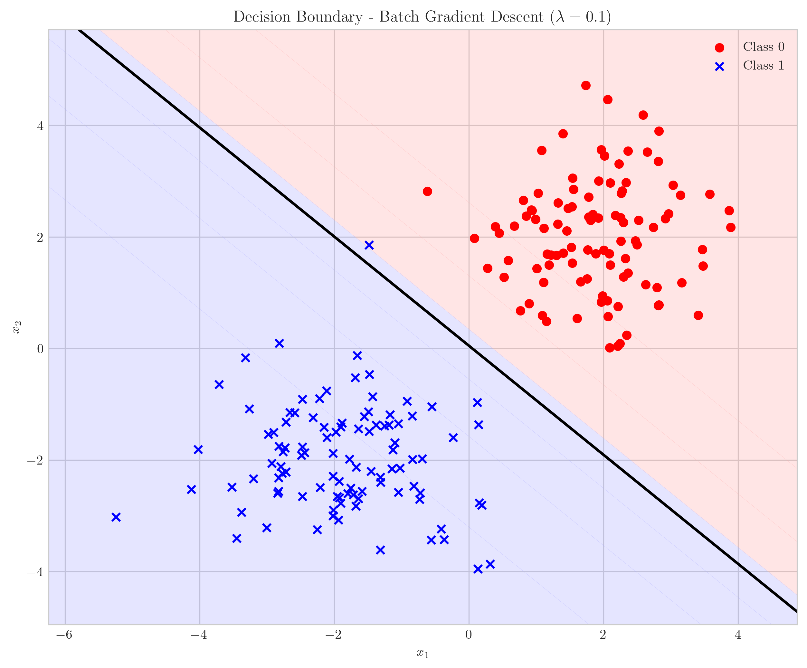
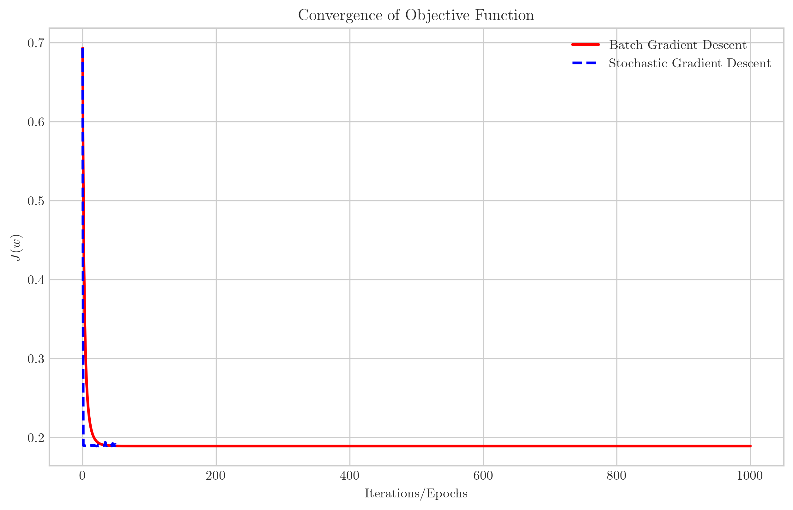
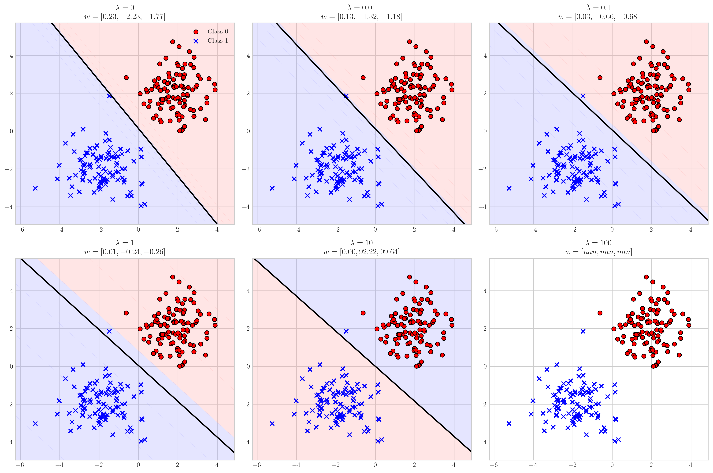

# Question 2: Logistic Regression Gradient Descent

## Problem Statement
Consider the following objective function for a logistic regression model:

$$J(w) = -\frac{1}{N} \sum_{i=1}^{N} [y_i \log(h_w(x_i)) + (1-y_i) \log(1-h_w(x_i))] + \lambda \|w\|^2$$

where $h_w(x_i) = \frac{1}{1 + e^{-w^T x_i}}$ is the sigmoid function.

### Task
1. Compute the gradient $\nabla J(w)$ with respect to the weights $w$
2. Write the update rule for gradient descent optimization
3. Write the update rule for stochastic gradient descent optimization
4. What is the role of $\lambda$ in this objective function? Answer in one sentence

## Understanding the Problem
This problem focuses on logistic regression, which is a fundamental binary classification algorithm. The objective function $J(w)$ consists of two terms:
1. The cross-entropy loss, which measures the discrepancy between predicted probabilities and actual binary labels
2. An L2 regularization term $\lambda \|w\|^2$, which penalizes large weight values

The sigmoid function $h_w(x_i)$ transforms the linear combination of features and weights into a probability value between 0 and 1. To optimize the objective function, we need to compute its gradient and use it in gradient descent algorithms.

## Solution

### Step 1: Computing the Gradient $\nabla J(w)$

We begin by computing the gradient of the objective function with respect to weights $w$. We'll break this down into two parts: the gradient of the cross-entropy loss and the gradient of the regularization term.

First, let's consider the cross-entropy loss term:
$$L(w) = -\frac{1}{N} \sum_{i=1}^{N} [y_i \log(h_w(x_i)) + (1-y_i) \log(1-h_w(x_i))]$$

Using the chain rule, we compute the partial derivative with respect to $w_j$:
$$\frac{\partial L}{\partial w_j} = -\frac{1}{N} \sum_{i=1}^{N} \left[y_i \cdot \frac{1}{h_w(x_i)} \cdot \frac{\partial h_w(x_i)}{\partial w_j} - (1-y_i) \cdot \frac{1}{1-h_w(x_i)} \cdot \frac{\partial h_w(x_i)}{\partial w_j}\right]$$

The derivative of the sigmoid function is:
$$\frac{\partial h_w(x_i)}{\partial w_j} = h_w(x_i) \cdot (1 - h_w(x_i)) \cdot x_{ij}$$

Where $x_{ij}$ is the $j$-th feature of the $i$-th sample.

Substituting this into our expression:
$$\frac{\partial L}{\partial w_j} = -\frac{1}{N} \sum_{i=1}^{N} \left[y_i \cdot \frac{1}{h_w(x_i)} \cdot h_w(x_i) \cdot (1 - h_w(x_i)) \cdot x_{ij} - (1-y_i) \cdot \frac{1}{1-h_w(x_i)} \cdot h_w(x_i) \cdot (1 - h_w(x_i)) \cdot x_{ij}\right]$$

Simplifying:
$$\frac{\partial L}{\partial w_j} = -\frac{1}{N} \sum_{i=1}^{N} \left[y_i \cdot (1 - h_w(x_i)) \cdot x_{ij} - (1-y_i) \cdot h_w(x_i) \cdot x_{ij}\right]$$

Further simplification:
$$\frac{\partial L}{\partial w_j} = -\frac{1}{N} \sum_{i=1}^{N} \left[y_i \cdot x_{ij} - y_i \cdot h_w(x_i) \cdot x_{ij} - h_w(x_i) \cdot x_{ij} + y_i \cdot h_w(x_i) \cdot x_{ij}\right]$$

$$\frac{\partial L}{\partial w_j} = -\frac{1}{N} \sum_{i=1}^{N} \left[(y_i - h_w(x_i)) \cdot x_{ij}\right]$$

$$\frac{\partial L}{\partial w_j} = \frac{1}{N} \sum_{i=1}^{N} \left[(h_w(x_i) - y_i) \cdot x_{ij}\right]$$

Next, we compute the gradient of the regularization term:
$$R(w) = \lambda \|w\|^2 = \lambda \sum_{j=1}^{d} w_j^2$$

The derivative with respect to $w_j$ is:
$$\frac{\partial R}{\partial w_j} = 2\lambda w_j$$

Typically, we don't regularize the bias term $w_0$, so:
$$\frac{\partial R}{\partial w_j} = \begin{cases} 
0 & \text{if } j = 0 \\
2\lambda w_j & \text{if } j > 0
\end{cases}$$

Combining both terms, the full gradient is:
$$\frac{\partial J}{\partial w_j} = \frac{1}{N} \sum_{i=1}^{N} \left[(h_w(x_i) - y_i) \cdot x_{ij}\right] + \begin{cases} 
0 & \text{if } j = 0 \\
2\lambda w_j & \text{if } j > 0
\end{cases}$$

In vector form, this can be written as:
$$\nabla J(w) = \frac{1}{N} X^T(h_w(X) - y) + 2\lambda \tilde{w}$$

Where $\tilde{w}$ is the vector $w$ with the first element (bias term) set to zero: $\tilde{w} = [0, w_1, w_2, \ldots, w_d]^T$.

### Step 2: Batch Gradient Descent Update Rule

In batch gradient descent, we update the weights using the full gradient computed over the entire dataset:

$$w := w - \alpha \nabla J(w)$$

Where $\alpha$ is the learning rate. Substituting our expression for the gradient:

$$w := w - \alpha \left[\frac{1}{N} X^T(h_w(X) - y) + 2\lambda \tilde{w}\right]$$

This update is performed repeatedly until convergence or for a fixed number of iterations.

### Step 3: Stochastic Gradient Descent Update Rule

In stochastic gradient descent (SGD), instead of using the entire dataset, we update the weights based on a single training example at each step:

For each sample $(x_i, y_i)$:
$$w := w - \alpha \left[(h_w(x_i) - y_i)x_i + 2\lambda \tilde{w}\right]$$

Where $(x_i, y_i)$ is a single training example randomly selected from the dataset. This process is repeated, cycling through all training examples (usually after shuffling), for multiple epochs.

Comparison of the convergence behavior of batch gradient descent and stochastic gradient descent:

As shown in the plot, SGD typically converges faster but with more noise, while BGD has a smoother convergence path.

### Step 4: Role of $\lambda$ in the Objective Function

The parameter $\lambda$ controls the strength of L2 regularization, preventing overfitting by penalizing large weight values, thereby encouraging simpler models with better generalization.

As illustrated in the figure, as $\lambda$ increases:
- When $\lambda = 0$: No regularization, potentially leading to overfitting
- Small $\lambda$ values (0.01, 0.1): Slight regularization that maintains model flexibility
- Medium $\lambda$ values (1): Balance between fitting the data and keeping weights small
- Large $\lambda$ values (10, 100): Strong regularization that can lead to underfitting

Note that with higher $\lambda$ values, the magnitude of weights decreases as shown by the weight values in each subplot.

## Key Insights

### Mathematical Understanding
- The gradient of the logistic regression objective function has an elegant form: $\nabla J(w) = \frac{1}{N} X^T(h_w(X) - y) + 2\lambda \tilde{w}$
- The cross-entropy term in the gradient represents the error (difference between predictions and actual labels) weighted by the features
- The regularization term in the gradient pulls weights toward zero, with strength proportional to $\lambda$

### Optimization Techniques
- Batch gradient descent uses the entire dataset to compute the gradient, resulting in a more stable but potentially slower convergence
- Stochastic gradient descent uses a single sample at a time, leading to noisier updates but often faster initial convergence
- Learning rate $\alpha$ must be carefully chosen: too large can lead to divergence, too small can lead to slow convergence

### Regularization Effects
- The $\lambda$ parameter provides a direct way to control the trade-off between fitting the training data and keeping the model simple
- Larger $\lambda$ values result in smaller weights and smoother decision boundaries
- Regularization is especially important when the number of features is large compared to the number of training examples

## Conclusion
- The gradient of the logistic regression objective function is $\nabla J(w) = \frac{1}{N} X^T(h_w(X) - y) + 2\lambda \tilde{w}$
- Batch gradient descent updates all weights simultaneously using the entire dataset: $w := w - \alpha \left[\frac{1}{N} X^T(h_w(X) - y) + 2\lambda \tilde{w}\right]$
- Stochastic gradient descent updates weights using a single sample at a time: $w := w - \alpha \left[(h_w(x_i) - y_i)x_i + 2\lambda \tilde{w}\right]$
- The regularization parameter $\lambda$ controls the trade-off between fitting the data well and keeping the model simple, preventing overfitting 