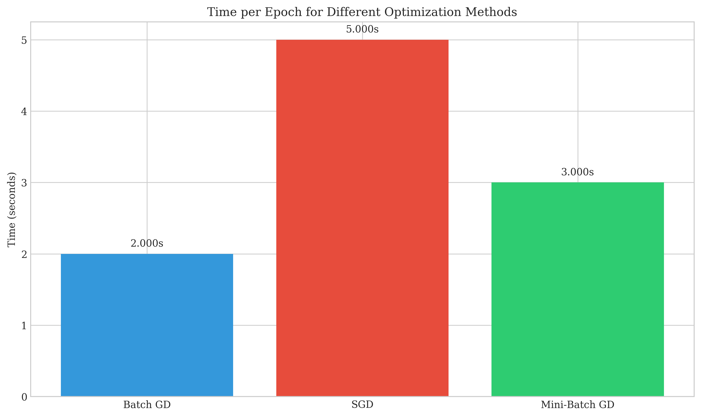
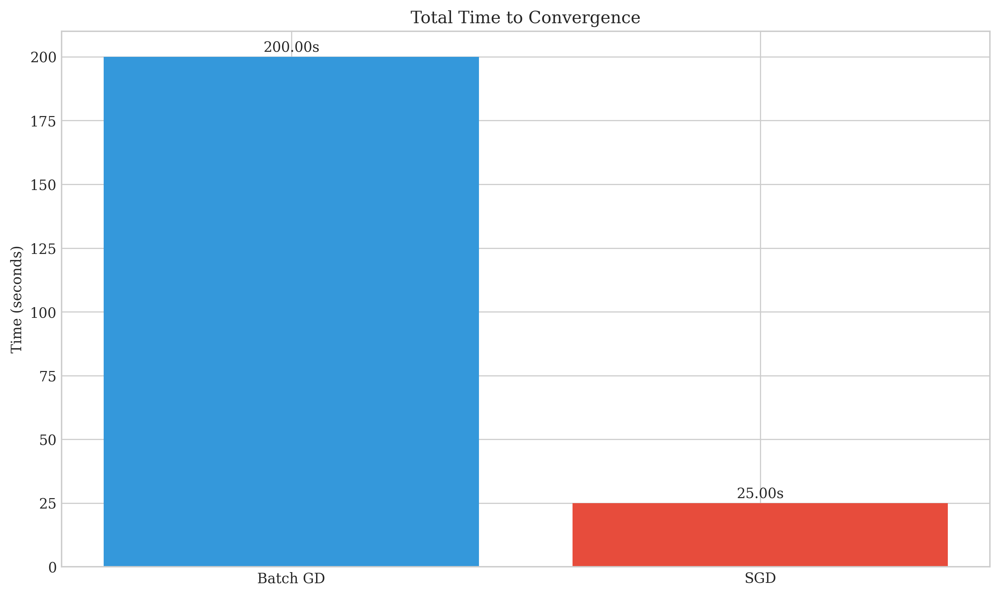
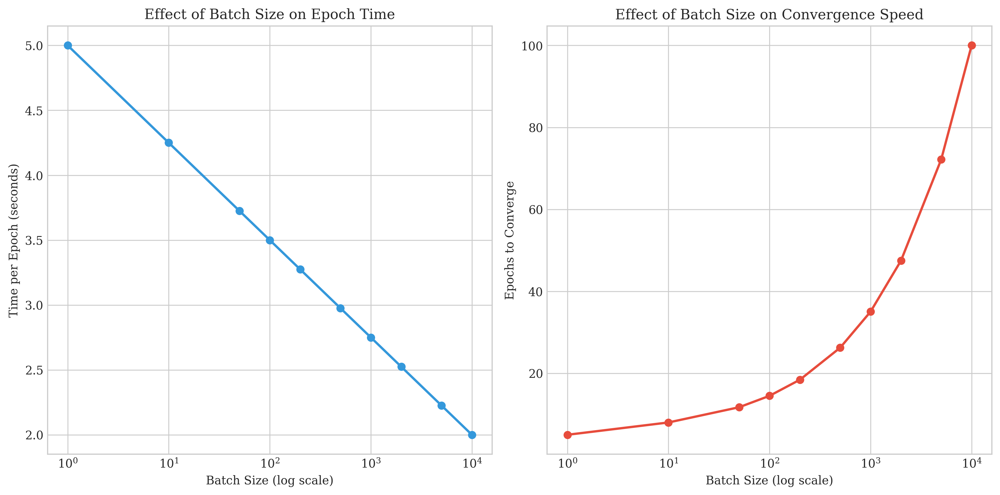
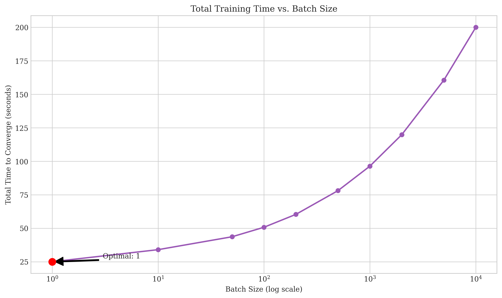

# Question 3: Comparing Optimization Methods for Linear Classification

## Problem Statement
Consider training a linear classifier on a dataset with 10,000 examples using different optimization methods.

### Task
1. If each epoch of batch gradient descent takes 2 seconds, and stochastic gradient descent processes examples one at a time at a rate of 0.0005 seconds per example, how long would one epoch take for each method?
2. If SGD requires 5 epochs to converge and batch gradient descent requires 100 epochs, calculate the total time to convergence for each method.
3. If mini-batch gradient descent with a batch size of 100 examples takes 0.03 seconds per mini-batch, how long would one epoch take?
4. What is the trade-off between batch size and convergence speed? Answer in 1-2 sentences.

## Understanding the Problem
This problem examines the computational efficiency of different optimization methods for training a linear classifier. We need to compare batch gradient descent (which processes all examples at once), stochastic gradient descent (which processes one example at a time), and mini-batch gradient descent (which processes a small batch of examples at a time).

The key factors to consider are:
- Time taken per epoch (one complete pass through the dataset)
- Number of epochs required to reach convergence
- Total training time (time per epoch × number of epochs)

## Solution

### Step 1: Calculate Time per Epoch for Each Method

For batch gradient descent:
- Given: 2 seconds per epoch
- Time per epoch = 2 seconds

For stochastic gradient descent (SGD):
- Given: 0.0005 seconds per example
- Number of examples: 10,000
- Time per epoch = 0.0005 × 10,000 = 5 seconds

For mini-batch gradient descent:
- Given: 0.03 seconds per mini-batch of 100 examples
- Number of mini-batches per epoch = 10,000 ÷ 100 = 100
- Time per epoch = 0.03 × 100 = 3 seconds

### Step 2: Calculate Total Time to Convergence

For batch gradient descent:
- Time per epoch: 2 seconds
- Number of epochs to converge: 100
- Total time = 2 × 100 = 200 seconds

For SGD:
- Time per epoch: 5 seconds
- Number of epochs to converge: 5
- Total time = 5 × 5 = 25 seconds

### Step 3: Mini-Batch Gradient Descent Epoch Time
As calculated in Step 1, one epoch of mini-batch gradient descent with batch size 100 takes 3 seconds.

### Step 4: Trade-off Between Batch Size and Convergence Speed

The relationship between batch size and convergence is complex and involves multiple trade-offs:

As batch size increases:
1. The time per epoch generally follows a non-linear pattern
2. The number of epochs required for convergence increases

The combined effect determines the total training time:

## Key Insights

### Computational Efficiency
- Batch gradient descent: Processes all examples at once, providing stable but slow convergence
- Stochastic gradient descent: Processes one example at a time, resulting in noisy updates but faster convergence in terms of epochs
- Mini-batch gradient descent: Strikes a balance between the two extremes

### Trade-off Between Batch Size and Convergence Speed
- **Smaller batch sizes** (like in SGD) provide noisier gradient updates that can help escape local minima, leading to faster convergence in terms of epochs but potentially higher per-epoch computation overhead when processing one example at a time.
- **Larger batch sizes** (like in batch GD) provide more stable and accurate gradient estimates but tend to require more epochs to converge and can get trapped in local minima.

### Optimal Batch Size
The optimal batch size depends on:
1. Hardware characteristics (parallelization capabilities)
2. Dataset properties
3. Optimization algorithm details
4. Model architecture

## Conclusion
- For this specific scenario, SGD converges much faster overall (25 seconds) than batch gradient descent (200 seconds), despite taking longer per epoch.
- Mini-batch gradient descent offers a middle ground, with moderate per-epoch time.
- The trade-off between batch size and convergence speed is that smaller batches generally require fewer epochs to converge but may have higher per-example processing overhead, while larger batches provide more stable updates but typically need more epochs to reach convergence. 