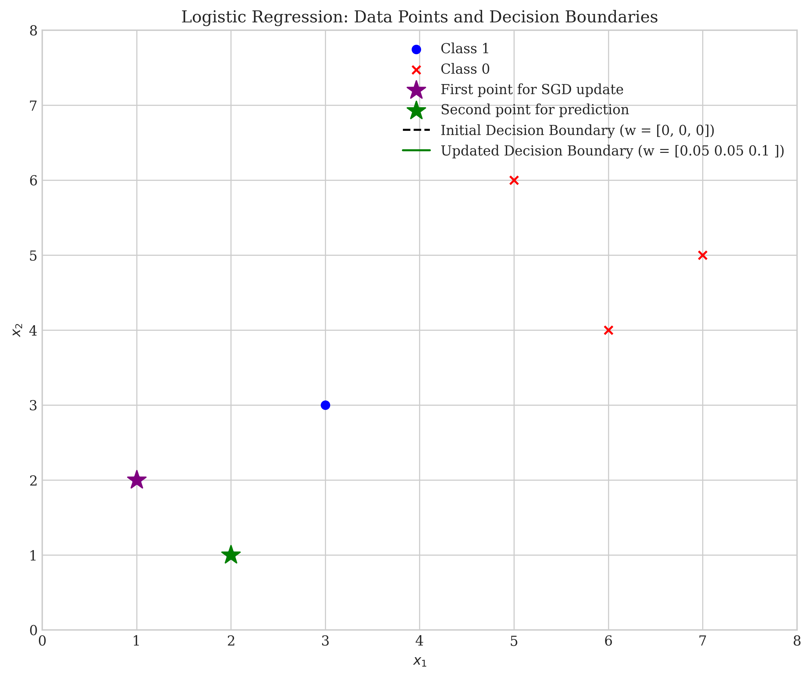
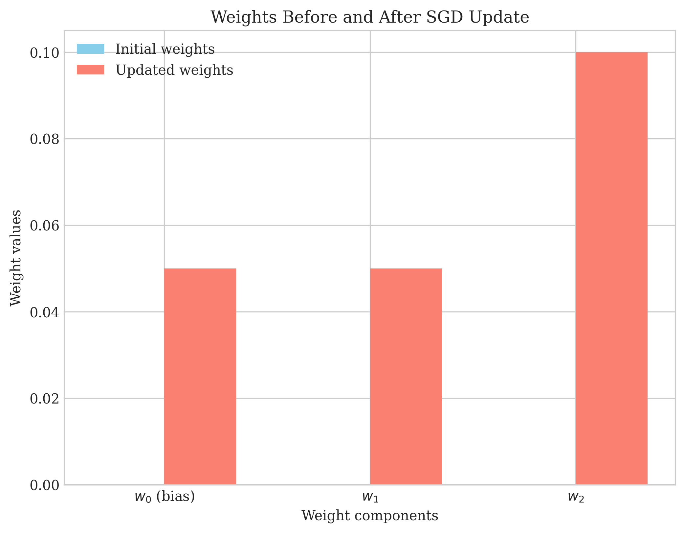
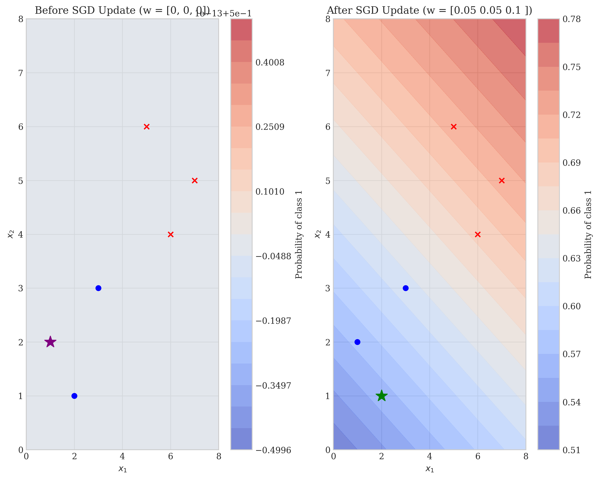

# Question 4: Logistic Regression SGD Update

## Problem Statement
Consider a binary classification problem with the following dataset:

| $x_1$ | $x_2$ | $y$ |
|-------|-------|-----|
| 1     | 2     | 1   |
| 2     | 1     | 1   |
| 3     | 3     | 1   |
| 6     | 4     | 0   |
| 5     | 6     | 0   |
| 7     | 5     | 0   |

We are implementing logistic regression using stochastic gradient descent (SGD). The model parameters are initially set to $w = [0, 0, 0]^T$ (where $w_0$ is the bias term), and the learning rate is $\eta = 0.1$.

### Task
1. Write down the update equation for logistic regression using SGD.
2. Perform the first SGD update using the first data point $(x_1 = 1, x_2 = 2, y = 1)$.
3. Calculate the predicted probability for the second data point $(x_1 = 2, x_2 = 1, y = 1)$ using the updated weights.
4. Compare the computational complexity of batch gradient descent versus stochastic gradient descent.

## Understanding the Problem
Logistic regression is a classification algorithm that models the probability of a binary outcome. The model uses the sigmoid function to transform a linear combination of features into a probability value between 0 and 1. Stochastic Gradient Descent (SGD) is an optimization algorithm that updates model parameters using one data point at a time, as opposed to batch gradient descent which uses all data points for each update.

The logistic regression model computes the probability of class 1 as:
$$P(y=1|x) = \sigma(w^T x) = \frac{1}{1 + e^{-w^T x}}$$

where $\sigma$ is the sigmoid function, $w$ is the weight vector, and $x$ is the feature vector (including a 1 for the bias term).

## Solution

### Step 1: Define the Logistic Regression SGD Update Equation
For logistic regression, the loss function for a single data point is:
$$L(w) = -[y \log(\sigma(w^T x)) + (1-y) \log(1-\sigma(w^T x))]$$

The gradient of this loss function with respect to the weights is:
$$\nabla_w L(w) = (\sigma(w^T x) - y) \cdot x$$

Therefore, the SGD update equation is:
$$w_{new} = w_{old} - \eta \cdot (\sigma(w_{old}^T x) - y) \cdot x$$

Where:
- $w_{old}$ is the current weight vector
- $w_{new}$ is the updated weight vector
- $\eta$ is the learning rate
- $x$ is the feature vector (including the bias term)
- $y$ is the true label
- $\sigma(w_{old}^T x)$ is the predicted probability

### Step 2: Perform the First SGD Update
For the first data point $(x_1 = 1, x_2 = 2, y = 1)$, we have:
- Feature vector with bias: $x = [1, 1, 2]^T$
- True label: $y = 1$
- Initial weights: $w = [0, 0, 0]^T$
- Learning rate: $\eta = 0.1$

First, calculate the predicted probability:
$$\sigma(w^T x) = \sigma(0 \cdot 1 + 0 \cdot 1 + 0 \cdot 2) = \sigma(0) = \frac{1}{1 + e^{-0}} = 0.5$$

Next, compute the gradient:
$$\nabla_w L(w) = (\sigma(w^T x) - y) \cdot x = (0.5 - 1) \cdot [1, 1, 2]^T = -0.5 \cdot [1, 1, 2]^T = [-0.5, -0.5, -1]^T$$

Finally, update the weights:
$$w_{new} = w_{old} - \eta \cdot \nabla_w L(w) = [0, 0, 0]^T - 0.1 \cdot [-0.5, -0.5, -1]^T = [0.05, 0.05, 0.1]^T$$

So the updated weight vector is $w = [0.05, 0.05, 0.1]^T$.

### Step 3: Calculate Predicted Probability for the Second Data Point
For the second data point $(x_1 = 2, x_2 = 1, y = 1)$, we have:
- Feature vector with bias: $x = [1, 2, 1]^T$
- Updated weights: $w = [0.05, 0.05, 0.1]^T$

Calculate the predicted probability:
$$\sigma(w^T x) = \sigma(0.05 \cdot 1 + 0.05 \cdot 2 + 0.1 \cdot 1) = \sigma(0.05 + 0.1 + 0.1) = \sigma(0.25) = \frac{1}{1 + e^{-0.25}} \approx 0.562177$$

So the predicted probability for the second data point is approximately 0.562.

### Step 4: Compare Computational Complexity of BGD vs. SGD

#### Batch Gradient Descent (BGD)
In batch gradient descent, we compute the gradient using all $n$ data points for each update:
- Forward pass: $O(n \times d)$ operations per iteration (compute $w^T x$ for all $n$ points)
- Gradient calculation: $O(n \times d)$ operations per iteration (compute gradient for all $n$ points)
- Total operations per epoch: $O(nd)$

#### Stochastic Gradient Descent (SGD)
In stochastic gradient descent, we compute the gradient using one data point for each update:
- Forward pass: $O(d)$ operations per data point
- Gradient calculation: $O(d)$ operations per data point
- Total operations per epoch: $O(n \times d) = O(nd)$ (for going through all $n$ points)

## Visual Explanations

### Decision Boundaries Before and After Update

This visualization shows the data points and decision boundaries before and after the SGD update. The initial decision boundary (dashed line) corresponds to $w = [0, 0, 0]^T$, which is undefined since the weights are all zero. After the update with the first data point, the decision boundary (solid green line) shifts to reflect the updated weights $w = [0.05, 0.05, 0.1]^T$. The decision boundary is the line where $w_0 + w_1 x_1 + w_2 x_2 = 0$, or equivalently, $x_2 = (-w_0 - w_1 x_1) / w_2$.

### Weights Before and After Update

This bar chart compares the weight values before and after the SGD update. Initially, all weights are zero. After the update, the weights become $w = [0.05, 0.05, 0.1]^T$. The bias term $w_0$ and the coefficient for $x_1$ both increase by 0.05, while the coefficient for $x_2$ increases by 0.1.

### Probability Contours Before and After Update

These contour plots show how the predicted probabilities change across the feature space before and after the SGD update. The left plot shows the initial probability landscape, which is uniform at 0.5 since all weights are zero. The right plot shows the probability landscape after the update, with the decision boundary (where probability equals 0.5) visible. The probability increases in the direction of the class 1 data points (blue circles) and decreases in the direction of the class 0 data points (red crosses).

## Key Insights

### Theoretical Foundations
- Logistic regression models the probability of a binary outcome using the sigmoid function.
- The gradient of the logistic loss for a single data point is $(\sigma(w^T x) - y) \cdot x$.
- The decision boundary in logistic regression is linear in the feature space.
- When all weights are zero, the predicted probability is always 0.5.

### Practical Applications
- SGD allows for online learning, where model parameters can be updated as new data arrives.
- The learning rate $\eta$ controls the step size of parameter updates.
- Even a single update can significantly change the decision boundary.
- The direction of the update is determined by the error $(\sigma(w^T x) - y)$ and the feature values.

### Computational Efficiency
- BGD and SGD have the same theoretical computational complexity per epoch: $O(nd)$.
- However, SGD often converges faster in practice with fewer epochs.
- SGD has better memory efficiency as it processes one point at a time.
- BGD provides more stable convergence but might be slower to reach the optimum.
- SGD introduces more noise in the optimization process, which can help escape local minima.

## Conclusion
- The SGD update for logistic regression with the first data point changed the weights from $w = [0, 0, 0]^T$ to $w = [0.05, 0.05, 0.1]^T$.
- The predicted probability for the second data point using the updated weights is approximately 0.562.
- While BGD and SGD have the same theoretical complexity per epoch, SGD often requires fewer epochs to converge and is more memory-efficient.
- The visualization of decision boundaries and probability contours helps understand how the model's predictions change after a single SGD update. 