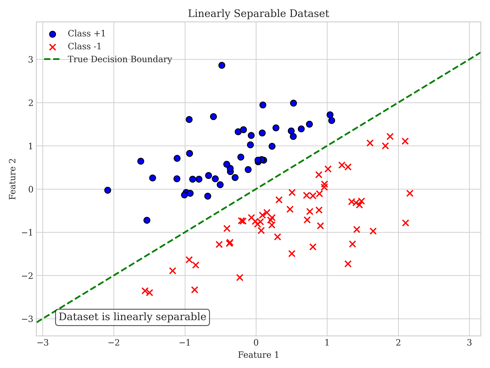
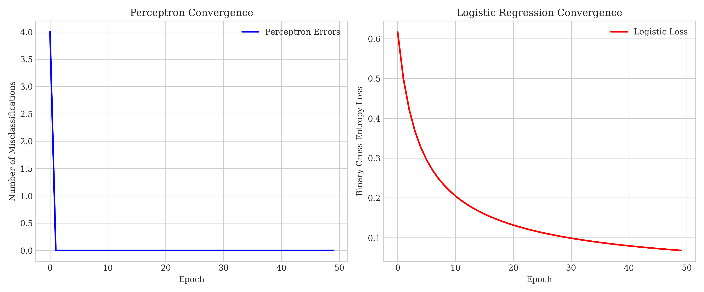
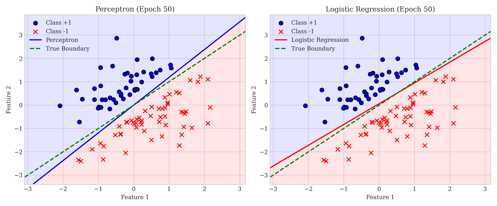
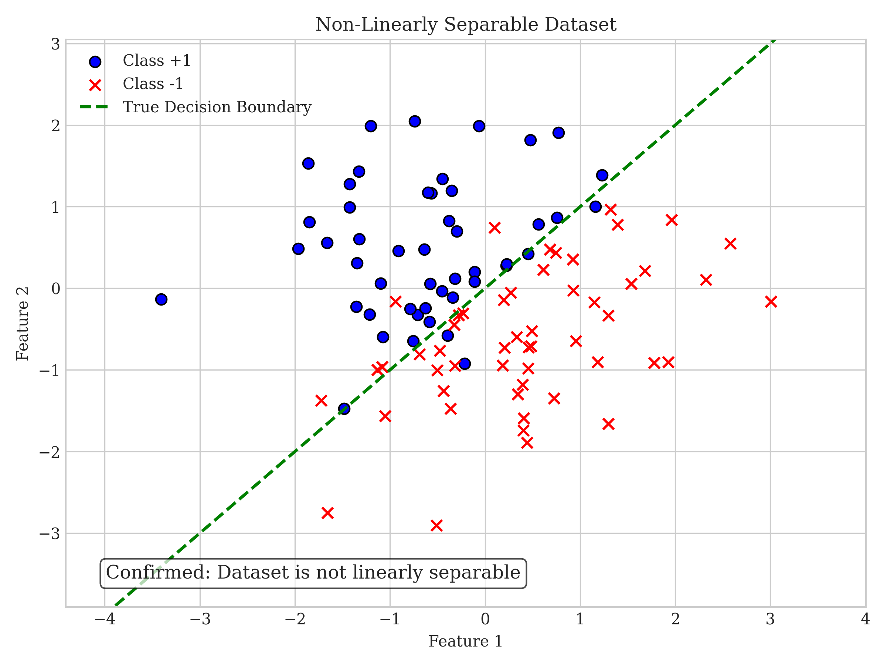
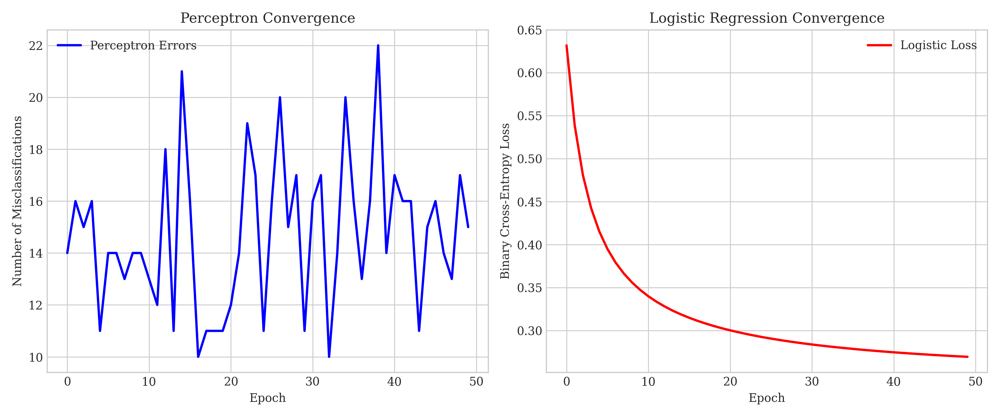
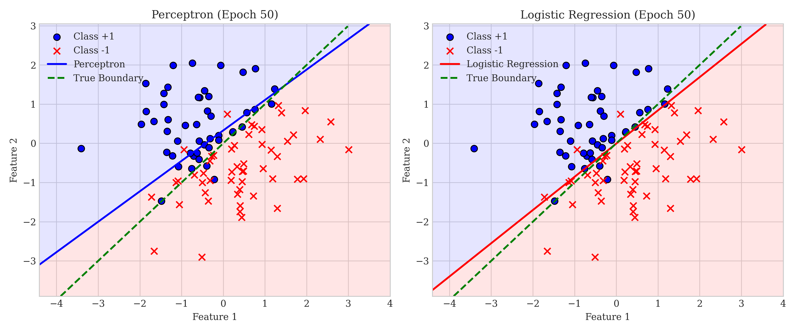

# Question 5: Perceptron Learning Algorithm

## Problem Statement
Consider the perceptron learning algorithm with the following update rule:

$$w_{t+1} = w_t + \eta y_i x_i$$

if $y_i (w_t^T x_i) \leq 0$ (misclassification), and $w_{t+1} = w_t$ otherwise.

### Task
1. How does this update rule differ from the standard gradient descent update for logistic regression?
2. Why might this update rule converge faster than gradient descent for linearly separable data?
3. For a misclassified point with $x = [1, 2, 1]^T$ (including bias term), $y = 1$, and current weights $w = [0, 1, -1]^T$, calculate the updated weights using $\eta = 0.5$
4. Will this update always reduce the number of misclassified points? Explain why or why not.

## Understanding the Problem
The perceptron is one of the simplest types of artificial neural networks and forms the foundation for more complex models. It implements a binary classifier that makes predictions using a linear decision boundary. The perceptron learning algorithm updates the weights of the model when it encounters misclassified points, attempting to find a separating hyperplane for linearly separable data.

The core of the problem is understanding how the perceptron's update rule works, how it differs from other optimization methods like gradient descent for logistic regression, and what its limitations are in terms of guaranteeing error reduction.

## Solution

### Task 1: Comparing Perceptron Update Rule with Gradient Descent for Logistic Regression

#### Perceptron Update Rule:
$$w_{t+1} = w_t + \eta y_i x_i \quad \text{(if } y_i(w_t^T x_i) \leq 0 \text{)}$$

#### Gradient Descent Update for Logistic Regression:
$$w_{t+1} = w_t + \eta (y_i - \sigma(w_t^T x_i)) x_i$$

Where $\sigma(z) = \frac{1}{1 + e^{-z}}$ is the sigmoid function.

The key differences are:
1. **Conditional vs. Unconditional**: The perceptron only updates when a point is misclassified, while logistic regression updates for every point.
2. **Magnitude of Update**: The perceptron update size is fixed by $\eta y_i x_i$ for misclassified points, whereas in logistic regression, the update is scaled by how far the prediction is from the true label.
3. **Error Function**: The perceptron directly minimizes misclassification errors, while logistic regression minimizes cross-entropy loss that approximates the 0-1 loss function.

### Task 2: Why Perceptron Might Converge Faster for Linearly Separable Data

When data is linearly separable, the perceptron convergence theorem guarantees that the algorithm will find a perfect decision boundary in a finite number of updates. The key advantages are:

1. **Focused Updates**: Perceptron only updates when necessary (misclassifications), ignoring correctly classified points and making larger steps toward the solution.
2. **Direct Optimization**: It directly optimizes the decision boundary position rather than a surrogate loss function.

#### Current Data Being Processed: Linearly Separable Dataset

The above visualization shows the linearly separable dataset used in our experiments. The blue circles represent class +1, and the red crosses represent class -1. As shown, a clear linear decision boundary (green dashed line) perfectly separates the two classes. We've engineered the dataset specifically to ensure linear separability by maintaining a margin between the classes.

#### Linearly Separable Data Results

The convergence plots for linearly separable data show that the perceptron (left) achieves zero misclassifications after just a few epochs, while logistic regression (right) continues to optimize its loss function even after finding a reasonable decision boundary.

With linearly separable data, both algorithms eventually find good decision boundaries, but the perceptron converges much faster and directly reaches zero misclassifications. Both the perceptron boundary (blue) and logistic regression boundary (red) correctly separate all data points, with the true boundary shown as a dashed green line.

#### Current Data Being Processed: Non-Linearly Separable Dataset

This visualization shows the non-linearly separable dataset where points of opposite classes overlap in the boundary region, making perfect separation impossible. We specifically created this dataset by flipping the labels of points near the decision boundary to ensure it cannot be perfectly classified by any linear model. This represents a more realistic scenario for many real-world applications.

#### Non-Separable Data Results

For non-separable data, the perceptron algorithm cannot find a perfect separation and continues to oscillate, while logistic regression still converges to a solution that minimizes the cross-entropy loss. Notice how the perceptron's error count never reaches zero and continues to fluctuate.

**Comparison between separable and non-separable scenarios:**
- For linearly separable data, the perceptron converges to a perfect decision boundary
- For non-separable data, the perceptron continues to oscillate as it cannot find a perfect solution
- Logistic regression converges in both scenarios, though it may not achieve zero misclassifications in the non-separable case

This comparison clearly demonstrates the limitations of the perceptron algorithm when dealing with non-separable data. While it performs exceptionally well for clean, separable data, it struggles with overlapping classes. In contrast, logistic regression provides more stable performance in both scenarios by minimizing a continuous loss function.

### Task 3: Calculate Updated Weights for the Specific Example

Given information:
- Point: $x = [1, 2, 1]^T$ (including bias term)
- Label: $y = 1$
- Current weights: $w = [0, 1, -1]^T$
- Learning rate: $\eta = 0.5$

Step 1: Check if the point is misclassified by computing $y(w^T x)$:
$$w^T x = 0 \times 1 + 1 \times 2 + (-1) \times 1 = 2 - 1 = 1$$
$$y(w^T x) = 1 \times 1 = 1 > 0$$

Since $y(w^T x) > 0$, the point is correctly classified. Therefore, no update is needed:
$$w_{t+1} = w_t = [0, 1, -1]^T$$

The 2D visualization confirms that the point lies in the correctly classified region (blue area). The decision boundary is already oriented such that the point is on the correct side. The visualization includes clear labels and color coding to distinguish the positive and negative classification regions.

The 3D visualization provides a spatial perspective of how the weight vector and decision boundary change after a perceptron update. In this case, since the point is correctly classified, the weight vector remains unchanged. The visualization shows the original weights (blue arrow) and the decision boundary plane (blue surface), with optimal viewing angles to make the 3D relationships apparent.

### Task 4: Will This Update Always Reduce the Number of Misclassified Points?

No, the perceptron update will not always reduce the total number of misclassified points. While it guarantees that the specific misclassified point used for the update will be correctly classified if it's the only point in the dataset, this improvement can come at the expense of misclassifying other points that were previously correctly classified.

In our example:
- Before update (left): Both points are misclassified (2 total misclassifications)
- After updating with respect to the first point (right): The first point becomes correctly classified, but the second point remains misclassified (1 total misclassification)

The visualization uses distinct markers for each point and consistent coloring of the decision regions, making it easy to see how the update affects each point's classification status. While the total number of misclassifications decreased in this specific example (from 2 to 1), this is not guaranteed in all cases. In some scenarios, correcting one point might misclassify multiple other points that were previously correct.

This limitation becomes even more apparent with non-separable data, as shown in our non-separable data experiment. In such cases, the perceptron algorithm may oscillate indefinitely, repeatedly fixing some misclassifications while introducing others, never reaching a perfect solution.

## Visual Explanations

### Perceptron vs. Logistic Regression Convergence

#### For Linearly Separable Data:

#### For Non-Linearly Separable Data:

These visualizations compare the convergence behavior of perceptron and logistic regression:
- The left plot shows the number of misclassifications per epoch for perceptron learning
- The right plot shows the binary cross-entropy loss per epoch for logistic regression

Notice the key differences between separable and non-separable data:
- With separable data, perceptron reaches zero misclassifications and stabilizes
- With non-separable data, perceptron continues to oscillate and cannot reach zero misclassifications
- Logistic regression shows smooth convergence in both cases

### 3D Visualization of Weight Update Process

This 3D visualization shows how the weight vector and decision boundary change after a perceptron update. For correctly classified points (as in Task 3), no update occurs. For misclassified points, the weight vector would move in the direction that pushes the decision boundary to correctly classify the point. The visualization uses optimal camera angles and clear labels to make the 3D relationships more apparent.

## Key Insights

### Theoretical Foundations
- The perceptron converges in a finite number of steps if the data is linearly separable (Novikoff's theorem)
- The perceptron directly minimizes the 0-1 loss function, which counts misclassifications
- The perceptron's update rule is closely related to stochastic gradient descent on a hinge loss

### Practical Implications
- The perceptron works well for linearly separable data but can fail to converge for non-linearly separable data
- Unlike logistic regression, perceptron only provides binary predictions, not probability estimates
- The simplicity of the perceptron update rule makes it computationally efficient

### Limitations and Extensions
- The perceptron cannot solve the XOR problem or other non-linearly separable problems
- More advanced variants like the voted perceptron or kernel perceptron can handle more complex data
- The perceptron update rule forms the basis for more complex neural network training algorithms

## Conclusion
- The perceptron update rule differs from logistic regression's gradient descent update by being conditional and having a fixed update magnitude that doesn't depend on prediction confidence.
- Perceptron convergence is typically faster for linearly separable data because it makes direct, focused updates only when needed.
- For the given example with $x = [1, 2, 1]^T$, $y = 1$, $w = [0, 1, -1]^T$, and $\eta = 0.5$, no update is needed since the point is already correctly classified.
- The perceptron update does not guarantee a reduction in the total number of misclassifications across all data points, though it will correct the single misclassification it's updating for.
- Our experiments with both linearly separable and non-separable data demonstrate the strengths and limitations of the perceptron algorithm compared to logistic regression in different scenarios. 