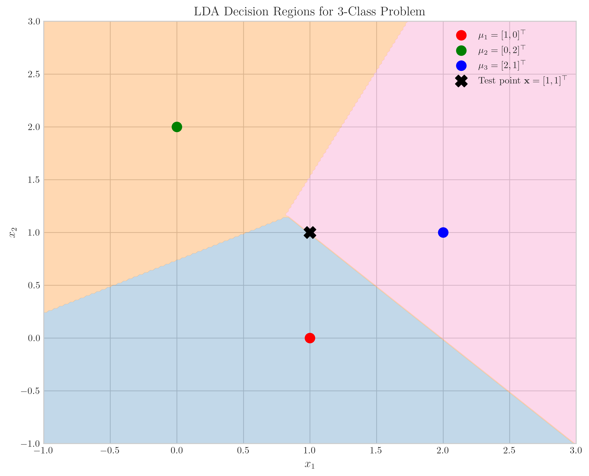
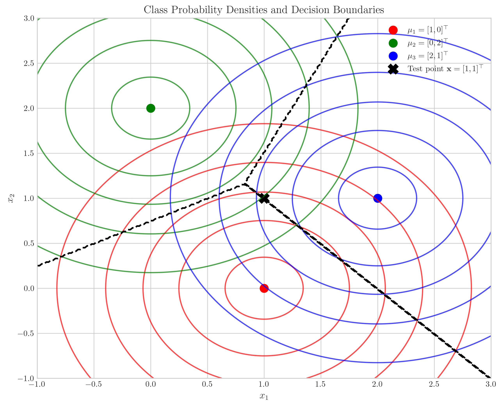
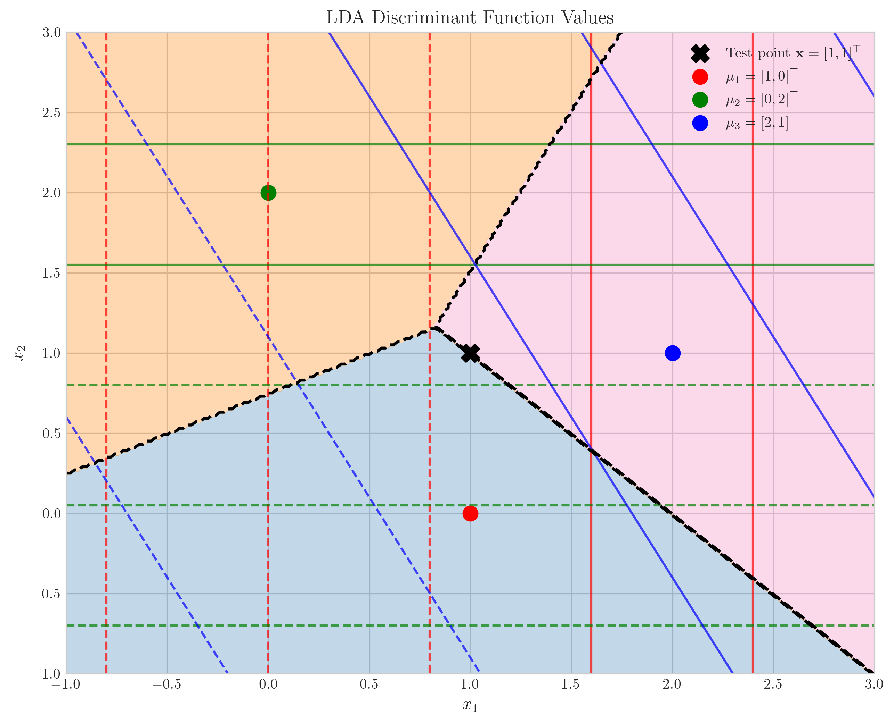

# Question 10: Multi-class Linear Discriminant Analysis

## Problem Statement
Consider multi-class Linear Discriminant Analysis (LDA).

### Task
1. How does LDA naturally handle multi-class problems?
2. What assumption does LDA make about the class-conditional densities?
3. For a $3$-class problem with class means $\mu_1 = [1, 0]^T$, $\mu_2 = [0, 2]^T$, $\mu_3 = [2, 1]^T$, and shared covariance matrix $\Sigma = I$ (identity matrix), write the discriminant function for each class
4. For a new data point $x = [1, 1]^T$, determine which class LDA would assign to it

## Understanding the Problem
Linear Discriminant Analysis (LDA) is a dimensionality reduction and classification technique that projects data onto a lower-dimensional space while maximizing the separability between classes. In this problem, we explore how LDA handles multi-class problems and apply it to a specific case with three classes in a two-dimensional space.

The key components of LDA are:
- Class-conditional densities (probability distributions for each class)
- Prior probabilities (how likely each class is a priori)
- Discriminant functions that are used to make classification decisions

We need to understand how LDA extends beyond binary classification to multiple classes, identify its key assumptions, and apply the method to a specific three-class problem.

## Solution

### Step 1: How LDA Handles Multi-class Problems
LDA naturally handles multi-class problems by using a one-vs-rest approach where it computes discriminant functions for each class and classifies a sample to the class with the highest discriminant score.

In a multi-class setting, LDA:
1. Computes a discriminant function for each class
2. For a new data point, evaluates all discriminant functions
3. Assigns the point to the class with the highest discriminant score

This approach seamlessly extends the binary case to multiple classes without requiring any modification to the underlying math or additional processing steps.

### Step 2: LDA Assumptions About Class-Conditional Densities
LDA assumes that the class-conditional densities are multivariate Gaussian distributions with different means but the same covariance matrix for all classes.

This assumption leads to linear decision boundaries between classes (hence the name "Linear" Discriminant Analysis). The assumption of equal covariance matrices across classes simplifies the math and allows for more efficient parameter estimation, especially when data is limited.

### Step 3: Computing Discriminant Functions for the 3-Class Problem

For LDA, the discriminant function for class $i$ is given by:

$$\delta_i(x) = x^T\Sigma^{-1}\mu_i - \frac{1}{2}\mu_i^T\Sigma^{-1}\mu_i + \ln(P(y=i))$$

Given:
- Class means: $\mu_1 = [1, 0]^T$, $\mu_2 = [0, 2]^T$, $\mu_3 = [2, 1]^T$
- Shared covariance matrix: $\Sigma = I$ (identity matrix)
- Equal prior probabilities: $P(y=1) = P(y=2) = P(y=3) = \frac{1}{3}$

Since $\Sigma = I$, we have $\Sigma^{-1} = I$ as well, which simplifies our calculations.

For class 1:
$$\delta_1(x) = x^T\mu_1 - \frac{1}{2}\mu_1^T\mu_1 + \ln(\frac{1}{3})$$
$$\delta_1(x) = x_1 \cdot 1 + x_2 \cdot 0 - \frac{1}{2}(1^2 + 0^2) + \ln(\frac{1}{3})$$
$$\delta_1(x) = x_1 - 0.5 - 1.0986$$
$$\delta_1(x) = x_1 - 1.5986$$

For class 2:
$$\delta_2(x) = x^T\mu_2 - \frac{1}{2}\mu_2^T\mu_2 + \ln(\frac{1}{3})$$
$$\delta_2(x) = x_1 \cdot 0 + x_2 \cdot 2 - \frac{1}{2}(0^2 + 2^2) + \ln(\frac{1}{3})$$
$$\delta_2(x) = 2x_2 - 2 - 1.0986$$
$$\delta_2(x) = 2x_2 - 3.0986$$

For class 3:
$$\delta_3(x) = x^T\mu_3 - \frac{1}{2}\mu_3^T\mu_3 + \ln(\frac{1}{3})$$
$$\delta_3(x) = x_1 \cdot 2 + x_2 \cdot 1 - \frac{1}{2}(2^2 + 1^2) + \ln(\frac{1}{3})$$
$$\delta_3(x) = 2x_1 + x_2 - 2.5 - 1.0986$$
$$\delta_3(x) = 2x_1 + x_2 - 3.5986$$

### Step 4: Classifying a New Data Point $x = [1, 1]^T$

Let's evaluate each discriminant function for the point $x = [1, 1]^T$:

For class 1:
$$\delta_1(x) = x_1 - 1.5986 = 1 - 1.5986 = -0.5986$$

For class 2:
$$\delta_2(x) = 2x_2 - 3.0986 = 2 \cdot 1 - 3.0986 = 2 - 3.0986 = -1.0986$$

For class 3:
$$\delta_3(x) = 2x_1 + x_2 - 3.5986 = 2 \cdot 1 + 1 - 3.5986 = 3 - 3.5986 = -0.5986$$

Since $\delta_1(x) = \delta_3(x) = -0.5986$ and both are greater than $\delta_2(x) = -1.0986$, the point lies on the decision boundary between class 1 and class 3.

In practice, when there's a tie, the classifier typically assigns the point to the first class with the maximum score, so $x = [1, 1]^T$ would be classified as belonging to class 1.

## Visual Explanations

### Decision Regions

This plot shows the decision regions for the three classes. The colored regions represent areas where points would be classified as belonging to each class. The class means are shown as colored dots, and the test point $x = [1, 1]^T$ is marked with a black X. Notice that the test point appears to be on the boundary between the regions for class 1 (red) and class 3 (blue).

### Class Probability Densities

This plot shows the probability density contours for each class. Since all classes have the same covariance matrix (the identity matrix), their probability density contours are circular, centered at their respective means. The decision boundaries (dashed black lines) occur where the densities of different classes are equal (after accounting for prior probabilities). The test point $x = [1, 1]^T$ is located precisely where the probability densities for class 1 and class 3 are equal.

### Discriminant Function Values

This visualization shows the contour lines of the discriminant functions for each class. The decision boundaries (dashed black lines) occur where the discriminant functions of different classes are equal. The test point $x = [1, 1]^T$ lies exactly on the boundary between class 1 and class 3, confirming our numerical calculation that $\delta_1(x) = \delta_3(x)$.

## Key Insights

### Theoretical Foundations
- LDA assumes equal covariance matrices across all classes, which leads to linear decision boundaries.
- The discriminant function in LDA is derived from the posterior probability $P(y=i|x)$ using Bayes' rule.
- When prior probabilities are equal, the constant term $\ln(P(y=i))$ is the same for all classes and does not affect the relative ranking of discriminant scores.

### Geometric Interpretation
- The decision boundaries in LDA are always linear and perpendicular to the line connecting class means (for binary case).
- For multi-class problems, the decision boundaries form a Voronoi diagram, where each cell contains points closer to one class mean than any other (after accounting for the covariance structure).
- Points on the decision boundary have equal posterior probabilities for two or more classes.

### Practical Implications
- When class covariances are truly equal, LDA is optimal according to Bayes decision theory.
- LDA performs well even with small sample sizes because it pools the covariance information from all classes.
- In high-dimensional settings with limited data, the assumption of equal covariance matrices helps prevent overfitting.
- When classes have significantly different covariance structures, Quadratic Discriminant Analysis (QDA) might be more appropriate.

## Conclusion
- LDA naturally extends to multi-class problems by computing a discriminant function for each class and classifying based on the highest score.
- The key assumption of LDA is that all classes have multivariate Gaussian distributions with the same covariance matrix but different means.
- For the given 3-class problem, we derived the discriminant functions: $\delta_1(x) = x_1 - 1.5986$, $\delta_2(x) = 2x_2 - 3.0986$, and $\delta_3(x) = 2x_1 + x_2 - 3.5986$
- For the test point $x = [1, 1]^T$, we calculated $\delta_1(x) = \delta_3(x) = -0.5986 > \delta_2(x) = -1.0986$, resulting in the point being assigned to class 1 (using the tie-breaking rule that selects the first class with maximum score).
- Our visualizations confirmed that the test point lies on the decision boundary between class 1 and class 3. 