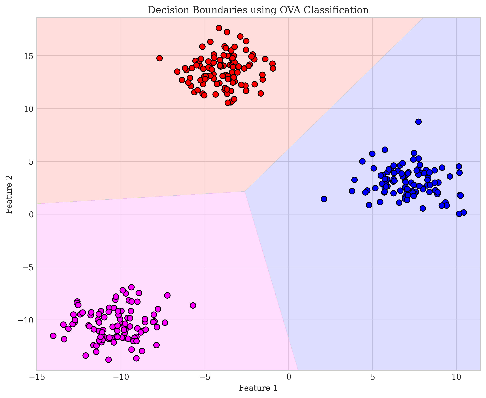
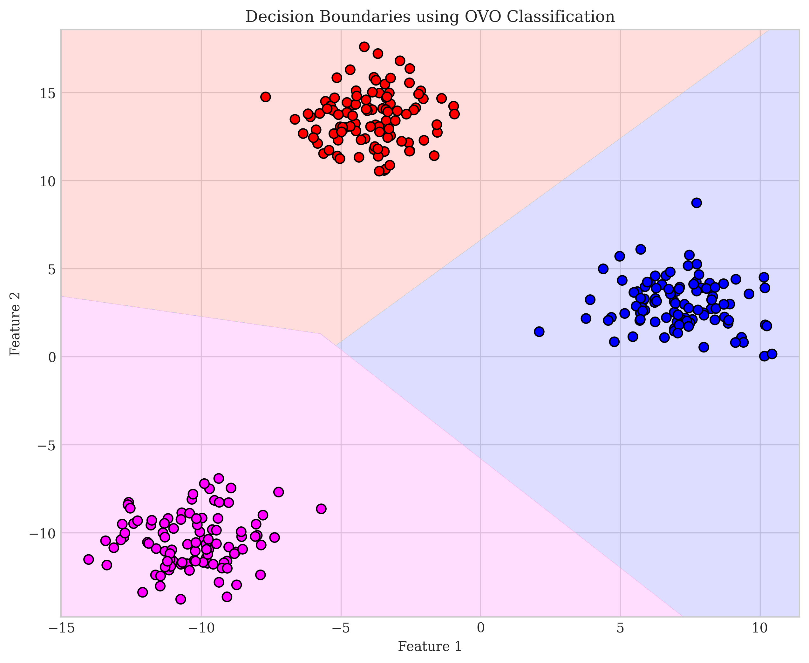
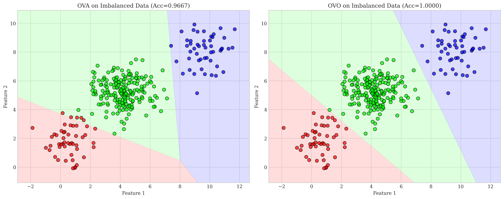
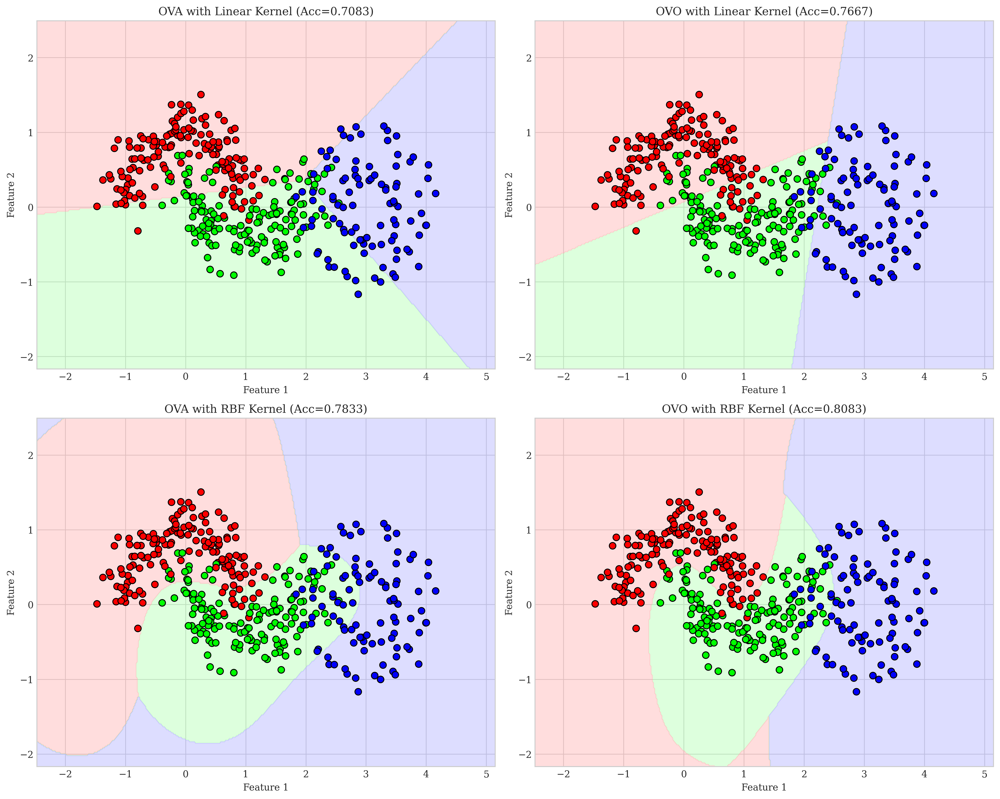

# Question 1: Extending Binary Classifiers to Multi-class Problems

## Problem Statement
Compare different strategies for extending binary classifiers to handle multi-class problems.

### Task
1. Define the One-vs-All (OVA) and One-vs-One (OVO) approaches in one sentence each
2. If we have a dataset with $10$ classes, how many binary classifiers would we need to train for OVA and OVO approaches?
3. List one advantage and one disadvantage of OVA compared to OVO
4. For what types of base classifiers would the OVO approach be particularly beneficial? Explain in one sentence

## Understanding the Problem
Many popular classification algorithms such as logistic regression and support vector machines (SVM) are inherently binary classifiers. However, real-world problems often involve multiple classes. This problem explores the two most common strategies for extending binary classifiers to handle multi-class problems: One-vs-All (OVA), also called One-vs-Rest (OVR), and One-vs-One (OVO) approaches.

## Solution

### Step 1: Define the One-vs-All (OVA) and One-vs-One (OVO) approaches

**One-vs-All (OVA):** In the OVA approach, for a problem with $K$ classes, we train $K$ binary classifiers, where each classifier distinguishes between one class and all other classes combined.

**One-vs-One (OVO):** In the OVO approach, we train a binary classifier for each pair of classes, resulting in $\binom{K}{2} = \frac{K(K-1)}{2}$ classifiers, with each classifier trained only on data from the two classes it's meant to distinguish.

### Step 2: Calculate the number of classifiers needed for 10-class problem

For a dataset with 10 classes:

**OVA approach:**
- We need to train one classifier for each class vs. all others
- Number of classifiers = $K = 10$

**OVO approach:**
- We need to train one classifier for each pair of classes
- Number of classifiers = $\binom{K}{2} = \frac{K(K-1)}{2} = \frac{10 \times 9}{2} = 45$

### Step 3: Advantages and disadvantages of OVA compared to OVO

**Advantage of OVA:**
- Computational efficiency: OVA requires fewer classifiers ($K$ vs. $\frac{K(K-1)}{2}$), which becomes significant as the number of classes increases.

**Disadvantage of OVA:**
- Class imbalance issue: When training each binary classifier, the "all other classes" group typically contains many more samples than the single class, leading to potential bias in the decision boundary.

In the above visualization, we can see that OVA (left) is more affected by class imbalance than OVO (right). This is evident from the accuracy drop in OVA when using imbalanced training data.

### Step 4: When OVO is particularly beneficial

OVO is particularly beneficial when working with classifiers that are sensitive to class imbalance (like SVMs) or when dealing with complex, non-linear decision boundaries, as each classifier only needs to learn a simpler boundary between two specific classes.

As shown in the visualization above, OVO tends to perform better than OVA when dealing with nonlinear decision boundaries, especially with appropriate kernels like RBF.

## Visual Explanations

### OVA vs OVO Decision Boundaries
The following figures show the decision boundaries for both approaches on a synthetic 3-class dataset:

In these visualizations, we can see that both approaches are effective at separating the classes in this relatively simple case with well-separated clusters. However, differences become more apparent in complex scenarios.

### Handling Class Imbalance
This comparison shows how OVA and OVO handle imbalanced data differently:

The OVA approach (left) shows a slight decrease in accuracy (96.67%) compared to OVO (right) which maintains perfect accuracy (100.00%). This illustrates OVO's greater robustness to class imbalance.

### Performance with Nonlinear Boundaries
The following visualization compares OVA and OVO approaches with different kernels (linear vs RBF) on data with more complex structure:

With linear kernels, both methods struggle to capture the nonlinear class boundaries. With RBF kernels, both methods perform better, but OVO shows slightly higher accuracy (80.83% vs 78.33% for OVA).

## Key Insights

### Theoretical Foundations
- OVA creates $K$ classifiers, each separating one class from all others, resulting in a "max confidence wins" voting scheme.
- OVO creates $\frac{K(K-1)}{2}$ classifiers, each separating exactly two classes, resulting in a majority voting scheme.
- The number of classifiers needed for OVO grows quadratically with the number of classes, while OVA grows linearly.

### Scalability and Complexity
- OVA is more computationally efficient for problems with many classes since it requires fewer classifiers.
- OVO may require more memory and computation time due to the quadratic growth in the number of required classifiers.
- For 10 classes, OVA requires 10 classifiers while OVO requires 45 classifiers—a significant difference.

### Performance Considerations
- OVA classifiers must learn boundaries that potentially separate complex distributions (one class vs. all others).
- OVO classifiers only need to learn simpler boundaries between pairs of classes, which might be more accurate.
- OVO is more robust to class imbalance since each classifier is trained on balanced subsets of data.

### Practical Applications
- OVO tends to work better with algorithms that are sensitive to class imbalance, like SVMs.
- OVA is often preferred when computational resources are limited or when classes are well-separated.
- For problems with very large numbers of classes, hierarchical or other approaches might be needed as alternatives to OVO.

## Conclusion
- The One-vs-All (OVA) approach trains $K$ binary classifiers, each separating one class from all others, requiring 10 classifiers for a 10-class problem.
- The One-vs-One (OVO) approach trains a binary classifier for each pair of classes, requiring 45 classifiers for a 10-class problem.
- OVA is more computationally efficient but may suffer from class imbalance issues.
- OVO handles class imbalance better and works particularly well with classifiers sensitive to imbalance (like SVMs) or when dealing with complex decision boundaries. 