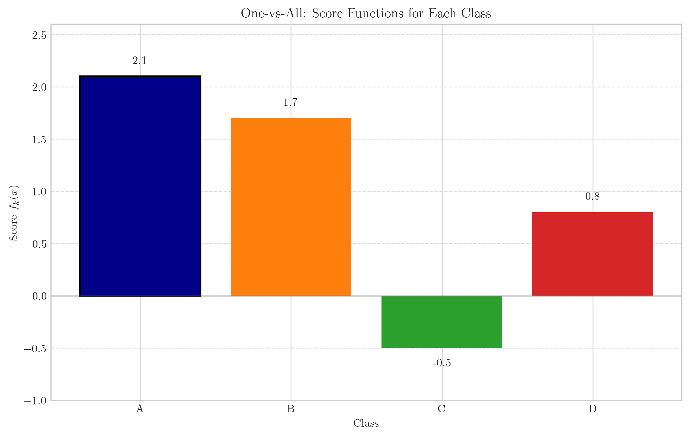
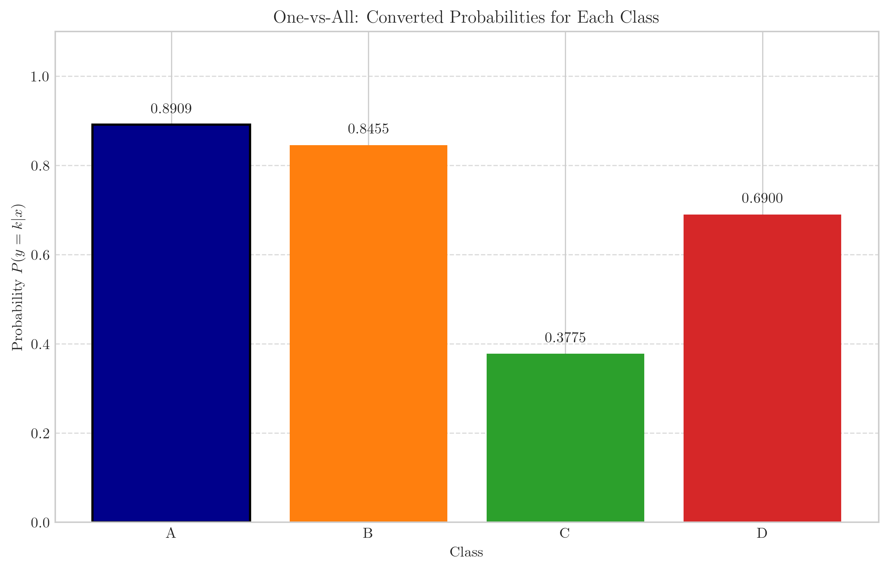
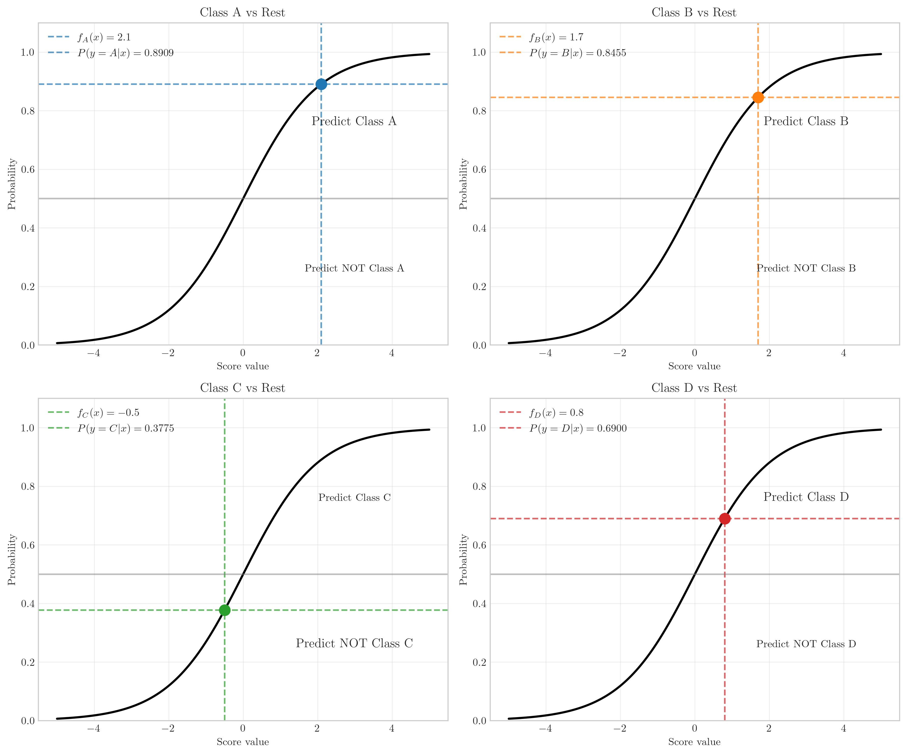
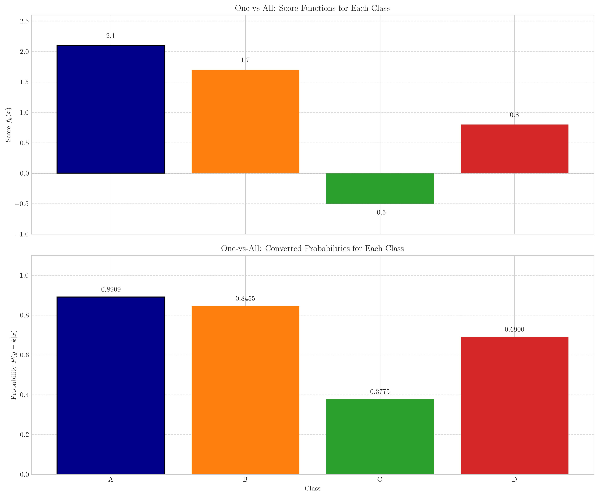

# Question 2: One-vs-All Multiclass Classification

## Problem Statement
Consider a multi-class classification problem with $4$ classes: A, B, C, and D. You decide to use the One-vs-One (OVO) approach with Logistic Regression as the base classifier.

The four logistic regression models have the following score functions:
- $f_A(x) = 2.1$
- $f_B(x) = 1.7$
- $f_C(x) = -0.5$
- $f_D(x) = 0.8$

### Task
1. If you train $4$ logistic regression models with the following score functions, 
   - $f_A(x) = 2.1$
   - $f_B(x) = 1.7$
   - $f_C(x) = -0.5$
   - $f_D(x) = 0.8$
   which class would be predicted for a new data point $x$?
2. Convert these scores to probabilities using the sigmoid function $\sigma(z) = \frac{1}{1 + e^{-z}}$ and verify that your prediction is the class with highest probability
3. When might the OVA approach fail to provide a clear decision for a data point? Explain in one sentence
4. How would you resolve ambiguities or conflicts in predictions from different binary classifiers in OVA? Suggest one approach

## Understanding the Problem
In One-vs-All (OVA) classification, we train one binary classifier for each class. Each classifier is trained to distinguish one particular class from all other classes. When classifying a new data point, we calculate a score from each binary classifier and choose the class whose classifier gives the highest score.

For logistic regression models, these scores are converted to probabilities using the sigmoid function $\sigma(z) = \frac{1}{1 + e^{-z}}$. The sigmoid function transforms any real-valued score into a probability value between 0 and 1.

## Solution

### Step 1: Identify the class with the highest score

We are given four score functions:
- $f_A(x) = 2.1$
- $f_B(x) = 1.7$
- $f_C(x) = -0.5$
- $f_D(x) = 0.8$

To determine which class is predicted, we need to find the maximum score:

$$\text{Predicted class} = \arg\max_{k \in \{A,B,C,D\}} f_k(x)$$

Comparing the scores:
- $f_A(x) = 2.1$ (highest)
- $f_B(x) = 1.7$
- $f_C(x) = -0.5$ (lowest)
- $f_D(x) = 0.8$

Since $f_A(x)$ has the highest score at 2.1, class A is predicted for the data point $x$.

### Step 2: Convert scores to probabilities using the sigmoid function

The sigmoid function is defined as:

$$\sigma(z) = \frac{1}{1 + e^{-z}}$$

Applying this function to each score:

For class A:
$$P(y = A | x) = \sigma(f_A(x)) = \sigma(2.1) = \frac{1}{1 + e^{-2.1}} \approx 0.890903$$

For class B:
$$P(y = B | x) = \sigma(f_B(x)) = \sigma(1.7) = \frac{1}{1 + e^{-1.7}} \approx 0.845535$$

For class C:
$$P(y = C | x) = \sigma(f_C(x)) = \sigma(-0.5) = \frac{1}{1 + e^{0.5}} \approx 0.377541$$

For class D:
$$P(y = D | x) = \sigma(f_D(x)) = \sigma(0.8) = \frac{1}{1 + e^{-0.8}} \approx 0.689974$$

Comparing these probabilities:
- $P(y = A | x) \approx 0.890903$ (highest)
- $P(y = B | x) \approx 0.845535$
- $P(y = C | x) \approx 0.377541$ (lowest)
- $P(y = D | x) \approx 0.689974$

Class A has the highest probability of 0.890903, which confirms our prediction from Step 1. This is expected because the sigmoid function is monotonically increasing, so the order of the scores is preserved when they are converted to probabilities.

### Step 3: When OVA might fail to provide a clear decision

The OVA approach might fail to provide a clear decision when multiple binary classifiers produce high confidence predictions for their respective classes. This can happen in regions of feature space where the decision boundaries of different classifiers overlap.

Consider a scenario with the following scores:
- $f_A(x) = 1.1$
- $f_B(x) = 1.2$
- $f_C(x) = 1.0$
- $f_D(x) = 1.3$

Converting these to probabilities:
- $P(y = A | x) \approx 0.750260$
- $P(y = B | x) \approx 0.768525$
- $P(y = C | x) \approx 0.731059$
- $P(y = D | x) \approx 0.785835$

In this case, all four classifiers predict their respective classes with high confidence (all probabilities > 0.5), leading to an ambiguous situation where multiple classifiers are claiming the data point belongs to their class.

This happens because each binary classifier is trained independently and doesn't consider the other classes during training. As a result, these classifiers may not coordinate well in regions where classes overlap.

### Step 4: Approaches to resolve ambiguities in OVA predictions

Several approaches can be used to resolve ambiguities in OVA predictions:

1. **Winner-takes-all strategy**: Select the class with the highest probability, even if multiple classifiers have probabilities > 0.5. This is the simplest approach and was implicitly used in our solution.

2. **Probability calibration**: Use methods like Platt scaling or isotonic regression to calibrate the probabilities from different classifiers to be more comparable across classes.

3. **One-vs-One (OVO) approach**: Instead of training each classifier against all other classes, train binary classifiers for each pair of classes. This results in $\frac{k(k-1)}{2}$ classifiers for $k$ classes. The final class is chosen by majority voting.

4. **Direct multiclass methods**: Use algorithms that naturally handle multiple classes like multinomial logistic regression, which directly models the probability distribution over all classes.

5. **Hierarchical classification**: Organize classes in a tree structure, where each node is a binary classifier that separates groups of classes, leading to more specialized classifiers at the leaves.

## Visual Explanations

### Combined View of Scores and Probabilities
The following visualization shows both the scores and their corresponding probabilities:

This clearly illustrates how the ranking of classes is preserved when scores are converted to probabilities via the sigmoid function.

### Potential Conflict Scenarios
The following table shows different scenarios where OVA classification might produce conflicts:

| Scenario | Score A | Score B | Score C | Score D | Predicted Class | Max Probability | Num Classes with P > 0.5 |
| :------ | :-----: | :-----: | :-----: | :-----: | :------------: | :------------: | :---------------------: |
| Case 1 | 1.10 | 1.00 | 0.90 | 0.80 | A | 0.7503 | 4 |
| Case 2 | 0.10 | 0.40 | -0.20 | -0.50 | B | 0.5987 | 2 |
| Case 3 | 2.50 | -1.00 | -1.50 | -2.00 | A | 0.9241 | 1 |

In cases where multiple binary classifiers predict their respective class (probability > 0.5), the standard approach is to select the class with the highest probability (winner-takes-all). As we can see in Case 1, all four classes have probabilities above 0.5, creating an ambiguous situation. In Case 2, two classes have probabilities above 0.5. Only in Case 3 do we have a single clear winner.

## Key Insights

### Theoretical Foundations
- In One-vs-All classification, we train $k$ binary classifiers for $k$ classes, where each classifier distinguishes one class from all others.
- For each new data point, we compute scores from all classifiers and select the class with the highest score.
- The sigmoid function $\sigma(z) = \frac{1}{1 + e^{-z}}$ converts scores to probabilities between 0 and 1.
- The sigmoid function is monotonically increasing, so the ranking of classes is preserved when converting scores to probabilities.

### Practical Considerations
- OVA is simple to implement and scales linearly with the number of classes.
- Ambiguities can arise when multiple classifiers predict their respective classes with high confidence.
- The winner-takes-all strategy is the most common approach for resolving conflicts.
- Alternative approaches like OVO or direct multiclass methods may provide better results in complex cases.

### Common Pitfalls
- Independent training of binary classifiers may lead to inconsistent decision boundaries.
- Imbalanced class distributions in training data can bias individual classifiers.
- Probability calibration might be necessary when making decisions based on probability thresholds.

## Conclusion
- For the given scores, class A would be predicted since it has the highest score of 2.1.
- Converting scores to probabilities using the sigmoid function confirms that class A has the highest probability of 0.890903.
- OVA might fail to provide a clear decision when multiple binary classifiers produce high confidence predictions for their respective classes.
- The winner-takes-all approach is the simplest method to resolve ambiguities, but alternatives like probability calibration, OVO, or direct multiclass methods may be more effective in complex scenarios. 