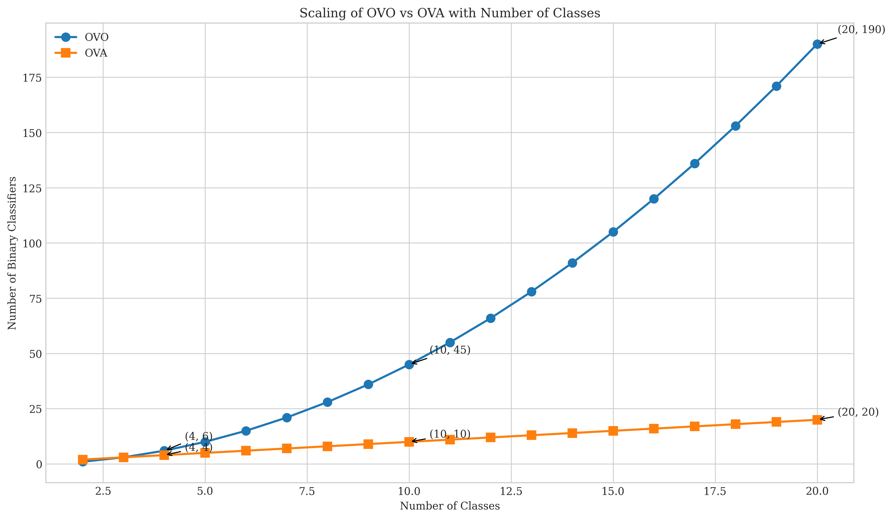
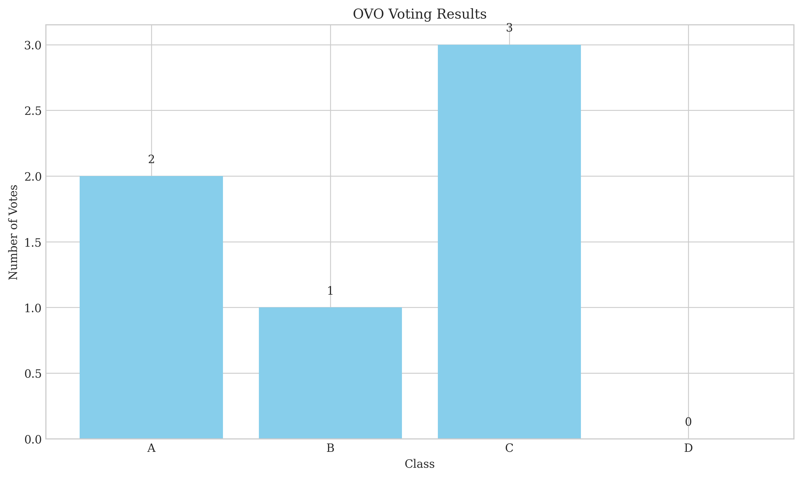
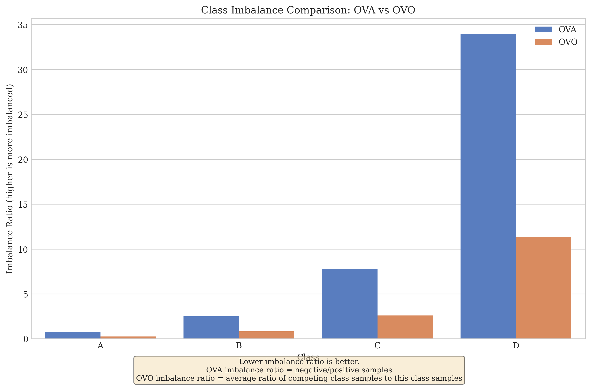

# Question 3: One-vs-One (OVO) Multi-class Classification

## Problem Statement
Consider a multi-class classification problem with $4$ classes: A, B, C, and D. You decide to use the One-vs-One (OVO) approach with Logistic Regression as the base classifier.

### Task
1. How many binary classifiers will you need to train for the OVO approach? List all pairs
2. Suppose you get the following predictions from each binary classifier:
   - A vs B: A wins
   - A vs C: C wins
   - A vs D: A wins
   - B vs C: C wins
   - B vs D: B wins
   - C vs D: C wins
   
   Using a voting scheme, which class would you predict?

3. What is a potential issue with the voting scheme in OVO when the number of classes is large? Answer in one sentence
4. How does OVO handle class imbalance compared to OVA? Explain in one or two sentences

## Solution

### 1. Number of Binary Classifiers Needed for OVO

For One-vs-One (OVO) approach with $n$ classes, we need to train $\binom{n}{2} = \frac{n(n-1)}{2}$ binary classifiers, one for each pair of classes.

With $n = 4$ classes (A, B, C, and D), we need:
$$\binom{4}{2} = \frac{4 \times 3}{2} = 6 \text{ binary classifiers}$$

The specific pairs are:
1. A vs B
2. A vs C
3. A vs D
4. B vs C
5. B vs D
6. C vs D

Each classifier is trained only on examples from the two classes it distinguishes, ignoring examples from other classes.

### 2. Voting Scheme for OVO

Given the following binary classifier predictions:
- A vs B: A wins
- A vs C: C wins
- A vs D: A wins
- B vs C: C wins
- B vs D: B wins
- C vs D: C wins

We count the number of wins for each class:
- Class A: 2 votes (wins against B and D)
- Class B: 1 vote (wins against D)
- Class C: 3 votes (wins against A, B, and D)
- Class D: 0 votes (loses all comparisons)

Since Class C has the most votes (3), the final prediction is **Class C**.

### 3. Potential Issue with OVO Voting for Large Number of Classes

The main issue with OVO voting when the number of classes is large is the quadratic growth in the number of required binary classifiers, making it computationally expensive.

For example:
- With 4 classes: 6 classifiers
- With 10 classes: 45 classifiers
- With 20 classes: 190 classifiers
- With 100 classes: 4,950 classifiers

This quadratic growth ($O(n^2)$) becomes impractical for problems with many classes, requiring excessive training time and memory to store all classifiers.

### 4. How OVO Handles Class Imbalance Compared to OVA

One-vs-One (OVO) generally handles class imbalance better than One-vs-All (OVA) because each binary classifier in OVO is trained only on data from two classes, creating more balanced training sets.

In contrast, OVA creates a binary classifier for each class where that class is positive and all other classes combined are negative. This approach can lead to severe class imbalance, especially for minority classes.

For example, in a dataset with classes A (1000 samples), B (500 samples), C (200 samples), and D (50 samples):

- For OVA, the classifier for Class D would have 50 positive samples and 1700 negative samples (imbalance ratio of 34:1)
- For OVO, each classifier involving Class D would have a much more balanced ratio (e.g., D vs A would have 50 vs 1000 samples, still imbalanced but less severely)

This improved balance in training data often leads to better performance for minority classes when using the OVO approach.

## Key Insights

- OVO requires $\frac{n(n-1)}{2}$ binary classifiers for $n$ classes
- OVO uses a voting scheme to combine binary predictions into a final class prediction
- The number of classifiers grows quadratically with the number of classes, becoming impractical for many-class problems
- OVO typically handles class imbalance better than OVA because it creates more balanced training sets for each binary classifier 