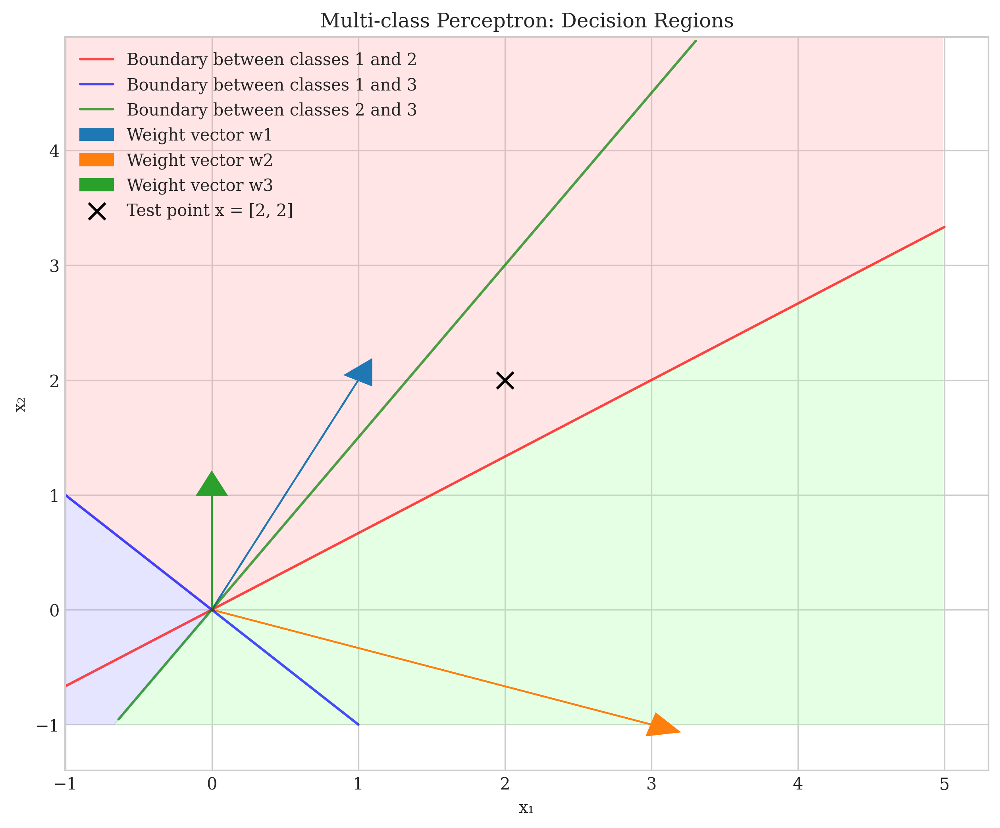
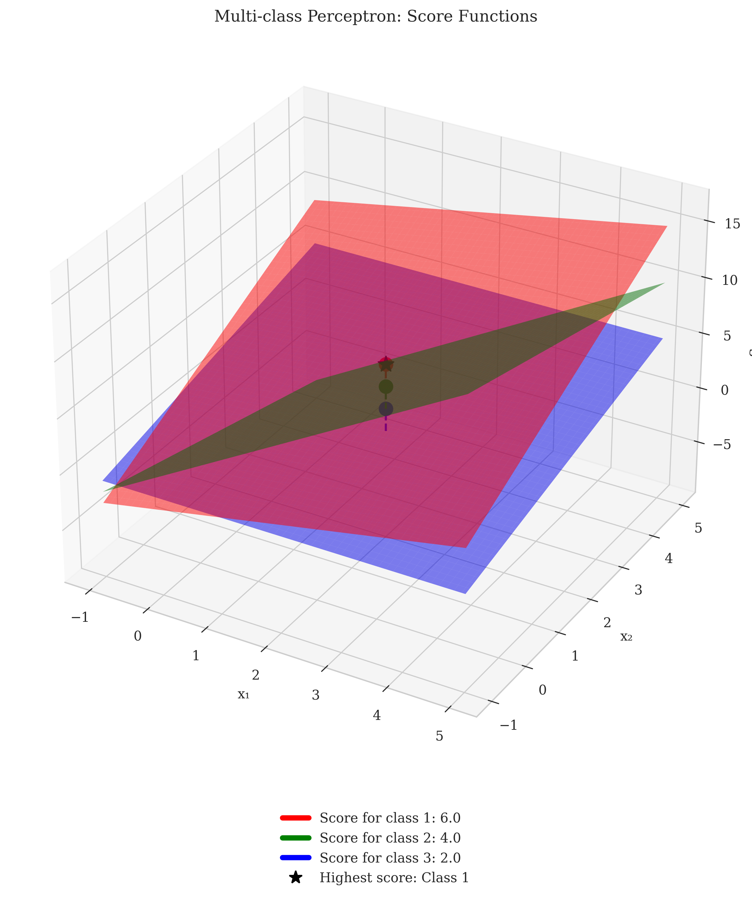

# Question 5: Multi-class Perceptron

## Problem Statement
Consider the multi-class perceptron algorithm, which directly extends the binary perceptron to handle multiple classes.

### Task
1. How does the multi-class perceptron differ from the binary perceptron? Explain in one sentence.
2. If we have $K$ classes and $d$ features, how many weight vectors and parameters do we need to learn?
3. For a $3$-class problem with $2$ features, if the weight vectors are:
   - $w_1 = [1, 2]^T$
   - $w_2 = [3, -1]^T$
   - $w_3 = [0, 1]^T$
   
   which class would be predicted for a new point $x = [2, 2]^T$?
4. If the true label for this point is class $1$, write the update rule for the multi-class perceptron (which weight vectors would be updated and how).

## Understanding the Problem
The multi-class perceptron is an extension of the binary perceptron algorithm to handle classification problems with more than two classes. Unlike binary classification where we have a single decision boundary, multi-class classification involves multiple decision boundaries separating different classes from each other.

## Solution

### Step 1: Understanding the Difference Between Binary and Multi-class Perceptron
The key difference between binary and multi-class perceptron is in how they represent decision boundaries and make predictions:

- **Binary Perceptron**: Uses a single weight vector $w$ and classifies based on the sign of the dot product $w^T x$. If $w^T x > 0$, the point is classified as positive, otherwise as negative.

- **Multi-class Perceptron**: Uses $K$ different weight vectors (one for each class) and classifies a point based on which weight vector gives the highest score when dotted with the input.

This difference allows the multi-class perceptron to partition the feature space into regions corresponding to different classes, rather than just dividing it into two regions as in the binary case.

### Step 2: Determining the Number of Weight Vectors and Parameters
For a multi-class perceptron with $K$ classes and $d$ features:
- We need $K$ weight vectors (one for each class)
- Each weight vector has $d$ components (one for each feature)
- Therefore, we need $K \times d$ parameters in total

For our specific 3-class problem with 2 features:
- Number of weight vectors: 3
- Number of parameters: $3 \times 2 = 6$

### Step 3: Predicting the Class for a New Point

For a new point $x = [2, 2]^T$, we need to calculate the score for each class and select the class with the highest score:

**Weight vectors:**
- $w_1 = [1, 2]^T$
- $w_2 = [3, -1]^T$
- $w_3 = [0, 1]^T$

**Scores calculation:**
- $\text{Score for class 1} = w_1 \cdot x = (1 \times 2) + (2 \times 2) = 2 + 4 = 6$
- $\text{Score for class 2} = w_2 \cdot x = (3 \times 2) + (-1 \times 2) = 6 - 2 = 4$
- $\text{Score for class 3} = w_3 \cdot x = (0 \times 2) + (1 \times 2) = 0 + 2 = 2$

Since class 1 has the highest score (6), the point $x = [2, 2]^T$ is predicted to belong to class 1.

The visualization above shows:
- The decision regions for each class (light red, light green, light blue)
- The weight vectors as arrows from the origin
- The decision boundaries between classes (lines where the scores for two classes are equal)
- The test point $x = [2, 2]^T$ marked with a black 'x'

We can see that the test point falls in the region for class 1 (light red), confirming our calculation.

### Step 4: 3D Visualization of Score Functions

This 3D visualization shows:
- The score functions for each class as planes in 3D space
- The height at any point $(x_1, x_2)$ represents the score for that class
- The test point's scores for each class shown as colored dots on their respective planes
- The highest score is marked with a black star

The scores are linear functions of the input features, and the class with the highest score at any point determines the classification.

### Step 5: Update Rule for the Multi-class Perceptron

For our example, since the predicted class (class 1) matches the true label (class 1), no update is needed.

However, had the prediction been incorrect, the update rule would be:

1. Increment the weight vector of the true class:
   $w_{\text{true}} = w_{\text{true}} + x$

2. Decrement the weight vector of the predicted class:
   $w_{\text{predicted}} = w_{\text{predicted}} - x$

For example, if the true class was 1 but the prediction was class 2:
- $w_1 = w_1 + x = [1, 2]^T + [2, 2]^T = [3, 4]^T$
- $w_2 = w_2 - x = [3, -1]^T - [2, 2]^T = [1, -3]^T$
- $w_3$ remains unchanged

These updates would move the decision boundaries to increase the chance of correctly classifying the point in future iterations.

## Key Insights

### Theoretical Understanding
- The multi-class perceptron uses a "one-vs-rest" approach implicitly by maintaining separate weight vectors for each class.
- The decision boundaries between any two classes are linear (hyperplanes), formed where the scores for those classes are equal.
- For $K$ classes, there are $\binom{K}{2} = \frac{K(K-1)}{2}$ decision boundaries.

### Geometric Interpretation
- Each weight vector defines a direction in the feature space where the corresponding class's score increases most rapidly.
- The decision boundaries are perpendicular to the difference between weight vectors.
- The intersection of all decision boundaries creates regions in feature space corresponding to different classes.

### Practical Implications
- The multi-class perceptron is simple to implement and can be very effective for linearly separable classes.
- The algorithm updates weights only when misclassifications occur, making it robust.
- Like the binary perceptron, it is guaranteed to converge if the classes are linearly separable.

## Conclusion
The multi-class perceptron is a natural extension of the binary perceptron that allows for direct classification into multiple classes. By maintaining separate weight vectors for each class and predicting based on the highest score, it effectively partitions the feature space into regions corresponding to different classes. 

The update rule focuses on reinforcing the correct class and penalizing the incorrectly predicted class, gradually improving the model's ability to correctly classify the data points. In our specific example with point $x = [2, 2]^T$, the model correctly predicts class 1, so no update is required. 