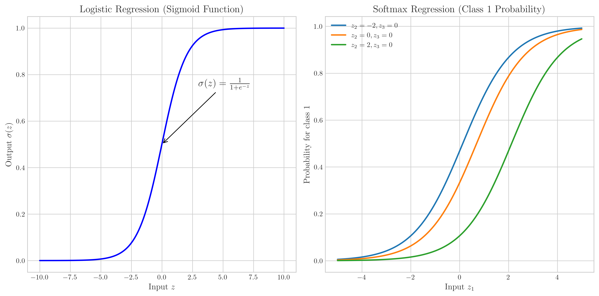
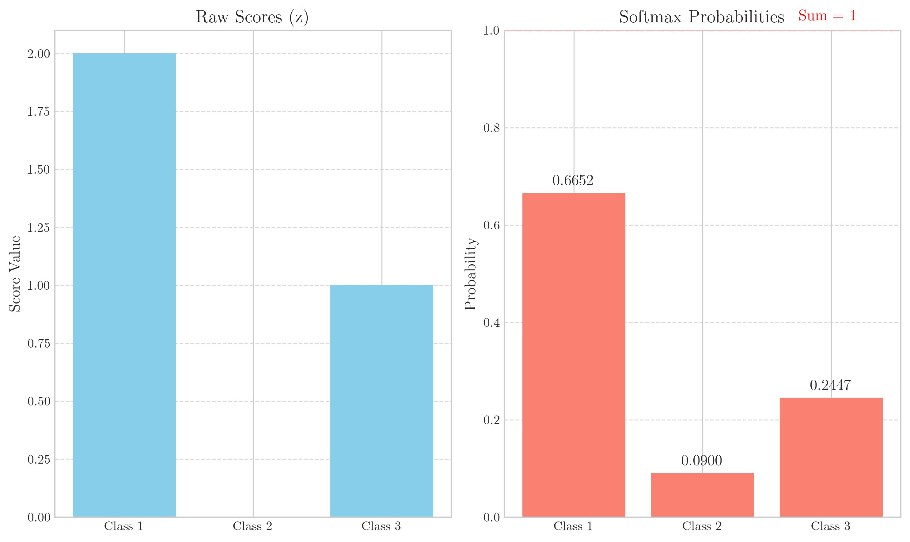
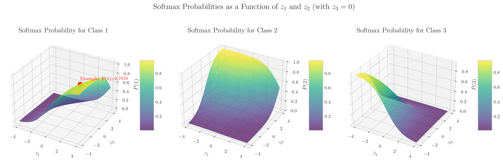
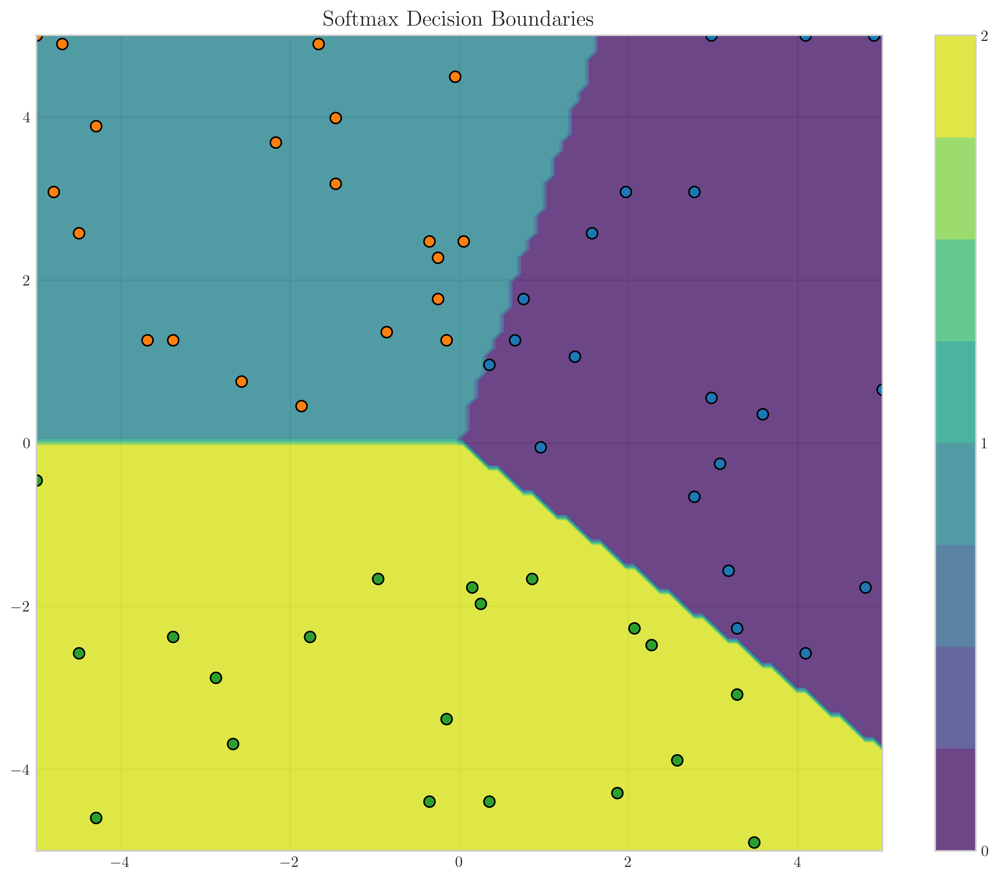
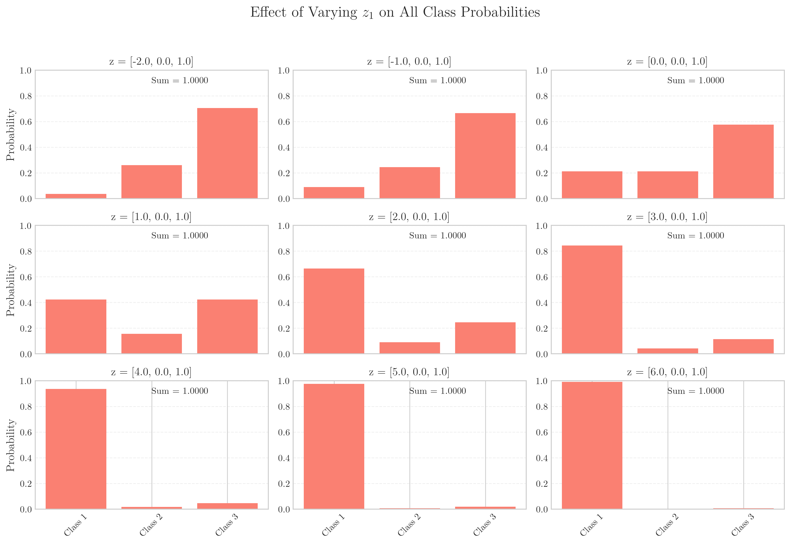

# Question 6: Softmax Regression for Multi-class Classification

## Problem Statement
Consider softmax regression for multi-class classification.

### Task
1. What is the difference between softmax regression and logistic regression? Answer in one sentence
2. Write the softmax function that converts raw scores to class probabilities
3. For a $3$-class problem with scores $z_1 = 2$, $z_2 = 0$, and $z_3 = 1$, calculate the softmax probabilities
4. How does softmax regression ensure that the predicted probabilities sum to $1$? Explain in one sentence

## Understanding the Problem
Softmax regression is a generalization of logistic regression to multi-class classification problems. While logistic regression handles binary classification by converting a single score to a probability through the sigmoid function, softmax regression takes multiple scores (one for each class) and converts them to a probability distribution across all classes. Understanding softmax regression is crucial for tasks where we need to classify inputs into more than two categories, such as image classification, document categorization, or natural language processing tasks.

## Solution

### Step 1: Understanding the Softmax Function
The softmax function takes a vector of raw scores or "logits" (often denoted as $z$) and transforms them into a probability distribution. For each class $i$, the softmax function is defined as:

$$\text{softmax}(z_i) = \frac{e^{z_i}}{\sum_{j=1}^{K} e^{z_j}}$$

Where $K$ is the number of classes, $z_i$ is the score for class $i$, and $e^{z_i}$ is the exponential of the score.

### Step 2: Differentiating Softmax from Logistic Regression
Logistic regression is a binary classifier that uses the sigmoid function to transform a single score into a probability between 0 and 1 for a binary outcome. The sigmoid function is:

$$\sigma(z) = \frac{1}{1 + e^{-z}}$$

Softmax regression extends this concept to multiple classes by assigning relative probabilities to each class. The key difference is that softmax regression can handle more than two classes and ensures the probabilities across all classes sum to 1.

The graph shows the sigmoid function for logistic regression (left) and how softmax probabilities for one class change as input scores vary (right). For softmax, the probability of class 1 depends not just on its own score but also on the scores of other classes.

### Step 3: Calculating Softmax Probabilities for the Given Example
For the 3-class problem with scores $z_1 = 2$, $z_2 = 0$, and $z_3 = 1$, we calculate the softmax probabilities step by step:

1. Input scores: $z = [2, 0, 1]$
2. For numerical stability, we shift the scores by subtracting the maximum value ($\max(z) = 2$):
   $\text{shifted}_z = [0, -2, -1]$
3. Calculate exponentials: $e^{\text{shifted}_z} = [1, 0.135, 0.368]$
4. Sum of exponentials: $\sum_j e^{z_j} = 1.503$
5. Normalize by dividing each exponential by the sum:
   $\text{softmax}(z) = [1/1.503, 0.135/1.503, 0.368/1.503] = [0.665, 0.090, 0.245]$

The final softmax probabilities are approximately:
- Class 1: 0.665 (66.5%)
- Class 2: 0.090 (9.0%)
- Class 3: 0.245 (24.5%)

These probabilities sum to 1, confirming that we have a valid probability distribution.

The left bar chart shows the raw scores, while the right bar chart displays the corresponding softmax probabilities, highlighting that the highest score (Class 1) receives the highest probability, but the sum of all probabilities equals 1.

### Step 4: Ensuring Probabilities Sum to 1
The softmax function ensures that the predicted probabilities sum to 1 by normalizing each exponentiated score by the sum of all exponentiated scores. Mathematically:

$$\sum_{i=1}^{K} \text{softmax}(z_i) = \sum_{i=1}^{K} \frac{e^{z_i}}{\sum_{j=1}^{K} e^{z_j}} = \frac{\sum_{i=1}^{K} e^{z_i}}{\sum_{j=1}^{K} e^{z_j}} = 1$$

This normalization creates a proper probability distribution where each probability is between 0 and 1, and the sum of all probabilities equals 1.

## Practical Implementation

### Visualizing Softmax Probabilities
The following 3D plots show how the softmax probabilities for each class vary as a function of $z_1$ and $z_2$ (with $z_3$ fixed at 0):

These visualizations demonstrate how increasing the score for one class increases its probability while simultaneously decreasing the probabilities of all other classes, maintaining a sum of 1.

### Softmax Decision Boundaries
The following visualization shows the decision boundaries created by a softmax classifier in a 2D feature space:

This plot illustrates how the feature space is divided into regions corresponding to different class predictions based on the highest softmax probability. Each colored region represents the area where a particular class has the highest probability. The decision boundaries between classes are linear, which is a characteristic property of softmax regression.

### Effect of Varying Scores on Probabilities
When we vary one score while keeping others constant, we can see how all class probabilities adjust:

This grid of plots shows how changing $z_1$ affects the probabilities of all three classes. The sum always remains 1, demonstrating the key property of softmax probabilities.

## Key Insights

### Mathematical Properties
- The softmax function is a generalization of the sigmoid function to multiple classes.
- Softmax transforms arbitrary real-valued scores into a probability distribution.
- The exponential function in softmax ensures all probabilities are positive.
- The normalization step ensures the probabilities sum to 1.

### Practical Applications
- Softmax regression is the go-to model for multi-class classification problems.
- Softmax outputs can be directly interpreted as class probabilities.
- The model is commonly used as the final layer in neural networks for classification tasks.
- Cross-entropy loss is typically used with softmax regression during training.

### Implementation Considerations
- For numerical stability, it's important to subtract the maximum score before applying the exponential function to prevent overflow.
- Despite its name, softmax regression is a linear model (similar to logistic regression) as the decision boundaries are linear.
- The softmax function itself is a non-linear activation function applied to the outputs of linear functions.

## Conclusion
- Softmax regression extends logistic regression from binary to multi-class classification by using the softmax function instead of the sigmoid function.
- The softmax function is defined as $\text{softmax}(z_i) = \frac{e^{z_i}}{\sum_{j=1}^{K} e^{z_j}}$, transforming raw scores into probabilities.
- For the given example with scores $[2,0,1]$, the softmax probabilities are $[0.665, 0.090, 0.245]$.
- Softmax ensures probabilities sum to 1 by normalizing each exponentiated score by their sum, creating a valid probability distribution. 