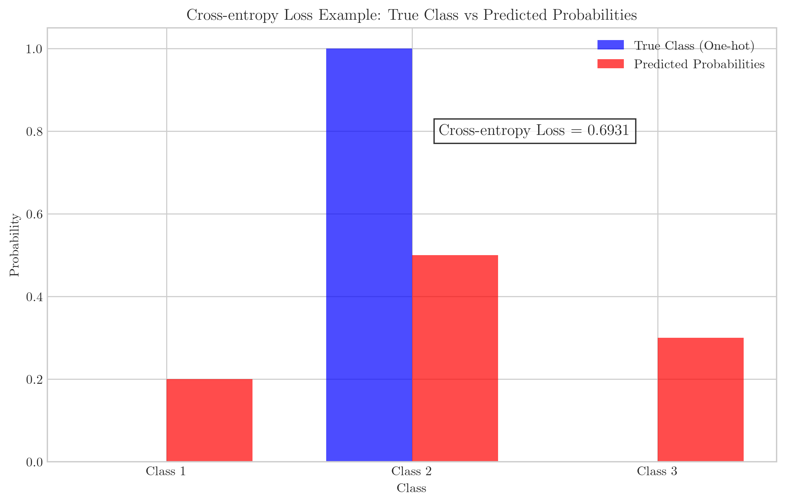
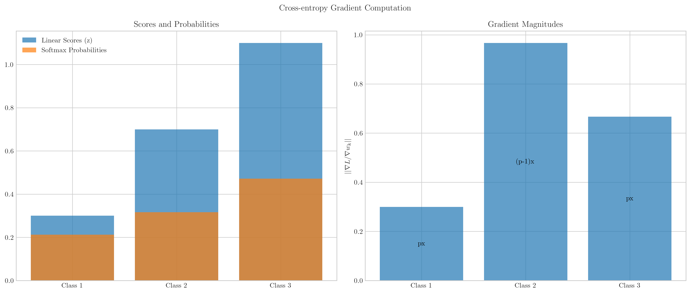
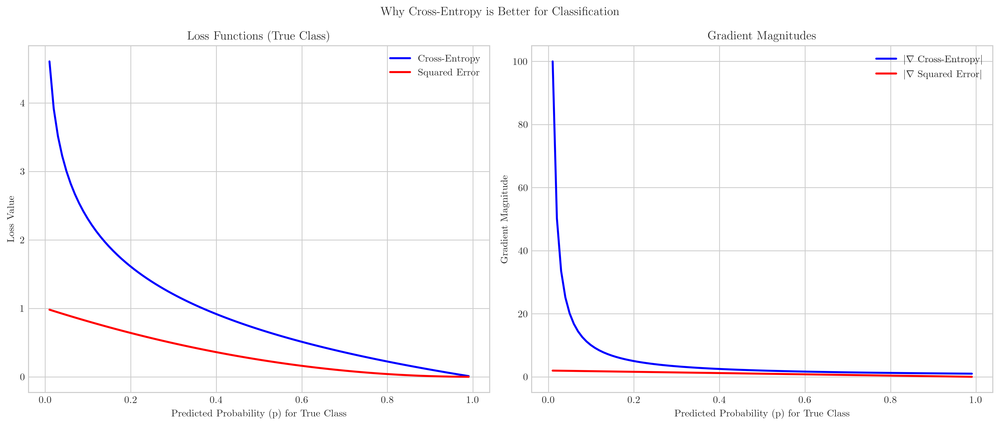
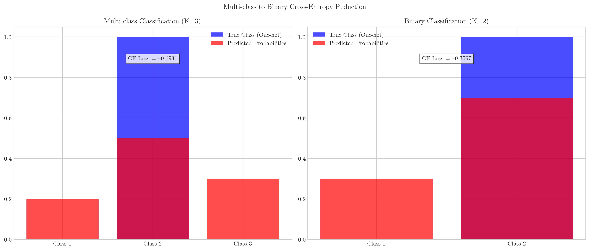
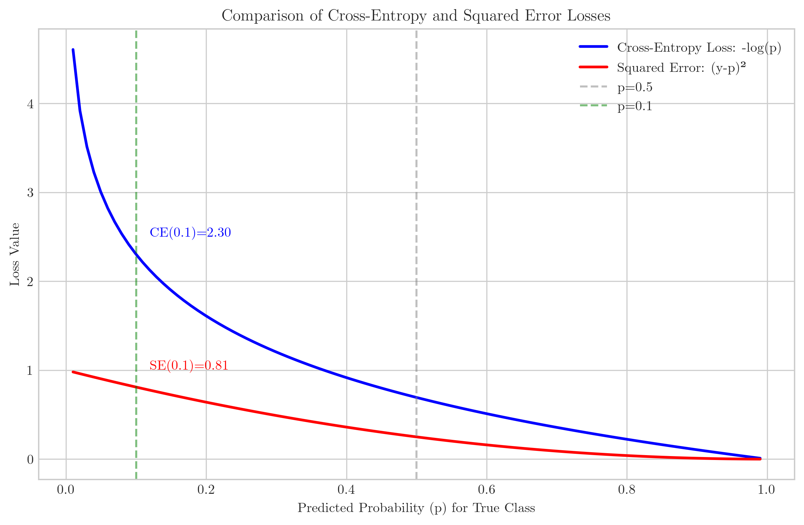

# Question 7: Multi-class Cross-entropy Loss for Softmax Regression

## Problem Statement
Consider the multi-class cross-entropy loss function for softmax regression:

$$L(w) = -\sum_{i=1}^{n} \sum_{k=1}^{K} y_{ik} \log(p_{ik})$$

where $y_{ik}$ is $1$ if example $i$ belongs to class $k$ and $0$ otherwise, and $p_{ik}$ is the predicted probability of example $i$ belonging to class $k$.

### Task
1. For a single data point with true class $2$ out of $3$ classes, and predicted probabilities $p_1 = 0.2$, $p_2 = 0.5$, $p_3 = 0.3$, calculate the cross-entropy loss
2. Derive the gradient of the cross-entropy loss with respect to the model parameters for a single data point
3. Why is cross-entropy a more appropriate loss function for multi-class classification than squared error? Answer in one or two sentences
4. How does the multi-class cross-entropy loss reduce to binary cross-entropy when there are only two classes? Explain in one or two sentences

## Understanding the Problem
Cross-entropy loss is a fundamental concept in classification tasks, especially when using softmax regression for multi-class problems. It quantifies the difference between the predicted probability distribution and the true distribution (represented as one-hot encoding for classification problems). The loss increases as the predicted probability of the true class decreases, thus encouraging the model to correctly classify examples.

In this problem, we need to understand not only how to calculate the cross-entropy loss but also its gradient, which is crucial for training models using gradient-based optimization methods. We'll also explore why cross-entropy is preferred over squared error for classification tasks, and how the multi-class formula simplifies to the binary case.

## Solution

### Task 1: Calculate the cross-entropy loss

For a single data point with true class 2 (out of 3 classes) and predicted probabilities $p_1 = 0.2$, $p_2 = 0.5$, $p_3 = 0.3$, we can represent the true class as a one-hot encoded vector $y = [0, 1, 0]$.

The cross-entropy loss is calculated as:

$$L = -\sum_{k=1}^{K} y_k \log(p_k)$$

Substituting our values:

$$L = -[0 \times \log(0.2) + 1 \times \log(0.5) + 0 \times \log(0.3)]$$

$$L = -\log(0.5)$$

$$L = -\log(0.5) = 0.693$$

As shown in the visualization, the cross-entropy loss focuses solely on the predicted probability for the true class (Class 2), ignoring the probabilities for other classes. The loss value of 0.693 reflects the penalty for predicting only a 50% probability for the correct class.

### Task 2: Derive the gradient of the cross-entropy loss

To derive the gradient of the cross-entropy loss with respect to the model parameters, we need to understand how the predicted probabilities are computed using softmax regression.

For softmax regression, the predicted probability for class $k$ is:

$$p_k = \frac{\exp(w_k^T x)}{\sum_{j=1}^{K} \exp(w_j^T x)}$$

where $w_k$ is the weight vector for class $k$ and $x$ is the input feature vector.

The cross-entropy loss for a single example with true class $y$ is:

$$L = -\log(p_y)$$

To derive the gradient $\frac{\partial L}{\partial w_k}$ for each class $k$, we apply the chain rule:

1. For the true class $y$:
   $$\frac{\partial L}{\partial w_y} = \frac{\partial L}{\partial p_y} \times \frac{\partial p_y}{\partial w_y}$$

   The partial derivative of the loss with respect to $p_y$ is:
   $$\frac{\partial L}{\partial p_y} = -\frac{1}{p_y}$$

   The partial derivative of $p_y$ with respect to $w_y$ is:
   $$\frac{\partial p_y}{\partial w_y} = p_y(1-p_y)x$$

   Therefore:
   $$\frac{\partial L}{\partial w_y} = -\frac{1}{p_y} \times p_y(1-p_y)x = (p_y-1)x$$

2. For classes $k \neq y$:
   $$\frac{\partial L}{\partial w_k} = \frac{\partial L}{\partial p_y} \times \frac{\partial p_y}{\partial w_k}$$

   The partial derivative of $p_y$ with respect to $w_k$ (for $k \neq y$) is:
   $$\frac{\partial p_y}{\partial w_k} = -p_y p_k x$$

   Therefore:
   $$\frac{\partial L}{\partial w_k} = -\frac{1}{p_y} \times (-p_y p_k x) = p_k x$$

In general, for any class $k$, the gradient can be expressed as:

$$\frac{\partial L}{\partial w_k} = (p_k - \mathbb{1}[k=y])x$$

where $\mathbb{1}[k=y]$ is 1 if $k$ equals the true class $y$, and 0 otherwise.

The visualization shows the computation of gradients for a simple example with 3 classes, where Class 2 is the true class. The left plot displays the linear scores and softmax probabilities for each class, while the right plot shows the magnitude of the gradient for each class's weight vector. For the true class, the gradient takes the form $(p-1)x$, and for other classes, it's simply $px$.

### Task 3: Why cross-entropy is more appropriate than squared error

Cross-entropy is more appropriate than squared error for classification because it provides much stronger penalties for confident wrong predictions, creating larger gradients and faster learning when predictions are far from the true distribution, and it aligns with the principles of maximum likelihood estimation for probability distributions.

The visualization compares cross-entropy and squared error loss functions. The left plot shows the loss values as a function of the predicted probability for the true class. When the predicted probability for the true class is low (approaching 0), cross-entropy loss grows much faster than squared error, heavily penalizing confident wrong predictions.

The right plot shows the gradient magnitudes. Cross-entropy's gradient approaches infinity as the predicted probability approaches zero, providing a strong learning signal when predictions are very wrong. This helps the model quickly correct significant errors, making cross-entropy more effective for classification tasks.

### Task 4: Reduction to binary cross-entropy

When there are only two classes (K=2), the multi-class cross-entropy reduces to binary cross-entropy because with only two mutually exclusive classes, we can represent the problem with a single probability p (for class 1) and 1-p (for class 0), leading to the familiar binary formula: $-[(1-y)\log(1-p) + y\log(p)]$.

The visualization demonstrates how multi-class classification with K=3 classes (left) and binary classification with K=2 classes (right) both use cross-entropy loss. In the binary case, the loss calculation simplifies because we only need a single probability value, as the other class's probability is its complement.

Mathematically, for K=2, we can rewrite the general multi-class formula:

1. Start with the multi-class formula: $L(w) = -\sum_{i=1}^{n} \sum_{k=1}^{K} y_{ik} \log(p_{ik})$
2. For K=2, this becomes: $L(w) = -\sum_{i=1}^{n} [y_{i1} \log(p_{i1}) + y_{i2} \log(p_{i2})]$
3. Using the binary notation $y_{i1} = 1-y_i$, $y_{i2} = y_i$, $p_{i1} = 1-p_i$, $p_{i2} = p_i$:
4. We get: $L(w) = -\sum_{i=1}^{n} [(1-y_i) \log(1-p_i) + y_i \log(p_i)]$

This is the standard binary cross-entropy loss formula used in logistic regression.

## Visual Explanations

### Cross-entropy Loss Example

This visualization shows the input data for Task 1: the true class (in blue) represented as a one-hot vector [0,1,0], and the predicted probabilities (in red) [0.2, 0.5, 0.3]. The cross-entropy loss (0.693) is calculated by taking the negative log of the predicted probability for the true class.

### Gradient Computation

This visualization demonstrates how the gradient is computed for softmax regression with cross-entropy loss. The left panel shows the linear scores and resulting softmax probabilities for each class. The right panel shows the magnitude of the gradient for each class's weight vector, with the formula used for each class.

### Loss Comparison

This graph compares cross-entropy and squared error losses as a function of the predicted probability for the true class. Note how cross-entropy loss approaches infinity as the probability approaches zero, creating a much stronger learning signal for very wrong predictions compared to squared error.

### Detailed Loss and Gradient Comparison

This detailed comparison shows both the loss functions (left) and their gradients (right). The gradient plot clearly demonstrates why cross-entropy is more effective for classification: its gradient magnitude becomes very large for wrong predictions (when p is close to 0), accelerating learning in these critical cases.

### Multi-class to Binary Reduction

This visualization compares multi-class cross-entropy (K=3) and binary cross-entropy (K=2), showing how both use the same fundamental principle but with different dimensionality. In the binary case (right), we only need to represent one probability since the other is its complement.

### Formula Reduction

This mathematical derivation shows step-by-step how the multi-class cross-entropy formula reduces to the binary cross-entropy formula when K=2, using the constraint that probabilities must sum to 1.

## Key Insights

### Theoretical Foundations
- Cross-entropy measures the difference between two probability distributions: the true distribution (represented by one-hot encoding for classification) and the predicted distribution.
- For softmax regression, cross-entropy loss has a particularly elegant gradient formula: $\nabla_{w_k} L = (p_k - y_k)x$, where $y_k$ is 1 for the true class and 0 otherwise.
- Cross-entropy is derived from the principle of maximum likelihood estimation for categorical distributions, making it theoretically well-founded for classification problems.

### Practical Applications
- Cross-entropy's large gradient for wrong predictions accelerates learning, especially in early training phases when predictions may be far from the truth.
- When combined with softmax activation, cross-entropy loss creates a convex optimization problem, avoiding local minima issues.
- The formula can be easily extended from binary to multi-class problems while maintaining the same fundamental properties.

### Comparison with Other Loss Functions
- Unlike squared error, cross-entropy treats classes as categorical rather than ordered numerical values, making it more appropriate for classification.
- Cross-entropy assigns increasingly severe penalties for confident wrong predictions, which aligns better with classification objectives.
- The gradient of cross-entropy provides stronger learning signals when predictions are far from the truth, resulting in faster convergence.

## Conclusion
- Cross-entropy loss for a single data point with true class 2 and probabilities [0.2, 0.5, 0.3] is 0.693.
- The gradient of the loss with respect to weights has an elegant form: $(p_k - \mathbb{1}[k=y])x$, where $\mathbb{1}[k=y]$ is 1 for the true class and 0 otherwise.
- Cross-entropy is more appropriate than squared error for classification because it provides stronger penalties for confident wrong predictions and aligns with maximum likelihood estimation for probability distributions.
- Multi-class cross-entropy reduces to binary cross-entropy when K=2 by expressing the problem in terms of a single probability value and its complement.

Cross-entropy loss serves as the cornerstone of modern classification models, with its theoretical guarantees and practical advantages making it the standard choice for training neural networks and other models for classification tasks. 