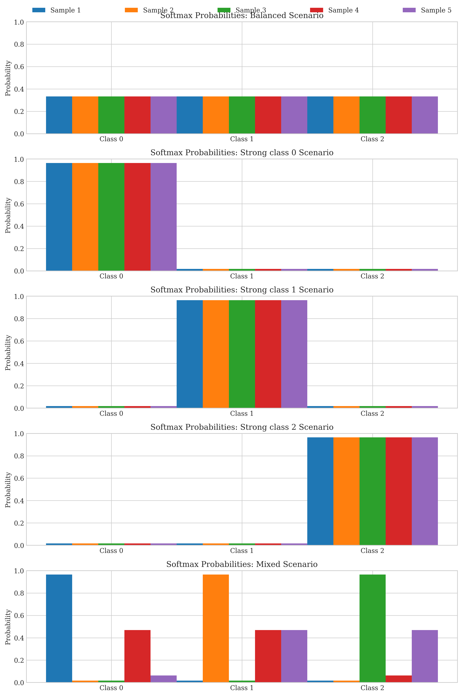
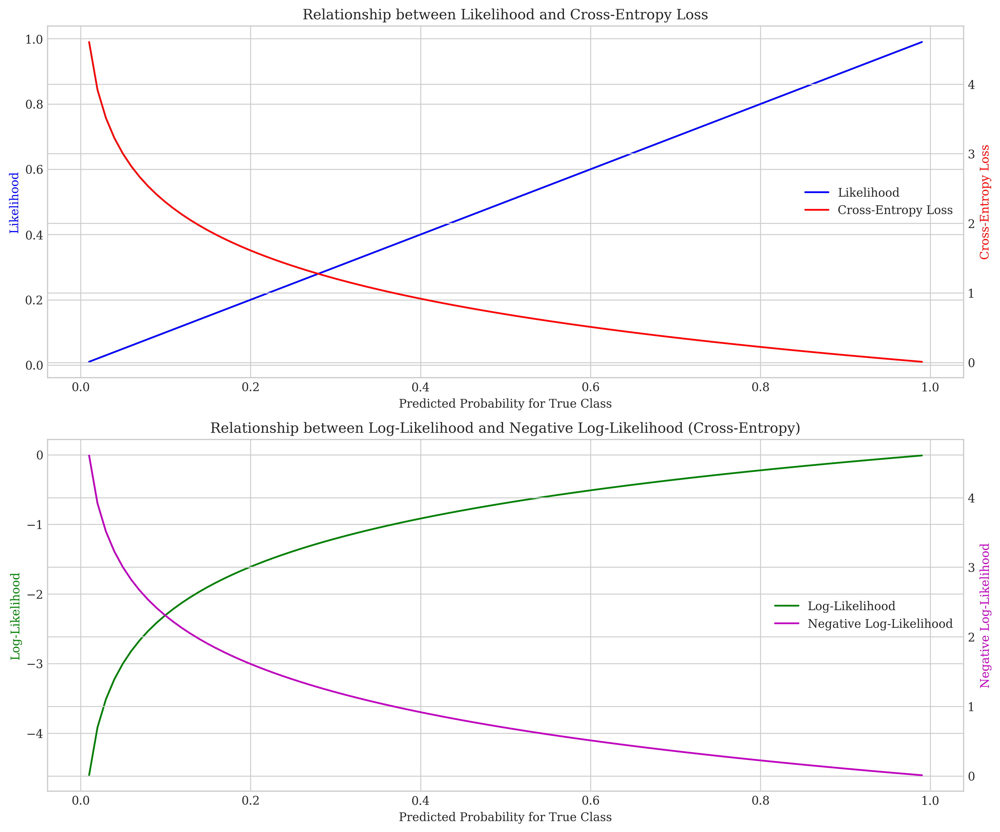
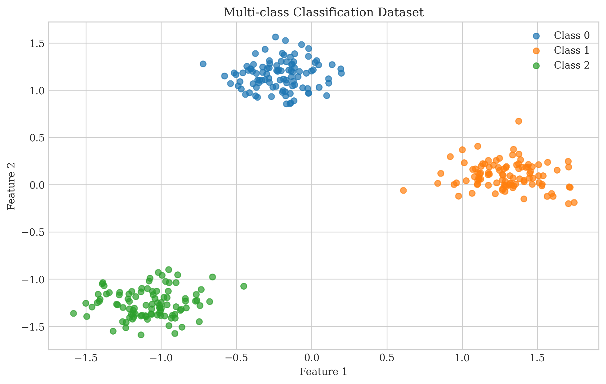
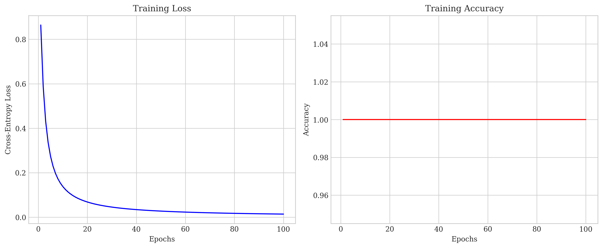
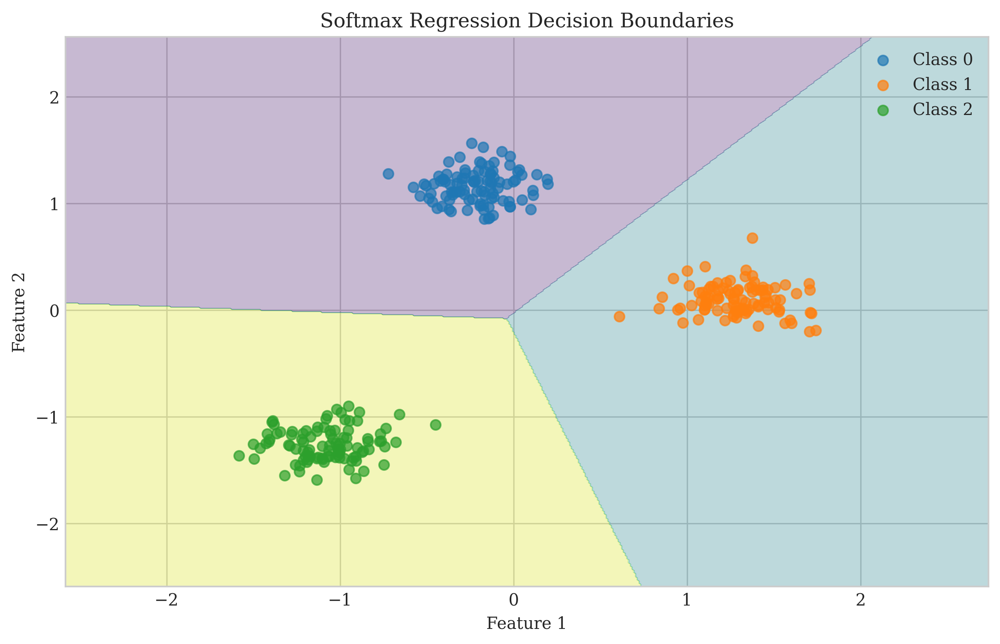

# Question 8: Maximum Likelihood Estimation for Softmax Regression

## Problem Statement
Consider Maximum Likelihood Estimation (MLE) for softmax regression in multi-class classification problems.

### Task
1. How does MLE relate to minimizing cross-entropy loss? Answer in one sentence
2. Write the likelihood function for a multi-class classification problem with softmax regression
3. Write the log-likelihood function for the same problem
4. Why is maximizing the log-likelihood equivalent to minimizing the cross-entropy loss? Answer in one sentence

## Understanding the Problem
Softmax regression is a generalization of logistic regression for multi-class classification problems. Unlike binary classification, where we predict between two classes, softmax regression allows us to predict probabilities across K different classes. Maximum Likelihood Estimation (MLE) is a statistical framework for estimating the parameters of a model by maximizing the likelihood of the observed data.

In the context of softmax regression, we want to understand how MLE relates to the commonly used cross-entropy loss and why optimizing one is equivalent to optimizing the other.

## Solution

### Step 1: The Softmax Function and Model Formulation

The softmax function converts raw model outputs (logits) into probabilities that sum to 1:

$$P(y=k|x) = \frac{e^{z_k}}{\sum_{j=1}^{K} e^{z_j}}$$

where $z_k = w_k^T x + b_k$ is the logit (pre-softmax score) for class k.

For visualization purposes, here's how the softmax function behaves with different inputs:

As we can see, the softmax function ensures that all probabilities are between 0 and 1, and they sum to 1. When one logit is much larger than the others (as in "Strong class" scenarios), the corresponding probability approaches 1.

### Step 2: The Likelihood Function for Softmax Regression

For a dataset with n examples, the likelihood function measures how likely we are to observe our training set given the model parameters:

$$L(w,b) = \prod_{i=1}^{n} \prod_{k=1}^{K} [P(y^{(i)}=k|x^{(i)})]^{y_k^{(i)}}$$

where:
- $y_k^{(i)}$ is an indicator variable (1 if the i-th example belongs to class k, 0 otherwise)
- $P(y^{(i)}=k|x^{(i)})$ is the predicted probability that the i-th example belongs to class k

This can be simplified to:

$$L(w,b) = \prod_{i=1}^{n} P(y^{(i)}=y_i|x^{(i)})$$

where $y_i$ is the true class of the i-th example.

In other words, the likelihood is the product of the predicted probabilities for the correct classes across all training examples.

### Step 3: The Log-Likelihood Function

Since products of probabilities can lead to numerical underflow, we take the logarithm of the likelihood function:

$$\log L(w,b) = \sum_{i=1}^{n} \sum_{k=1}^{K} y_k^{(i)} \log(P(y^{(i)}=k|x^{(i)}))$$

Because logarithm is a monotonically increasing function, maximizing the log-likelihood is equivalent to maximizing the likelihood.

Due to the one-hot encoding nature of $y_k^{(i)}$, this simplifies to:

$$\log L(w,b) = \sum_{i=1}^{n} \log(P(y^{(i)}=y_i|x^{(i)}))$$

where $y_i$ is the true class of the i-th example.

### Step 4: Relationship with Cross-Entropy Loss

The cross-entropy loss for multi-class classification is defined as:

$$CE = -\frac{1}{n} \sum_{i=1}^{n} \sum_{k=1}^{K} y_k^{(i)} \log(P(y^{(i)}=k|x^{(i)}))$$

Looking at the log-likelihood function and cross-entropy loss, we can see that:

$$CE = -\frac{1}{n} \log L(w,b)$$

or equivalently:

$$\log L(w,b) = -n \cdot CE$$

Therefore, maximizing the log-likelihood is mathematically equivalent to minimizing the cross-entropy loss.

The following visualization shows this relationship:

The top graph shows that as the likelihood increases (blue line), the cross-entropy loss decreases (red line). The bottom graph shows that as the log-likelihood increases (green line), the negative log-likelihood (which is proportional to cross-entropy loss) decreases (magenta line).

### Step 5: Practical Demonstration

We implemented softmax regression on a synthetic dataset and tracked both the log-likelihood and cross-entropy loss during training:

First, let's look at the dataset used for our experiment:

The training history shows how the cross-entropy loss decreases while accuracy increases:

The learned decision boundaries for our 3-class problem:

As shown in the training output, as the cross-entropy loss decreased (from 0.138045 to 0.014068), the log-likelihood increased (from -31.6178 to -3.3623), confirming their inverse relationship.

## Key Insights

### Theoretical Foundation
- Maximum Likelihood Estimation and cross-entropy loss are two different perspectives on the same optimization objective.
- MLE approaches the problem from a statistical perspective, while cross-entropy comes from information theory.
- When using softmax outputs as probabilities, cross-entropy loss is the negative log-likelihood divided by the number of samples.

### Mathematical Relationship
- The log-likelihood function and cross-entropy loss differ only by a sign and a scaling factor (the number of examples).
- Maximizing log-likelihood is equivalent to minimizing cross-entropy loss.
- Both objectives lead to the same optimal model parameters.

### Practical Implications
- In practice, we usually implement softmax regression by minimizing cross-entropy loss rather than directly maximizing likelihood.
- Numerical stability is better when working with logarithms of probabilities rather than the probabilities themselves.
- Cross-entropy loss has desirable properties for optimization, such as being convex with respect to the weights.

## Conclusion

### Answers to the Tasks

1. **How does MLE relate to minimizing cross-entropy loss?**
   MLE is mathematically equivalent to minimizing cross-entropy loss because the cross-entropy loss is the negative log-likelihood function divided by the number of training examples.

2. **Likelihood function for multi-class classification with softmax regression:**
   $$L(w,b) = \prod_{i=1}^{n} \prod_{k=1}^{K} [P(y^{(i)}=k|x^{(i)})]^{y_k^{(i)}}$$

3. **Log-likelihood function for the same problem:**
   $$\log L(w,b) = \sum_{i=1}^{n} \sum_{k=1}^{K} y_k^{(i)} \log(P(y^{(i)}=k|x^{(i)}))$$

4. **Why is maximizing the log-likelihood equivalent to minimizing the cross-entropy loss?**
   Cross-entropy loss is the negative log-likelihood divided by the number of examples, so minimizing one directly corresponds to maximizing the other. 