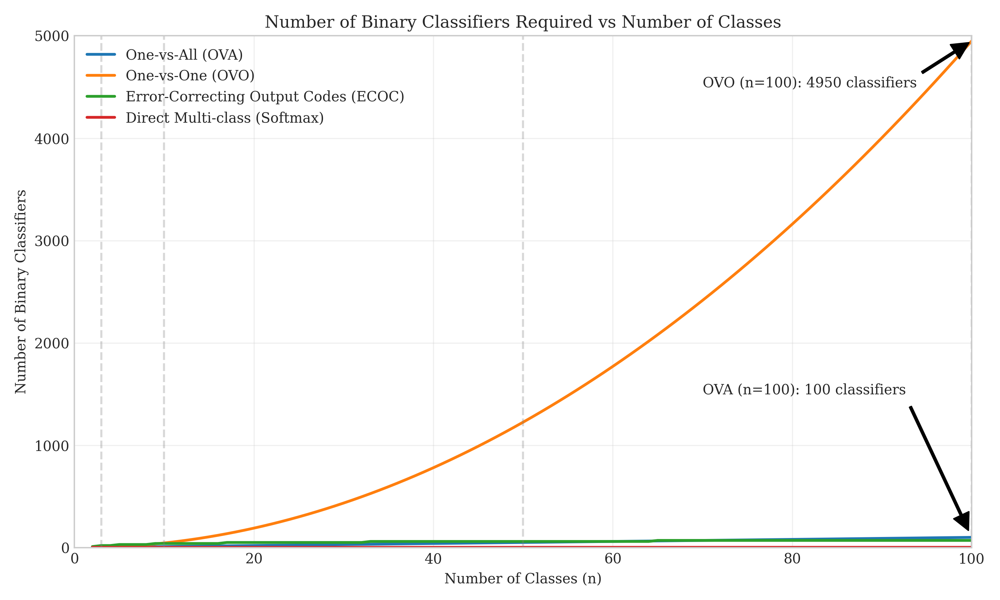
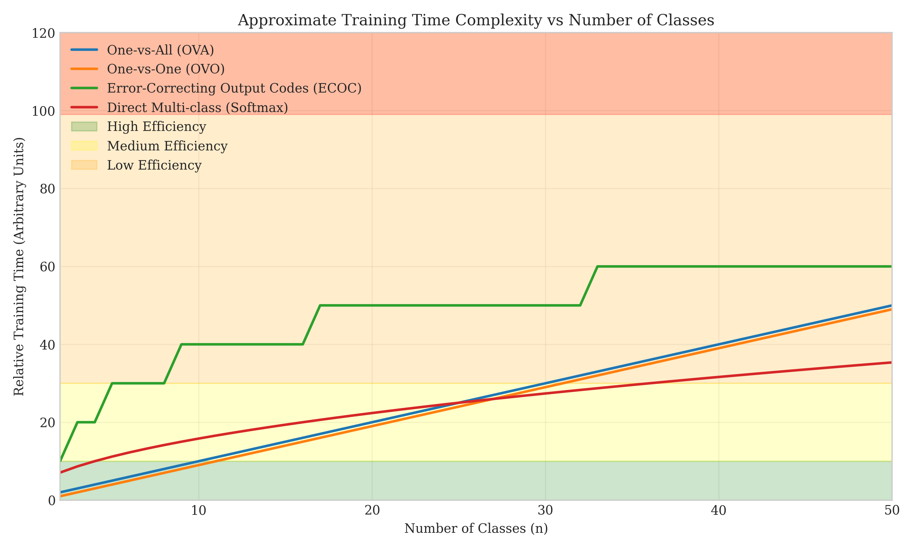
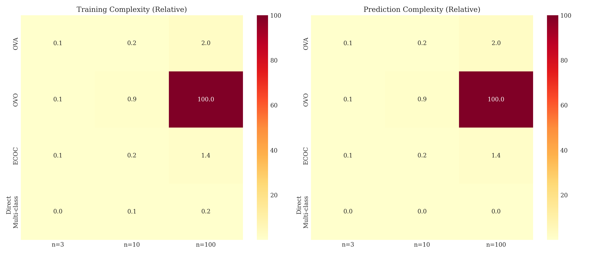
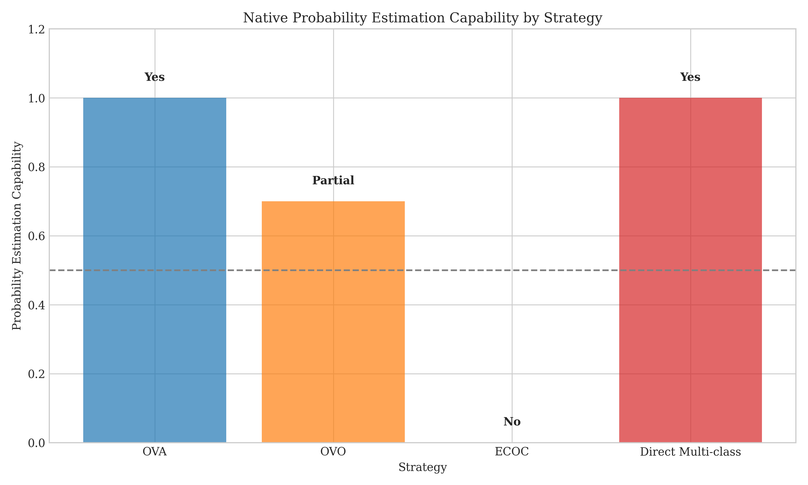
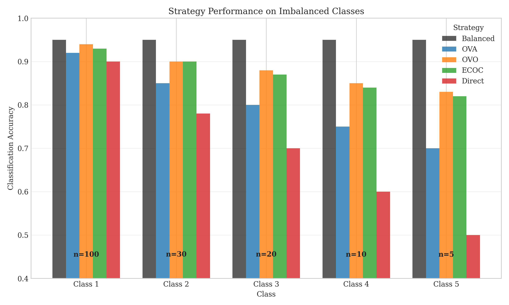

# Question 9: Comparing Multi-class Classification Strategies

## Problem Statement
Compare different multi-class classification strategies in terms of various metrics.

### Task
1. Complete the following table by marking with X the strategies that have the specified properties:

| Property | OVA | OVO | ECOC | Direct Multi-class (e.g., Softmax) |
|----------|-----|-----|------|----------------------------------|
| Handles large number of classes efficiently |     |     |      |                                  |
| Provides probability estimates naturally |     |     |      |                                  |
| Most computationally efficient during training |     |     |      |                                  |
| Most computationally efficient during prediction |     |     |      |                                  |
| Most robust to class imbalance |     |     |      |                                  |

2. Which approach would you recommend for a problem with $100$ classes but limited training data? Explain why in one sentence
3. Which approach would you recommend for a problem with $3$ classes and abundant training data? Explain why in one sentence
4. How does the choice of base classifier (e.g., Perceptron vs. logistic regression) affect the selection of multi-class strategy? Explain in two sentences

## Understanding the Problem
Multi-class classification extends binary classification to problems with more than two classes. While some algorithms naturally handle multiple classes (like decision trees), many fundamental algorithms (like SVM and logistic regression) are inherently binary. Various strategies have been developed to adapt binary classifiers for multi-class problems, each with distinct advantages and limitations.

## Solution

### Step 1: Understanding Multi-class Classification Strategies

Let's first understand the key differences between each strategy:

1. **One-vs-All (OVA)**: Trains $n$ binary classifiers (one for each class), where each classifier distinguishes between one class and all others. During prediction, the class with the highest confidence score is selected.

2. **One-vs-One (OVO)**: Trains $\frac{n(n-1)}{2}$ binary classifiers, where each classifier distinguishes between a pair of classes. During prediction, each classifier votes for a class, and the class with the most votes wins.

3. **Error-Correcting Output Codes (ECOC)**: Assigns a unique binary code to each class and trains binary classifiers for each bit position. During prediction, the class whose code is closest to the predicted code is selected. Typically requires $O(\log_2(n))$ classifiers.

4. **Direct Multi-class (e.g., Softmax)**: Directly extends the model to handle multiple classes in a single model, such as multinomial logistic regression with softmax activation.

### Step 2: Comparing Number of Classifiers and Scalability

The number of classifiers required by each strategy is a key factor in their efficiency:

- OVA: Requires $n$ classifiers for $n$ classes (linear scaling)
- OVO: Requires $\frac{n(n-1)}{2}$ classifiers for $n$ classes (quadratic scaling)
- ECOC: Requires approximately $\log_2(n)$ classifiers for $n$ classes (logarithmic scaling)
- Direct Multi-class: Requires only 1 model regardless of the number of classes (constant scaling)

As shown in the graph, the number of classifiers for OVO grows quadratically with the number of classes, making it inefficient for problems with many classes. OVA grows linearly, while ECOC grows logarithmically, making the latter more efficient for large numbers of classes. Direct multi-class approaches maintain a constant number of models regardless of class count.

### Step 3: Analyzing Training and Prediction Efficiency

Training time is affected by both the number of classifiers and the amount of data each classifier processes:

- OVA: Each classifier uses all training data ($O(n \times N)$ complexity)
- OVO: Each classifier uses only data from two classes ($O(n^2 \times \frac{2N}{n})$ complexity)
- ECOC: Each classifier uses all training data ($O(\log(n) \times N)$ complexity)
- Direct Multi-class: Uses all training data in one model ($O(N \times \sqrt{n})$ complexity)

Where $n$ is the number of classes and $N$ is the number of samples.

For prediction efficiency, direct multi-class is generally fastest since it requires running only one model. OVO is slowest since it requires running many classifiers (quadratic in number of classes). The relative computational complexities for different numbers of classes can be seen below:

### Step 4: Evaluating Probability Estimates and Class Imbalance

Probability estimation capabilities differ across strategies:

- OVA: Naturally provides probability estimates for each class
- OVO: Can provide probability estimates but requires aggregation of pairwise probabilities
- ECOC: Does not naturally provide probability estimates
- Direct Multi-class: Naturally provides probability estimates (e.g., softmax outputs)

Robustness to class imbalance also varies significantly across strategies:

- OVA: Moderately affected by class imbalance
- OVO: More robust to class imbalance since each classifier sees a balanced subset of two classes
- ECOC: More robust to class imbalance due to redundant code bits
- Direct Multi-class: Most affected by class imbalance, especially for minority classes

### Step 5: Completing the Properties Table

Based on our analysis, here's the completed table:

| Property | OVA | OVO | ECOC | Direct Multi-class |
|----------|-----|-----|------|-------------------|
| Handles large number of classes efficiently |  |  | X | X |
| Provides probability estimates naturally | X | X |  | X |
| Most computationally efficient during training |  |  |  | X |
| Most computationally efficient during prediction |  |  |  | X |
| Most robust to class imbalance |  | X | X |  |

### Step 6: Summary of Strategy Characteristics

Here's a comprehensive summary of all strategy characteristics:

| Strategy | Handles Large # of Classes | Provides Probability Estimates | Training Efficiency | Prediction Efficiency | Robust to Class Imbalance |
|----------|----------------------------|--------------------------------|---------------------|------------------------|----------------------------|
| One-vs-All (OVA) | No | Yes | Medium | Medium | Medium |
| One-vs-One (OVO) | No | Yes | Low | Low | High |
| Error-Correcting Output Codes (ECOC) | Yes | No | Low | Medium | High |
| Direct Multi-class (Softmax) | Yes | Yes | High | High | Low |

### Step 7: Recommendations for Specific Scenarios

**For 100 classes with limited training data:**
ECOC would be the recommended approach because it efficiently handles many classes (logarithmic scaling) while being robust to limited training data through its error-correcting properties.

**For 3 classes with abundant training data:**
Direct Multi-class (Softmax) would be the recommended approach because it's computationally efficient and provides natural probability estimates without the overhead of multiple classifiers for such a small number of classes.

**Impact of base classifier choice:**
The choice of base classifier affects strategy selection because:
1. Weak classifiers benefit from error-correcting approaches like ECOC
2. Powerful classifiers like logistic regression can effectively utilize direct multi-class approaches
3. Base classifiers that natively provide probability estimates (like logistic regression) work better with OVA and direct multi-class
4. Computationally intensive base classifiers may make OVO and ECOC prohibitively expensive due to the large number of models needed

## Key Insights

### Theoretical Foundations
- OVA and OVO decompose the multi-class problem into multiple binary problems but scale poorly with class count
- ECOC uses error-correcting codes to achieve robustness with logarithmic scaling in the number of classes
- Direct multi-class approaches natively handle multiple classes but may require more data per class
- The mathematical formulation of each strategy affects its generalization capabilities:
  - OVA: $f_i(x) = P(y=i|x) \text{ vs } P(y\neq i|x)$
  - OVO: $f_{ij}(x) = P(y=i|y \in \{i,j\}, x)$
  - ECOC: Uses Hamming distance to find closest code
  - Direct: $P(y=i|x) = \frac{e^{w_i^T x}}{\sum_{j=1}^{n} e^{w_j^T x}}$ (softmax)

### Practical Considerations
- For problems with many classes, avoid OVO due to quadratic growth in classifiers
- When probabilities are important, choose OVA, OVO, or direct multi-class rather than ECOC
- For class-imbalanced problems, OVO and ECOC tend to be more robust
- Direct multi-class approaches are most computationally efficient but may struggle with limited data per class

### Selection Criteria
- Number of classes: Direct multi-class or ECOC for many classes, any approach for few classes
- Available training data: ECOC for limited data, direct multi-class for abundant data
- Computational constraints: Direct multi-class for fastest training and prediction
- Class imbalance: OVO or ECOC when classes are heavily imbalanced

## Conclusion

- Different multi-class strategies have distinct trade-offs in terms of scalability, efficiency, probability estimation, and robustness to class imbalance.
- The optimal strategy depends on the specific problem characteristics, including number of classes, amount of training data, and class distribution.
- For many classes (e.g., 100) with limited data, ECOC provides a good balance of efficiency and robustness.
- For few classes (e.g., 3) with abundant data, direct multi-class approaches are most efficient and effective.
- The choice of base classifier significantly affects which multi-class strategy performs best, with strong classifiers benefiting from direct approaches and weak classifiers benefiting from ensemble approaches like ECOC. 