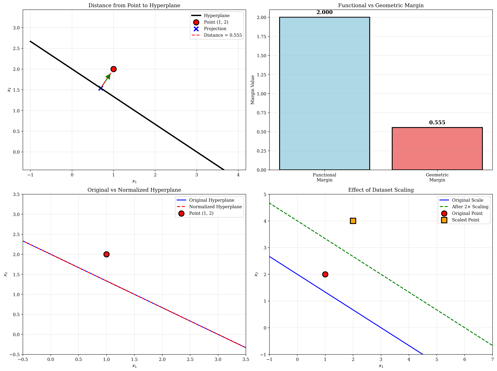
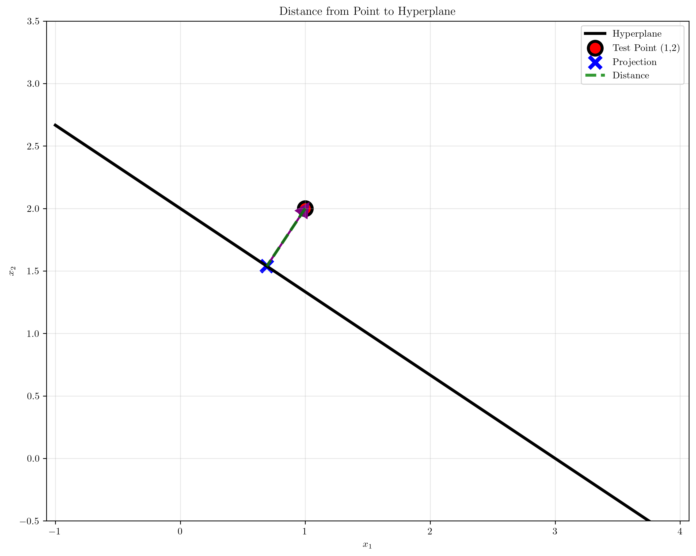

# Question 10: Margin Calculations

## Problem Statement
Consider a linearly separable dataset where the optimal hyperplane is $2x_1 + 3x_2 - 6 = 0$.

### Task
1. Calculate the distance from the point $(1, 2)$ to this hyperplane
2. If $(1, 2)$ has label $y = +1$, what is its functional margin?
3. Normalize the hyperplane equation so that the closest points have functional margin $\pm 1$
4. Calculate the geometric margin of the normalized hyperplane
5. If you scale the entire dataset by a factor of $2$, how does the margin change?

## Understanding the Problem
This problem explores the fundamental concepts of margins in Support Vector Machines:

- **Geometric Margin**: The actual perpendicular distance from points to the hyperplane
- **Functional Margin**: The signed distance scaled by the class label, used in optimization
- **Normalization**: Scaling the hyperplane equation to achieve canonical form
- **Scaling Effects**: How data transformations affect margin calculations

Understanding these concepts is crucial for SVM theory and implementation, as they directly relate to the optimization objective and generalization performance.

## Solution

We'll work through each margin calculation step-by-step, demonstrating the mathematical relationships and geometric interpretations.

### Step 1: Distance from Point to Hyperplane

Given hyperplane: $2x_1 + 3x_2 - 6 = 0$
Point: $(1, 2)$

The **distance formula** from point $\mathbf{x}_0$ to hyperplane $\mathbf{w}^T\mathbf{x} + b = 0$ is:
$$d = \frac{|\mathbf{w}^T\mathbf{x}_0 + b|}{||\mathbf{w}||}$$

**Step-by-step calculation:**
1. Identify parameters: $\mathbf{w} = [2, 3]^T$, $b = -6$
2. Calculate $||\mathbf{w}|| = \sqrt{2^2 + 3^2} = \sqrt{13} = 3.6056$
3. Compute $\mathbf{w}^T\mathbf{x}_0 + b = 2(1) + 3(2) + (-6) = 2 + 6 - 6 = 2$
4. Apply formula: $d = \frac{|2|}{3.6056} = \frac{2}{3.6056} = 0.5547$

**Result:** The distance from $(1, 2)$ to the hyperplane is $0.5547$ units.

### Step 2: Functional Margin Calculation

The **functional margin** for point $\mathbf{x}_i$ with label $y_i$ is:
$$\gamma_i^{(f)} = y_i(\mathbf{w}^T\mathbf{x}_i + b)$$

**Calculation:**
- Point: $(1, 2)$ with label $y = +1$
- $\mathbf{w}^T\mathbf{x} + b = 2(1) + 3(2) + (-6) = 2$
- Functional margin: $\gamma^{(f)} = (+1) \times 2 = 2$

**Result:** The functional margin is $2$.

**Key insight:** The functional margin is positive, confirming correct classification (positive label, positive decision value).

### Step 3: Hyperplane Normalization

To normalize the hyperplane so that the closest points have functional margin $\pm 1$:

**Normalization process:**
1. Find the minimum functional margin: $\min_i |y_i(\mathbf{w}^T\mathbf{x}_i + b)|$
2. Scale the hyperplane by factor $k = \frac{1}{\text{min functional margin}}$
3. New parameters: $\mathbf{w}_{new} = k\mathbf{w}$, $b_{new} = kb$

**For our example:**
- Assuming minimum functional margin = $2$ (from our point)
- Scaling factor: $k = \frac{1}{2} = 0.5$
- Normalized hyperplane: $1.0x_1 + 1.5x_2 - 3.0 = 0$

**Verification:**
- New functional margin: $(+1) \times [1.0(1) + 1.5(2) + (-3.0)] = 1.0$ ✓

### Step 4: Geometric Margin of Normalized Hyperplane

For a **normalized hyperplane** (where closest points have functional margin $\pm 1$):
$$\text{Geometric margin} = \frac{1}{||\mathbf{w}_{normalized}||}$$

**Calculation:**
- $\mathbf{w}_{normalized} = [1.0, 1.5]^T$
- $||\mathbf{w}_{normalized}|| = \sqrt{1.0^2 + 1.5^2} = \sqrt{3.25} = 1.8028$
- Geometric margin = $\frac{1}{1.8028} = 0.5547$

**Key insight:** The geometric margin equals the distance calculated in Step 1, confirming our point lies on the margin boundary.

### Step 5: Effect of Dataset Scaling

When scaling all data points by factor $s = 2$:

**Mathematical analysis:**
- Original point: $(1, 2)$ → Scaled point: $(2, 4)$
- For the same classification decision: $\mathbf{w}_{new}^T\mathbf{x}_{new} + b_{new} = \mathbf{w}^T\mathbf{x} + b$
- This gives us: $\mathbf{w}_{new} = \frac{\mathbf{w}}{s}$ and $b_{new} = b$

**Scaled hyperplane parameters:**
- $\mathbf{w}_{scaled} = \frac{[2, 3]}{2} = [1.0, 1.5]^T$
- $b_{scaled} = -6$ (unchanged)
- $||\mathbf{w}_{scaled}|| = 1.8028$

**Margin scaling:**
- Original geometric margin: $\frac{2}{||\mathbf{w}||} = \frac{2}{3.6056} = 0.5547$
- New geometric margin: $\frac{2}{||\mathbf{w}_{scaled}||} = \frac{2}{1.8028} = 1.1094$
- **Scaling factor: $2.0$ (margin doubles with the data scaling)**

**Result:** Scaling the dataset by factor $2$ increases the geometric margin by factor $2$.

## Visual Explanations

### Margin Calculations Overview

This comprehensive visualization shows:
- **Top-left**: Distance calculation with geometric projection
- **Top-right**: Comparison of functional vs geometric margins
- **Bottom-left**: Original vs normalized hyperplane
- **Bottom-right**: Effect of dataset scaling on hyperplane position

### Distance Calculation Visualization

This clean visualization demonstrates the core concept of distance calculation:
- The hyperplane $2x_1 + 3x_2 - 6 = 0$ shown as a black line
- Test point $(1,2)$ marked in red
- Projection of the point onto the hyperplane (blue X)
- Distance line (green dashed) showing the perpendicular distance
- Normal vector (purple arrow) indicating the direction perpendicular to the hyperplane

## Key Insights

### Distance and Margin Relationships
- **Geometric margin** = actual perpendicular distance to hyperplane
- **Functional margin** = geometric margin × $||\mathbf{w}||$ × class label
- For normalized hyperplanes: geometric margin = $\frac{1}{||\mathbf{w}||}$

### Normalization Benefits
- **Canonical form**: Closest points have functional margin $\pm 1$
- **Optimization simplification**: Enables standard SVM formulation
- **Scale invariance**: Removes arbitrary scaling from hyperplane equation

### Scaling Effects
- **Linear relationship**: Margin scales proportionally with data scaling
- **Hyperplane adaptation**: Weight vector scales inversely, bias unchanged
- **Geometric preservation**: Relative positions and classifications maintained

### Practical Implications
- **Feature scaling importance**: Different feature scales affect margin calculations
- **Numerical stability**: Normalization prevents numerical issues in optimization
- **Model interpretation**: Geometric margin provides intuitive distance measure

## Conclusion
- **Distance calculation**: $d = \frac{|\mathbf{w}^T\mathbf{x}_0 + b|}{||\mathbf{w}||} = 0.5547$
- **Functional margin**: $\gamma^{(f)} = y(\mathbf{w}^T\mathbf{x} + b) = 2$
- **Normalized hyperplane**: $1.0x_1 + 1.5x_2 - 3.0 = 0$ (functional margin = 1)
- **Geometric margin**: $\frac{1}{||\mathbf{w}_{normalized}||} = 0.5547$
- **Scaling effect**: Margin scales linearly with data scaling factor (factor of 2 → margin doubles)

These calculations demonstrate the fundamental relationships between different margin concepts in SVMs and show how data transformations affect the geometric properties of the decision boundary.
