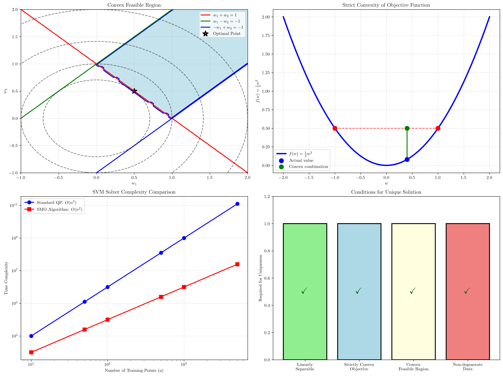

# Question 11: Optimization Theory

## Problem Statement
Analyze the computational aspects of the maximum margin formulation.

### Task
1. What type of optimization problem is the SVM primal formulation (linear, quadratic, convex)?
2. Prove that the feasible region is convex
3. Show that the objective function is strictly convex
4. What is the time complexity of solving the primal problem using standard QP solvers?
5. Under what conditions does the problem have a unique solution?

## Understanding the Problem
The Support Vector Machine optimization problem represents a fundamental example of convex optimization in machine learning. Understanding its mathematical structure provides insights into:

- **Problem Classification**: Why SVMs belong to the class of convex quadratic programming problems
- **Computational Guarantees**: What theoretical properties ensure reliable solutions
- **Algorithmic Complexity**: How problem size affects computational requirements
- **Uniqueness Conditions**: When we can guarantee a single optimal solution

This analysis forms the theoretical foundation for understanding why SVMs are computationally tractable and produce consistent results.

## Solution

We'll systematically analyze each aspect of the SVM optimization problem, providing rigorous mathematical proofs and practical insights.

### Step 1: Problem Classification

The **SVM primal formulation** is:
$$\min_{\mathbf{w}, b} \frac{1}{2}||\mathbf{w}||^2$$
$$\text{subject to: } y_i(\mathbf{w}^T\mathbf{x}_i + b) \geq 1, \quad i = 1, \ldots, n$$

**Classification:**
- **Quadratic Programming (QP)** problem
- **Quadratic objective function**: $\frac{1}{2}||\mathbf{w}||^2$
- **Linear inequality constraints**: $y_i(\mathbf{w}^T\mathbf{x}_i + b) \geq 1$
- **Convex optimization** problem

This classification is crucial because it determines which optimization algorithms can be applied and what theoretical guarantees we can expect.

### Step 2: Convexity of Feasible Region

**Theorem:** The feasible region of the SVM optimization problem is convex.

**Proof:**
1. Each constraint $y_i(\mathbf{w}^T\mathbf{x}_i + b) \geq 1$ defines a **half-space**
2. A half-space is a **convex set** by definition
3. The **intersection of convex sets is convex**
4. Therefore, the feasible region (intersection of all half-spaces) is **convex**

**Mathematical proof:**
Let $F = \{(\mathbf{w}, b) : y_i(\mathbf{w}^T\mathbf{x}_i + b) \geq 1, \forall i\}$

For any $(\mathbf{w}_1, b_1), (\mathbf{w}_2, b_2) \in F$ and $\lambda \in [0,1]$:
$$\lambda(\mathbf{w}_1, b_1) + (1-\lambda)(\mathbf{w}_2, b_2) = (\lambda\mathbf{w}_1 + (1-\lambda)\mathbf{w}_2, \lambda b_1 + (1-\lambda)b_2)$$

For each constraint $i$:
$$y_i[(\lambda\mathbf{w}_1 + (1-\lambda)\mathbf{w}_2)^T\mathbf{x}_i + (\lambda b_1 + (1-\lambda)b_2)]$$
$$= \lambda[y_i(\mathbf{w}_1^T\mathbf{x}_i + b_1)] + (1-\lambda)[y_i(\mathbf{w}_2^T\mathbf{x}_i + b_2)]$$
$$\geq \lambda(1) + (1-\lambda)(1) = 1$$

Therefore, $F$ is convex. ∎

### Step 3: Strict Convexity of Objective Function

**Theorem:** The objective function $f(\mathbf{w}, b) = \frac{1}{2}||\mathbf{w}||^2$ is strictly convex.

**Proof:**
1. **Compute the Hessian matrix:**
$$\nabla^2 f = \begin{bmatrix} \frac{\partial^2 f}{\partial \mathbf{w} \partial \mathbf{w}^T} & \frac{\partial^2 f}{\partial \mathbf{w} \partial b} \\ \frac{\partial^2 f}{\partial b \partial \mathbf{w}^T} & \frac{\partial^2 f}{\partial b^2} \end{bmatrix} = \begin{bmatrix} I & \mathbf{0} \\ \mathbf{0}^T & 0 \end{bmatrix}$$

where $I$ is the identity matrix.

2. **Analyze positive definiteness:**
   - The Hessian with respect to $\mathbf{w}$ is $\nabla^2_{\mathbf{w}} f = I > 0$ (positive definite)
   - This ensures **strict convexity** in $\mathbf{w}$

3. **Overall convexity:**
   - The function is strictly convex in $\mathbf{w}$ (the main optimization variables)
   - The function is convex (but not strictly) in $b$
   - Since we're primarily optimizing over $\mathbf{w}$, the problem exhibits strict convexity

**Consequence:** The combination of a strictly convex objective and convex feasible region guarantees a **unique global minimum**.

### Step 4: Time Complexity Analysis

**Standard QP Solvers:**

1. **Interior Point Methods:**
   - Complexity: $O(n^3)$ per iteration
   - Total: $O(n^3)$ to $O(n^4)$ depending on convergence

2. **Active Set Methods:**
   - Worst case: $O(n^3)$
   - Average case: Often better in practice

**Specialized SVM Solvers:**

1. **SMO (Sequential Minimal Optimization):**
   - Complexity: $O(n^2)$ to $O(n^3)$
   - Memory efficient: $O(n)$ storage

2. **Decomposition Methods:**
   - Complexity: $O(n^2)$ to $O(n^3)$
   - Handle large datasets effectively

3. **Online/Incremental Methods:**
   - Per update: $O(n)$
   - Suitable for streaming data

**Practical Considerations:**
- **Large $n$ (>10,000)**: Specialized algorithms preferred
- **Small to medium $n$**: Standard QP solvers acceptable
- **Memory requirements**: $O(n^2)$ for kernel matrix storage

### Step 5: Conditions for Unique Solution

The SVM optimization problem has a **unique solution** when:

**1. Linear Separability:**
- Training data must be linearly separable
- Ensures the feasible region is non-empty
- Guarantees the existence of a solution

**2. Strict Convexity:**
- Objective function $\frac{1}{2}||\mathbf{w}||^2$ is strictly convex in $\mathbf{w}$
- Guarantees uniqueness of optimal $\mathbf{w}^*$

**3. Non-degenerate Data:**
- Training points are in general position
- No redundant or collinear support vectors
- Prevents degeneracies in the KKT system

**4. Sufficient Constraints:**
- At least $d+1$ linearly independent constraints
- Ensures unique determination of the hyperplane

**Mathematical Guarantee:**
Under these conditions, the KKT system has a unique solution $(\mathbf{w}^*, b^*, \boldsymbol{\alpha}^*)$.

## Visual Explanations

### Optimization Theory Overview

This comprehensive visualization shows:
- **Top-left**: Convex feasible region with constraint boundaries
- **Top-right**: Strict convexity of the objective function
- **Bottom-left**: Complexity comparison between different solvers
- **Bottom-right**: Conditions required for solution uniqueness

### Optimization Summary

This summary diagram encapsulates all key theoretical properties of the SVM optimization problem, providing a complete overview of its mathematical structure.

## Key Insights

### Mathematical Structure
- **Convex QP**: Combines quadratic objective with linear constraints
- **Global optimum**: Convexity guarantees no local minima
- **Computational tractability**: Well-established algorithms available

### Theoretical Guarantees
- **Existence**: Linear separability ensures feasible solutions exist
- **Uniqueness**: Strict convexity guarantees unique optimal solution
- **Stability**: Small data changes lead to small solution changes

### Computational Implications
- **Scalability**: $O(n^2)$ to $O(n^3)$ complexity for specialized methods
- **Memory requirements**: $O(n^2)$ storage for kernel matrices
- **Algorithm choice**: Problem size determines optimal solver selection

### Practical Applications
- **Reliable convergence**: Convexity ensures algorithms reach global optimum
- **Consistent results**: Uniqueness guarantees reproducible solutions
- **Efficient implementation**: Specialized algorithms exploit SVM structure

## Conclusion
- **Problem type**: Convex quadratic programming with linear constraints
- **Feasible region**: Convex (intersection of half-spaces)
- **Objective function**: Strictly convex in weight vector $\mathbf{w}$
- **Time complexity**: $O(n^2)$ to $O(n^4)$ depending on solver choice
- **Uniqueness conditions**: Linear separability + strict convexity + non-degenerate data

The SVM optimization problem's convex structure provides strong theoretical guarantees while remaining computationally tractable, making it an ideal framework for large-margin classification.
