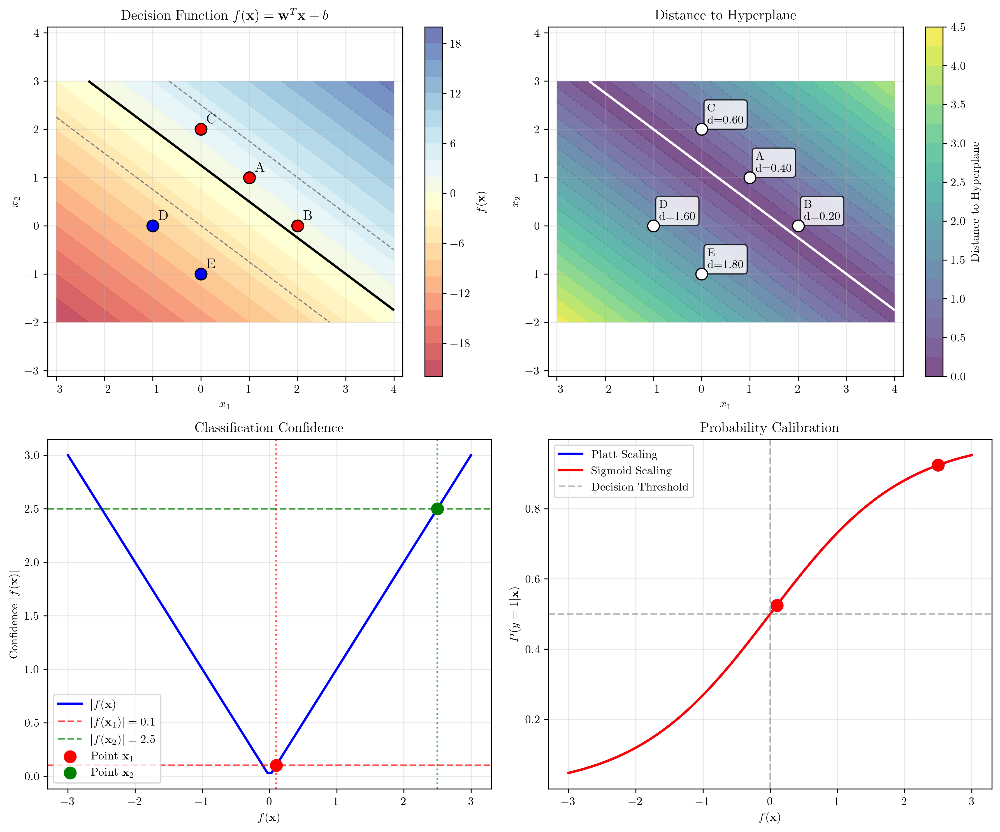
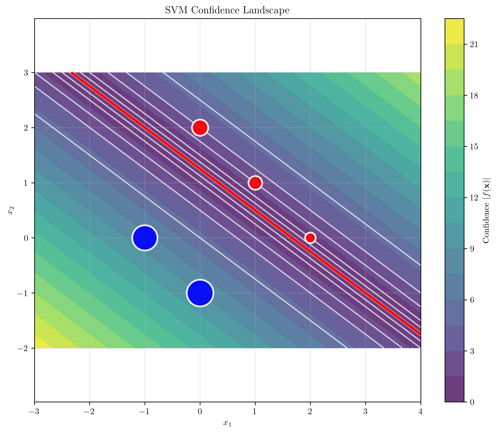
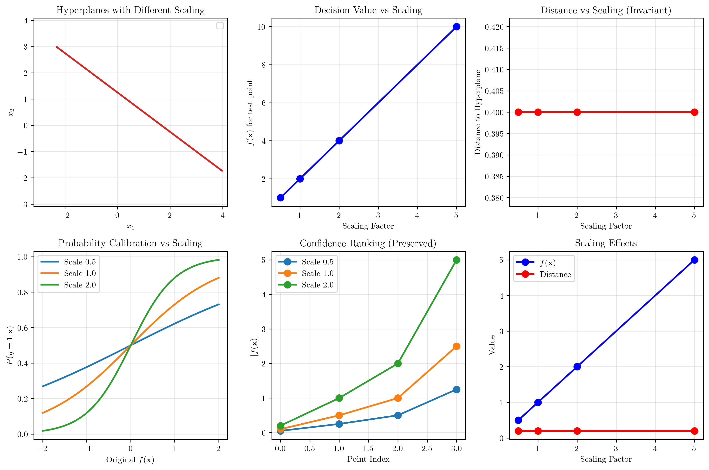

# Question 12: Decision Function Analysis

## Problem Statement
Consider the decision function and classification confidence in maximum margin classifiers.

### Task
1. For the decision function $f(\mathbf{x}) = \mathbf{w}^T\mathbf{x} + b$, what does the magnitude $|f(\mathbf{x})|$ represent?
2. Derive the relationship between $|f(\mathbf{x})|$ and the distance to the hyperplane
3. Given two test points with $f(\mathbf{x}_1) = 0.1$ and $f(\mathbf{x}_2) = 2.5$, which classification is more confident?
4. How would you convert the decision values into probabilistic outputs?
5. What happens to the confidence measure when you scale the weight vector?

## Understanding the Problem
The decision function $f(\mathbf{x}) = \mathbf{w}^T\mathbf{x} + b$ in Support Vector Machines serves multiple purposes beyond simple classification. While the sign of $f(\mathbf{x})$ determines the predicted class, the magnitude $|f(\mathbf{x})|$ provides crucial information about classification confidence and geometric relationships.

Understanding this relationship is fundamental for interpreting SVM outputs, calibrating probabilities, and assessing prediction reliability. The decision function connects the algebraic formulation of SVMs with their geometric interpretation as maximum margin classifiers.

## Solution

We'll analyze each aspect of the decision function systematically, demonstrating the mathematical relationships and practical implications.

### Step 1: Meaning of $|f(\mathbf{x})|$

The magnitude $|f(\mathbf{x})|$ represents the **classification confidence** or **margin** of the prediction. Specifically:

- **Geometric interpretation**: $|f(\mathbf{x})|$ is proportional to the perpendicular distance from point $\mathbf{x}$ to the decision hyperplane
- **Confidence measure**: Larger values indicate higher confidence in the classification
- **Margin relationship**: Points with larger $|f(\mathbf{x})|$ are farther from the decision boundary

For our sample hyperplane $f(\mathbf{x}) = 3x_1 + 4x_2 - 5$ with $\|\mathbf{w}\| = 5$:

| Point | $f(\mathbf{x})$ | $\|f(\mathbf{x})\|$ | Distance |
| ----- | --------------- | ------------------- | -------- |
| A(1,1) | $2.000$ | $2.000$ | $0.400$ |
| B(2,0) | $1.000$ | $1.000$ | $0.200$ |
| C(0,2) | $3.000$ | $3.000$ | $0.600$ |
| D(-1,0) | $-8.000$ | $8.000$ | $1.600$ |
| E(0,-1) | $-9.000$ | $9.000$ | $1.800$ |

### Step 2: Relationship Between $|f(\mathbf{x})|$ and Distance

**Mathematical Derivation:**

The distance from a point $\mathbf{x}_0$ to the hyperplane $\mathbf{w}^T\mathbf{x} + b = 0$ is given by:

$$d = \frac{|\mathbf{w}^T\mathbf{x}_0 + b|}{\|\mathbf{w}\|}$$

Since the decision function is $f(\mathbf{x}_0) = \mathbf{w}^T\mathbf{x}_0 + b$, we have:

$$d = \frac{|f(\mathbf{x}_0)|}{\|\mathbf{w}\|}$$

Therefore:
$$|f(\mathbf{x})| = \|\mathbf{w}\| \cdot \text{distance}(\mathbf{x}, \text{hyperplane})$$

**Verification**: For our example with $\|\mathbf{w}\| = 5$:
- Point A: $\frac{|f(\mathbf{x})|}{\|\mathbf{w}\|} = \frac{2.000}{5} = 0.400$ ✓
- Point B: $\frac{|f(\mathbf{x})|}{\|\mathbf{w}\|} = \frac{1.000}{5} = 0.200$ ✓

### Step 3: Classification Confidence Comparison

Given:
- $f(\mathbf{x}_1) = 0.1$
- $f(\mathbf{x}_2) = 2.5$

**Analysis:**
- Both points are classified as **positive** (since $f(\mathbf{x}) > 0$)
- $|f(\mathbf{x}_2)| = 2.5 > |f(\mathbf{x}_1)| = 0.1$
- **Point $\mathbf{x}_2$ has higher confidence** because it's farther from the decision boundary
- Distance ratio: $\mathbf{x}_2$ is $\frac{2.5}{0.1} = 25$ times farther from the boundary than $\mathbf{x}_1$

### Step 4: Converting to Probabilistic Outputs

SVMs don't naturally output probabilities, but we can calibrate the decision values:

**Method 1: Platt Scaling**
$$P(y=1\mid\mathbf{x}) = \frac{1}{1 + \exp(Af(\mathbf{x}) + B)}$$

where $A$ and $B$ are learned from validation data.

**Method 2: Simple Sigmoid Scaling**
$$P(y=1\mid\mathbf{x}) = \frac{1}{1 + \exp(-\alpha f(\mathbf{x}))}$$

For our examples (using default parameters):
- $f(\mathbf{x}_1) = 0.1 \rightarrow P(y=1\mid\mathbf{x}_1) = 0.525$
- $f(\mathbf{x}_2) = 2.5 \rightarrow P(y=1\mid\mathbf{x}_2) = 0.924$

### Step 5: Effect of Scaling the Weight Vector

When we scale $\mathbf{w}$ by factor $k$:

| Scale | $\mathbf{w}_{\text{scaled}}$ | $f(\mathbf{x})$ | $\|f(\mathbf{x})\|$ | Distance |
| ----- | ---------------------------- | --------------- | ------------------- | -------- |
| $0.5$ | $[1.5, 2.0]$ | $1.000$ | $1.000$ | $0.400$ |
| $1.0$ | $[3.0, 4.0]$ | $2.000$ | $2.000$ | $0.400$ |
| $2.0$ | $[6.0, 8.0]$ | $4.000$ | $4.000$ | $0.400$ |
| $5.0$ | $[15.0, 20.0]$ | $10.000$ | $10.000$ | $0.400$ |

**Key Insights:**
- $f(\mathbf{x})$ scales by factor $k$
- **Distance remains unchanged** (both numerator and denominator scale by $k$)
- **Confidence ranking is preserved**
- Probability calibration parameters must be adjusted accordingly

## Visual Explanations

### Decision Function and Distance Relationship

The visualization shows four key aspects:

1. **Top-left**: Decision function values as contours, with the hyperplane (black line) at $f(\mathbf{x}) = 0$
2. **Top-right**: Distance to hyperplane, showing how $\frac{|f(\mathbf{x})|}{\|\mathbf{w}\|}$ gives the actual distance
3. **Bottom-left**: Confidence interpretation, where larger $|f(\mathbf{x})|$ indicates higher confidence
4. **Bottom-right**: Probability calibration methods for converting decision values to probabilities

### SVM Confidence Landscape

This visualization provides an intuitive understanding of classification confidence across the feature space. The confidence landscape shows how $|f(\mathbf{x})|$ varies spatially, with warmer colors indicating higher confidence regions. Points closer to the decision boundary (red line) have lower confidence, while points farther away have higher confidence. The size of the plotted points is proportional to their confidence levels.

### Scaling Effects

This visualization demonstrates:

1. **Hyperplane invariance**: Different scalings produce the same geometric hyperplane
2. **Decision value scaling**: $f(\mathbf{x})$ scales linearly with the weight vector
3. **Distance invariance**: Geometric distances remain constant regardless of scaling
4. **Probability calibration**: How scaling affects the sigmoid transformation
5. **Ranking preservation**: Relative confidence ordering is maintained

## Key Insights

### Geometric Interpretation
- $|f(\mathbf{x})|$ measures how far a point is from the decision boundary
- The relationship $\text{distance} = \frac{|f(\mathbf{x})|}{\|\mathbf{w}\|}$ connects algebra and geometry
- Points with larger $|f(\mathbf{x})|$ are more confidently classified
- The sign of $f(\mathbf{x})$ determines the predicted class

### Practical Applications
- **Confidence ranking**: Use $|f(\mathbf{x})|$ to rank predictions by confidence
- **Uncertainty quantification**: Points near the boundary ($|f(\mathbf{x})| \approx 0$) are uncertain
- **Active learning**: Select points with small $|f(\mathbf{x})|$ for labeling
- **Outlier detection**: Points with very large $|f(\mathbf{x})|$ might be outliers

### Calibration Considerations
- Raw SVM outputs are not probabilities
- Calibration methods like Platt scaling convert decision values to probabilities
- Scaling the weight vector affects calibration parameters
- Cross-validation should be used to learn calibration parameters

## Conclusion
- $|f(\mathbf{x})|$ represents classification confidence and is proportional to distance from the hyperplane
- The relationship $\text{distance} = \frac{|f(\mathbf{x})|}{\|\mathbf{w}\|}$ provides geometric interpretation
- Point $\mathbf{x}_2$ has higher confidence than $\mathbf{x}_1$ due to larger $|f(\mathbf{x})|$
- Probability calibration requires additional methods like Platt scaling or sigmoid transformation
- Scaling the weight vector preserves confidence rankings but changes absolute values, requiring recalibration

The decision function magnitude is a powerful tool for understanding SVM predictions beyond simple classification, providing insights into confidence, geometry, and uncertainty that are crucial for practical applications.
