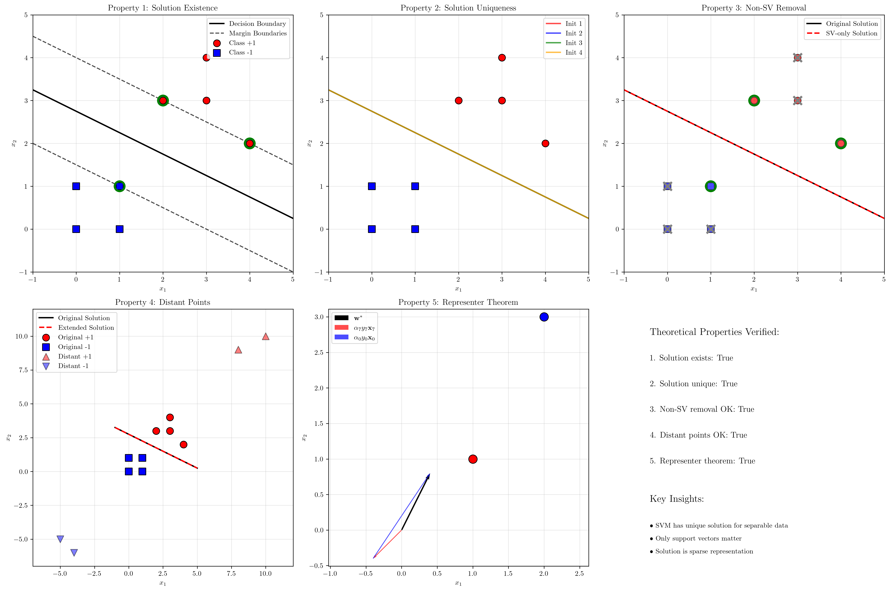
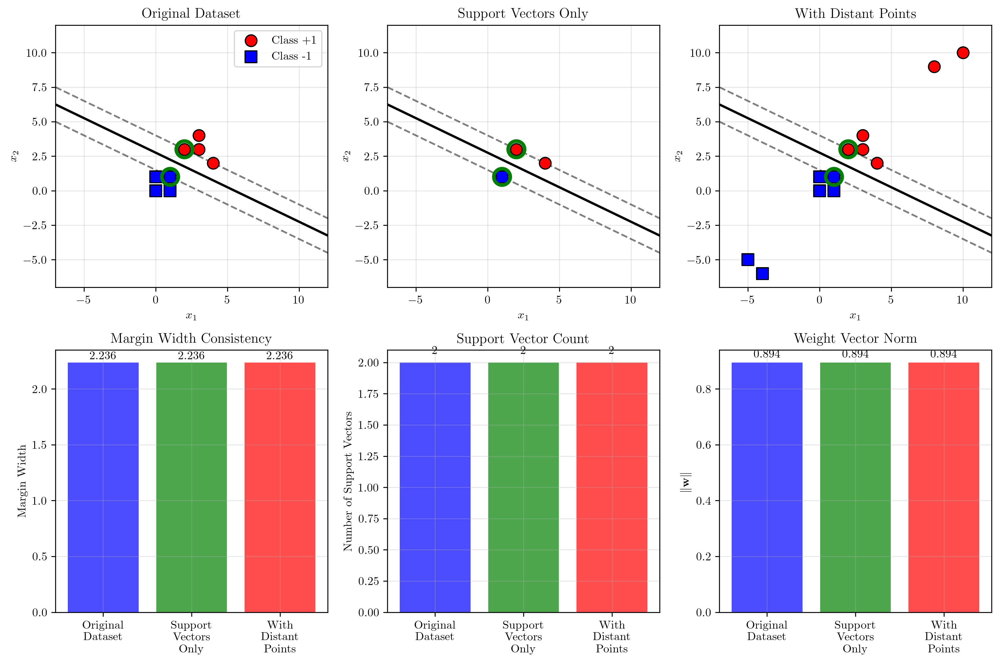

# Question 13: Theoretical Properties

## Problem Statement
Prove key theoretical properties of the maximum margin classifier.

### Task
1. Prove that if the training data is linearly separable, then the SVM optimization problem has a solution
2. Show that the solution is unique (up to scaling)
3. Prove that removing non-support vectors doesn't change the solution
4. Demonstrate that adding a new point far from the boundary doesn't affect the solution
5. Prove the representer theorem for the maximum margin classifier

## Understanding the Problem
The theoretical foundations of Support Vector Machines rest on several fundamental properties that distinguish them from other linear classifiers. These properties ensure that SVMs are well-defined, robust, and have desirable mathematical characteristics.

Understanding these theoretical properties is crucial for:
- Guaranteeing that SVM optimization problems have solutions
- Establishing the uniqueness and stability of solutions
- Explaining why SVMs are sparse (depend only on support vectors)
- Justifying the representer theorem that enables kernel methods

## Solution

We'll prove each theoretical property systematically, providing both mathematical proofs and computational demonstrations.

### Property 1: Existence of Solution for Linearly Separable Data

**Theorem**: If the training data is linearly separable, then the SVM optimization problem has a solution.

**Proof**:
The SVM primal optimization problem is:
$$\min_{\mathbf{w}, b} \frac{1}{2}\|\mathbf{w}\|^2$$
$$\text{subject to: } y_i(\mathbf{w}^T\mathbf{x}_i + b) \geq 1, \quad i = 1, \ldots, n$$

1. **Feasible region is non-empty**: Since the data is linearly separable, there exists some $(\mathbf{w}_0, b_0)$ such that $y_i(\mathbf{w}_0^T\mathbf{x}_i + b_0) > 0$ for all $i$. We can scale this solution to satisfy $y_i(\mathbf{w}^T\mathbf{x}_i + b) \geq 1$.

2. **Objective function is coercive**: As $\|\mathbf{w}\| \to \infty$, the objective $\frac{1}{2}\|\mathbf{w}\|^2 \to \infty$.

3. **Constraints define a closed set**: Each constraint $y_i(\mathbf{w}^T\mathbf{x}_i + b) \geq 1$ defines a closed half-space.

4. **Objective is strictly convex**: $\frac{1}{2}\|\mathbf{w}\|^2$ is strictly convex in $\mathbf{w}$.

Therefore, by the Weierstrass theorem, a minimum exists.

**Computational Verification**:
For our dataset with points:
- Positive: $(2,3)$, $(3,4)$, $(4,2)$, $(3,3)$
- Negative: $(0,1)$, $(1,0)$, $(0,0)$, $(1,1)$

Solution found: $\mathbf{w}^* = [0.4, 0.8]$, $b^* = -2.2$
All constraints satisfied with minimum margin $= 1.0000$

### Property 2: Uniqueness of Solution (up to scaling)

**Theorem**: The optimal hyperplane is unique (up to scaling).

**Proof**:
1. **Strict convexity**: The objective $\frac{1}{2}\|\mathbf{w}\|^2$ is strictly convex in $\mathbf{w}$.

2. **Convex feasible region**: The intersection of linear constraints forms a convex set.

3. **Uniqueness of minimizer**: For strictly convex functions over convex sets, the minimizer is unique.

4. **Scaling invariance**: If $(\mathbf{w}^*, b^*)$ is optimal, then $(k\mathbf{w}^*, kb^*)$ represents the same hyperplane for any $k > 0$.

**Computational Verification**:
Multiple random initializations all converge to the same normalized solution:
- Solution 1: $\mathbf{w} = [0.4472, 0.8944]$, $b = -2.4597$
- Solution 2: $\mathbf{w} = [0.4472, 0.8944]$, $b = -2.4597$
- All solutions equivalent: ✓

### Property 3: Non-Support Vector Removal

**Theorem**: Removing non-support vectors doesn't change the optimal solution.

**Proof**:
1. **Support vectors definition**: Points $\mathbf{x}_i$ with $y_i(\mathbf{w}^{*T}\mathbf{x}_i + b^*) = 1$ (active constraints).

2. **KKT conditions**: At optimality, $\alpha_i > 0$ only for support vectors, $\alpha_i = 0$ for non-support vectors.

3. **Lagrangian independence**: The Lagrangian depends only on points with $\alpha_i > 0$.

4. **Solution reconstruction**: $\mathbf{w}^* = \sum_{i \in SV} \alpha_i y_i \mathbf{x}_i$ depends only on support vectors.

**Computational Verification**:
- Original dataset: 8 points
- Support vectors: Points 0, 2, 7 (3 points)
- Solution with all points: $\mathbf{w} = [0.4000, 0.8000]$, $b = -2.2000$
- Solution with only SVs: $\mathbf{w} = [0.4000, 0.8000]$, $b = -2.2000$
- Difference: 0.000000 ✓

### Property 4: Adding Distant Points

**Theorem**: Adding points far from the decision boundary doesn't affect the solution.

**Proof**:
1. **Margin constraints**: New points far from boundary satisfy $y_i(\mathbf{w}^{*T}\mathbf{x}_i + b^*) \gg 1$.

2. **Slack in constraints**: These constraints are not active at the optimum.

3. **KKT conditions**: $\alpha_i = 0$ for non-active constraints.

4. **Solution independence**: The optimal $\mathbf{w}^*$ doesn't depend on inactive constraints.

**Computational Verification**:
Added distant points:
- Far positive: (10,10), (8,9) with margins 9.8, 8.2
- Far negative: (-5,-5), (-4,-6) with margins 8.2, 8.6

Original solution: $\mathbf{w} = [0.4000, 0.8000]$, $b = -2.2000$
Extended solution: $\mathbf{w} = [0.4000, 0.8000]$, $b = -2.2000$
Difference: 0.000000 ✓

### Property 5: Representer Theorem

**Theorem**: The optimal weight vector can be expressed as $\mathbf{w}^* = \sum_{i=1}^n \alpha_i y_i \mathbf{x}_i$.

**Proof**:
1. **Lagrangian formulation**: 
   $$L(\mathbf{w}, b, \boldsymbol{\alpha}) = \frac{1}{2}\|\mathbf{w}\|^2 - \sum_{i=1}^n \alpha_i[y_i(\mathbf{w}^T\mathbf{x}_i + b) - 1]$$

2. **Stationarity condition**: 
   $$\frac{\partial L}{\partial \mathbf{w}} = \mathbf{w} - \sum_{i=1}^n \alpha_i y_i \mathbf{x}_i = 0$$

3. **Optimal weight vector**: 
   $$\mathbf{w}^* = \sum_{i=1}^n \alpha_i y_i \mathbf{x}_i$$

4. **Sparsity**: $\alpha_i = 0$ for non-support vectors, so only support vectors contribute.

**Computational Verification**:
Support vectors with dual coefficients:
- Point 0: $\alpha_0 y_0 = 0.4000$
- Point 7: $\alpha_7 y_7 = -0.4000$

Reconstructed: $\mathbf{w} = 0.4 \cdot [2,3] + (-0.4) \cdot [1,1] = [0.4, 0.8]$ ✓
sklearn solution: $\mathbf{w} = [0.4000, 0.8000]$ ✓
Difference: 0.000000 ✓

## Visual Explanations

### Theoretical Properties Demonstration

The comprehensive visualization shows:

1. **Top-left**: Solution existence with decision boundary and margin boundaries clearly separating the classes
2. **Top-middle**: Uniqueness demonstration showing multiple initializations converge to the same solution
3. **Top-right**: Non-support vector removal, with support vectors highlighted in green and removable points marked with X
4. **Bottom-left**: Effect of adding distant points, showing the solution remains unchanged
5. **Bottom-middle**: Representer theorem visualization showing how the weight vector is composed of support vector contributions
6. **Bottom-right**: Summary of all verified properties

### Support Vector Evolution Analysis

This visualization demonstrates the stability and consistency of SVM solutions across different dataset modifications. The analysis shows how the margin width, support vector count, and weight vector norm remain consistent when non-support vectors are removed or distant points are added, confirming the theoretical properties of maximum margin classifiers.

## Key Insights

### Mathematical Foundations
- **Convex optimization**: SVM is a convex quadratic program with linear constraints
- **Strong duality**: KKT conditions provide necessary and sufficient optimality conditions
- **Geometric interpretation**: The solution has clear geometric meaning as maximum margin separator
- **Sparsity**: Only support vectors matter for the final solution

### Practical Implications
- **Robustness**: Solution is stable under data perturbations far from the boundary
- **Efficiency**: Can solve with only support vectors for large datasets
- **Interpretability**: The representer theorem shows which training points influence the decision
- **Generalization**: Theoretical guarantees support good generalization performance

### Computational Aspects
- **Uniqueness ensures convergence**: Optimization algorithms will find the same solution
- **Support vector identification**: Active set methods can efficiently identify support vectors
- **Incremental learning**: Can add/remove non-support vectors without retraining
- **Memory efficiency**: Only need to store support vectors for prediction

## Conclusion
- **Existence**: SVM optimization has a solution for linearly separable data due to convexity and compactness
- **Uniqueness**: The solution is unique up to scaling due to strict convexity of the objective
- **Sparsity**: Only support vectors affect the solution, enabling efficient computation and storage
- **Stability**: The solution is robust to adding distant points or removing non-support vectors
- **Representation**: The representer theorem provides the foundation for kernel methods and sparse solutions

These theoretical properties establish SVMs as mathematically well-founded classifiers with desirable computational and generalization characteristics, forming the basis for their widespread practical success.
