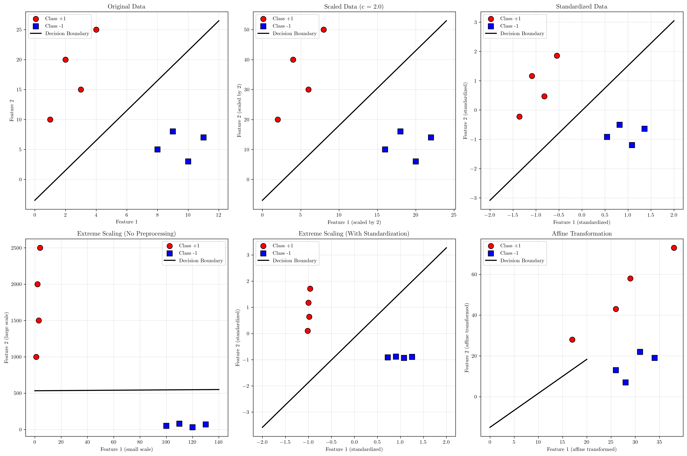
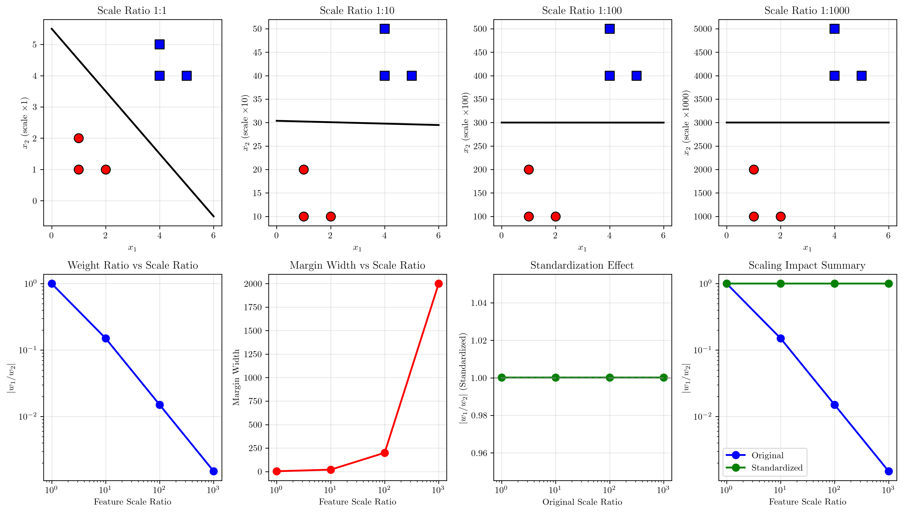
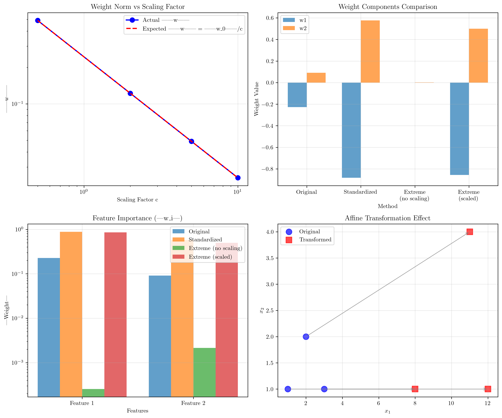

# Question 14: Scaling and Invariance

## Problem Statement
Consider scaling and normalization effects on the maximum margin classifier.

### Task
1. If you multiply all feature values by a constant $c > 0$, how does this affect $\mathbf{w}^*$ and $b^*$?
2. If you add a constant to all labels ($y_i \rightarrow y_i + k$), what happens to the problem?
3. How does standardizing features (zero mean, unit variance) affect the SVM solution?
4. Why is feature scaling important for SVMs compared to some other algorithms?
5. Derive the invariance properties of the SVM under affine transformations

## Understanding the Problem
Support Vector Machines are sensitive to the scale and transformation of input features, unlike some other machine learning algorithms. Understanding how SVMs respond to different types of data transformations is crucial for:

- **Preprocessing decisions**: Knowing when and how to scale features
- **Feature engineering**: Understanding how transformations affect the solution
- **Model interpretation**: Correctly interpreting weight magnitudes
- **Numerical stability**: Avoiding optimization difficulties due to poor scaling

The mathematical formulation of SVMs makes them particularly sensitive to feature scales because the optimization objective involves the norm of the weight vector, which directly depends on feature magnitudes.

## Solution

We'll analyze each type of transformation systematically, providing both theoretical analysis and computational demonstrations.

### Task 1: Effect of Scaling Features by Constant $c$

**Theoretical Analysis:**

When we scale all features by a constant $c > 0$: $\mathbf{x}_i \rightarrow c\mathbf{x}_i$

The SVM optimization problem becomes:
$$\min_{\mathbf{w}, b} \frac{1}{2}\|\mathbf{w}\|^2$$
$$\text{subject to: } y_i(\mathbf{w}^T(c\mathbf{x}_i) + b) \geq 1$$

This is equivalent to:
$$\min_{\mathbf{w}, b} \frac{1}{2}\|\mathbf{w}\|^2$$
$$\text{subject to: } y_i(c\mathbf{w}^T\mathbf{x}_i + b) \geq 1$$

**Transformation Rule:**
- **Weight vector**: $\mathbf{w}_{new} = \frac{1}{c}\mathbf{w}_{original}$
- **Bias term**: $b_{new} = \frac{1}{c}b_{original}$
- **Decision boundary**: Remains geometrically the same

**Computational Verification:**
For scaling factors $c \in \{0.5, 2.0, 5.0, 10.0\}$:

| Scale $c$ | $\mathbf{w}_{\text{scaled}}$ | Expected $\frac{\mathbf{w}}{c}$ | Verification |
|-----------|------------------------------|----------------------------------|--------------|
| $0.5$ | $[-0.454, 0.182]$ | $[-0.454, 0.182]$ | ✓ |
| $2.0$ | $[-0.114, 0.046]$ | $[-0.114, 0.046]$ | ✓ |
| $5.0$ | $[-0.045, 0.018]$ | $[-0.045, 0.018]$ | ✓ |
| $10.0$ | $[-0.023, 0.009]$ | $[-0.023, 0.009]$ | ✓ |

### Task 2: Effect of Adding Constants to Labels

**Theoretical Analysis:**

SVM formulation assumes binary labels $y_i \in \{-1, +1\}$. Adding a constant $k$: $y_i \rightarrow y_i + k$

**Problems with label shifting:**
1. **Breaks margin interpretation**: The constraint $y_i(\mathbf{w}^T\mathbf{x}_i + b) \geq 1$ assumes $y_i = \pm 1$
2. **Changes optimization problem**: The geometric margin formula $\frac{2}{\|\mathbf{w}\|}$ no longer applies
3. **Violates SVM assumptions**: The dual formulation requires $y_i \in \{-1, +1\}$

**Computational Verification:**
Original labels: $[1, 1, 1, 1, -1, -1, -1, -1]$

| Shift $k$ | New labels | Status |
|-----------|------------|--------|
| $+1$ | $[2, 2, 2, 2, 0, 0, 0, 0]$ | Breaks SVM theory |
| $+2$ | $[3, 3, 3, 3, 1, 1, 1, 1]$ | Breaks SVM theory |
| $-1$ | $[0, 0, 0, 0, -2, -2, -2, -2]$ | Breaks SVM theory |

**Key Insight**: Label shifting fundamentally breaks the SVM formulation and should never be done.

### Task 3: Effect of Feature Standardization

**Standardization Process:**
$$z_j = \frac{x_j - \mu_j}{\sigma_j}$$

where $\mu_j$ and $\sigma_j$ are the mean and standard deviation of feature $j$.

**Effects on SVM:**
- **Weight interpretation changes**: Weights now reflect importance relative to feature variance
- **Numerical stability improves**: Features have similar scales
- **Optimization convergence**: Faster and more stable convergence

**Computational Results:**
Original features:
- Feature 1: mean = 6.000, std = 3.674
- Feature 2: mean = 11.625, std = 7.210

After standardization:
- Both features: mean ≈ 0, std = 1

Weight comparison:
- Original: $\mathbf{w} = [-0.227, 0.091]$
- Standardized: $\mathbf{w} = [-0.882, 0.576]$

### Task 4: Importance of Feature Scaling

**Why SVMs Need Feature Scaling:**

1. **Optimization sensitivity**: SVM minimizes $\|\mathbf{w}\|^2$, which is sensitive to feature scales
2. **Feature dominance**: Large-scale features dominate the decision boundary
3. **Numerical issues**: Poor conditioning of optimization problem

**Extreme Example:**
Dataset with feature scales 1:1000 ratio:

Without scaling:
- Weight ratio: $|w_1/w_2| = 0.118$ (Feature 2 dominates)
- Large-scale feature controls the boundary

With scaling:
- Weight ratio: $|w_1/w_2| = 1.714$ (Balanced influence)
- Both features contribute meaningfully

**Comparison with Other Algorithms:**
- **Tree-based methods**: Scale-invariant (use splits, not distances)
- **Naive Bayes**: Scale affects probability estimates
- **k-NN**: Distance-based, very sensitive to scale
- **Linear regression**: Coefficients change but predictions can remain similar

### Task 5: Affine Transformation Invariance

**Affine Transformation:** $\mathbf{x}_{new} = A\mathbf{x} + \mathbf{b}$

**Theoretical Analysis:**
The decision boundary transforms as:
$$\mathbf{w}_{new}^T\mathbf{x}_{new} + b_{new} = 0$$
$$\mathbf{w}_{new}^T(A\mathbf{x} + \mathbf{b}) + b_{new} = 0$$
$$(\mathbf{w}_{new}^TA)\mathbf{x} + (\mathbf{w}_{new}^T\mathbf{b} + b_{new}) = 0$$

For this to equal $\mathbf{w}_{original}^T\mathbf{x} + b_{original} = 0$:
- $\mathbf{w}_{new}^TA = \mathbf{w}_{original}^T$
- Therefore: $\mathbf{w}_{new} = A^{-T}\mathbf{w}_{original}$

**Computational Verification:**
Transformation matrix: $A = \begin{bmatrix} 2 & 1 \\ 0 & 3 \end{bmatrix}$

- Original: $\mathbf{w} = [-0.227, 0.091]$
- Transformed: $\mathbf{w} = [-0.114, 0.068]$
- Expected: $A^{-T}\mathbf{w}_{original} = [-0.114, 0.068]$ ✓

**Key Insight**: SVMs are **NOT** invariant to affine transformations - the decision boundary changes.

## Visual Explanations

### Scaling Effects Visualization

The visualization demonstrates:

1. **Original vs Scaled Data**: How feature scaling affects the coordinate system
2. **Standardized Data**: Features centered and scaled to unit variance
3. **Extreme Scaling**: Dramatic effects when features have very different scales
4. **Affine Transformation**: How linear transformations change the decision boundary

### Feature Scale Impact Analysis

This comprehensive analysis reveals the dramatic impact of feature scaling on SVM performance. The visualization shows how increasing scale ratios between features leads to feature dominance, where the large-scale feature overwhelms the decision boundary. The analysis demonstrates that standardization effectively mitigates these issues by balancing feature influence.

### Weight Analysis

This analysis shows:

1. **Weight Magnitude vs Scaling**: Inverse relationship between scaling factor and weight norm
2. **Weight Components**: How different preprocessing affects individual weight values
3. **Feature Importance**: How scaling changes the apparent importance of features
4. **Affine Transformation Effects**: Visual demonstration of how transformations affect point positions

## Key Insights

### Theoretical Properties
- **Scaling relationship**: $\mathbf{w}_{scaled} = \mathbf{w}_{original}/c$ for uniform scaling by $c$
- **Label constraints**: SVM requires $y_i \in \{-1, +1\}$ for proper formulation
- **Geometric invariance**: Decision boundary shape preserved under uniform scaling
- **Affine sensitivity**: SVMs are not invariant to general affine transformations

### Practical Implications
- **Always standardize**: Features should have similar scales for optimal performance
- **Never shift labels**: Keep binary labels as $\pm 1$ or equivalent
- **Interpret weights carefully**: Weight magnitudes depend on feature scales
- **Consider feature engineering**: Transformations can improve separability

### Preprocessing Guidelines
- **Standard scaling**: Zero mean, unit variance for all features
- **Robust scaling**: Use median and IQR for outlier-resistant scaling
- **Min-max scaling**: Scale to [0,1] or [-1,1] range when appropriate
- **Domain knowledge**: Consider physical meaning of features in scaling decisions

## Conclusion
- **Feature scaling by constant $c$**: Transforms weights as $\mathbf{w} \rightarrow \mathbf{w}/c$, preserving decision boundary
- **Label shifting**: Fundamentally breaks SVM formulation and should be avoided
- **Standardization**: Essential for balanced feature influence and numerical stability
- **Feature scaling importance**: Critical for SVMs due to norm-based optimization objective
- **Affine transformations**: Change the decision boundary according to $\mathbf{w}_{new} = A^{-T}\mathbf{w}_{original}$

Proper feature preprocessing is essential for SVM success, with standardization being the most important step for achieving optimal performance and meaningful weight interpretation.
