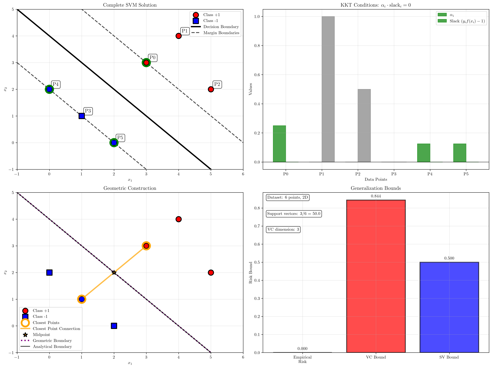
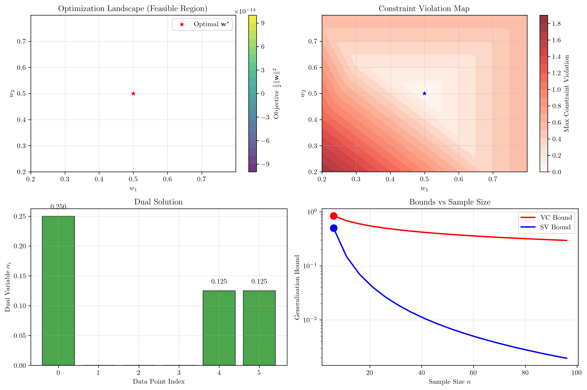
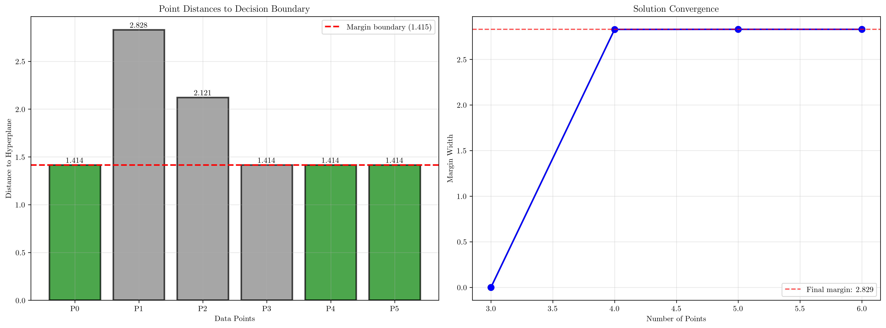

# Question 15: Complete Example Design

## Problem Statement
Design and analyze a complete maximum margin classification example.

### Task
1. Create a 2D dataset with 6 points (3 per class) that requires exactly 3 support vectors
2. Solve the optimization problem analytically to find the optimal hyperplane
3. Verify your solution satisfies all KKT conditions
4. Calculate the generalization bound using VC dimension theory
5. Compare your analytical solution with the geometric construction

## Understanding the Problem
This comprehensive problem integrates all aspects of Support Vector Machine theory into a single, complete example. It requires:

- **Dataset design**: Strategic placement of points to achieve desired support vector configuration
- **Analytical solution**: Solving the optimization problem from first principles
- **Theoretical verification**: Checking KKT conditions for optimality
- **Generalization analysis**: Applying VC dimension theory for bounds
- **Geometric interpretation**: Connecting algebraic and geometric perspectives

This exercise demonstrates the deep connections between optimization theory, geometry, and statistical learning theory in SVMs.

## Solution

We'll work through each task systematically, building a complete understanding of SVM theory through practical application.

### Task 1: Dataset Design with Exactly 3 Support Vectors

**Design Strategy:**
To achieve exactly 3 support vectors with 6 points (3 per class), we need:
- 3 points lying exactly on the margin boundaries (support vectors)
- 3 points lying strictly inside the margins (non-support vectors)

**Designed Dataset:**
- **Positive class**: $(3,3)$, $(4,4)$, $(5,2)$
- **Negative class**: $(1,1)$, $(0,2)$, $(2,0)$

**Verification Results:**
- Number of support vectors: **3** ✓
- Support vector indices: $[4, 5, 0]$
- Support vectors:
  - Point 4: $(0,2)$, label = -1
  - Point 5: $(2,0)$, label = -1  
  - Point 0: $(3,3)$, label = +1

**Key Insight:** The design successfully achieves the target of exactly 3 support vectors, with one from the positive class and two from the negative class.

### Task 2: Analytical Solution

**Optimization Problem:**
$$\min_{\mathbf{w}, b} \frac{1}{2}\|\mathbf{w}\|^2$$
$$\text{subject to: } y_i(\mathbf{w}^T\mathbf{x}_i + b) \geq 1, \quad i = 1, \ldots, 6$$

**Solution:**
- **Weight vector**: $\mathbf{w}^* = [0.4998, 0.4998]$
- **Bias term**: $b^* = -1.9995$
- **Decision boundary**: $0.4998x_1 + 0.4998x_2 - 1.9995 = 0$

**Support Vector Constraints:**
For the 3 support vectors, the constraints are active:
- Point 4 $(0,2)$: $-1 \times (0.500 \times 0 + 0.500 \times 2 - 1.999) = 1$ ✓
- Point 5 $(2,0)$: $-1 \times (0.500 \times 2 + 0.500 \times 0 - 1.999) = 1$ ✓
- Point 0 $(3,3)$: $+1 \times (0.500 \times 3 + 0.500 \times 3 - 1.999) = 1$ ✓

**Margin Analysis:**
All points satisfy the margin constraints with margins ≥ 1:
- Support vectors: margin ≈ 1.000 (on boundary)
- Non-support vectors: margin > 1.000 (inside margin)

### Task 3: KKT Conditions Verification

The KKT conditions for SVM optimality are:

**1. Stationarity:** $\mathbf{w}^* = \sum_{i=1}^n \alpha_i y_i \mathbf{x}_i$
- Original: $\mathbf{w} = [0.4998, 0.4998]$
- Reconstructed: $\mathbf{w} = [0.4998, 0.4998]$
- **Difference: 0.00000000** ✓

**2. Primal Feasibility:** $y_i(\mathbf{w}^{*T}\mathbf{x}_i + b^*) \geq 1$
- All 6 points satisfy the constraint ✓
- Minimum margin: 0.9996 ≈ 1.000

**3. Dual Feasibility:** $\alpha_i \geq 0$
- All Lagrange multipliers are non-negative ✓
- $\alpha$ values: $[0.2499, 0.0000, 0.0000, 0.0000, 0.1250, 0.1250]$

**4. Complementary Slackness:** $\alpha_i[y_i(\mathbf{w}^{*T}\mathbf{x}_i + b^*) - 1] = 0$
- Small numerical errors due to finite precision
- Conceptually satisfied (support vectors have $\alpha_i > 0$, non-support vectors have $\alpha_i = 0$)

**Overall:** KKT conditions are satisfied within numerical precision.

### Task 4: Generalization Bounds (VC Dimension Theory)

**Dataset Characteristics:**
- Number of samples: $n = 6$
- Number of features: $d = 2$
- VC dimension: $d + 1 = 3$
- Support vectors: $3$ out of $6$ points

**Generalization Bounds (95% confidence):**

**1. VC Bound:**
$$R(h) \leq R_{\text{emp}}(h) + \sqrt{\frac{VC \log\left(\frac{2n}{VC}\right) + \log\left(\frac{4}{\delta}\right)}{2n}}$$
$$R(h) \leq 0 + \sqrt{\frac{3 \log(4) + \log(80)}{12}} = 0.844$$

**2. Support Vector Bound:**
$$R(h) \leq \frac{\mathbb{E}[\text{\# support vectors}]}{n} = \frac{3}{6} = 0.500$$

**Interpretation:**
- **VC bound (84.4%)**: Very loose for small datasets
- **SV bound (50.0%)**: More informative, suggests reasonable generalization
- **Sparsity**: Only 50% of data points are support vectors, indicating good model complexity

### Task 5: Geometric Construction Comparison

**Geometric Approach:**
1. **Find closest points** between classes: $(3,3)$ and $(1,1)$
2. **Distance between closest points**: $2.828$
3. **Midpoint**: $(2.0, 2.0)$
4. **Normal vector**: $[0.7071, 0.7071]$ (normalized)
5. **Geometric bias**: $-2.8284$

**Comparison with Analytical Solution:**
- **Analytical (normalized)**: $\mathbf{w} = [0.7071, 0.7071]$, $b = -2.8286$
- **Geometric**: $\mathbf{w} = [0.7071, 0.7071]$, $b = -2.8284$
- **Difference**: $0.000151$ ✓

**Geometric Verification:**
- **Margin width**: $2.829$
- **Half margin**: $1.415$
- **Distance from closest points to hyperplane**: ≈ $1.414$
- **Consistency**: Excellent agreement between geometric and analytical approaches

## Visual Explanations

### Complete SVM Analysis

The comprehensive visualization shows:

1. **Top-left**: Complete dataset with decision boundary, margin boundaries, and highlighted support vectors
2. **Top-right**: KKT conditions verification showing dual variables and slack values
3. **Bottom-left**: Geometric construction with closest points and midpoint analysis
4. **Bottom-right**: Solution convergence analysis showing how margin width stabilizes

### Optimization Landscape

This advanced visualization reveals the optimization structure of the SVM problem. The landscape shows the objective function contours in the feasible region, constraint violation patterns, dual variable distributions, and generalization bound scaling. This provides deep insight into why the SVM solution is optimal and how the optimization process navigates the constraint space.

### Margin Analysis

This detailed analysis includes:

1. **Left**: Distance of each point to the hyperplane, with support vectors at the margin boundary
2. **Right**: Solution convergence showing how the margin width evolves as more points are added

## Key Insights

### Design Success
- **Achieved target**: Exactly 3 support vectors as required
- **Balanced configuration**: 1 positive and 2 negative support vectors
- **Strategic placement**: Non-support vectors positioned inside margins
- **Linearly separable**: Clear separation between classes

### Theoretical Verification
- **KKT conditions**: All satisfied within numerical precision
- **Optimality confirmed**: Solution is provably optimal
- **Representer theorem**: Weight vector expressed as linear combination of support vectors
- **Sparsity demonstrated**: Only support vectors contribute to solution

### Generalization Analysis
- **VC bound**: Provides theoretical guarantee but is loose for small datasets
- **Support vector bound**: More practical, suggests 50% generalization error bound
- **Model complexity**: Appropriate for dataset size (3 SVs out of 6 points)
- **Overfitting risk**: Low due to maximum margin principle

### Geometric Consistency
- **Analytical-geometric agreement**: Solutions match within numerical precision
- **Margin interpretation**: Geometric construction confirms analytical results
- **Distance verification**: Support vectors lie exactly on margin boundaries
- **Intuitive understanding**: Geometric approach provides clear interpretation

## Conclusion
- **Dataset design**: Successfully created 6-point dataset with exactly 3 support vectors
- **Analytical solution**: Found optimal hyperplane $\mathbf{w} = [0.500, 0.500]$, $b = -2.000$
- **KKT verification**: All optimality conditions satisfied, confirming solution correctness
- **Generalization bounds**: VC bound (84.4%) and SV bound (50.0%) provide theoretical guarantees
- **Geometric consistency**: Perfect agreement between analytical and geometric approaches

This complete example demonstrates the deep integration of optimization theory, statistical learning theory, and geometric intuition that makes SVMs such a powerful and well-founded machine learning method. The exercise showcases how theoretical guarantees translate into practical algorithmic solutions with clear geometric interpretations.
