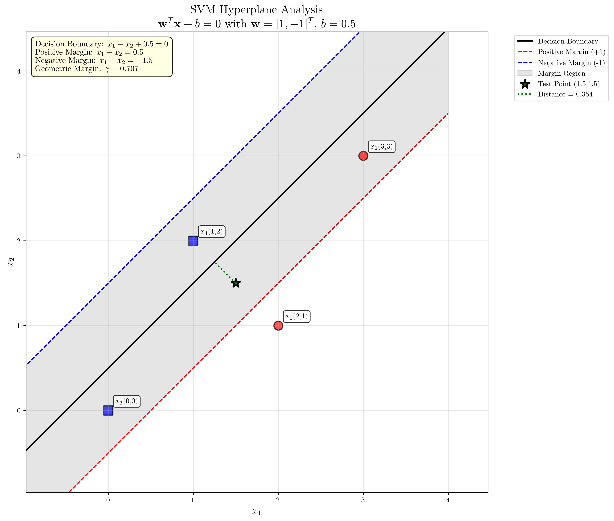
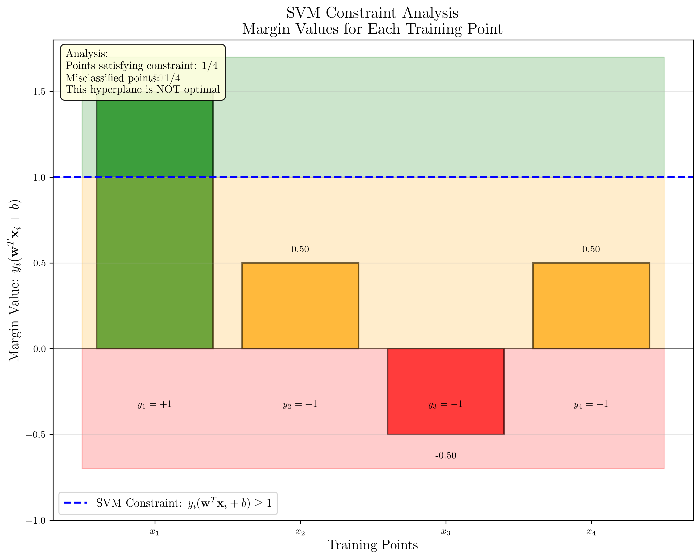

# Question 16: Numerical Hyperplane Analysis

## Problem Statement
Consider a 2D dataset with training points:
- Class +1: $\mathbf{x}_1 = (2, 1)$, $\mathbf{x}_2 = (3, 3)$
- Class -1: $\mathbf{x}_3 = (0, 0)$, $\mathbf{x}_4 = (1, 2)$

The optimal hyperplane is $w_1 x_1 + w_2 x_2 + b = 0$ with $\mathbf{w} = (1, -1)^T$ and $b = 0.5$.

### Task
1. Calculate $y_i(\mathbf{w}^T\mathbf{x}_i + b)$ for each point and verify the margin constraints
2. Identify which points are support vectors (constraints satisfied with equality)
3. Calculate the geometric margin $\gamma = \frac{1}{||\mathbf{w}||}$
4. Find the distance from test point $(1.5, 1.5)$ to the hyperplane
5. Write equations for the positive and negative margin boundaries

## Understanding the Problem
This problem analyzes a specific hyperplane for an SVM classifier. In a hard-margin SVM, the optimal hyperplane must satisfy the constraint $y_i(\mathbf{w}^T\mathbf{x}_i + b) \geq 1$ for all training points. Support vectors are points that lie exactly on the margin boundaries where $y_i(\mathbf{w}^T\mathbf{x}_i + b) = 1$.

The geometric margin represents the perpendicular distance from the hyperplane to the closest points, and it's related to the weight vector's magnitude. The margin boundaries are parallel hyperplanes at distance $\gamma$ from the decision boundary.

## Solution

We'll analyze the given hyperplane systematically, checking whether it represents a valid SVM solution and computing all required quantities.

### Step 1: Verify Margin Constraints

For each training point, we calculate $y_i(\mathbf{w}^T\mathbf{x}_i + b)$ and check if it satisfies the SVM constraint $\geq 1$.

**Point 1:** $\mathbf{x}_1 = (2, 1)$, $y_1 = +1$
$$\mathbf{w}^T\mathbf{x}_1 + b = 1 \cdot 2 + (-1) \cdot 1 + 0.5 = 1.5$$
$$y_1(\mathbf{w}^T\mathbf{x}_1 + b) = 1 \cdot 1.5 = 1.5 \geq 1 \quad \checkmark$$

**Point 2:** $\mathbf{x}_2 = (3, 3)$, $y_2 = +1$
$$\mathbf{w}^T\mathbf{x}_2 + b = 1 \cdot 3 + (-1) \cdot 3 + 0.5 = 0.5$$
$$y_2(\mathbf{w}^T\mathbf{x}_2 + b) = 1 \cdot 0.5 = 0.5 < 1 \quad \text{⚠ Violation}$$

**Point 3:** $\mathbf{x}_3 = (0, 0)$, $y_3 = -1$
$$\mathbf{w}^T\mathbf{x}_3 + b = 1 \cdot 0 + (-1) \cdot 0 + 0.5 = 0.5$$
$$y_3(\mathbf{w}^T\mathbf{x}_3 + b) = -1 \cdot 0.5 = -0.5 < 0 \quad \text{✗ Misclassified}$$

**Point 4:** $\mathbf{x}_4 = (1, 2)$, $y_4 = -1$
$$\mathbf{w}^T\mathbf{x}_4 + b = 1 \cdot 1 + (-1) \cdot 2 + 0.5 = -0.5$$
$$y_4(\mathbf{w}^T\mathbf{x}_4 + b) = -1 \cdot (-0.5) = 0.5 < 1 \quad \text{⚠ Violation}$$

**Conclusion:** This hyperplane violates SVM constraints for points 2, 3, and 4, indicating it's not the optimal SVM solution.

### Step 2: Identify Support Vectors

Support vectors are points where $y_i(\mathbf{w}^T\mathbf{x}_i + b) = 1$ exactly.

From our calculations:
- Point 1: margin = 1.5 (not a support vector)
- Point 2: margin = 0.5 (not a support vector)
- Point 3: margin = -0.5 (not a support vector)
- Point 4: margin = 0.5 (not a support vector)

**Result:** No points are exact support vectors with this hyperplane, confirming it's not the optimal SVM solution.

### Step 3: Calculate Geometric Margin

The geometric margin is given by:
$$\gamma = \frac{1}{||\mathbf{w}||}$$

First, calculate the norm of the weight vector:
$$||\mathbf{w}|| = ||(1, -1)|| = \sqrt{1^2 + (-1)^2} = \sqrt{2} \approx 1.414$$

Therefore:
$$\gamma = \frac{1}{\sqrt{2}} = \frac{\sqrt{2}}{2} \approx 0.707$$

The margin width (distance between positive and negative margin boundaries) is:
$$\text{Margin width} = 2\gamma = \frac{2}{\sqrt{2}} = \sqrt{2} \approx 1.414$$

### Step 4: Distance from Test Point to Hyperplane

For test point $\mathbf{x}_{\text{test}} = (1.5, 1.5)$, the distance to hyperplane $\mathbf{w}^T\mathbf{x} + b = 0$ is:
$$d = \frac{|\mathbf{w}^T\mathbf{x}_{\text{test}} + b|}{||\mathbf{w}||}$$

Calculate the activation:
$$\mathbf{w}^T\mathbf{x}_{\text{test}} + b = 1 \cdot 1.5 + (-1) \cdot 1.5 + 0.5 = 0.5$$

Therefore:
$$d = \frac{|0.5|}{\sqrt{2}} = \frac{0.5}{\sqrt{2}} = \frac{\sqrt{2}}{4} \approx 0.354$$

Since the activation is positive (0.5 > 0), the test point is on the positive side of the hyperplane.

### Step 5: Margin Boundary Equations

The decision boundary is: $x_1 - x_2 + 0.5 = 0$

**Positive margin boundary** (where $\mathbf{w}^T\mathbf{x} + b = +1$):
$$x_1 - x_2 + 0.5 = 1$$
$$x_1 - x_2 = 0.5$$

**Negative margin boundary** (where $\mathbf{w}^T\mathbf{x} + b = -1$):
$$x_1 - x_2 + 0.5 = -1$$
$$x_1 - x_2 = -1.5$$

## Visual Explanations

### Hyperplane Analysis Visualization

The visualization shows:
- **Black solid line**: Decision boundary ($x_1 - x_2 + 0.5 = 0$)
- **Red dashed line**: Positive margin boundary ($x_1 - x_2 = 0.5$)
- **Blue dashed line**: Negative margin boundary ($x_1 - x_2 = -1.5$)
- **Gray shaded region**: Margin region between the boundaries
- **Training points**: Colored by class (red circles for +1, blue squares for -1)
- **Green star**: Test point $(1.5, 1.5)$
- **Green dotted line**: Distance from test point to hyperplane

The plot clearly shows that this hyperplane doesn't represent an optimal SVM solution since some points violate the margin constraints.

### Constraint Analysis Visualization

This bar chart provides a clear analysis of how each training point satisfies (or violates) the SVM margin constraints. The visualization shows:
- **Green bars**: Points satisfying the constraint $y_i(\mathbf{w}^T\mathbf{x}_i + b) \geq 1$
- **Orange bars**: Points with positive margins but violating the constraint (0 < margin < 1)
- **Red bars**: Misclassified points (negative margin values)
- **Blue dashed line**: The SVM constraint threshold at margin = 1

The analysis reveals that only 1 out of 4 points satisfies the SVM constraint, with 1 point being misclassified and 2 points having insufficient margins.

## Key Insights

### SVM Constraint Analysis
- Only point 1 satisfies the hard-margin constraint $y_i(\mathbf{w}^T\mathbf{x}_i + b) \geq 1$
- Point 3 is misclassified (negative margin value)
- Points 2 and 4 have positive but insufficient margins
- This indicates the given hyperplane is not the optimal SVM solution

### Geometric Properties
- The geometric margin $\gamma = \frac{1}{\sqrt{2}} \approx 0.707$ represents the distance from the hyperplane to the margin boundaries
- The margin width of $\sqrt{2} \approx 1.414$ is the total separation between positive and negative margin boundaries
- The weight vector $\mathbf{w} = (1, -1)$ is perpendicular to all three parallel lines (decision boundary and margin boundaries)

### Distance Calculations
- The distance formula $d = \frac{|\mathbf{w}^T\mathbf{x} + b|}{||\mathbf{w}||}$ gives the perpendicular distance from any point to the hyperplane
- The sign of $\mathbf{w}^T\mathbf{x} + b$ determines which side of the hyperplane a point lies on
- Points with the same distance from the hyperplane lie on parallel lines

## Conclusion
- **Margin verification**: The given hyperplane violates SVM constraints for 3 out of 4 points
- **Support vectors**: No exact support vectors exist with this hyperplane
- **Geometric margin**: $\gamma = \frac{\sqrt{2}}{2} \approx 0.707$
- **Test point distance**: $\approx 0.354$ units from the hyperplane (on positive side)
- **Margin boundaries**: Positive at $x_1 - x_2 = 0.5$, negative at $x_1 - x_2 = -1.5$

This analysis demonstrates that while we can compute all the required quantities for any given hyperplane, the specific hyperplane provided is not the optimal SVM solution for this dataset.
