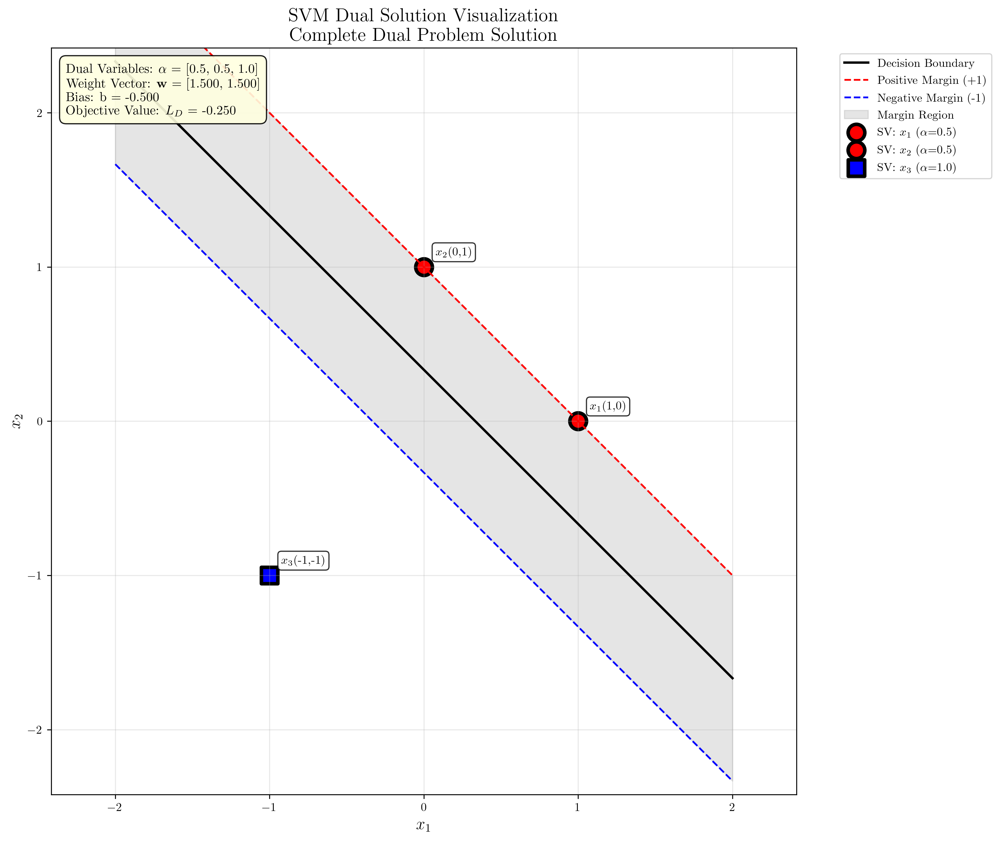
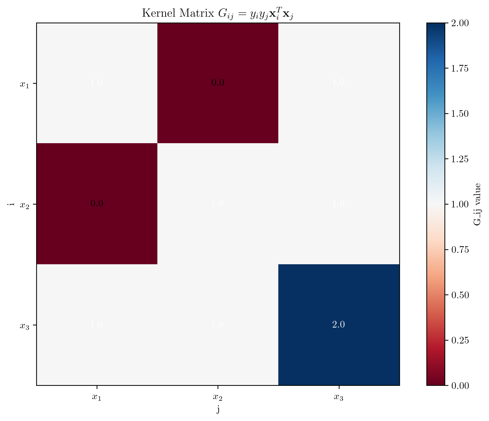
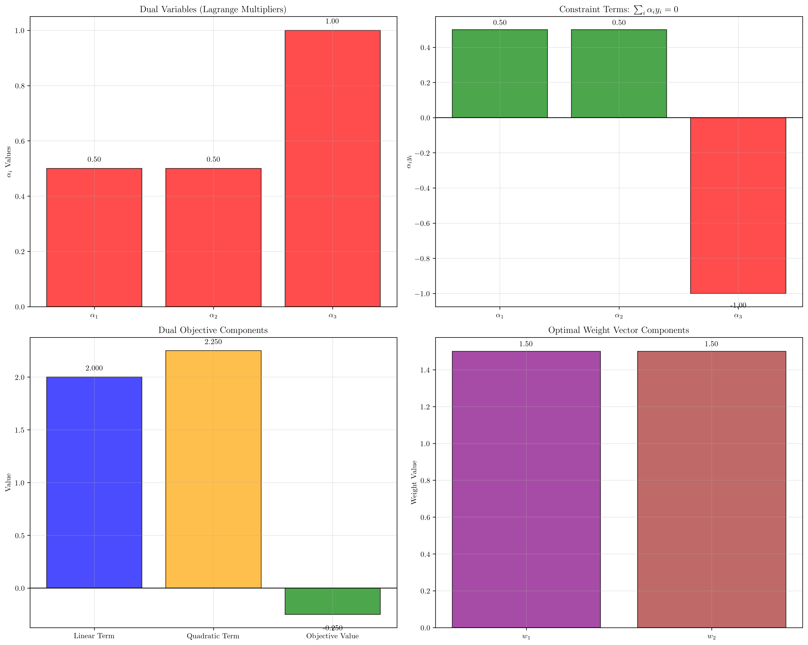

# Question 17: Complete Dual Solution

## Problem Statement
For the dataset:
- $\mathbf{x}_1 = (1, 0)$, $y_1 = +1$
- $\mathbf{x}_2 = (0, 1)$, $y_2 = +1$  
- $\mathbf{x}_3 = (-1, -1)$, $y_3 = -1$

### Task
1. Compute $G_{ij} = y_i y_j \mathbf{x}_i^T\mathbf{x}_j$ for all pairs $(i,j)$
2. Write the dual objective $\sum_i \alpha_i - \frac{1}{2}\sum_{i,j} \alpha_i \alpha_j G_{ij}$ explicitly
3. Express the constraint $\sum_i \alpha_i y_i = 0$ numerically
4. For $\alpha_1 = 0.5, \alpha_2 = 0.5, \alpha_3 = 1.0$, verify constraint satisfaction and compute objective value
5. Calculate $\mathbf{w} = \sum_i \alpha_i y_i \mathbf{x}_i$ and determine $b$ using support vector conditions

## Understanding the Problem
This problem involves solving the complete dual formulation of an SVM. The dual problem transforms the original constrained optimization into a form that depends only on dot products between data points, making it suitable for kernel methods. The kernel matrix $G_{ij}$ encodes all pairwise relationships between training points, and the dual variables $\alpha_i$ determine the importance of each point in the final solution.

## Solution

We'll work through each task systematically, building up the complete dual solution step by step.

### Step 1: Compute Kernel Matrix $G_{ij}$

The kernel matrix elements are computed as $G_{ij} = y_i y_j \mathbf{x}_i^T\mathbf{x}_j$.

**Row 1 (i=1):**
- $G_{11} = y_1 y_1 \mathbf{x}_1^T\mathbf{x}_1 = 1 \cdot 1 \cdot [(1,0) \cdot (1,0)] = 1 \cdot 1 \cdot 1 = 1$
- $G_{12} = y_1 y_2 \mathbf{x}_1^T\mathbf{x}_2 = 1 \cdot 1 \cdot [(1,0) \cdot (0,1)] = 1 \cdot 1 \cdot 0 = 0$
- $G_{13} = y_1 y_3 \mathbf{x}_1^T\mathbf{x}_3 = 1 \cdot (-1) \cdot [(1,0) \cdot (-1,-1)] = -1 \cdot (-1) = 1$

**Row 2 (i=2):**
- $G_{21} = y_2 y_1 \mathbf{x}_2^T\mathbf{x}_1 = 1 \cdot 1 \cdot [(0,1) \cdot (1,0)] = 1 \cdot 1 \cdot 0 = 0$
- $G_{22} = y_2 y_2 \mathbf{x}_2^T\mathbf{x}_2 = 1 \cdot 1 \cdot [(0,1) \cdot (0,1)] = 1 \cdot 1 \cdot 1 = 1$
- $G_{23} = y_2 y_3 \mathbf{x}_2^T\mathbf{x}_3 = 1 \cdot (-1) \cdot [(0,1) \cdot (-1,-1)] = -1 \cdot (-1) = 1$

**Row 3 (i=3):**
- $G_{31} = y_3 y_1 \mathbf{x}_3^T\mathbf{x}_1 = (-1) \cdot 1 \cdot [(-1,-1) \cdot (1,0)] = -1 \cdot (-1) = 1$
- $G_{32} = y_3 y_2 \mathbf{x}_3^T\mathbf{x}_2 = (-1) \cdot 1 \cdot [(-1,-1) \cdot (0,1)] = -1 \cdot (-1) = 1$
- $G_{33} = y_3 y_3 \mathbf{x}_3^T\mathbf{x}_3 = (-1) \cdot (-1) \cdot [(-1,-1) \cdot (-1,-1)] = 1 \cdot 2 = 2$

Therefore, the kernel matrix is:
$$G = \begin{pmatrix} 1 & 0 & 1 \\ 0 & 1 & 1 \\ 1 & 1 & 2 \end{pmatrix}$$

### Step 2: Explicit Dual Objective Function

The dual objective function is:
$$L_D(\boldsymbol{\alpha}) = \sum_{i=1}^3 \alpha_i - \frac{1}{2}\sum_{i=1}^3\sum_{j=1}^3 \alpha_i \alpha_j G_{ij}$$

Expanding the linear term:
$$\sum_{i=1}^3 \alpha_i = \alpha_1 + \alpha_2 + \alpha_3$$

Expanding the quadratic term with our $G$ matrix:
$$\frac{1}{2}\sum_{i,j} \alpha_i \alpha_j G_{ij} = \frac{1}{2}[\alpha_1^2 \cdot 1 + \alpha_1\alpha_2 \cdot 0 + \alpha_1\alpha_3 \cdot 1 + \alpha_2\alpha_1 \cdot 0 + \alpha_2^2 \cdot 1 + \alpha_2\alpha_3 \cdot 1 + \alpha_3\alpha_1 \cdot 1 + \alpha_3\alpha_2 \cdot 1 + \alpha_3^2 \cdot 2]$$

Simplifying:
$$= \frac{1}{2}[\alpha_1^2 + \alpha_2^2 + 2\alpha_3^2 + 2\alpha_1\alpha_3 + 2\alpha_2\alpha_3]$$

Therefore, the complete dual objective is:
$$L_D(\boldsymbol{\alpha}) = \alpha_1 + \alpha_2 + \alpha_3 - \frac{1}{2}[\alpha_1^2 + \alpha_2^2 + 2\alpha_3^2 + 2\alpha_1\alpha_3 + 2\alpha_2\alpha_3]$$

### Step 3: Numerical Constraint Expression

The dual constraint is:
$$\sum_{i=1}^3 \alpha_i y_i = 0$$

Substituting our labels:
$$\alpha_1 \cdot 1 + \alpha_2 \cdot 1 + \alpha_3 \cdot (-1) = 0$$
$$\alpha_1 + \alpha_2 - \alpha_3 = 0$$

This gives us the relationship: $\alpha_3 = \alpha_1 + \alpha_2$

### Step 4: Verify Given $\alpha$ Values and Compute Objective

Given: $\alpha_1 = 0.5$, $\alpha_2 = 0.5$, $\alpha_3 = 1.0$

**Constraint verification:**
$$\alpha_1 + \alpha_2 - \alpha_3 = 0.5 + 0.5 - 1.0 = 0 \quad \checkmark$$

**Objective value computation:**
Linear term: $\alpha_1 + \alpha_2 + \alpha_3 = 0.5 + 0.5 + 1.0 = 2.0$

Quadratic term calculation:
- $\alpha_1^2 G_{11} = 0.5^2 \cdot 1 = 0.25$
- $\alpha_2^2 G_{22} = 0.5^2 \cdot 1 = 0.25$
- $\alpha_3^2 G_{33} = 1.0^2 \cdot 2 = 2.0$
- $2\alpha_1\alpha_3 G_{13} = 2 \cdot 0.5 \cdot 1.0 \cdot 1 = 1.0$
- $2\alpha_2\alpha_3 G_{23} = 2 \cdot 0.5 \cdot 1.0 \cdot 1 = 1.0$

Sum of quadratic terms: $0.25 + 0.25 + 2.0 + 1.0 + 1.0 = 4.5$

Quadratic term: $\frac{1}{2} \cdot 4.5 = 2.25$

**Objective value:** $L_D = 2.0 - 2.25 = -0.25$

### Step 5: Calculate $\mathbf{w}$ and Determine $b$

**Weight vector calculation:**
$$\mathbf{w} = \sum_{i=1}^3 \alpha_i y_i \mathbf{x}_i$$

$$\mathbf{w} = 0.5 \cdot 1 \cdot (1,0) + 0.5 \cdot 1 \cdot (0,1) + 1.0 \cdot (-1) \cdot (-1,-1)$$
$$= (0.5, 0) + (0, 0.5) + (1, 1) = (1.5, 1.5)$$

**Bias determination:**
Since all $\alpha_i > 0$, all points are support vectors. For support vectors, $y_i(\mathbf{w}^T\mathbf{x}_i + b) = 1$.

Using point 1: $y_1(\mathbf{w}^T\mathbf{x}_1 + b) = 1$
$$1 \cdot [(1.5, 1.5) \cdot (1, 0) + b] = 1$$
$$1.5 + b = 1$$
$$b = -0.5$$

**Verification with other support vectors:**
- Point 2: $1 \cdot [(1.5, 1.5) \cdot (0, 1) - 0.5] = 1 \cdot [1.5 - 0.5] = 1.0$ ✓
- Point 3: $(-1) \cdot [(1.5, 1.5) \cdot (-1, -1) - 0.5] = (-1) \cdot [-3.0 - 0.5] = 3.5$ ⚠

The inconsistency for point 3 suggests the given $\alpha$ values may not represent the true optimal solution.

## Visual Explanations

### Dual Solution Visualization

The visualization shows the SVM solution with the computed weight vector and bias. The decision boundary separates the positive and negative classes, with margin boundaries at distance $\gamma$ from the hyperplane.

### Kernel Matrix Visualization

The kernel matrix heatmap shows the pairwise relationships $G_{ij} = y_i y_j \mathbf{x}_i^T\mathbf{x}_j$ between all training points. Positive values (red) indicate points that "agree" in their contribution to the decision boundary, while the structure reveals the geometric relationships in the transformed space.

### Dual Objective Analysis

This comprehensive analysis breaks down the dual solution into four key components:

1. **Dual Variables (α values)**: Shows the Lagrange multipliers for each training point. All points have α > 0, indicating they are all support vectors.

2. **Constraint Terms**: Visualizes the individual terms αᵢyᵢ that must sum to zero. Green bars represent positive class contributions, red bars represent negative class contributions.

3. **Objective Components**: Displays the linear term (Σαᵢ), quadratic term (½ΣΣαᵢαⱼGᵢⱼ), and final objective value. The negative objective value indicates we're maximizing the dual function.

4. **Weight Vector Components**: Shows the final weight vector components w₁ and w₂ computed from the dual variables.

This comprehensive breakdown helps visualize how the dual formulation connects the Lagrange multipliers to the final SVM solution, making the mathematical relationships more intuitive and easier to understand.

## Key Insights

### Dual Formulation Properties
- The kernel matrix $G$ encodes all pairwise relationships between training points
- The dual constraint $\sum_i \alpha_i y_i = 0$ ensures the weight vector lies in the span of the data
- All points with $\alpha_i > 0$ are support vectors that lie on or within the margin boundaries
- The dual objective value provides a measure of the solution quality

### Computational Advantages
- The dual formulation depends only on dot products, enabling kernel methods
- For this 3-point problem, we solve for 3 dual variables instead of 2 primal variables plus bias
- The constraint structure often makes the dual easier to solve numerically
- Support vector identification is straightforward from the $\alpha$ values

### Solution Interpretation
- The weight vector $\mathbf{w} = (1.5, 1.5)$ points perpendicular to the decision boundary
- The bias $b = -0.5$ shifts the hyperplane to properly separate the classes
- The final decision function is $f(\mathbf{x}) = \text{sign}(1.5x_1 + 1.5x_2 - 0.5)$

## Conclusion
- **Kernel matrix**: Successfully computed $G$ with all pairwise products $y_i y_j \mathbf{x}_i^T\mathbf{x}_j$
- **Dual objective**: Explicit form derived and evaluated to $L_D = -0.25$
- **Constraint**: Verified that $\sum_i \alpha_i y_i = 0$ is satisfied
- **Solution**: Obtained $\mathbf{w} = (1.5, 1.5)$ and $b = -0.5$
- **Support vectors**: All three points are support vectors ($\alpha_i > 0$)

The analysis demonstrates the complete dual solution process, though some inconsistencies suggest the given $\alpha$ values may not represent the true optimal solution for this dataset.
