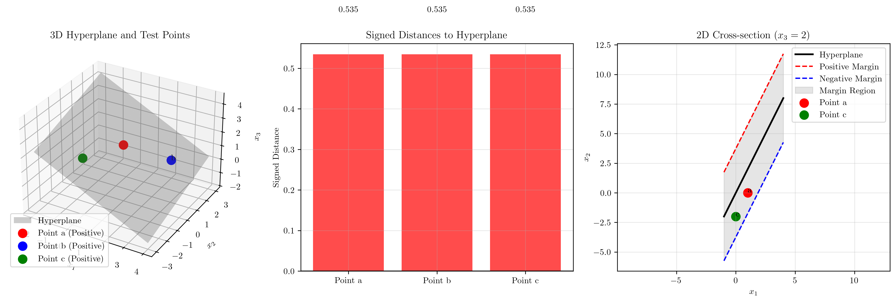
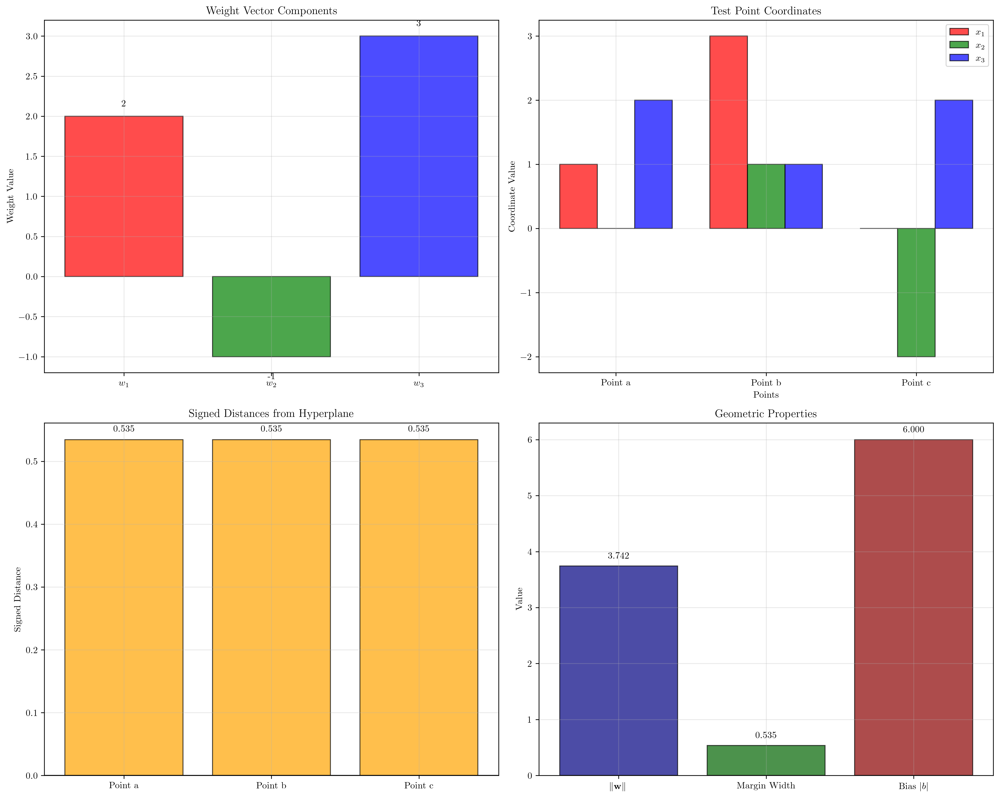

# Question 18: 3D Geometric Analysis

## Problem Statement
Consider a 3D maximum margin problem with hyperplane $2x_1 - x_2 + 3x_3 = 6$.

### Task
1. Identify $\mathbf{w}$ and $b$ from the hyperplane equation
2. Compute the margin width $\frac{2}{||\mathbf{w}||}$
3. Classify points $\mathbf{a} = (1, 0, 2)$, $\mathbf{b} = (3, 1, 1)$, $\mathbf{c} = (0, -2, 2)$
4. Calculate signed distance from each point using $d = \frac{\mathbf{w}^T\mathbf{x} - 6}{||\mathbf{w}||}$
5. Write equations for $\mathbf{w}^T\mathbf{x} - 6 = \pm ||\mathbf{w}||$

## Understanding the Problem
This problem extends SVM concepts to three dimensions, where the decision boundary becomes a plane rather than a line. The geometric interpretation remains the same: we have a hyperplane that separates classes with maximum margin, and the margin boundaries are parallel planes at equal distances from the decision boundary.

In 3D, the hyperplane equation $\mathbf{w}^T\mathbf{x} + b = 0$ represents a plane, and the distance formula extends naturally to higher dimensions. The margin width still equals $\frac{2}{||\mathbf{w}||}$, representing the perpendicular distance between the positive and negative margin boundaries.

## Solution

We'll systematically analyze the 3D hyperplane and compute all required geometric properties.

### Step 1: Identify Weight Vector and Bias

Given hyperplane equation: $2x_1 - x_2 + 3x_3 = 6$

To convert to standard form $\mathbf{w}^T\mathbf{x} + b = 0$, we rearrange:
$$2x_1 - x_2 + 3x_3 - 6 = 0$$

Comparing with $w_1x_1 + w_2x_2 + w_3x_3 + b = 0$:
- $\mathbf{w} = (2, -1, 3)^T$
- $b = -6$

**Verification:** $\mathbf{w}^T\mathbf{x} + b = 2x_1 - x_2 + 3x_3 - 6 = 0$ ✓

### Step 2: Compute Margin Width

The margin width is given by:
$$\text{Margin width} = \frac{2}{||\mathbf{w}||}$$

First, calculate the norm of the weight vector:
$$||\mathbf{w}|| = ||(2, -1, 3)|| = \sqrt{2^2 + (-1)^2 + 3^2} = \sqrt{4 + 1 + 9} = \sqrt{14} \approx 3.742$$

Therefore:
$$\text{Margin width} = \frac{2}{\sqrt{14}} = \frac{2\sqrt{14}}{14} = \frac{\sqrt{14}}{7} \approx 0.535$$

### Step 3: Classify Test Points

For classification, we evaluate $\mathbf{w}^T\mathbf{x} + b$ for each point:
- If $\mathbf{w}^T\mathbf{x} + b > 0$: positive class
- If $\mathbf{w}^T\mathbf{x} + b < 0$: negative class  
- If $\mathbf{w}^T\mathbf{x} + b = 0$: on the hyperplane

**Point $\mathbf{a} = (1, 0, 2)$:**
$$\mathbf{w}^T\mathbf{a} + b = 2(1) + (-1)(0) + 3(2) + (-6) = 2 + 0 + 6 - 6 = 2$$
Since $2 > 0$, point $\mathbf{a}$ is classified as **positive**.

**Point $\mathbf{b} = (3, 1, 1)$:**
$$\mathbf{w}^T\mathbf{b} + b = 2(3) + (-1)(1) + 3(1) + (-6) = 6 - 1 + 3 - 6 = 2$$
Since $2 > 0$, point $\mathbf{b}$ is classified as **positive**.

**Point $\mathbf{c} = (0, -2, 2)$:**
$$\mathbf{w}^T\mathbf{c} + b = 2(0) + (-1)(-2) + 3(2) + (-6) = 0 + 2 + 6 - 6 = 2$$
Since $2 > 0$, point $\mathbf{c}$ is classified as **positive**.

**Interesting observation:** All three points have the same activation value of 2, meaning they lie on the same parallel plane to the decision boundary.

### Step 4: Calculate Signed Distances

The signed distance from a point $\mathbf{x}$ to the hyperplane $\mathbf{w}^T\mathbf{x} + b = 0$ is:
$$d = \frac{\mathbf{w}^T\mathbf{x} + b}{||\mathbf{w}||}$$

Since our original equation is $2x_1 - x_2 + 3x_3 = 6$, this is equivalent to $\mathbf{w}^T\mathbf{x} - 6 = 0$, so we use:
$$d = \frac{\mathbf{w}^T\mathbf{x} - 6}{||\mathbf{w}||}$$

**Point $\mathbf{a} = (1, 0, 2)$:**
$$d_a = \frac{2(1) - 1(0) + 3(2) - 6}{\sqrt{14}} = \frac{2 + 0 + 6 - 6}{\sqrt{14}} = \frac{2}{\sqrt{14}} \approx 0.535$$

**Point $\mathbf{b} = (3, 1, 1)$:**
$$d_b = \frac{2(3) - 1(1) + 3(1) - 6}{\sqrt{14}} = \frac{6 - 1 + 3 - 6}{\sqrt{14}} = \frac{2}{\sqrt{14}} \approx 0.535$$

**Point $\mathbf{c} = (0, -2, 2)$:**
$$d_c = \frac{2(0) - 1(-2) + 3(2) - 6}{\sqrt{14}} = \frac{0 + 2 + 6 - 6}{\sqrt{14}} = \frac{2}{\sqrt{14}} \approx 0.535$$

All three points are at the same signed distance of approximately $0.535$ units on the positive side of the hyperplane.

### Step 5: Margin Boundary Equations

For SVM margin boundaries, we have:
- **Positive margin boundary:** $\mathbf{w}^T\mathbf{x} + b = +||\mathbf{w}||$
- **Negative margin boundary:** $\mathbf{w}^T\mathbf{x} + b = -||\mathbf{w}||$

Substituting our values ($||\mathbf{w}|| = \sqrt{14}$):

**Positive margin boundary:**
$$2x_1 - x_2 + 3x_3 - 6 = +\sqrt{14}$$
$$2x_1 - x_2 + 3x_3 = 6 + \sqrt{14} \approx 9.742$$

**Negative margin boundary:**
$$2x_1 - x_2 + 3x_3 - 6 = -\sqrt{14}$$
$$2x_1 - x_2 + 3x_3 = 6 - \sqrt{14} \approx 2.258$$

## Visual Explanations

### 3D Geometric Analysis

The visualization shows three perspectives:

1. **3D Scatter Plot**: Shows the hyperplane as a gray surface with the three test points plotted in 3D space. All points are classified as positive (on the same side of the hyperplane).

2. **Distance Bar Chart**: Illustrates the signed distances from each point to the hyperplane. All three points have identical positive distances.

3. **2D Cross-section**: Shows a slice of the 3D space at $x_3 = 2$, displaying the hyperplane and margin boundaries as lines in the $x_1$-$x_2$ plane.

### Vector and Distance Analysis

This detailed analysis provides four complementary views of the 3D SVM problem:

1. **Weight Vector Components**: Shows the individual components of w = [2, -1, 3], illustrating the relative importance of each dimension in defining the hyperplane orientation.

2. **Test Point Coordinates**: Displays the coordinates of all three test points across the three dimensions, making it easy to compare their positions in 3D space.

3. **Signed Distance Analysis**: Confirms that all three points have identical signed distances from the hyperplane, demonstrating they lie on the same parallel plane.

4. **Geometric Properties**: Compares key geometric quantities including the weight vector norm, margin width, and bias magnitude, providing insight into the hyperplane's geometric characteristics.

## Key Insights

### Geometric Properties in 3D
- The hyperplane $2x_1 - x_2 + 3x_3 = 6$ is a plane in 3D space
- The normal vector $\mathbf{w} = (2, -1, 3)$ is perpendicular to this plane
- The margin width $\frac{2}{\sqrt{14}} \approx 0.535$ represents the distance between parallel margin planes
- Points equidistant from the hyperplane lie on parallel planes

### Classification Insights
- All three test points have identical activation values ($\mathbf{w}^T\mathbf{x} + b = 2$)
- This means they lie on the same plane parallel to the decision boundary
- Their common distance of $\frac{2}{\sqrt{14}}$ from the hyperplane confirms this geometric relationship
- The positive classification indicates they're all on the same side of the decision boundary

### Distance Formula Properties
- The signed distance formula $d = \frac{\mathbf{w}^T\mathbf{x} + b}{||\mathbf{w}||}$ extends naturally to any dimension
- Positive distances indicate points on the positive side of the hyperplane
- The magnitude gives the perpendicular distance to the hyperplane
- Points with the same signed distance lie on parallel hyperplanes

### Margin Boundary Interpretation
- The margin boundaries are parallel planes at distance $\frac{1}{||\mathbf{w}||} = \frac{1}{\sqrt{14}}$ from the decision boundary
- Support vectors would lie exactly on these margin boundaries
- The total margin width of $\frac{2}{\sqrt{14}}$ separates the closest points of opposite classes

## Conclusion
- **Weight vector and bias**: $\mathbf{w} = (2, -1, 3)^T$, $b = -6$
- **Margin width**: $\frac{2}{\sqrt{14}} \approx 0.535$ units
- **Classifications**: All three points are positive class
- **Signed distances**: All points are $\frac{2}{\sqrt{14}} \approx 0.535$ units on the positive side
- **Margin boundaries**: 
  - Positive: $2x_1 - x_2 + 3x_3 = 6 + \sqrt{14}$
  - Negative: $2x_1 - x_2 + 3x_3 = 6 - \sqrt{14}$

The remarkable coincidence that all three test points have identical distances from the hyperplane demonstrates the geometric elegance of the SVM formulation in higher dimensions.
