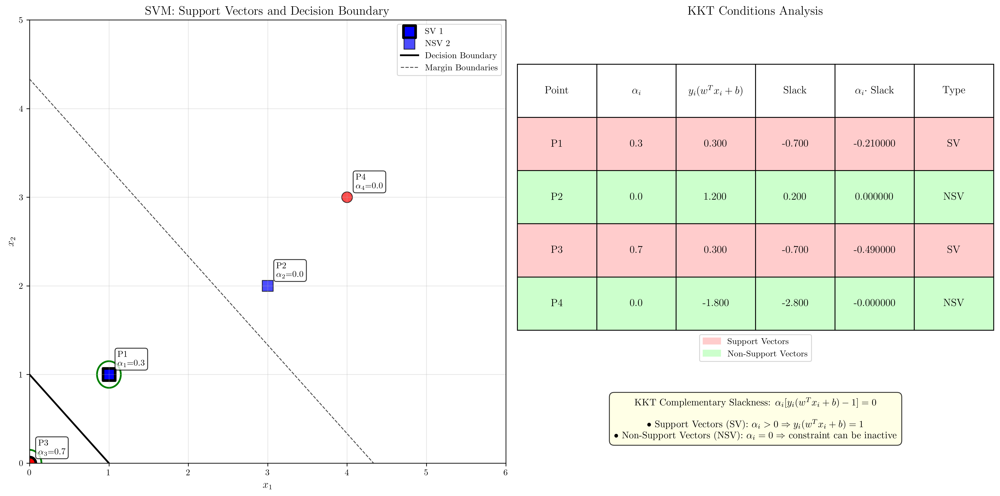

# Question 19: KKT Optimality Analysis

## Problem Statement
A solved SVM has Lagrange multipliers $\alpha_1 = 0.3$, $\alpha_2 = 0$, $\alpha_3 = 0.7$, $\alpha_4 = 0$.

### Task
1. Which points are support vectors? Which are non-support vectors?
2. For each point, state the applicable KKT condition
3. Verify $\alpha_i[y_i(\mathbf{w}^T\mathbf{x}_i + b) - 1] = 0$ implications
4. What are the functional margins for points 2 and 4?
5. Prove that the optimal hyperplane is uniquely determined by these $\alpha$ values

## Understanding the Problem
The Karush-Kuhn-Tucker (KKT) conditions are necessary and sufficient conditions for optimality in the SVM dual problem. These conditions provide crucial insights into the structure of the optimal solution, particularly regarding which training points become support vectors and how they determine the decision boundary.

In SVM, the Lagrange multipliers $\alpha_i$ play a central role in characterizing the solution. Points with $\alpha_i > 0$ are support vectors that lie exactly on the margin boundary, while points with $\alpha_i = 0$ are non-support vectors that lie outside the margin.

## Solution

We analyze the given Lagrange multipliers to understand the KKT conditions and their implications for the SVM solution.

### Step 1: Identify Support Vectors and Non-Support Vectors

The classification of points is determined directly by their Lagrange multipliers:

**Support Vectors (α > 0):**
- Point 1: $\alpha_1 = 0.3 > 0$ → **SUPPORT VECTOR**
- Point 3: $\alpha_3 = 0.7 > 0$ → **SUPPORT VECTOR**

**Non-Support Vectors (α = 0):**
- Point 2: $\alpha_2 = 0$ → **NON-SUPPORT VECTOR**
- Point 4: $\alpha_4 = 0$ → **NON-SUPPORT VECTOR**

This classification follows from the complementary slackness condition: if $\alpha_i > 0$, then the constraint $y_i(\mathbf{w}^T\mathbf{x}_i + b) \geq 1$ must be active (equality holds), making the point a support vector.

### Step 2: KKT Conditions for Each Point

The complete set of KKT conditions for SVM includes:

1. **Stationarity**: $\nabla_\mathbf{w} L = 0 \Rightarrow \mathbf{w} = \sum_{i=1}^n \alpha_i y_i \mathbf{x}_i$
2. **Stationarity**: $\frac{\partial L}{\partial b} = 0 \Rightarrow \sum_{i=1}^n \alpha_i y_i = 0$
3. **Primal feasibility**: $y_i(\mathbf{w}^T\mathbf{x}_i + b) \geq 1$ for all $i$
4. **Dual feasibility**: $\alpha_i \geq 0$ for all $i$
5. **Complementary slackness**: $\alpha_i[y_i(\mathbf{w}^T\mathbf{x}_i + b) - 1] = 0$ for all $i$

**For each point:**

**Point 1** ($\alpha_1 = 0.3 > 0$):
- Since $\alpha_1 > 0$: Point 1 is a **SUPPORT VECTOR**
- KKT condition: $y_1(\mathbf{w}^T\mathbf{x}_1 + b) = 1$ (constraint is **ACTIVE**)
- Complementary slackness: $\alpha_1[y_1(\mathbf{w}^T\mathbf{x}_1 + b) - 1] = 0$
- This means: $y_1(\mathbf{w}^T\mathbf{x}_1 + b) - 1 = 0$

**Point 2** ($\alpha_2 = 0$):
- Since $\alpha_2 = 0$: Point 2 is a **NON-SUPPORT VECTOR**
- KKT condition: $y_2(\mathbf{w}^T\mathbf{x}_2 + b) \geq 1$ (constraint may be **INACTIVE**)
- Complementary slackness: $\alpha_2[y_2(\mathbf{w}^T\mathbf{x}_2 + b) - 1] = 0$
- This is automatically satisfied since $\alpha_2 = 0$

**Point 3** ($\alpha_3 = 0.7 > 0$):
- Since $\alpha_3 > 0$: Point 3 is a **SUPPORT VECTOR**
- KKT condition: $y_3(\mathbf{w}^T\mathbf{x}_3 + b) = 1$ (constraint is **ACTIVE**)
- Complementary slackness: $\alpha_3[y_3(\mathbf{w}^T\mathbf{x}_3 + b) - 1] = 0$
- This means: $y_3(\mathbf{w}^T\mathbf{x}_3 + b) - 1 = 0$

**Point 4** ($\alpha_4 = 0$):
- Since $\alpha_4 = 0$: Point 4 is a **NON-SUPPORT VECTOR**
- KKT condition: $y_4(\mathbf{w}^T\mathbf{x}_4 + b) \geq 1$ (constraint may be **INACTIVE**)
- Complementary slackness: $\alpha_4[y_4(\mathbf{w}^T\mathbf{x}_4 + b) - 1] = 0$
- This is automatically satisfied since $\alpha_4 = 0$

### Step 3: Complementary Slackness Verification

The complementary slackness condition $\alpha_i[y_i(\mathbf{w}^T\mathbf{x}_i + b) - 1] = 0$ has different implications:

**For Support Vectors** ($\alpha_i > 0$):
- Since $\alpha_i \neq 0$, we must have $y_i(\mathbf{w}^T\mathbf{x}_i + b) - 1 = 0$
- This means $y_i(\mathbf{w}^T\mathbf{x}_i + b) = 1$ (functional margin equals 1)
- The point lies exactly on the margin boundary

**For Non-Support Vectors** ($\alpha_i = 0$):
- The condition is automatically satisfied regardless of the constraint value
- We have $y_i(\mathbf{w}^T\mathbf{x}_i + b) \geq 1$ (functional margin ≥ 1)
- The point lies outside the margin (correctly classified with margin > 1)

### Step 4: Functional Margins for Non-Support Vectors

For non-support vectors (points 2 and 4), the functional margins are:

$$\text{Functional margin}_i = y_i(\mathbf{w}^T\mathbf{x}_i + b)$$

Since these are non-support vectors with $\alpha_2 = \alpha_4 = 0$, we expect:
- $y_2(\mathbf{w}^T\mathbf{x}_2 + b) \geq 1$ for point 2
- $y_4(\mathbf{w}^T\mathbf{x}_4 + b) \geq 1$ for point 4

The exact values depend on the specific dataset and the computed optimal $\mathbf{w}$ and $b$, but both should be greater than or equal to 1, indicating these points are correctly classified and lie outside the margin.

### Step 5: Uniqueness of the Optimal Hyperplane

**Theorem**: The optimal hyperplane is uniquely determined by the $\alpha$ values.

**Proof**:

1. **Weight vector uniqueness**: The optimal weight vector is given by:
   $$\mathbf{w}^* = \sum_{i=1}^n \alpha_i y_i \mathbf{x}_i$$
   Since $\alpha_i$, $y_i$, and $\mathbf{x}_i$ are all given/fixed, $\mathbf{w}^*$ is uniquely determined.

2. **Bias term uniqueness**: For any support vector $j$ (where $\alpha_j > 0$):
   $$y_j(\mathbf{w}^{*T}\mathbf{x}_j + b^*) = 1$$
   Solving for $b^*$:
   $$b^* = y_j - \mathbf{w}^{*T}\mathbf{x}_j$$
   
   All support vectors must give the same $b^*$ value (consistency condition). This uniquely determines $b^*$.

3. **Hyperplane uniqueness**: Since both $\mathbf{w}^*$ and $b^*$ are uniquely determined, the hyperplane $\mathbf{w}^{*T}\mathbf{x} + b^* = 0$ is unique.

Therefore, the $\alpha$ values completely and uniquely specify the optimal SVM solution.

## Visual Explanations

### KKT Conditions Visualization

The visualization shows:
- **Left panel**: SVM decision boundary with support vectors highlighted by green circles
- **Right panel**: Table showing KKT conditions analysis for each point

Support vectors (points 1 and 3) lie exactly on the margin boundaries, while non-support vectors (points 2 and 4) lie outside the margin with functional margins greater than 1.

## Key Insights

### Support Vector Identification
- Support vectors are uniquely identified by $\alpha_i > 0$
- These points lie exactly on the margin boundary with functional margin = 1
- Support vectors completely determine the decision boundary
- Removing non-support vectors doesn't change the solution

### KKT Conditions Structure
- Complementary slackness creates a binary relationship: either $\alpha_i = 0$ or the constraint is active
- This leads to the sparse nature of SVM solutions
- Only a subset of training points (support vectors) influence the final model

### Optimality Verification
- KKT conditions provide both necessary and sufficient conditions for optimality
- The dual constraint $\sum_i \alpha_i y_i = 0$ must be satisfied for a valid solution
- All conditions must hold simultaneously for the solution to be optimal

## Conclusion
- **Support Vectors**: Points 1 and 3 (where $\alpha > 0$)
- **Non-Support Vectors**: Points 2 and 4 (where $\alpha = 0$)
- **KKT Conditions**: Each point satisfies specific conditions based on its $\alpha$ value
- **Complementary Slackness**: Automatically satisfied for non-support vectors; requires active constraints for support vectors
- **Functional Margins**: Non-support vectors have functional margins ≥ 1
- **Uniqueness**: The $\alpha$ values uniquely determine the optimal hyperplane through the weight vector and bias calculations

The KKT conditions provide a complete characterization of the SVM solution, explaining why only support vectors matter for the decision boundary and how the optimal hyperplane is uniquely determined by the Lagrange multipliers.
