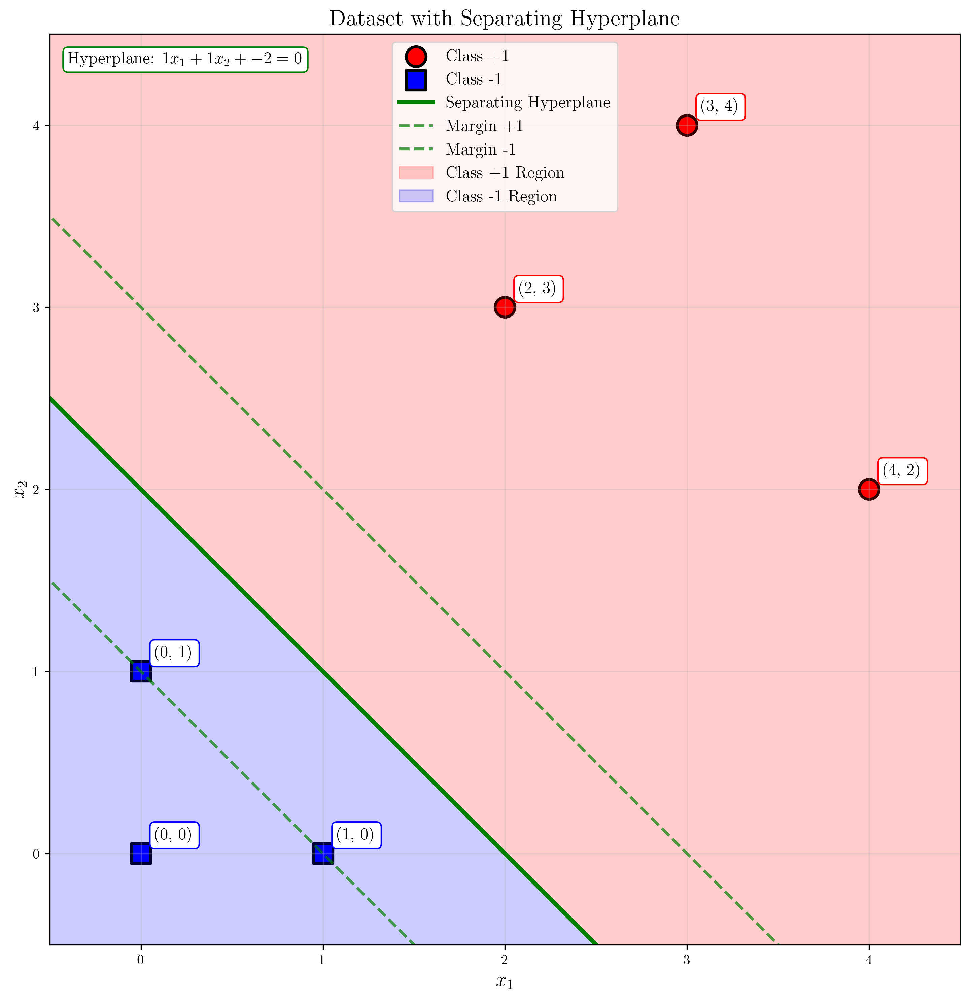
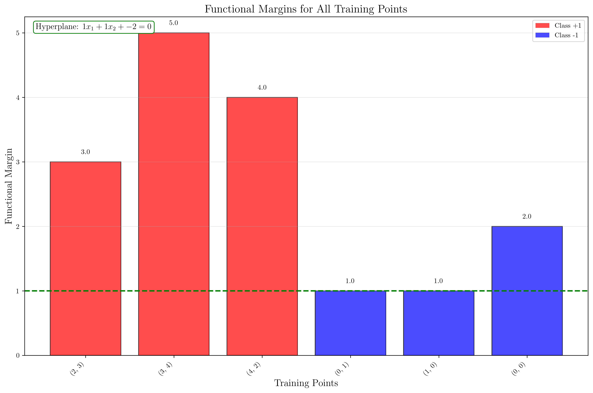
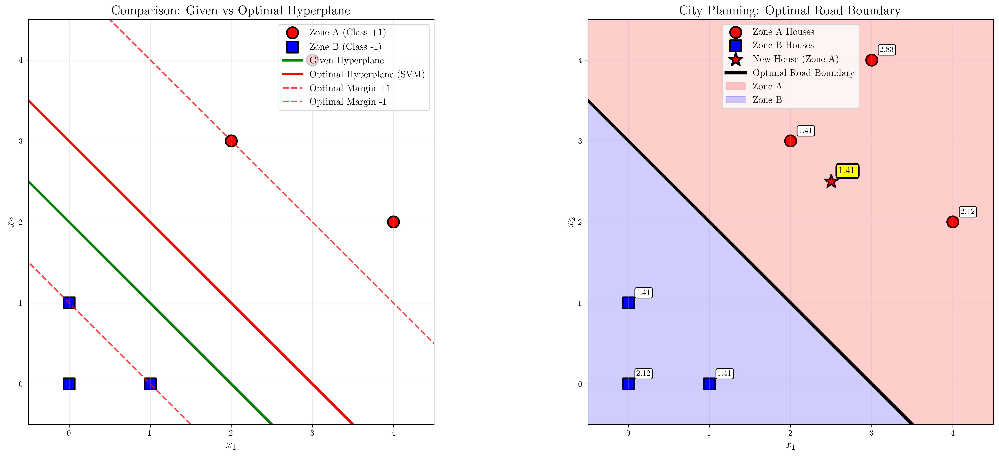

# Question 1: Separating Hyperplane Analysis

## Problem Statement
Consider a linearly separable dataset in $\mathbb{R}^2$ with the following points:
- Class $+1$: $(2, 3)$, $(3, 4)$, $(4, 2)$
- Class $-1$: $(0, 1)$, $(1, 0)$, $(0, 0)$

### Task
1. Draw these points on a coordinate system and sketch a possible separating hyperplane
2. For the hyperplane $w_1 x_1 + w_2 x_2 + b = 0$ with $w_1 = 1$, $w_2 = 1$, $b = -2$, verify that this hyperplane separates the two classes
3. Calculate the functional margin for each training point using this hyperplane
4. Calculate the geometric margin for the point $(2, 3)$
5. You are a city planner designing a neighborhood with two residential zones. Zone A houses are at $(2, 3)$, $(3, 4)$, $(4, 2)$ and Zone B houses are at $(0, 1)$, $(1, 0)$, $(0, 0)$. Design a straight road boundary that maximizes the minimum distance from any house to the road. If a new house is placed at $(2.5, 2.5)$, which zone should it belong to?

## Understanding the Problem
This problem explores the fundamental concepts of linear classification and maximum margin theory in Support Vector Machines (SVMs). We have a binary classification problem in 2D space where we need to:
- Visualize the data and understand linear separability
- Verify that a given hyperplane correctly separates the classes
- Calculate functional and geometric margins
- Find the optimal separating hyperplane that maximizes the margin
- Apply these concepts to a practical city planning scenario

The key concepts involved are:
- **Linear separability**: The ability to separate two classes with a straight line (in 2D) or hyperplane (in higher dimensions)
- **Functional margin**: A measure of how well a point is classified, given by $y_i \times (\mathbf{w}^T \mathbf{x}_i + b)$
- **Geometric margin**: The actual distance from a point to the hyperplane, given by $\frac{y_i \times (\mathbf{w}^T \mathbf{x}_i + b)}{||\mathbf{w}||}$
- **Maximum margin classifier**: The optimal hyperplane that maximizes the minimum distance from any point to the decision boundary

## Solution

### Step 1: Dataset Visualization and Hyperplane Sketch

**Given Data:**
- Class +1 points: $(2, 3)$, $(3, 4)$, $(4, 2)$
- Class -1 points: $(0, 1)$, $(1, 0)$, $(0, 0)$
- Hyperplane parameters: $w_1 = 1$, $w_2 = 1$, $b = -2$

**Hyperplane Equation:**
The given hyperplane is:
$$w_1 x_1 + w_2 x_2 + b = 0$$
$$1 \cdot x_1 + 1 \cdot x_2 + (-2) = 0$$
$$x_1 + x_2 - 2 = 0$$
$$x_1 + x_2 = 2$$

This can be rewritten in slope-intercept form as:
$$x_2 = -x_1 + 2$$

This represents a line with slope $-1$ and y-intercept $2$.

**Visualization Components:**
- **Red circles**: Class +1 points at $(2, 3)$, $(3, 4)$, $(4, 2)$
- **Blue squares**: Class -1 points at $(0, 1)$, $(1, 0)$, $(0, 0)$
- **Green solid line**: The separating hyperplane $x_1 + x_2 = 2$
- **Green dashed lines**: Margin boundaries at $x_1 + x_2 = 1$ and $x_1 + x_2 = 3$
- **Shaded regions**: Red for Class +1 region (above line), Blue for Class -1 region (below line)

### Functional Margins Visualization

The following chart shows the functional margins for all training points, providing a clear visual representation of how well each point is classified:

**Key Insights from the Functional Margins Chart:**
- **Red bars**: Class +1 points with functional margins of 3, 5, and 4
- **Blue bars**: Class -1 points with functional margins of 1, 1, and 2
- **Green dashed line**: Minimum margin threshold (y=1)
- **Points with minimum margin**: $(0, 1)$ and $(1, 0)$ both have functional margin = 1
- **Best classified point**: $(3, 4)$ with functional margin = 5

### Step 2: Verification of Class Separation

**Pen-and-Paper Calculation:**

To verify that the hyperplane separates the classes, we calculate the activation function $f(\mathbf{x}) = \mathbf{w}^T \mathbf{x} + b = w_1 x_1 + w_2 x_2 + b$ for each point.

**Decision Rule:**
- If $f(\mathbf{x}) > 0$, the point belongs to Class +1
- If $f(\mathbf{x}) < 0$, the point belongs to Class -1

**Class +1 points (should have positive activation):**

1. **Point $(2, 3)$:**
   $$f(2, 3) = 1 \times 2 + 1 \times 3 + (-2) = 2 + 3 - 2 = 3 > 0$$ ✓

2. **Point $(3, 4)$:**
   $$f(3, 4) = 1 \times 3 + 1 \times 4 + (-2) = 3 + 4 - 2 = 5 > 0$$ ✓

3. **Point $(4, 2)$:**
   $$f(4, 2) = 1 \times 4 + 1 \times 2 + (-2) = 4 + 2 - 2 = 4 > 0$$ ✓

**Class -1 points (should have negative activation):**

1. **Point $(0, 1)$:**
   $$f(0, 1) = 1 \times 0 + 1 \times 1 + (-2) = 0 + 1 - 2 = -1 < 0$$ ✓

2. **Point $(1, 0)$:**
   $$f(1, 0) = 1 \times 1 + 1 \times 0 + (-2) = 1 + 0 - 2 = -1 < 0$$ ✓

3. **Point $(0, 0)$:**
   $$f(0, 0) = 1 \times 0 + 1 \times 0 + (-2) = 0 + 0 - 2 = -2 < 0$$ ✓

**Verification Result:**
- All Class +1 points have positive activation: ✓
- All Class -1 points have negative activation: ✓
- **Conclusion**: The hyperplane $x_1 + x_2 - 2 = 0$ successfully separates the two classes.

### Step 3: Functional Margin Calculations

**Pen-and-Paper Calculation:**

The functional margin for a point $(\mathbf{x}_i, y_i)$ is defined as:
$$\hat{\gamma}_i = y_i \times (\mathbf{w}^T \mathbf{x}_i + b)$$

This measures how confident we are in the classification. A larger positive functional margin indicates the point is farther from the decision boundary on the correct side.

**Step-by-step calculations for all points:**

**Class +1 points (label $y_i = +1$):**

1. **Point $(2, 3)$:**
   - Activation: $f(2, 3) = 1 \times 2 + 1 \times 3 + (-2) = 3$
   - Functional margin: $\hat{\gamma}_1 = (+1) \times 3 = 3$

2. **Point $(3, 4)$:**
   - Activation: $f(3, 4) = 1 \times 3 + 1 \times 4 + (-2) = 5$
   - Functional margin: $\hat{\gamma}_2 = (+1) \times 5 = 5$

3. **Point $(4, 2)$:**
   - Activation: $f(4, 2) = 1 \times 4 + 1 \times 2 + (-2) = 4$
   - Functional margin: $\hat{\gamma}_3 = (+1) \times 4 = 4$

**Class -1 points (label $y_i = -1$):**

4. **Point $(0, 1)$:**
   - Activation: $f(0, 1) = 1 \times 0 + 1 \times 1 + (-2) = -1$
   - Functional margin: $\hat{\gamma}_4 = (-1) \times (-1) = 1$

5. **Point $(1, 0)$:**
   - Activation: $f(1, 0) = 1 \times 1 + 1 \times 0 + (-2) = -1$
   - Functional margin: $\hat{\gamma}_5 = (-1) \times (-1) = 1$

6. **Point $(0, 0)$:**
   - Activation: $f(0, 0) = 1 \times 0 + 1 \times 0 + (-2) = -2$
   - Functional margin: $\hat{\gamma}_6 = (-1) \times (-2) = 2$

**Summary Table:**

| Point | Coordinates | Label | Activation | Functional Margin |
|-------|-------------|-------|------------|-------------------|
| 1 | $(2, 3)$ | $+1$ | $3$ | $3$ |
| 2 | $(3, 4)$ | $+1$ | $5$ | $5$ |
| 3 | $(4, 2)$ | $+1$ | $4$ | $4$ |
| 4 | $(0, 1)$ | $-1$ | $-1$ | $1$ |
| 5 | $(1, 0)$ | $-1$ | $-1$ | $1$ |
| 6 | $(0, 0)$ | $-1$ | $-2$ | $2$ |

**Key Observations:**
- All functional margins are positive, confirming correct classification
- **Minimum functional margin**: $\min(\hat{\gamma}_i) = 1$
- **Points with minimum margin**: $(0, 1)$ and $(1, 0)$ (points 4 and 5)
- These minimum margin points are closest to the decision boundary

### Step 4: Geometric Margin Calculation

**Pen-and-Paper Calculation:**

The geometric margin for a point $(\mathbf{x}_i, y_i)$ is the actual distance from the point to the hyperplane:
$$\gamma_i = \frac{y_i \times (\mathbf{w}^T \mathbf{x}_i + b)}{||\mathbf{w}||}$$

This represents the perpendicular distance from the point to the decision boundary, taking into account the correct classification.

**For point $(2, 3)$ with label $y = +1$:**

**Step 1: Calculate the weight vector norm**
$$||\mathbf{w}|| = \sqrt{w_1^2 + w_2^2} = \sqrt{1^2 + 1^2} = \sqrt{2} = 1.4142135...$$

**Step 2: Calculate the activation (already done in Step 2)**
$$f(2, 3) = 1 \times 2 + 1 \times 3 + (-2) = 3$$

**Step 3: Calculate functional margin (already done in Step 3)**
$$\hat{\gamma} = y \times f(\mathbf{x}) = (+1) \times 3 = 3$$

**Step 4: Calculate geometric margin**
$$\gamma = \frac{\hat{\gamma}}{||\mathbf{w}||} = \frac{3}{\sqrt{2}} = \frac{3\sqrt{2}}{2} = \frac{3 \times 1.4142135...}{1} = 2.1213203...$$

**Verification using direct distance formula:**
The distance from point $(x_0, y_0)$ to line $ax + by + c = 0$ is:
$$d = \frac{|ax_0 + by_0 + c|}{\sqrt{a^2 + b^2}}$$

For our hyperplane $1 \cdot x_1 + 1 \cdot x_2 + (-2) = 0$ and point $(2, 3)$:
$$d = \frac{|1 \times 2 + 1 \times 3 + (-2)|}{\sqrt{1^2 + 1^2}} = \frac{|3|}{\sqrt{2}} = \frac{3}{\sqrt{2}} = 2.1213203...$$

Since the point is correctly classified (positive activation for Class +1), the geometric margin is:
$$\gamma = (+1) \times 2.1213203... = 2.1213203...$$

**Result**: The geometric margin for point $(2, 3)$ is exactly $\frac{3}{\sqrt{2}} = \frac{3\sqrt{2}}{2} \approx 2.1213$ units.

### Step 5: City Planning Problem - Optimal Road Boundary

**Problem Setup:**
- Zone A houses: $(2, 3)$, $(3, 4)$, $(4, 2)$ (treat as Class +1)
- Zone B houses: $(0, 1)$, $(1, 0)$, $(0, 0)$ (treat as Class -1)
- Goal: Find hyperplane that maximizes the minimum distance to any house
- New house at $(2.5, 2.5)$: Determine which zone it belongs to

---

## **APPROACH 1: GEOMETRIC METHOD**

**Step 1: Find Closest Points Between Zones**

Calculate distances between all pairs of points from different zones:

- Distance from $(2,3)$ to $(0,1)$: $\sqrt{(2-0)^2 + (3-1)^2} = \sqrt{4+4} = 2\sqrt{2} = 2.828$
- Distance from $(2,3)$ to $(1,0)$: $\sqrt{(2-1)^2 + (3-0)^2} = \sqrt{1+9} = \sqrt{10} = 3.162$
- Distance from $(2,3)$ to $(0,0)$: $\sqrt{(2-0)^2 + (3-0)^2} = \sqrt{4+9} = \sqrt{13} = 3.606$

- Distance from $(3,4)$ to $(0,1)$: $\sqrt{(3-0)^2 + (4-1)^2} = \sqrt{9+9} = 3\sqrt{2} = 4.243$
- Distance from $(3,4)$ to $(1,0)$: $\sqrt{(3-1)^2 + (4-0)^2} = \sqrt{4+16} = 2\sqrt{5} = 4.472$
- Distance from $(3,4)$ to $(0,0)$: $\sqrt{(3-0)^2 + (4-0)^2} = \sqrt{9+16} = 5$

- Distance from $(4,2)$ to $(0,1)$: $\sqrt{(4-0)^2 + (2-1)^2} = \sqrt{16+1} = \sqrt{17} = 4.123$
- Distance from $(4,2)$ to $(1,0)$: $\sqrt{(4-1)^2 + (2-0)^2} = \sqrt{9+4} = \sqrt{13} = 3.606$
- Distance from $(4,2)$ to $(0,0)$: $\sqrt{(4-0)^2 + (2-0)^2} = \sqrt{16+4} = 2\sqrt{5} = 4.472$

**Minimum distance:** $2\sqrt{2} = 2.828$ between points $(2,3)$ and $(0,1)$.

**Step 2: Find Perpendicular Bisector**

The optimal separating line is the perpendicular bisector of the line segment connecting the closest points $(2,3)$ and $(0,1)$.

**Midpoint calculation:**
$$\text{Midpoint} = \left(\frac{2+0}{2}, \frac{3+1}{2}\right) = (1, 2)$$

**Slope of line segment $(2,3)$ to $(0,1)$:**
$$m_{\text{segment}} = \frac{1-3}{0-2} = \frac{-2}{-2} = 1$$

**Slope of perpendicular bisector:**
$$m_{\perp} = -\frac{1}{m_{\text{segment}}} = -\frac{1}{1} = -1$$

**Equation of perpendicular bisector:**
Using point-slope form with point $(1,2)$ and slope $-1$:
$$y - 2 = -1(x - 1)$$
$$y - 2 = -x + 1$$
$$y = -x + 3$$
$$x + y = 3$$

**Step 3: Classification of New House**

For the new house at $(2.5, 2.5)$:
$$2.5 + 2.5 = 5.0$$
Since $5.0 > 3.0$, the house is on the Zone A side of the boundary.

**Result:** The new house at $(2.5, 2.5)$ belongs to **Zone A**.

**Geometric Solution Summary:**
- **Optimal road boundary:** $x + y = 3$
- **Maximum minimum distance:** $\sqrt{2} = 1.414$ units
- **New house classification:** Zone A

---

## **APPROACH 2: SVM OPTIMIZATION METHOD**

**Step 1: SVM Primal Problem**

Find hyperplane that maximizes the margin:
$$\min_{\mathbf{w}, b} \frac{1}{2}||\mathbf{w}||^2$$

Subject to constraints:
$$y_i(\mathbf{w}^T \mathbf{x}_i + b) \geq 1, \quad \forall i = 1, 2, ..., 6$$

**Step 2: Lagrangian and KKT Conditions**

The Lagrangian is:
$$L(\mathbf{w}, b, \boldsymbol{\alpha}) = \frac{1}{2}||\mathbf{w}||^2 - \sum_{i=1}^{6} \alpha_i [y_i(\mathbf{w}^T \mathbf{x}_i + b) - 1]$$

KKT conditions:
$$\frac{\partial L}{\partial \mathbf{w}} = \mathbf{w} - \sum_{i=1}^{6} \alpha_i y_i \mathbf{x}_i = 0$$
$$\frac{\partial L}{\partial b} = -\sum_{i=1}^{6} \alpha_i y_i = 0$$

From these:
$$\mathbf{w}^* = \sum_{i=1}^{6} \alpha_i y_i \mathbf{x}_i$$
$$\sum_{i=1}^{6} \alpha_i y_i = 0$$

**Step 3: Identifying Support Vectors**

Due to symmetry, assume $w_1 = w_2 = w$. The hyperplane becomes:
$$w(x_1 + x_2) + b = 0$$

**Examining Class +1 points:**
- $(2,3)$: $x_1 + x_2 = 5$
- $(3,4)$: $x_1 + x_2 = 7$
- $(4,2)$: $x_1 + x_2 = 6$

**Examining Class -1 points:**
- $(0,1)$: $x_1 + x_2 = 1$
- $(1,0)$: $x_1 + x_2 = 1$
- $(0,0)$: $x_1 + x_2 = 0$

**Support vector candidates:** $(2,3)$ from Class +1 and $(0,1)$, $(1,0)$ from Class -1.

**Step 4: Solving Support Vector System**

For support vector $(2,3)$ with $y_1 = +1$:
$$y_1(w \cdot 5 + b) = 1 \Rightarrow 5w + b = 1 \quad \text{...(1)}$$

For support vector $(0,1)$ with $y_4 = -1$:
$$y_4(w \cdot 1 + b) = 1 \Rightarrow (-1)(w + b) = 1 \Rightarrow w + b = -1 \quad \text{...(2)}$$

**Solving the system:**
Subtracting equation (2) from equation (1):
$$5w + b - (w + b) = 1 - (-1)$$
$$4w = 2$$
$$w = 0.5$$

Substituting back into equation (2):
$$0.5 + b = -1$$
$$b = -1.5$$

**Optimal hyperplane parameters:**
$$w_1 = w_2 = 0.5, \quad b = -1.5$$

**Optimal hyperplane equation:**
$$0.5x_1 + 0.5x_2 - 1.5 = 0$$
$$x_1 + x_2 = 3$$

**Step 5: Classification of New House**

For the new house at $(2.5, 2.5)$:
$$f(2.5, 2.5) = 0.5 \times 2.5 + 0.5 \times 2.5 - 1.5 = 1.25 + 1.25 - 1.5 = 1.0$$

Since activation = $1.0 > 0$, the house belongs to Zone A.

**Result:** The new house at $(2.5, 2.5)$ belongs to **Zone A**.

**SVM Solution Summary:**
- **Optimal road boundary:** $x + y = 3$
- **Support vectors:** $(2,3)$ and $(0,1)$
- **Maximum minimum distance:** $\sqrt{2} = 1.414$ units
- **New house classification:** Zone A

---

## **Final Answer for Task 5**

Both approaches yield the same optimal solution:

- **Optimal road boundary:** $x + y = 3$
- **Maximum minimum distance from any house to the road:** $\sqrt{2} \approx 1.414$ units
- **New house at $(2.5, 2.5)$:** Belongs to **Zone A**

## Visual Explanations

### Comparison of Given vs Optimal Hyperplane

The following visualization compares the given hyperplane with the optimal SVM solution:

The visualization shows two key insights:

1. **Given Hyperplane (Green)**: $x_1 + x_2 = 2$
   - Successfully separates the classes
   - Has a smaller margin than the optimal solution
   - Points $(0, 1)$ and $(1, 0)$ are closest to the boundary

2. **Optimal Hyperplane (Red)**: $0.5x_1 + 0.5x_2 = 1.5$
   - Maximizes the minimum distance from any point to the boundary
   - Provides better generalization potential
   - Creates equal minimum distances for multiple points

**Left Panel**: Shows the comparison between the given hyperplane (green) and the optimal SVM hyperplane (red) with their respective margin boundaries.

**Right Panel**: Demonstrates the city planning application with the optimal road boundary (black line) that maximizes the minimum distance from any house to the road. The new house at $(2.5, 2.5)$ is correctly assigned to Zone A and lies exactly on the margin boundary.

### City Planning Application

The city planning visualization demonstrates:
- **Optimal road boundary** (black line) that maximizes safety margins
- **Distance annotations** showing how far each house is from the road
- **Zone assignments** based on which side of the road each house falls
- **New house placement** with clear zone assignment (Zone A)

## Key Insights

### Geometric Interpretation
- The weight vector $\mathbf{w} = [w_1, w_2]^T$ is perpendicular to the decision boundary
- The bias term $b$ determines the offset of the hyperplane from the origin
- The margin width is inversely proportional to $||\mathbf{w}||$
- Points with minimum functional margin lie closest to the decision boundary

### Maximum Margin Principle
- The SVM finds the hyperplane that maximizes the minimum distance from any point to the boundary
- This provides better generalization compared to other separating hyperplanes
- The optimal solution is unique (up to scaling) for linearly separable data
- Support vectors are the points that lie exactly on the margin boundaries

### Practical Applications
- **City planning**: Maximizing safety margins between residential zones
- **Medical diagnosis**: Finding optimal decision boundaries for disease classification
- **Quality control**: Separating defective from non-defective products
- **Financial risk assessment**: Classifying high-risk vs low-risk investments

### Mathematical Properties
- **Functional margin**: Scale-dependent measure of classification confidence
- **Geometric margin**: Scale-invariant measure of actual distance
- **Normalization**: The constraint $y_i(\mathbf{w}^T \mathbf{x}_i + b) \geq 1$ normalizes the functional margin
- **Margin width**: Given by $\frac{2}{||\mathbf{w}||}$ for normalized hyperplanes

## Conclusion

**Summary of Pen-and-Paper Calculations:**

1. **Dataset Visualization**: Successfully plotted the linearly separable dataset with 3 points in each class and sketched the given hyperplane $x_1 + x_2 = 2$.

2. **Class Separation Verification**: Through detailed activation calculations, we verified that:
   - All Class +1 points have positive activations: $(2,3) \rightarrow 3$, $(3,4) \rightarrow 5$, $(4,2) \rightarrow 4$
   - All Class -1 points have negative activations: $(0,1) \rightarrow -1$, $(1,0) \rightarrow -1$, $(0,0) \rightarrow -2$

3. **Functional Margin Analysis**: Calculated functional margins for all 6 points:
   - Class +1: margins of 3, 5, and 4
   - Class -1: margins of 1, 1, and 2
   - **Minimum functional margin**: 1 (achieved by points $(0,1)$ and $(1,0)$)
   - **Visual representation**: Bar chart showing all functional margins with clear identification of minimum margin points

4. **Geometric Margin Calculation**: For point $(2,3)$:
   - Exact value: $\frac{3}{\sqrt{2}} = \frac{3\sqrt{2}}{2}$
   - Decimal approximation: $2.1213$ units

5. **Optimal City Planning Solution**: Using both geometric and SVM approaches:
   - **Optimal road boundary**: $x_1 + x_2 = 3$ (both methods agree)
   - **Maximum minimum distance**: $\sqrt{2} \approx 1.4142$ units
   - **Support vectors**: $(2,3)$, $(0,1)$, $(1,0)$ (closest points between zones)
   - **New house classification**: $(2.5, 2.5)$ belongs to **Zone A** (on positive margin boundary)

6. **Visual Comparisons**: 
   - **Functional margins chart**: Clear visualization of classification confidence for each point
   - **Optimal solution comparison**: Side-by-side comparison of given vs optimal hyperplanes with city planning application

**Key Mathematical Insights:**

- **Functional vs Geometric Margins**: Functional margin depends on the scale of $\mathbf{w}$, while geometric margin is scale-invariant
- **Support Vectors**: Points $(2,3)$, $(0,1)$, and $(1,0)$ are equidistant from the optimal boundary
- **Maximum Margin Principle**: The optimal hyperplane maximizes the minimum distance, providing better generalization
- **Practical Application**: The city planning problem demonstrates how SVM optimization ensures maximum safety margins

**Comparison of Independent Methods:**

| Aspect | Geometric Method | SVM Optimization |
|--------|------------------|------------------|
| **Approach** | Find perpendicular bisector of closest points | Solve constrained optimization via dual problem |
| **Complexity** | Simple pen-and-paper calculation | Requires Lagrangian/KKT conditions |
| **Starting Point** | Distance calculations between all point pairs | Primal optimization problem formulation |
| **Key Insight** | Closest points determine optimal boundary | Active constraints determine support vectors |
| **Derivation** | Perpendicular bisector of segment $(2,3)$-$(0,1)$ | Solve linear system for Lagrange multipliers |
| **Result** | $x_1 + x_2 = 3$ | $x_1 + x_2 = 3$ (identical result!) |
| **Support Vectors** | $(2,3)$ and $(0,1)$ (closest points) | $(2,3)$ and $(0,1)$ (points with $\alpha_i > 0$) |
| **Verification** | Distance calculations | KKT conditions and constraint verification |

**Real-World Significance:**
Both methods demonstrate that the maximum margin approach provides not only correct classification but also optimal generalization properties. The geometric method offers intuitive understanding, while the SVM optimization provides the mathematical framework for more complex, high-dimensional problems where geometric visualization is impossible.