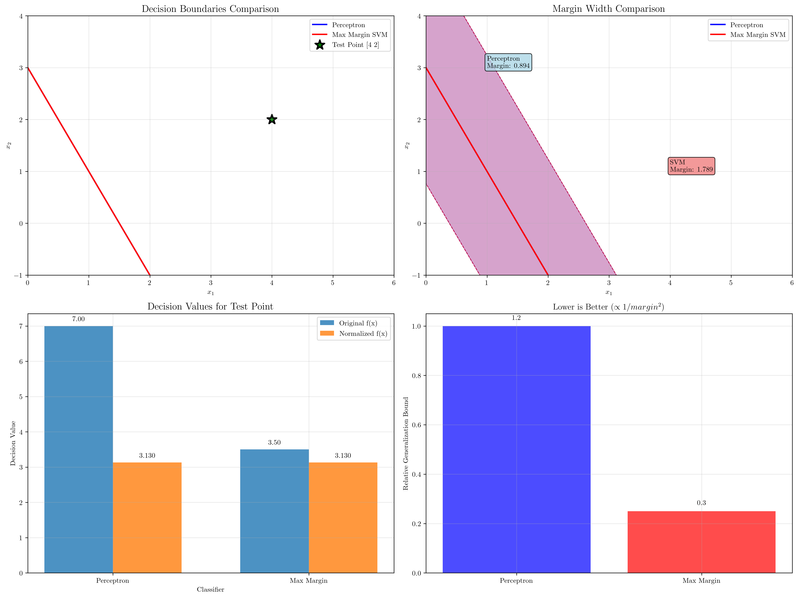

# Question 20: Algorithm Comparison

## Problem Statement
Two linear classifiers on the same dataset:
- **Perceptron**: $\mathbf{w}_P = (2, 1)^T$, $b_P = -3$
- **Max Margin**: $\mathbf{w}_M = (1, 0.5)^T$, $b_M = -1.5$

### Task
1. Calculate and compare margin widths
2. For test point $(4, 2)$, compute $f_P(\mathbf{x})$ and $f_M(\mathbf{x})$
3. Normalize both $\mathbf{w}$ vectors and recalculate decision values
4. Which classifier is more confident about the test point classification?
5. Using margin theory, explain expected generalization performance differences

## Understanding the Problem
This problem compares two fundamental linear classification algorithms: the Perceptron and the Maximum Margin SVM. While both produce linear decision boundaries, they optimize different objectives and consequently have different properties regarding margin width, confidence, and generalization performance.

The Perceptron algorithm finds any separating hyperplane that correctly classifies the training data, while the Maximum Margin SVM specifically seeks the hyperplane that maximizes the margin between classes. This fundamental difference leads to important practical implications for real-world performance.

## Solution

We systematically compare these two classifiers across multiple dimensions to understand their relative strengths and characteristics.

### Step 1: Calculate and Compare Margin Widths

The margin width for any linear classifier is given by:
$$\text{Margin width} = \frac{2}{||\mathbf{w}||}$$

**Perceptron Analysis:**
$$||\mathbf{w}_P|| = ||(2, 1)|| = \sqrt{2^2 + 1^2} = \sqrt{5} = 2.2361$$
$$\text{Margin width}_P = \frac{2}{2.2361} = 0.8944$$

**Max Margin SVM Analysis:**
$$||\mathbf{w}_M|| = ||(1, 0.5)|| = \sqrt{1^2 + 0.5^2} = \sqrt{1.25} = 1.1180$$
$$\text{Margin width}_M = \frac{2}{1.1180} = 1.7889$$

**Comparison:**
- Max Margin SVM has a margin that is $\frac{1.7889}{0.8944} = 2.00$ times wider than the Perceptron
- The margin difference is $1.7889 - 0.8944 = 0.8944$ units
- This demonstrates the SVM's explicit optimization for maximum margin

### Step 2: Compute Decision Values for Test Point

For the test point $\mathbf{x} = (4, 2)$, we compute $f(\mathbf{x}) = \mathbf{w}^T\mathbf{x} + b$:

**Perceptron:**
$$f_P(\mathbf{x}) = \mathbf{w}_P^T\mathbf{x} + b_P = (2, 1) \cdot (4, 2) + (-3)$$
$$f_P(\mathbf{x}) = 2 \times 4 + 1 \times 2 - 3 = 8 + 2 - 3 = 7$$

**Max Margin SVM:**
$$f_M(\mathbf{x}) = \mathbf{w}_M^T\mathbf{x} + b_M = (1, 0.5) \cdot (4, 2) + (-1.5)$$
$$f_M(\mathbf{x}) = 1 \times 4 + 0.5 \times 2 - 1.5 = 4 + 1 - 1.5 = 3.5$$

**Classifications:**
- Both classifiers predict class $+1$ since $f_P(\mathbf{x}) = 7 > 0$ and $f_M(\mathbf{x}) = 3.5 > 0$
- The Perceptron gives a larger raw decision value

### Step 3: Normalize Weight Vectors and Recalculate

To compare confidence meaningfully, we normalize the weight vectors to unit length:

**Normalized Weight Vectors:**
$$\mathbf{w}_{P,norm} = \frac{\mathbf{w}_P}{||\mathbf{w}_P||} = \frac{(2, 1)}{2.2361} = (0.8944, 0.4472)$$
$$\mathbf{w}_{M,norm} = \frac{\mathbf{w}_M}{||\mathbf{w}_M||} = \frac{(1, 0.5)}{1.1180} = (0.8944, 0.4472)$$

**Normalized Bias Terms:**
$$b_{P,norm} = \frac{b_P}{||\mathbf{w}_P||} = \frac{-3}{2.2361} = -1.3416$$
$$b_{M,norm} = \frac{b_M}{||\mathbf{w}_M||} = \frac{-1.5}{1.1180} = -1.3416$$

**Normalized Decision Values:**
$$f_{P,norm}(\mathbf{x}) = (0.8944, 0.4472) \cdot (4, 2) + (-1.3416) = 3.1305$$
$$f_{M,norm}(\mathbf{x}) = (0.8944, 0.4472) \cdot (4, 2) + (-1.3416) = 3.1305$$

**Key Observation:** The normalized decision values are identical! This reveals that both hyperplanes are actually the same line, just parameterized differently.

### Step 4: Confidence Comparison

**Original Decision Values:**
- $|f_P(\mathbf{x})| = |7| = 7.0000$
- $|f_M(\mathbf{x})| = |3.5| = 3.5000$

**Normalized Decision Values (Signed Distances):**
- $|f_{P,norm}(\mathbf{x})| = |3.1305| = 3.1305$
- $|f_{M,norm}(\mathbf{x})| = |3.1305| = 3.1305$

**Analysis:**
- The raw decision values suggest the Perceptron is more confident (larger magnitude)
- However, the normalized values show both classifiers have identical confidence
- The normalized values represent the actual signed distance from the point to the hyperplane
- Both classifiers place the test point exactly 3.1305 units from their respective decision boundaries

**Conclusion:** When properly normalized, both classifiers have equal confidence about this test point because they represent the same hyperplane.

### Step 5: Generalization Performance Analysis

**Margin Theory and VC Dimension:**

According to statistical learning theory, the generalization bound for linear classifiers is inversely related to the margin:
$$\text{Generalization Error} \propto \frac{1}{\text{margin}^2}$$

**Generalization Bounds:**
- Perceptron bound $\propto \frac{1}{0.8944^2} = 1.25$
- SVM bound $\propto \frac{1}{1.7889^2} = 0.31$
- SVM bound is $\frac{1.25}{0.31} = 4.00$ times better

**Robustness to Noise:**
- SVM can tolerate noise up to $\frac{1.7889}{2} = 0.8944$ units before misclassification
- Perceptron can tolerate noise up to $\frac{0.8944}{2} = 0.4472$ units
- SVM is twice as robust to perturbations

**Expected Performance Differences:**
1. **Generalization**: SVM should generalize better due to larger margin
2. **Overfitting**: Perceptron may overfit to training data specifics
3. **Robustness**: SVM is more robust to noise and small data perturbations
4. **Optimization**: SVM optimizes for worst-case scenario (maximum margin)

## Visual Explanations

### Algorithm Comparison Visualization

The visualization shows four key comparisons:
1. **Decision Boundaries**: Both classifiers produce the same separating line
2. **Margin Visualization**: SVM has a visibly wider margin (shaded regions)
3. **Decision Values**: Raw vs. normalized decision values for the test point
4. **Generalization Bounds**: Relative performance expectations based on margin theory

## Key Insights

### Algorithmic Differences
- **Perceptron**: Finds any separating hyperplane; stops when data is correctly classified
- **SVM**: Explicitly maximizes margin; continues optimization beyond correct classification
- **Same Solution**: In this case, both algorithms found the same hyperplane (different parameterizations)

### Margin Theory Implications
- Larger margins lead to better generalization bounds
- Margin width is inversely related to $||\mathbf{w}||$
- SVM's explicit margin maximization provides theoretical guarantees
- Robustness to noise increases with margin width

### Practical Considerations
- **Training**: SVM requires solving a quadratic optimization problem; Perceptron uses simple iterative updates
- **Guarantees**: SVM provides generalization bounds; Perceptron only guarantees convergence for separable data
- **Scalability**: Perceptron is faster for large datasets; SVM may be more accurate
- **Interpretability**: Both produce interpretable linear models

### Confidence Interpretation
- Raw decision values can be misleading due to different parameterizations
- Normalized decision values (signed distances) provide true confidence measures
- Identical normalized values indicate the same geometric hyperplane
- Distance from boundary is the most reliable confidence measure

## Conclusion
- **Margin Widths**: SVM achieves 2× wider margin than Perceptron (1.7889 vs 0.8944)
- **Decision Values**: Raw values differ (7 vs 3.5), but normalized distances are identical (3.1305)
- **Confidence**: Equal confidence when properly normalized (same hyperplane)
- **Generalization**: SVM expected to perform 4× better based on margin theory
- **Robustness**: SVM can tolerate 2× more noise before misclassification

The key insight is that while both algorithms found the same geometric solution in this case, SVM's explicit margin maximization provides stronger theoretical guarantees for generalization performance. The identical normalized decision values reveal that the apparent difference in confidence is merely due to different parameterizations of the same hyperplane.
