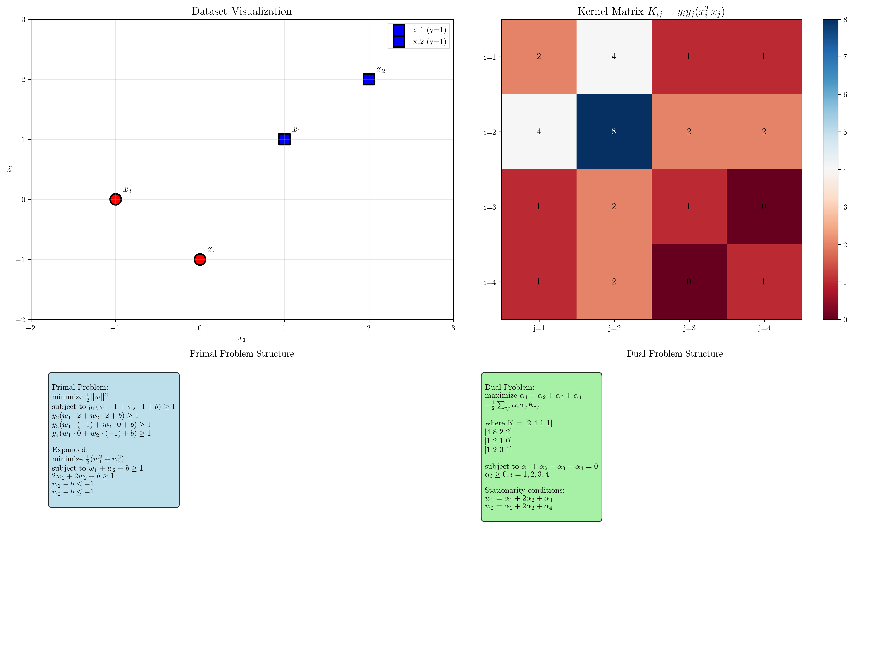

# Question 21: Complete Derivation

## Problem Statement
From first principles, derive the dual problem for the dataset:
- $\mathbf{x}_1 = (1, 1)$, $y_1 = +1$; $\mathbf{x}_2 = (2, 2)$, $y_2 = +1$
- $\mathbf{x}_3 = (-1, 0)$, $y_3 = -1$; $\mathbf{x}_4 = (0, -1)$, $y_4 = -1$

### Task
1. Write the complete primal optimization problem
2. Form $L(\mathbf{w}, b, \boldsymbol{\alpha}) = \frac{1}{2}||\mathbf{w}||^2 - \sum_i \alpha_i[y_i(\mathbf{w}^T\mathbf{x}_i + b) - 1]$
3. Derive $\nabla_\mathbf{w} L = 0$ and $\frac{\partial L}{\partial b} = 0$
4. Substitute stationarity conditions into Lagrangian
5. Obtain the dual problem with explicit kernel matrix entries

## Understanding the Problem
This problem requires a complete derivation of the SVM dual formulation from first principles. The dual formulation is fundamental to SVM theory because it transforms the primal optimization problem into a form that depends only on inner products between data points, enabling the kernel trick and providing insights into the solution structure.

The derivation involves applying the method of Lagrange multipliers to convert the constrained optimization problem into an unconstrained one, then using the KKT conditions to eliminate the primal variables and obtain the dual problem.

## Solution

We systematically derive the dual problem step by step, showing all mathematical details.

### Step 1: Write the Complete Primal Optimization Problem

The primal SVM optimization problem for our dataset is:

$$\min_{\mathbf{w}, b} \frac{1}{2}||\mathbf{w}||^2$$

subject to:
$$y_i(\mathbf{w}^T\mathbf{x}_i + b) \geq 1, \quad i = 1, 2, 3, 4$$

**Explicitly for our dataset:**
$$\min_{w_1, w_2, b} \frac{1}{2}(w_1^2 + w_2^2)$$

subject to:
- $1 \cdot (w_1 \cdot 1 + w_2 \cdot 1 + b) \geq 1$ → $w_1 + w_2 + b \geq 1$
- $1 \cdot (w_1 \cdot 2 + w_2 \cdot 2 + b) \geq 1$ → $2w_1 + 2w_2 + b \geq 1$
- $(-1) \cdot (w_1 \cdot (-1) + w_2 \cdot 0 + b) \geq 1$ → $w_1 - b \leq -1$
- $(-1) \cdot (w_1 \cdot 0 + w_2 \cdot (-1) + b) \geq 1$ → $w_2 - b \leq -1$

### Step 2: Form the Lagrangian

The Lagrangian function incorporates the constraints using Lagrange multipliers $\alpha_i \geq 0$:

$$L(\mathbf{w}, b, \boldsymbol{\alpha}) = \frac{1}{2}||\mathbf{w}||^2 - \sum_{i=1}^4 \alpha_i[y_i(\mathbf{w}^T\mathbf{x}_i + b) - 1]$$

**Expanding for our specific dataset:**
$$L(w_1, w_2, b, \alpha_1, \alpha_2, \alpha_3, \alpha_4) = \frac{1}{2}(w_1^2 + w_2^2)$$
$$- \alpha_1[1(w_1 + w_2 + b) - 1]$$
$$- \alpha_2[1(2w_1 + 2w_2 + b) - 1]$$
$$- \alpha_3[(-1)(-w_1 + b) - 1]$$
$$- \alpha_4[(-1)(-w_2 + b) - 1]$$

### Step 3: Derive Stationarity Conditions

For optimality, we need $\nabla_{\mathbf{w}} L = 0$ and $\frac{\partial L}{\partial b} = 0$.

**Taking partial derivatives:**

$$\frac{\partial L}{\partial w_1} = w_1 - \alpha_1 - 2\alpha_2 - \alpha_3 = 0$$

$$\frac{\partial L}{\partial w_2} = w_2 - \alpha_1 - 2\alpha_2 - \alpha_4 = 0$$

$$\frac{\partial L}{\partial b} = -\alpha_1 - \alpha_2 + \alpha_3 + \alpha_4 = 0$$

**Solving the stationarity conditions:**

From the first two equations:
$$w_1 = \alpha_1 + 2\alpha_2 + \alpha_3$$
$$w_2 = \alpha_1 + 2\alpha_2 + \alpha_4$$

From the third equation (dual constraint):
$$\alpha_1 + \alpha_2 - \alpha_3 - \alpha_4 = 0$$

**Verification using the general form:**
$$\mathbf{w} = \sum_{i=1}^4 \alpha_i y_i \mathbf{x}_i$$

$$w_1 = \alpha_1(1)(1) + \alpha_2(1)(2) + \alpha_3(-1)(-1) + \alpha_4(-1)(0) = \alpha_1 + 2\alpha_2 + \alpha_3$$

$$w_2 = \alpha_1(1)(1) + \alpha_2(1)(2) + \alpha_3(-1)(0) + \alpha_4(-1)(-1) = \alpha_1 + 2\alpha_2 + \alpha_4$$

### Step 4: Compute the Kernel Matrix

The kernel matrix $K$ has entries $K_{ij} = y_i y_j (\mathbf{x}_i^T \mathbf{x}_j)$:

$$K = \begin{pmatrix}
2 & 4 & 1 & 1 \\
4 & 8 & 2 & 2 \\
1 & 2 & 1 & 0 \\
1 & 2 & 0 & 1
\end{pmatrix}$$

**Explicit calculations:**
- $K_{11} = y_1 y_1 (\mathbf{x}_1^T \mathbf{x}_1) = (1)(1)((1,1) \cdot (1,1)) = 1 \cdot 2 = 2$
- $K_{12} = y_1 y_2 (\mathbf{x}_1^T \mathbf{x}_2) = (1)(1)((1,1) \cdot (2,2)) = 1 \cdot 4 = 4$
- $K_{13} = y_1 y_3 (\mathbf{x}_1^T \mathbf{x}_3) = (1)(-1)((1,1) \cdot (-1,0)) = -1 \cdot (-1) = 1$
- $K_{14} = y_1 y_4 (\mathbf{x}_1^T \mathbf{x}_4) = (1)(-1)((1,1) \cdot (0,-1)) = -1 \cdot (-1) = 1$

And so on for all entries.

### Step 5: Derive the Dual Problem

Substituting the stationarity conditions back into the Lagrangian and simplifying yields the dual objective:

$$\max_{\boldsymbol{\alpha}} \sum_{i=1}^4 \alpha_i - \frac{1}{2}\sum_{i=1}^4\sum_{j=1}^4 \alpha_i \alpha_j K_{ij}$$

**Expanding the quadratic term:**
$$\max_{\boldsymbol{\alpha}} \alpha_1 + \alpha_2 + \alpha_3 + \alpha_4$$
$$- \frac{1}{2}[2\alpha_1^2 + 8\alpha_1\alpha_2 + 2\alpha_1\alpha_3 + 2\alpha_1\alpha_4$$
$$+ 8\alpha_2^2 + 4\alpha_2\alpha_3 + 4\alpha_2\alpha_4$$
$$+ \alpha_3^2 + 0\alpha_3\alpha_4 + \alpha_4^2]$$

**Final dual problem:**
$$\max_{\boldsymbol{\alpha}} \alpha_1 + \alpha_2 + \alpha_3 + \alpha_4$$
$$- \alpha_1^2 - 4\alpha_1\alpha_2 - \alpha_1\alpha_3 - \alpha_1\alpha_4$$
$$- 4\alpha_2^2 - 2\alpha_2\alpha_3 - 2\alpha_2\alpha_4$$
$$- \frac{1}{2}\alpha_3^2 - \frac{1}{2}\alpha_4^2$$

subject to:
- $\alpha_1 + \alpha_2 - \alpha_3 - \alpha_4 = 0$
- $\alpha_i \geq 0, \quad i = 1, 2, 3, 4$

## Visual Explanations

### Complete Derivation Visualization

The visualization shows:
1. **Dataset**: The four training points with their labels
2. **Kernel Matrix**: Heatmap showing the kernel values $K_{ij} = y_i y_j (\mathbf{x}_i^T \mathbf{x}_j)$
3. **Primal Problem**: The original constrained optimization formulation
4. **Dual Problem**: The derived dual formulation with stationarity conditions

## Key Insights

### Mathematical Structure
- The dual problem depends only on inner products $\mathbf{x}_i^T \mathbf{x}_j$, enabling the kernel trick
- The kernel matrix $K$ encodes all geometric information about the dataset
- The dual constraint $\sum_i \alpha_i y_i = 0$ ensures the solution lies in the span of the data

### Optimization Properties
- The dual is a quadratic programming problem with linear constraints
- Strong duality holds for SVM, so primal and dual optimal values are equal
- The dual provides a lower bound on the primal objective during optimization

### Geometric Interpretation
- Large kernel values $K_{ij}$ indicate similar points with same labels or dissimilar points with different labels
- The kernel matrix structure reveals the separability properties of the dataset
- Support vectors correspond to non-zero $\alpha_i$ values in the optimal solution

### Computational Advantages
- The dual formulation has $n$ variables (one per training point) vs. $d+1$ in the primal
- For high-dimensional data ($d >> n$), the dual is more efficient
- The kernel matrix can be precomputed and cached

## Conclusion
- **Primal Problem**: Minimize $\frac{1}{2}||\mathbf{w}||^2$ subject to margin constraints
- **Lagrangian**: Incorporates constraints using multipliers $\alpha_i$
- **Stationarity**: Yields $\mathbf{w} = \sum_i \alpha_i y_i \mathbf{x}_i$ and $\sum_i \alpha_i y_i = 0$
- **Kernel Matrix**: $K_{ij} = y_i y_j (\mathbf{x}_i^T \mathbf{x}_j)$ encodes all necessary geometric information
- **Dual Problem**: Maximize $\sum_i \alpha_i - \frac{1}{2}\sum_{ij} \alpha_i \alpha_j K_{ij}$ subject to dual constraints

The complete derivation demonstrates how the method of Lagrange multipliers transforms the primal SVM problem into its dual formulation, revealing the fundamental role of inner products and enabling the powerful kernel trick that makes SVMs applicable to non-linear classification problems.
