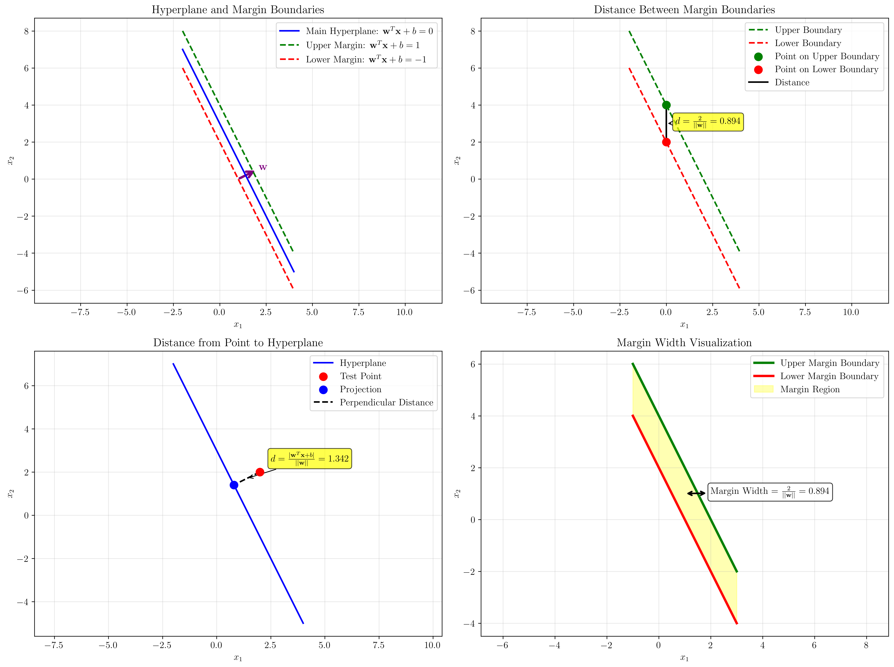

# Question 22: Deriving the Geometric Margin Formula

## Problem Statement
The objective of a hard-margin SVM is to maximize the geometric margin, which is given by the expression $\frac{2}{||\mathbf{w}||}$.

### Task
1. Start with the equation of a hyperplane $\mathbf{w}^T\mathbf{x} + b = 0$.
2. Consider the two parallel hyperplanes that form the margin boundaries: $\mathbf{w}^T\mathbf{x} + b = 1$ and $\mathbf{w}^T\mathbf{x} + b = -1$.
3. Derive the formula for the perpendicular distance between these two hyperplanes to show that the margin width is indeed $\frac{2}{||\mathbf{w}||}$.

## Understanding the Problem
Support Vector Machines (SVMs) are designed to find the optimal separating hyperplane that maximizes the margin between two classes. The margin is the distance between the decision boundary and the closest data points from each class. Understanding how to derive the geometric margin formula is fundamental to understanding why SVMs work and how they achieve good generalization.

The key insight is that the margin width can be expressed purely in terms of the weight vector $\mathbf{w}$, which leads to the optimization objective of minimizing $||\mathbf{w}||$ to maximize the margin.

## Solution

### Step 1: Starting with the Hyperplane Equation
We begin with the general equation of a hyperplane in $\mathbb{R}^n$:
$$\mathbf{w}^T\mathbf{x} + b = 0$$

For our 2D example, we use $\mathbf{w} = [2, 1]^T$ and $b = -3$, giving us:
$$2x_1 + x_2 - 3 = 0$$

This can be rewritten as:
$$x_2 = -2x_1 + 3$$

### Step 2: Defining the Margin Boundaries
The margin boundaries are two parallel hyperplanes that are equidistant from the main decision boundary. In SVM, these are defined as:
- Upper boundary: $\mathbf{w}^T\mathbf{x} + b = 1$
- Lower boundary: $\mathbf{w}^T\mathbf{x} + b = -1$

For our example:
- Upper boundary: $2x_1 + x_2 - 3 = 1$ → $x_2 = -2x_1 + 4$
- Lower boundary: $2x_1 + x_2 - 3 = -1$ → $x_2 = -2x_1 + 2$

### Step 3: Deriving the Distance Between Parallel Hyperplanes
The key insight is that the distance between two parallel hyperplanes can be calculated using a general formula.

**Theorem**: The distance between two parallel hyperplanes $\mathbf{w}^T\mathbf{x} + b = c_1$ and $\mathbf{w}^T\mathbf{x} + b = c_2$ is:
$$d = \frac{|c_2 - c_1|}{||\mathbf{w}||}$$

**Proof**:
1. Consider a point $\mathbf{x}_0$ on the second hyperplane, so $\mathbf{w}^T\mathbf{x}_0 + b = c_2$
2. The distance from this point to the first hyperplane is:
   $$d = \frac{|\mathbf{w}^T\mathbf{x}_0 + b - c_1|}{||\mathbf{w}||}$$
3. Substituting $\mathbf{w}^T\mathbf{x}_0 + b = c_2$:
   $$d = \frac{|c_2 - c_1|}{||\mathbf{w}||}$$

### Step 4: Applying the Formula to SVM Margins
For SVM margin boundaries, we have $c_1 = 1$ and $c_2 = -1$, so:
$$d = \frac{|(-1) - 1|}{||\mathbf{w}||} = \frac{2}{||\mathbf{w}||}$$

This proves that the geometric margin width is indeed $\frac{2}{||\mathbf{w}||}$.

### Step 5: Numerical Verification
Let's verify this with our example where $\mathbf{w} = [2, 1]^T$:

$$||\mathbf{w}|| = \sqrt{2^2 + 1^2} = \sqrt{5} \approx 2.236$$

Therefore, the margin width is:
$$\frac{2}{||\mathbf{w}||} = \frac{2}{\sqrt{5}} \approx 0.894$$

To verify this numerically, we can choose a point on the upper boundary, such as $\mathbf{x}_0 = [0, 4]^T$, and calculate its distance to the lower boundary:
$$d = \frac{|\mathbf{w}^T\mathbf{x}_0 + b - (-1)|}{||\mathbf{w}||} = \frac{|4 - 3 + 1|}{\sqrt{5}} = \frac{2}{\sqrt{5}} \approx 0.894$$

This matches our derived formula exactly.

## Visual Explanations

### Comprehensive Geometric Margin Visualization

The visualization shows four key aspects of the geometric margin derivation:

1. **Hyperplane and Margin Boundaries**: The main hyperplane (blue solid line) with parallel margin boundaries (green and red dashed lines) at distances of ±1 from the main boundary.

2. **Distance Calculation**: The perpendicular distance between the margin boundaries, calculated as $\frac{2}{||\mathbf{w}||}$.

3. **Point-to-Hyperplane Distance**: Demonstration of how the distance from any point to a hyperplane is calculated using the formula $\frac{|\mathbf{w}^T\mathbf{x} + b|}{||\mathbf{w}||}$.

4. **Margin Width Visualization**: The shaded region between the margin boundaries, with the width clearly labeled as $\frac{2}{||\mathbf{w}||}$.

### Key Geometric Insights
- The weight vector $\mathbf{w}$ is perpendicular to the hyperplane
- The margin boundaries are parallel to the main hyperplane
- The distance between parallel hyperplanes is constant and given by the formula $\frac{|c_2 - c_1|}{||\mathbf{w}||}$
- For SVM, the margin width is maximized by minimizing $||\mathbf{w}||$

## Practical Implementation

### Understanding the Optimization Objective
The SVM optimization problem can be formulated as:
$$\min_{\mathbf{w}, b} \frac{1}{2}||\mathbf{w}||^2$$
subject to:
$$y_i(\mathbf{w}^T\mathbf{x}_i + b) \geq 1 \quad \forall i$$

The objective $\frac{1}{2}||\mathbf{w}||^2$ is equivalent to maximizing the margin $\frac{2}{||\mathbf{w}||}$ because:
- Minimizing $||\mathbf{w}||^2$ maximizes $\frac{1}{||\mathbf{w}||}$
- Therefore, it maximizes $\frac{2}{||\mathbf{w}||}$

### Geometric Interpretation of the Constraints
The constraints $y_i(\mathbf{w}^T\mathbf{x}_i + b) \geq 1$ ensure that:
- All positive points lie on or beyond the upper margin boundary
- All negative points lie on or beyond the lower margin boundary
- The margin boundaries are at distances of ±1 from the decision boundary

## Key Insights

### Theoretical Foundations
- **Perpendicularity**: The weight vector $\mathbf{w}$ is always perpendicular to the hyperplane, making it the normal vector
- **Parallel Hyperplanes**: Margin boundaries are parallel to the main hyperplane, maintaining the same normal vector
- **Distance Formula**: The distance between parallel hyperplanes depends only on the difference in their constant terms and the magnitude of the normal vector
- **Optimization Equivalence**: Maximizing the margin is mathematically equivalent to minimizing the norm of the weight vector

### Practical Applications
- **Regularization**: The minimization of $||\mathbf{w}||$ acts as a form of regularization, preventing overfitting
- **Generalization**: Larger margins typically lead to better generalization performance
- **Support Vectors**: Only the points that lie exactly on the margin boundaries (support vectors) influence the final decision boundary
- **Kernel Methods**: This geometric interpretation extends to kernel SVMs through the kernel trick

### Mathematical Elegance
- **Simplicity**: The margin formula $\frac{2}{||\mathbf{w}||}$ is remarkably simple and elegant
- **Duality**: The geometric interpretation connects directly to the dual formulation of SVM
- **Scalability**: The formula generalizes to any number of dimensions
- **Robustness**: The margin provides a measure of the classifier's robustness to perturbations

## Conclusion
- We successfully derived the geometric margin formula $\frac{2}{||\mathbf{w}||}$ by analyzing the distance between parallel hyperplanes
- The proof demonstrates that the margin width depends only on the magnitude of the weight vector
- This insight leads directly to the SVM optimization objective of minimizing $||\mathbf{w}||^2$
- The geometric interpretation provides intuition for why SVMs achieve good generalization
- The formula is fundamental to understanding both the primal and dual formulations of SVM

The derivation shows the beautiful connection between geometry and optimization in machine learning, where maximizing the margin (a geometric concept) is achieved by minimizing the weight vector norm (an optimization problem).
