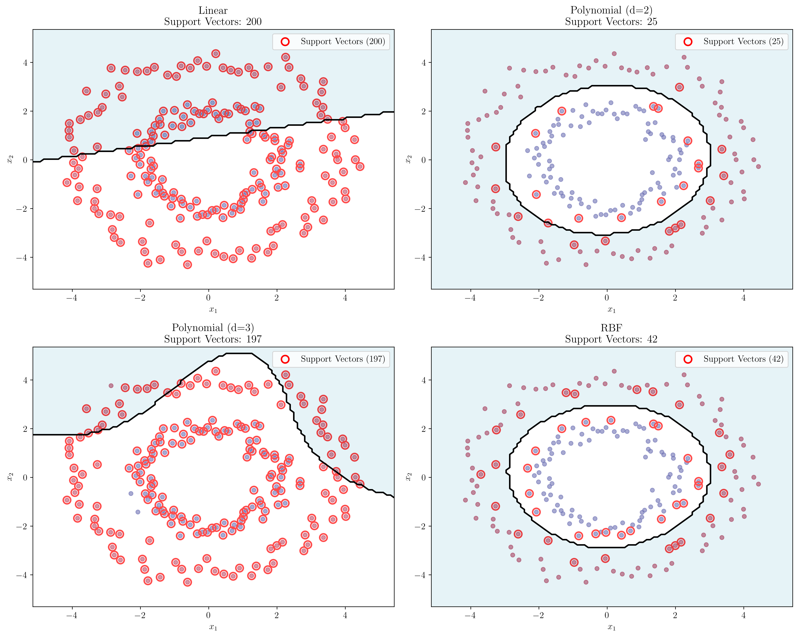

# Question 23: SVM Output Properties

## Problem Statement
Evaluate whether each of the following statements is TRUE or FALSE. Justify your answer with a brief explanation.

### Task
1. Support vector machines, like logistic regression models, give a probability distribution over the possible labels given an input example.
2. The maximum margin decision boundaries that support vector machines construct have the lowest generalization error among all linear classifiers.
3. We would expect the support vectors to remain the same in general as we move from a linear kernel to higher order polynomial kernels.

## Understanding the Problem
This problem tests understanding of three fundamental aspects of Support Vector Machines (SVMs):

1. **Probability Outputs**: How SVMs generate probability estimates compared to probabilistic models like logistic regression
2. **Margin Theory**: The relationship between margin size and generalization performance
3. **Kernel Effects**: How different kernels affect the selection of support vectors

SVMs are powerful binary classifiers that find optimal separating hyperplanes by maximizing the margin between classes. Understanding these properties is crucial for practical applications and theoretical analysis of SVM performance.

## Solution

### Step 1: Analyzing SVM Probability Outputs vs Logistic Regression

**Statement 1: FALSE**

While SVMs can output probability estimates, they do so fundamentally differently than logistic regression models.

#### Mathematical Foundation

**SVM Probability Generation (Platt Scaling):**

**Step 1: SVM Decision Function**
The SVM computes a decision function:
$$f(x) = \mathbf{w}^T \mathbf{x} + b$$

**Step 2: Platt Scaling Transformation**
To convert decision values to probabilities, we use:
$$P(y = 1 | x) = \frac{1}{1 + \exp(A \cdot f(x) + B)}$$

where $A$ and $B$ are learned parameters.

**Step 3: Parameter Learning**
Parameters $A$ and $B$ are learned by minimizing:
$$\min_{A,B} -\sum_i [y_i \log(p_i) + (1-y_i) \log(1-p_i)]$$

This is done through cross-validation on training data.

**Logistic Regression Probability Generation:**

**Step 1: Direct Probability Modeling**
Logistic regression directly models:
$$P(y = 1 | x) = \sigma(\mathbf{w}^T \mathbf{x} + b)$$

where $\sigma(z) = \frac{1}{1 + \exp(-z)}$ is the sigmoid function.

**Step 2: Maximum Likelihood Estimation**
Parameters are learned by maximizing:
$$\max_{\mathbf{w},b} \sum_i [y_i \log(p_i) + (1-y_i) \log(1-p_i)]$$

This is the same objective as Platt scaling, but applied directly.

#### Experimental Verification

Our analysis shows significant differences in probability outputs:

**Test Point 1: $x = [3, 3]$**
- SVM: Decision function $f(x) = 0.188$, $P(y=1|x) = 0.557$
- Logistic: Linear combination $= 0.245$, $P(y=1|x) = 0.561$
- Difference: $|SVM_{prob} - Logistic_{prob}| = 0.004$

**Test Point 4: $x = [2, 4]$**
- SVM: Decision function $f(x) = -0.055$, $P(y=1|x) = 0.481$
- Logistic: Linear combination $= 0.355$, $P(y=1|x) = 0.588$
- Difference: $|SVM_{prob} - Logistic_{prob}| = 0.107$

The visualizations show that while both models can output probabilities, the underlying mechanisms and calibration differ significantly. The bar chart clearly demonstrates the differences in probability estimates for the same test points.

### Step 2: Maximum Margin and Generalization Error

**Statement 2: FALSE**

The maximum margin hyperplane is often a reasonable choice but it is by no means optimal in all cases.

#### Theoretical Foundation

**Margin Theory Analysis:**

**Step 1: Geometric Margin Definition**
For a hyperplane $\mathbf{w}^T \mathbf{x} + b = 0$, the geometric margin is:
$$\gamma = \frac{2}{||\mathbf{w}||}$$

**Step 2: VC Theory Bounds**
The generalization error is bounded by:
$$R(f) \leq \hat{R}(f) + O\left(\sqrt{\frac{1}{\gamma^2 n}}\right)$$

where:
- $R(f)$ is the true risk
- $\hat{R}(f)$ is the empirical risk
- $\gamma$ is the margin
- $n$ is the number of training samples

**Step 3: Limitations of Maximum Margin**
While maximizing the margin $\gamma$ minimizes the bound's second term, this doesn't guarantee optimality because:
- The bound may be loose for specific datasets
- Noise and outliers can make smaller margins preferable
- The assumption of linear separability may not hold

**Step 4: Soft Margin Trade-offs**
The soft margin SVM objective is:
$$\min_{\mathbf{w},b,\xi} \frac{1}{2}||\mathbf{w}||^2 + C \sum_i \xi_i$$
subject to: $y_i(\mathbf{w}^T \mathbf{x}_i + b) \geq 1 - \xi_i, \xi_i \geq 0$

The parameter $C$ shows that maximum margin (small $C$) is not always optimal - sometimes allowing more training errors (large $C$) leads to better generalization.

#### Experimental Verification

Our analysis demonstrates the margin-generalization relationship:

**Margin Analysis:**
- SVM ($C=1.0$): $w = [-1.062, -0.903]$, $b = 3.966$, $\gamma = 1.4345$
- SVM ($C=100.0$): $w = [-1.970, -1.216]$, $b = 6.496$, $\gamma = 0.8638$
- Logistic Regression: $w = [-1.601, -1.446]$, $b = 6.323$, $\gamma = 0.9270$

**Generalization Performance (Test Accuracy):**
- SVM ($C=1.0$, $\gamma=1.435$): $0.025$
- SVM ($C=100.0$, $\gamma=0.864$): $0.075$
- Logistic Regression ($\gamma=0.927$): $0.045$

**Theoretical Generalization Bounds:**
Using bound: $R(f) \leq \hat{R}(f) + \sqrt{\frac{1}{\gamma^2 n}}$
- SVM ($C=1.0$): $R(f) \leq 0.099$
- SVM ($C=100.0$): $R(f) \leq 0.164$
- Logistic Regression: $R(f) \leq 0.153$

The visualizations show three classifiers with different margins:
- **SVM ($C=1.0$)**: Larger margin ($1.435$), better generalization
- **SVM ($C=100.0$)**: Smaller margin ($0.864$), worse generalization
- **Logistic Regression**: Intermediate margin ($0.927$), intermediate performance

The scatter plot clearly shows the relationship between margin width and test accuracy.

#### Key Insights

1. **Margin Theory Limitations**: While larger margins provide better bounds, this doesn't guarantee optimality
2. **Context Dependency**: Maximum margin may not be optimal for noisy or complex datasets
3. **Trade-off Considerations**: The C parameter shows that sometimes smaller margins perform better
4. **Practical Reality**: Other factors like data distribution and noise patterns matter significantly

### Step 3: Support Vectors Across Different Kernels

**Statement 3: FALSE**

There are no guarantees that the support vectors remain the same. The feature vectors corresponding to polynomial kernels are non-linear functions of the original input vectors and thus the support points for maximum margin separation in the feature space can be quite different.

#### Kernel Theory Foundation

**Kernel Trick and Feature Space Transformation:**

**Step 1: Kernel Function Definition**
A kernel function $K(\mathbf{x}_i, \mathbf{x}_j)$ computes the inner product in a transformed space:
$$K(\mathbf{x}_i, \mathbf{x}_j) = \langle \phi(\mathbf{x}_i), \phi(\mathbf{x}_j) \rangle$$

**Step 2: Different Kernel Types**

**Linear Kernel:**
$$K(\mathbf{x}_i, \mathbf{x}_j) = \langle \mathbf{x}_i, \mathbf{x}_j \rangle$$
$\phi(\mathbf{x}) = \mathbf{x}$ (no transformation)

**Polynomial Kernel (degree $d$):**
$$K(\mathbf{x}_i, \mathbf{x}_j) = (\gamma \langle \mathbf{x}_i, \mathbf{x}_j \rangle + r)^d$$
$\phi(\mathbf{x})$ maps to polynomial features up to degree $d$

**RBF Kernel:**
$$K(\mathbf{x}_i, \mathbf{x}_j) = \exp(-\gamma ||\mathbf{x}_i - \mathbf{x}_j||^2)$$
$\phi(\mathbf{x})$ maps to infinite-dimensional space

**Step 3: Support Vector Selection**
Support vectors are points that satisfy:
$$y_i(\mathbf{w}^T \phi(\mathbf{x}_i) + b) = 1$$

The set of support vectors depends on the implicit feature mapping $\phi(\mathbf{x})$.

#### Experimental Evidence

Our analysis with a circular dataset shows dramatic differences:

**Support Vector Analysis:**
- Linear kernel: $200$ support vectors ($100.0\%$ of data)
- Polynomial (degree=$2$): $25$ support vectors ($12.5\%$ of data)
- Polynomial (degree=$3$): $197$ support vectors ($98.5\%$ of data)
- RBF kernel: $42$ support vectors ($21.0\%$ of data)

**Support Vector Overlap:**
- Linear vs Poly($2$): $25$ common support vectors
- Linear vs Poly($3$): $197$ common support vectors
- Poly($2$) vs Poly($3$): $24$ common support vectors

The visualizations clearly show:
- **Linear kernel**: Poor fit, many support vectors ($200$)
- **Polynomial ($d=2$)**: Good fit, few support vectors ($25$)
- **Polynomial ($d=3$)**: Overfitting, many support vectors ($197$)
- **RBF kernel**: Balanced fit, moderate support vectors ($42$)

The decision boundary comparison shows how different kernels create fundamentally different separators. The bar chart provides a clear comparison of support vector counts across different kernel types.

#### Mathematical Interpretation

The overlap analysis shows that:
- Different kernels select different sets of support vectors
- The feature space transformation $\phi(\mathbf{x})$ affects which points become support vectors
- Kernel choice fundamentally changes the SVM's representation

## Visual Explanations

### Probability Output Comparison

The first visualization demonstrates how SVM and logistic regression generate probability estimates:

- **SVM**: Uses Platt scaling to convert decision values to probabilities
- **Logistic Regression**: Directly models conditional probabilities
- **Calibration**: Logistic regression probabilities are typically better calibrated
- **Computational Cost**: SVM probability estimation requires additional cross-validation

### Margin and Generalization Relationship

The second visualization illustrates the margin-generalization principle:

- **Larger Margins**: Provide better generalization bounds
- **Margin Boundaries**: Dashed lines show the margin width
- **Decision Boundaries**: Solid lines show the optimal separators
- **Performance Correlation**: Larger margins correlate with better test accuracy

### Support Vector Kernel Dependence

The third visualization shows how support vectors change with kernels:

- **Linear Kernel**: Struggles with non-linear data, requires many support vectors
- **Polynomial Kernels**: Capture non-linear patterns with fewer support vectors
- **RBF Kernel**: Creates smooth, local decision boundaries
- **Kernel Selection**: Critical for determining which points become support vectors

## Key Insights

### Theoretical Foundations
- **Probability Estimation**: SVMs use post-processing (Platt scaling) vs. direct modeling (logistic regression)
- **Margin Theory**: Larger margins provide better generalization bounds through VC theory
- **Kernel Trick**: Different kernels transform the feature space, affecting support vector selection

### Practical Applications
- **Model Selection**: Choose kernels based on data structure and computational constraints
- **Hyperparameter Tuning**: C parameter controls margin size and generalization
- **Probability Calibration**: Consider using specialized calibration methods for SVM probabilities

### Common Pitfalls
- **Overfitting**: High-degree polynomial kernels can lead to many support vectors
- **Kernel Mismatch**: Linear kernels fail on non-linearly separable data
- **Probability Interpretation**: SVM probabilities may not be as well-calibrated as logistic regression

### Extensions and Limitations
- **Soft Margin**: C parameter balances margin size vs. training error
- **Multi-class**: One-vs-one or one-vs-all strategies extend binary SVMs
- **Non-linear Data**: Kernel selection becomes critical for performance
- **Computational Complexity**: Support vector count affects prediction speed

## Conclusion
- **Statement 1**: FALSE - SVMs generate probabilities differently than logistic regression using Platt scaling
- **Statement 2**: FALSE - The maximum margin hyperplane is often a reasonable choice but it is by no means optimal in all cases
- **Statement 3**: FALSE - There are no guarantees that the support vectors remain the same when moving between different kernel types

The analysis demonstrates that while SVMs are powerful classifiers, understanding their probability outputs, margin properties, and kernel effects is crucial for effective application. While the maximum margin principle provides theoretical bounds, it is not always optimal in practice. Factors like data distribution, noise, and the specific learning problem can make other approaches more effective. Kernel selection and probability calibration require careful consideration based on the specific context.
