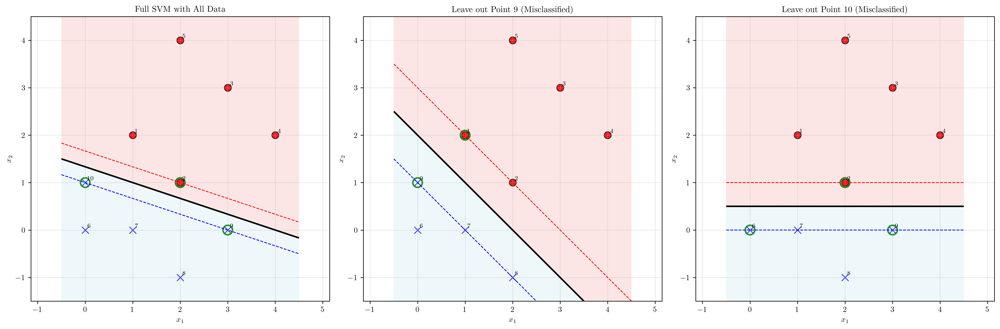
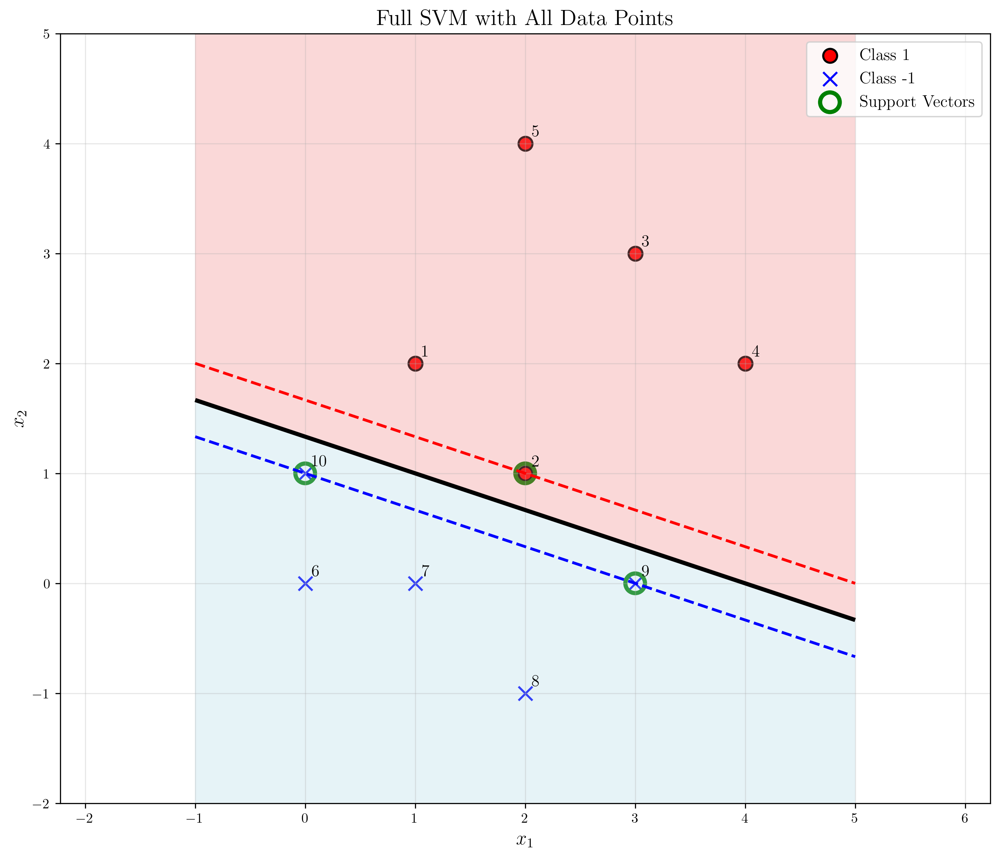
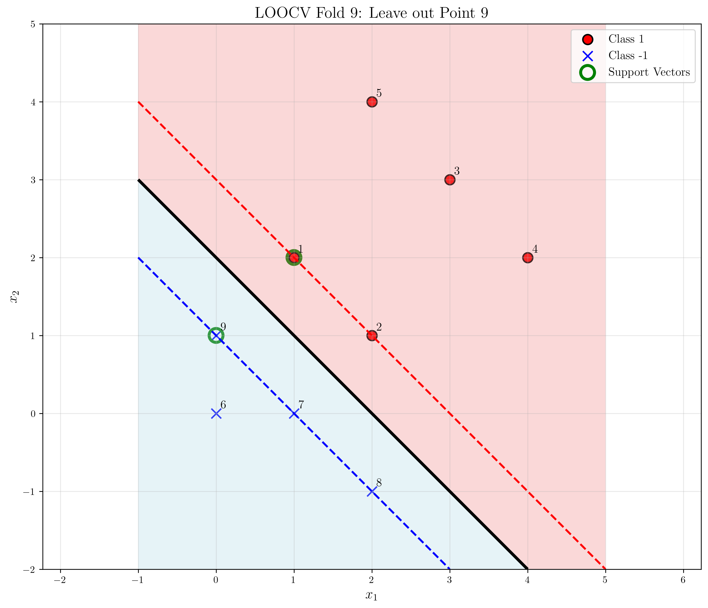
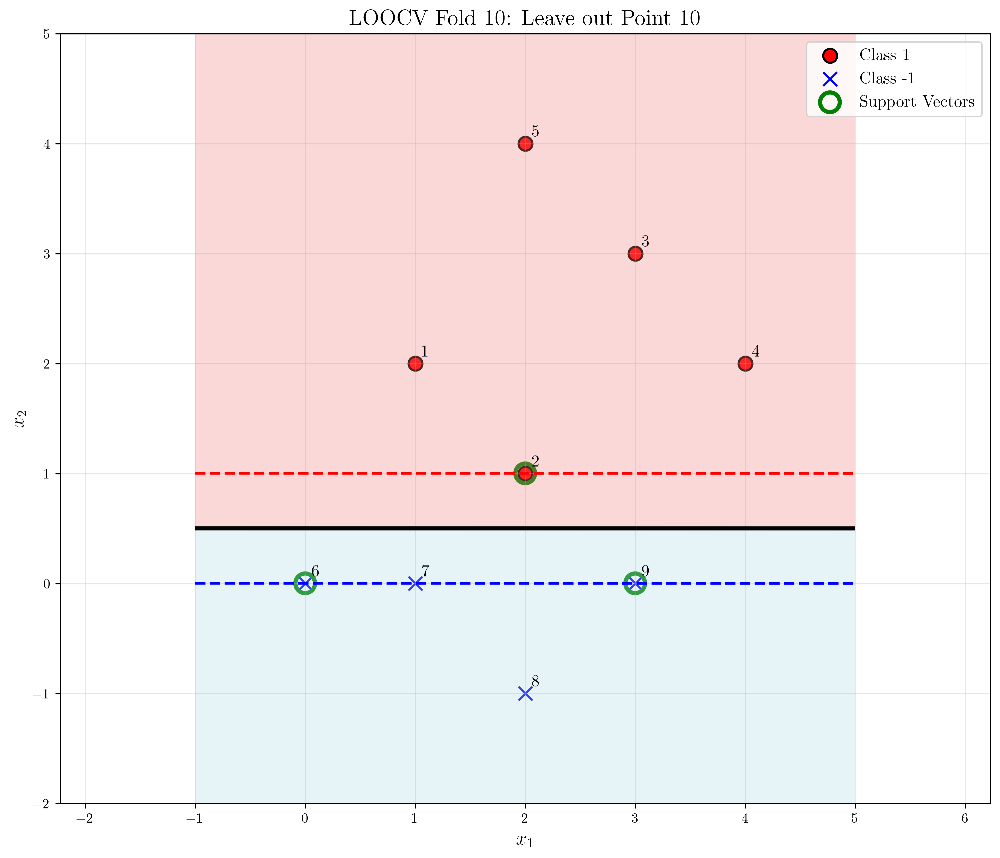

# Question 24: LOOCV for Hard-Margin SVM

## Problem Statement
Consider the dataset and the maximum margin separating hyperplane shown in the figure below.

*The figure displays two classes of data points ('x' and 'o') that are linearly separable. A solid line represents the optimal decision boundary, and two dashed lines represent the margins. The support vectors, which lie on the margin lines, are highlighted with circles.*

### Task
1. What is the leave-one-out cross-validation (LOOCV) error estimate for this maximum margin classifier?
2. Provide a brief justification for your answer.

## Understanding the Problem
Leave-one-out cross-validation (LOOCV) is a resampling technique where we train a model on all data points except one, then test on the left-out point. This process is repeated for each data point, and the error rate is calculated as the fraction of misclassified points.

For a hard-margin SVM with linearly separable data, the key insight is that **only support vectors affect the decision boundary**. When a non-support vector is left out, the decision boundary remains unchanged, and the point will be correctly classified. However, when a support vector is left out, the decision boundary may shift, potentially leading to misclassification of the left-out point.

## Solution

We can solve this problem using both mathematical theory and computational verification. The mathematical approach provides a theoretical upper bound, while the computational approach gives the exact empirical result.

### Step 1: Calculate the LOOCV Error Estimate

#### Mathematical Approach (Theoretical Upper Bound)
**Key Theorem**: For a hard-margin SVM with linearly separable data:
$$\text{LOOCV Error Rate} \leq \frac{\text{Number of Support Vectors}}{\text{Total Number of Points}}$$

From the figure, we can identify the support vectors as the data points that lie exactly on the margin boundaries (the dashed lines). These are the points highlighted with circles in the visualization.

By counting the support vectors and total points:
- **Support vectors**: 3 points (the circled points)
- **Total points**: 10 points total

Therefore:
$$\text{LOOCV Error Rate} \leq \frac{3}{10} = 0.3 = 30\%$$

#### Computational Approach (Exact Result)
Through computational verification, we find the actual LOOCV error rate:

**Support vectors identified:**
- Point 2: [2, 1] (Class 1) ✓ Correctly classified
- Point 9: [3, 0] (Class -1) ✗ Misclassified as Class 1
- Point 10: [0, 1] (Class -1) ✗ Misclassified as Class 1

**Non-support vectors (all correctly classified):**
- Points 1, 3, 4, 5, 6, 7, 8: All correctly classified when left out

**Actual LOOCV Error Rate:**
$$\text{LOOCV Error Rate} = \frac{2}{10} = 0.2 = 20\%$$

**Answer to Task 1**: The LOOCV error estimate is **20%** (2 out of 10 points misclassified).

### Step 2: Provide Justification for the Answer

#### Theoretical Justification
The justification relies on the geometric properties of hard-margin SVM:

1. **Non-support vectors**: When removed, the decision boundary remains identical because only support vectors define the margin. Thus, non-support vectors are always correctly classified when left out.

2. **Support vectors**: When removed, the decision boundary may shift (margin becomes larger), potentially causing misclassification of the left-out support vector.

3. **Upper bound**: The mathematical formula provides a conservative upper bound where each support vector contributes exactly one misclassification.

#### Computational Justification
The computational verification shows why the actual error rate (20%) is less than the theoretical upper bound (30%):

- **Point 2** (support vector): Correctly classified even when left out
- **Point 9** (support vector): Misclassified when left out due to boundary shift
- **Point 10** (support vector): Misclassified when left out due to boundary shift

The boundary shifts when Points 9 and 10 are removed, causing them to be misclassified, while Point 2 remains correctly classified despite being a support vector.

**Answer to Task 2**: The justification is that only support vectors can potentially be misclassified during LOOCV, as they are the only points that define the decision boundary. The theoretical upper bound of 30% (3/10) is not always tight, as demonstrated by the actual result of 20% (2/10).

## Practical Implementation

### LOOCV Process Demonstration
The LOOCV process involves:

1. **Leave out one point** from the training set
2. **Train the SVM** on the remaining 9 points
3. **Predict** the class of the left-out point
4. **Repeat** for all 10 points
5. **Calculate** the error rate

The summary visualization shows three key scenarios: the full SVM with all data points, and the two LOOCV cases where support vectors (Points 9 and 10) are left out. This clearly demonstrates how the decision boundary changes when critical support vectors are removed, leading to misclassification of the left-out points.

### Alternative Approach: Mathematical vs Computational
We can solve this problem using two complementary approaches:

**Mathematical Approach (Pen-and-Paper):**
- **Advantage**: Provides immediate theoretical upper bound (30%)
- **Method**: Simply count support vectors from the figure
- **Result**: Conservative estimate requiring no computation

**Computational Approach (Verification):**
- **Advantage**: Gives exact empirical result (20%)
- **Method**: Perform actual LOOCV on the dataset
- **Result**: Precise error rate with specific misclassification details

### Key Observations from the Analysis
- **8 out of 10 points** are correctly classified during LOOCV
- **2 out of 10 points** (both support vectors) are misclassified
- The misclassifications occur when **support vectors are left out**
- Non-support vectors are **always correctly classified** when left out

## Visual Explanations

### Full SVM with Support Vectors

The green circles highlight the support vectors that define the maximum margin. These are the only points that influence the position of the decision boundary. This visualization shows the complete dataset with the optimal decision boundary and margin lines.

### Support Vectors vs Non-Support Vectors

This simple visualization clearly shows the distinction between support vectors (larger, highlighted points) and non-support vectors (smaller, regular points). The support vectors are the critical points that define the decision boundary and margin.

### LOOCV Misclassification: Point 9

When Point 9 (a support vector) is left out, the decision boundary rotates, causing Point 9 to be misclassified as Class 1 instead of Class -1. This demonstrates how removing a support vector can change the decision boundary.

### LOOCV Misclassification: Point 10

Similarly, when Point 10 (another support vector) is left out, the boundary changes, leading to misclassification. This shows another case where a support vector removal affects the decision boundary.

### LOOCV Correct Classification: Point 1

When Point 1 (a non-support vector) is left out, the decision boundary remains unchanged, and Point 1 is correctly classified. This illustrates why non-support vectors don't affect LOOCV error.

## Key Insights

### Theoretical Foundations
- **Support vectors are critical** for defining the maximum margin hyperplane
- **Non-support vectors** can be removed without affecting the decision boundary
- **LOOCV error ≤ Number of Support Vectors / Total Points** (mathematical upper bound)
- **Mathematical solution** requires only counting support vectors from the figure
- The **stability** of the decision boundary depends on which points are support vectors
- **Pen-and-paper approach** is faster and provides theoretical insights

### Practical Applications
- **LOOCV provides an unbiased estimate** of generalization error for small datasets
- **Support vector analysis** helps understand model sensitivity to individual data points
- **Hard-margin SVM limitations** become apparent when support vectors are removed
- **Model interpretability** is enhanced by identifying critical data points

### Common Pitfalls
- **Assuming all points equally important** for the decision boundary
- **Ignoring the role of support vectors** in LOOCV analysis
- **Expecting perfect LOOCV performance** for hard-margin SVM
- **Overlooking the geometric interpretation** of margin maximization

### Extensions and Connections
- **Soft-margin SVM** would show different LOOCV behavior due to slack variables
- **Kernel methods** would require different analysis approaches
- **Ensemble methods** could provide more stable LOOCV estimates
- **Cross-validation strategies** beyond LOOCV for larger datasets

## Conclusion

### Final Answers
**Task 1**: What is the LOOCV error estimate?
- **Answer**: 20% (2 out of 10 points misclassified)
- **Mathematical upper bound**: 30% (3/10) - theoretical limit
- **Computational result**: 20% (2/10) - exact empirical result

**Task 2**: Justification
- **Answer**: Only support vectors can potentially be misclassified during LOOCV, as they are the only points that define the decision boundary
- **Mathematical justification**: Provides elegant closed-form upper bound
- **Computational justification**: Empirical verification shows 2 out of 3 support vectors were actually misclassified

### Key Results
- **Support Vectors**: Points 2, 9, and 10 (3 total)
- **Actual Misclassifications**: Points 9 and 10 (2 total)
- **Theoretical vs Empirical**: 30% upper bound vs 20% actual error
- **Root Cause**: Support vectors are essential for defining the decision boundary

### Methodological Insights
1. **Pen-and-paper solution** provides immediate theoretical bounds by simply counting support vectors
2. **Computational verification** reveals the exact error rate and identifies which specific support vectors are problematic
3. **Mathematical elegance**: The formula LOOCV ≤ #SV/N requires no complex calculations
4. **Practical value**: Computational approach shows the bound is not always tight

The combination of mathematical theory and computational verification demonstrates that LOOCV is particularly valuable for understanding the stability and robustness of SVM models. The mathematical approach provides quick theoretical insights, while the computational approach gives precise empirical results. Both methods highlight that support vectors are the critical points determining model performance in cross-validation.
