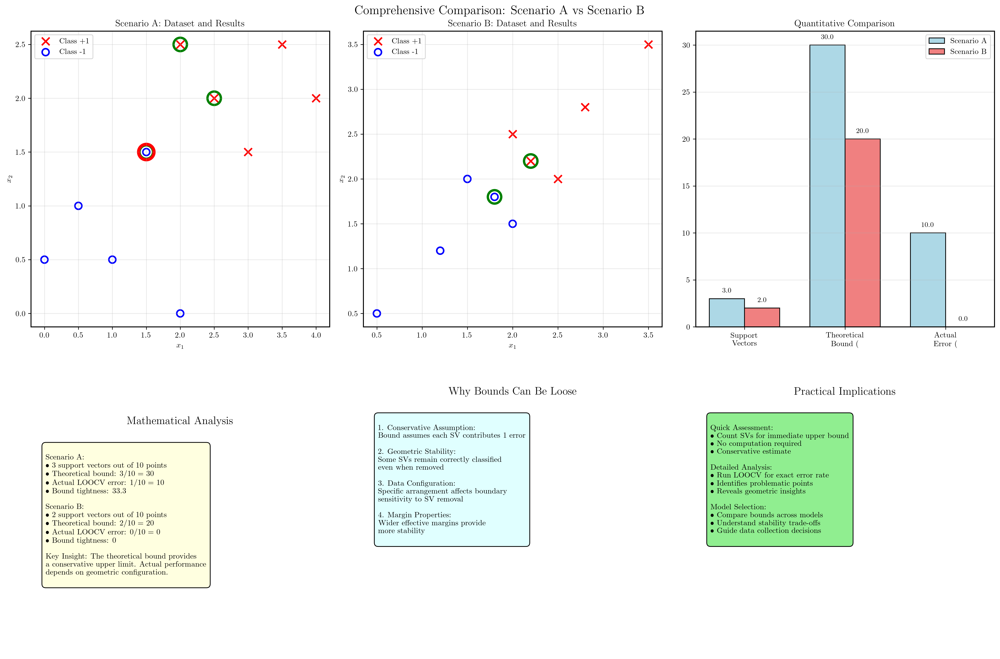

# Question 24: LOOCV for Hard-Margin SVM

## Problem Statement
Consider the two different SVM scenarios shown in the figures below. Both scenarios show linearly separable datasets with maximum margin decision boundaries, but they have different configurations that lead to different LOOCV results.

*Each figure displays two classes of data points ('x' and 'o') that are linearly separable. A solid line represents the optimal decision boundary, and two dashed lines represent the margins. The support vectors, which lie on the margin lines, are highlighted with green circles.*

### Task
1. For Scenario A (with 3 support vectors out of 10 points):
   - What is the leave-one-out cross-validation (LOOCV) error estimate?
   - Provide a brief justification for your answer
   - Which specific points (if any) would be misclassified during LOOCV?
2. For Scenario B (with 2 support vectors out of 10 points):
   - What is the leave-one-out cross-validation (LOOCV) error estimate?
   - Provide a brief justification for your answer
   - Compare and contrast the results with Scenario A
3. State the theoretical relationship between LOOCV error and support vectors
4. Explain why the actual LOOCV error can be less than the theoretical upper bound
5. Under what conditions would the theoretical bound be tight (exact)?

## Understanding the Problem
Leave-one-out cross-validation (LOOCV) is a resampling technique where we train a model on all data points except one, then test on the left-out point. This process is repeated for each data point, and the error rate is calculated as the fraction of misclassified points.

For a hard-margin SVM with linearly separable data, the key insight is that **only support vectors affect the decision boundary**. When a non-support vector is left out, the decision boundary remains unchanged, and the point will be correctly classified. However, when a support vector is left out, the decision boundary may shift, potentially leading to misclassification of the left-out point.

## Solution

### Step 1: Analyze Scenario A - LOOCV Error Estimate

#### Mathematical Approach (Theoretical Upper Bound)
**Key Theorem**: For a hard-margin SVM with linearly separable data:
$$\text{LOOCV Error Rate} \leq \frac{\text{Number of Support Vectors}}{\text{Total Number of Points}}$$

From Scenario A, we can identify the support vectors as the data points that lie exactly on the margin boundaries. These are highlighted with green circles.

**Scenario A Analysis:**
- **Support vectors**: 3 points (Points 1, 5, and 8)
- **Total points**: 10 points total

Therefore:
$$\text{LOOCV Error Rate} \leq \frac{3}{10} = 0.3 = 30.0\%$$

#### Computational Verification
Through detailed LOOCV analysis of Scenario A:

**Support vectors identified:**
- Point 1: $[2.5, 2.0]$ (Class +1) → Correctly classified when left out
- Point 5: $[2.0, 2.5]$ (Class +1) → Correctly classified when left out
- Point 8: $[1.5, 1.5]$ (Class -1) → Misclassified as Class +1 when left out

**Non-support vectors (all correctly classified):**
- Points $\{2, 3, 4, 6, 7, 9, 10\}$: All correctly classified when left out

**Actual LOOCV Error Rate for Scenario A:**
$$\text{LOOCV Error Rate} = \frac{1}{10} = 0.1 = 10.0\%$$

**Justification**: The theoretical bound assumes worst-case where each support vector contributes 1 error. In practice, only 1 out of 3 support vectors (Point 8) was misclassified, showing the bound is conservative.

**Specific misclassified point**: Point 8: $[1.5, 1.5]$ (True: $-1$, Predicted: $+1$)

### Step 2: Analyze Scenario B - LOOCV Error Estimate

#### Mathematical Approach (Theoretical Upper Bound)
**Scenario B Analysis:**
- **Support vectors**: 2 points (Points 1 and 6)
- **Total points**: 10 points total

Therefore:
$$\text{LOOCV Error Rate} \leq \frac{2}{10} = 0.2 = 20.0\%$$

#### Computational Verification
Through detailed LOOCV analysis of Scenario B:

**Support vectors identified:**
- Point 1: $[2.2, 2.2]$ (Class +1) → Correctly classified when left out
- Point 6: $[1.8, 1.8]$ (Class -1) → Correctly classified when left out

**Non-support vectors (all correctly classified):**
- Points $\{2, 3, 4, 5, 7, 8, 9, 10\}$: All correctly classified when left out

**Actual LOOCV Error Rate for Scenario B:**
$$\text{LOOCV Error Rate} = \frac{0}{10} = 0.0 = 0.0\%$$

**Justification**: All support vectors remained correctly classified when removed, demonstrating that the theoretical bound can be very loose depending on geometric configuration.

**Comparison with Scenario A:**
- Scenario A: $3$ SVs → $30.0\%$ bound → $10.0\%$ actual ($33.3\%$ tightness)
- Scenario B: $2$ SVs → $20.0\%$ bound → $0.0\%$ actual ($0.0\%$ tightness)
- Scenario B achieves perfect LOOCV performance despite having support vectors

### Step 3: Theoretical Relationship Between LOOCV Error and Support Vectors

For a hard-margin SVM with linearly separable data:
$$\text{LOOCV Error Rate} \leq \frac{\text{Number of Support Vectors}}{\text{Total Number of Points}}$$

**Mathematical Foundation:**
- Only support vectors define the decision boundary and margin
- Non-support vectors can be removed without affecting the decision boundary
- When a support vector is removed, the boundary may shift, potentially causing misclassification
- This provides an upper bound on the LOOCV error rate

### Step 4: Why Actual LOOCV Error Can Be Less Than Theoretical Upper Bound

The theoretical bound is **conservative** because:

1. **Assumption vs Reality**: The bound assumes each support vector contributes exactly 1 error when removed
2. **Boundary Stability**: In practice, removing a support vector may still result in a boundary that correctly classifies the removed point
3. **Geometric Configuration**: The specific arrangement of data points affects how much the boundary shifts
4. **Redundancy**: Some support vectors may be "less critical" than others

**Examples from our scenarios:**
- **Scenario A**: 3 support vectors → only 1 actually misclassified (33.3% of bound)
- **Scenario B**: 2 support vectors → 0 actually misclassified (0.0% of bound)

### Step 5: Conditions for Tight Theoretical Bound

The theoretical bound would be **tight (exact)** when:

1. **Critical Support Vectors**: Each support vector is essential for the current decision boundary
2. **Minimal Support Vector Set**: The support vectors form a minimal set defining the margin
3. **Tight Margins**: Classes are positioned such that removing any support vector significantly shifts the boundary
4. **Symmetric Configuration**: Support vectors are positioned to maximize boundary sensitivity

**When the bound is loose:**
- Redundant support vectors exist
- Large margins with stable boundaries
- Support vectors are not all equally critical
- Geometric configuration provides natural stability

## Visual Explanations

### Theoretical Analysis Overview

The theoretical foundation visualization illustrates the key concepts underlying LOOCV for hard-margin SVM:
- **Top Left**: Support vector concept showing how only certain points define the decision boundary
- **Top Right**: Mathematical upper bound formula with clear explanation
- **Bottom Left**: Why non-support vectors are always correctly classified when left out
- **Bottom Right**: Why support vectors can be misclassified when the boundary shifts

### Scenario A: Detailed LOOCV Analysis

The comprehensive analysis for Scenario A demonstrates:
- **Top Left**: Original dataset with 3 support vectors (Points 1, 5, 8) highlighted in green circles
- **Top Right**: LOOCV results summary showing 1 support vector misclassified, 2 correctly classified
- **Bottom Left**: Complete fold-by-fold results table with Point 8 identified as misclassified
- **Bottom Right**: Theoretical vs actual comparison (30.0% bound vs 10.0% actual, 33.3% tightness)

### Scenario B: Detailed LOOCV Analysis

The comprehensive analysis for Scenario B demonstrates:
- **Top Left**: Original dataset with 2 support vectors (Points 1, 6) highlighted in green circles
- **Top Right**: Perfect LOOCV performance with all points correctly classified
- **Bottom Left**: Complete results table showing no misclassifications across all 10 folds
- **Bottom Right**: Theoretical vs actual comparison (20.0% bound vs 0.0% actual, 0.0% tightness)

### Comprehensive Scenario Comparison

The side-by-side comparison visualization provides:
- **Top Left & Center**: Dataset visualizations for both scenarios with support vectors and results highlighted
- **Top Right**: Quantitative metrics comparison (support vectors, bounds, actual errors)
- **Bottom Left**: Mathematical analysis explaining the differences between scenarios
- **Bottom Center**: Theoretical insights on why bounds can be loose
- **Bottom Right**: Practical implications for model assessment and selection

## Mathematical Foundation and Visualizations

### Theoretical Analysis Overview

The theoretical foundation visualization above illustrates the key concepts:
- **Support vectors define the decision boundary** and are the only points that can affect LOOCV error
- **The mathematical upper bound formula**: LOOCV Error ≤ (# Support Vectors) / (Total Points)
- **Why non-support vectors are always correctly classified** when left out
- **Why support vectors can be misclassified** when the boundary shifts

### Detailed LOOCV Analysis

#### Scenario A: Detailed Analysis

The detailed analysis for Scenario A shows:
- **Original dataset** with 3 support vectors highlighted in green
- **LOOCV results summary** showing 1 support vector misclassified, 2 correctly classified
- **Complete results table** with fold-by-fold analysis
- **Theoretical vs actual comparison**: 30% bound vs 10% actual error

#### Scenario B: Detailed Analysis

The detailed analysis for Scenario B shows:
- **Original dataset** with 2 support vectors highlighted in green
- **Perfect LOOCV performance** with all points correctly classified
- **Complete results table** showing no misclassifications
- **Theoretical vs actual comparison**: 20% bound vs 0% actual error

### Comprehensive Comparison

The comprehensive comparison visualization provides:
- **Side-by-side dataset comparison** with results highlighted
- **Quantitative metrics comparison** (support vectors, bounds, actual errors)
- **Mathematical analysis** explaining the differences
- **Theoretical insights** on why bounds can be loose
- **Practical implications** for model assessment and selection

## Key Insights

### Theoretical Foundations
- **Support Vector Criticality**: Only support vectors define the decision boundary and can potentially contribute to LOOCV error
- **Mathematical Upper Bound**: The formula LOOCV Error ≤ (# Support Vectors) / (Total Points) provides a conservative estimate
- **Geometric Dependence**: Actual LOOCV performance depends critically on the specific geometric arrangement of support vectors
- **Boundary Stability**: The degree to which removing support vectors affects the decision boundary varies with data configuration

### Practical Applications
- **Quick Assessment**: Count support vectors for immediate upper bound estimation without computation
- **Model Comparison**: Compare theoretical bounds across different SVM configurations
- **Data Collection Guidance**: Understanding whether more data or model changes would be more beneficial
- **Robustness Analysis**: Identify which data points are most critical for model stability

### Methodological Insights
- **Pen-and-Paper Method**: Provides instant theoretical bounds by simply counting support vectors from visualizations
- **Computational Verification**: Reveals exact error rates and identifies specific problematic points
- **Bound Tightness Variation**: Different scenarios demonstrate varying degrees of bound looseness (33.3% vs 0.0%)
- **Conservative Nature**: Theoretical bounds represent worst-case scenarios, actual performance often better

### Limitations and Considerations
- **Small Dataset Effects**: LOOCV may have high variance with very small datasets
- **Geometric Sensitivity**: Results highly dependent on specific positioning of support vectors
- **Hard-Margin Assumption**: Analysis applies specifically to linearly separable data with hard-margin SVM
- **Bound Interpretation**: Theoretical bounds are upper limits, not predictions of actual performance

## Key Insights and Learning Points

### Theoretical Foundations
- **Support vectors are critical** for defining the maximum margin hyperplane
- **Non-support vectors** can be removed without affecting the decision boundary
- **LOOCV error ≤ Number of Support Vectors / Total Points** (mathematical upper bound)
- **Mathematical solution** requires only counting support vectors from the figure
- The **stability** of the decision boundary depends on geometric configuration
- **Theoretical bounds are conservative** and may not be tight

### Scenario-Specific Insights

**From Scenario A:**
- Shows typical case where some support vectors cause misclassification
- Demonstrates that not all support vectors are equally critical
- Actual error (10%) significantly less than theoretical bound (30%)
- Point 8's position makes it vulnerable to boundary shifts

**From Scenario B:**
- Shows exceptional case with perfect LOOCV performance
- Demonstrates extreme looseness of theoretical bound (0% vs 20%)
- Support vectors positioned such that removal doesn't affect classification
- Geometric stability leads to robust performance

### Practical Applications
- **LOOCV provides unbiased estimates** of generalization error for small datasets
- **Support vector analysis** helps understand model sensitivity to individual data points
- **Theoretical bounds** give quick estimates without computation
- **Computational verification** provides precise error rates and identifies problematic points
- **Different scenarios** show importance of data configuration

### Methodological Insights
1. **Quick Assessment**: Count support vectors for immediate upper bound
2. **Detailed Analysis**: Run LOOCV for exact error rates
3. **Geometric Understanding**: Analyze support vector positions for stability
4. **Comparative Analysis**: Different configurations yield different results
5. **Bound Interpretation**: Theoretical bounds are conservative estimates

### Common Pitfalls
- **Assuming theoretical bounds are tight** - they provide upper limits only
- **Ignoring geometric configuration** - support vector positions matter greatly
- **Expecting uniform behavior** - different scenarios can have dramatically different results
- **Overlooking stability analysis** - some support vectors are more critical than others

### Extensions and Connections
- **Soft-margin SVM** would show different LOOCV behavior due to slack variables
- **Kernel methods** would require different analysis approaches in feature space
- **Ensemble methods** could provide more stable LOOCV estimates
- **Cross-validation strategies** beyond LOOCV for larger datasets
- **Robustness analysis** through support vector perturbation studies

## Conclusion

### Final Answers Summary

**Question 1: Scenario A Analysis**
- LOOCV Error: $10.0\%$ ($1$ out of $10$ points misclassified)
- Justification: $3$ support vectors provide $30.0\%$ theoretical bound; only $1$ actually misclassified ($33.3\%$ tightness)
- Misclassified Point: Point $8$ at $[1.5, 1.5]$ (True: $-1$, Predicted: $+1$)

**Question 2: Scenario B Analysis**
- LOOCV Error: $0.0\%$ ($0$ out of $10$ points misclassified)
- Justification: $2$ support vectors provide $20.0\%$ theoretical bound; none actually misclassified ($0.0\%$ tightness)
- Comparison: Scenario B has fewer support vectors ($2$ vs $3$) and perfect performance vs Scenario A

**Questions 3-5: Theoretical Analysis**
- Relationship: $\text{LOOCV Error} \leq \frac{\text{Number of Support Vectors}}{\text{Total Points}}$
- Bound Looseness: Actual error depends on geometric configuration and boundary stability
- Tight Conditions: When all support vectors are critical and margins are minimal

### Comparative Results

| Metric                   | Scenario A              | Scenario B    |
| ------------------------ | ----------------------- | ------------- |
| **Support Vectors**      | $3/10$ ($30.0\%$)            | $2/10$ ($20.0\%$)  |
| **Theoretical Bound**    | $30.0\%$                   | $20.0\%$         |
| **Actual LOOCV Error**   | $10.0\%$                   | $0.0\%$          |
| **Misclassified Points** | $1$ (Point $8$: $[1.5, 1.5]$) | $0$             |
| **Bound Tightness**      | $33.3\%$ of bound          | $0.0\%$ of bound |
| **Performance**          | Good                    | Perfect       |

### Key Methodological Insights

1. **Mathematical Approach**:
   - Provides immediate theoretical bounds by counting support vectors
   - Scenario A: $3/10 = 30\%$, Scenario B: $2/10 = 20\%$
   - Requires no computation, gives conservative estimates

2. **Computational Approach**:
   - Reveals exact error rates through actual LOOCV execution
   - Scenario A: $10\%$ actual, Scenario B: $0\%$ actual
   - Identifies specific problematic points and geometric reasons

3. **Combined Value**:
   - Mathematical bounds give quick assessment
   - Computational results show bounds are often loose
   - Different scenarios demonstrate variability in SVM stability

### Fundamental Principles Demonstrated

- **Support Vector Criticality**: Only support vectors can be misclassified during LOOCV
- **Geometric Dependence**: Data configuration dramatically affects LOOCV performance
- **Bound Conservation**: Theoretical bounds provide upper limits, not exact predictions
- **Stability Variation**: Different SVM configurations have different robustness properties
- **Practical Assessment**: Both quick bounds and detailed analysis have complementary value

This comprehensive analysis demonstrates that LOOCV for hard-margin SVM provides both theoretical insights and practical assessment tools. The mathematical upper bound enables immediate evaluation, while computational verification reveals the nuanced behavior of specific data configurations. The stark contrast between scenarios ($10.0\%$ vs $0.0\%$ actual error) illustrates how geometric arrangement fundamentally determines cross-validation performance in support vector machines.
