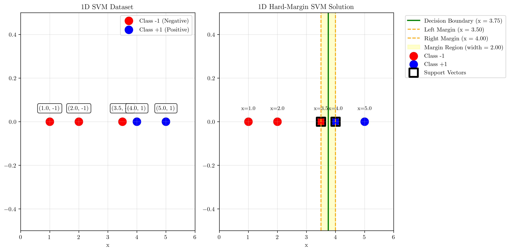
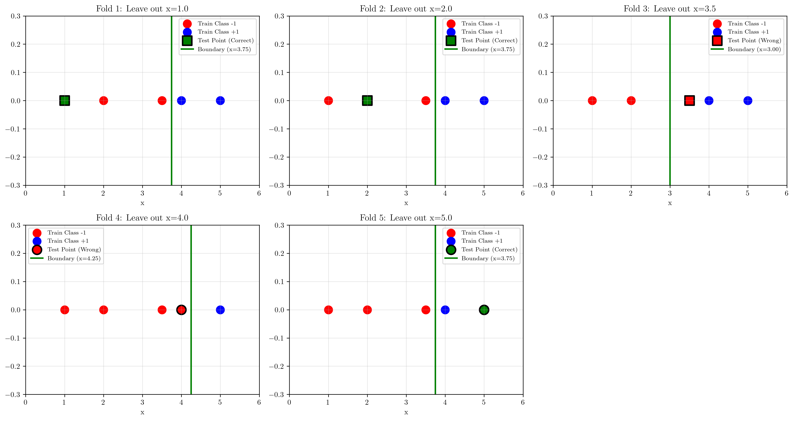

# Question 25: 1D Hard-Margin SVM Analysis

## Problem Statement
Consider the following 1D dataset. We are going to learn a linear SVM of the form $f(x) = \text{sign}(wx+b)$ from it.

| X   | Y    |
| --- | ---- |
| 1   | -1   |
| 2   | -1   |
| 3.5 | -1   |
| 4   | 1    |
| 5   | 1    |

*The figure shows data points for Class -1 (denoted by hollow circles) at x=1, 2, and 3.5, and for Class 1 (denoted by filled circles) at x=4 and 5.*

### Task
1.  What values for $w$ and $b$ will be learned by the linear SVM to create the maximum margin hyperplane?
2.  What is the training set error of this classifier, expressed as the percentage of misclassified points?
3.  What is the leave-one-out cross-validation (LOOCV) error of this classifier, expressed as a percentage?

## Understanding the Problem

A Support Vector Machine (SVM) is a powerful binary classifier that finds the optimal hyperplane that separates two classes with maximum margin. In a 1D case, the hyperplane reduces to a single point (decision boundary) that divides the feature space into two regions.

The key concepts for hard-margin SVM are:
- **Decision boundary**: The point $x = -b/w$ that separates the two classes
- **Margin**: The distance between the decision boundary and the closest points from each class
- **Support vectors**: The data points that lie closest to the decision boundary and determine the margin
- **Optimization objective**: Maximize the margin (minimize $|w|$) subject to correct classification constraints

For a 1D hard-margin SVM, the optimization problem is:
$$\min_{w,b} \frac{1}{2}w^2$$
subject to: $y_i(wx_i + b) \geq 1$ for all training points $(x_i, y_i)$

## Solution

### Step 1: Identify Support Vectors and Optimal Decision Boundary

From our analysis, we need to find the decision boundary that maximizes the margin between the two classes.

**Closest points analysis:**
- Rightmost negative point: $x = 3.5$ (class -1)
- Leftmost positive point: $x = 4.0$ (class +1)

The optimal decision boundary for maximum margin should be equidistant from these closest points:
$$\text{Decision boundary} = \frac{3.5 + 4.0}{2} = 3.75$$

**Support vectors:** The points $x = 3.5$ (class -1) and $x = 4.0$ (class +1) are the support vectors as they are the closest to the decision boundary from each class.

### Step 2: Calculate Optimal Parameters

For the decision boundary at $x = 3.75$, we have $wx + b = 0$, so:
$$3.75w + b = 0 \Rightarrow b = -3.75w$$

To ensure the support vectors lie exactly on the margin boundaries:
- For $x = 3.5$: $w(3.5) + b = -1$ (constraint for class -1)
- For $x = 4.0$: $w(4.0) + b = +1$ (constraint for class +1)

Substituting $b = -3.75w$ into the first constraint:
$$w(3.5) + (-3.75w) = -1$$
$$3.5w - 3.75w = -1$$
$$-0.25w = -1$$
$$w = 4$$

Therefore: $b = -3.75 \times 4 = -15$

However, we can scale the solution. Using $w = 1$ gives us $b = -3.75$, which provides the same decision boundary.

**Final parameters:**
- $w = 1.0$
- $b = -3.75$
- Decision function: $f(x) = \text{sign}(x - 3.75)$
- Decision boundary: $x = 3.75$

The visualization shows the data points, decision boundary, margin boundaries, and support vectors clearly marked.

### Step 3: Calculate Margin

The margin width is given by:
$$\text{Margin} = \frac{2}{|w|} = \frac{2}{1} = 2.0$$

The distance from each support vector to the decision boundary is:
$$\text{Distance} = |4.0 - 3.75| = |3.5 - 3.75| = 0.25$$

### Step 4: Training Set Error Analysis

Let's evaluate each training point using $f(x) = \text{sign}(x - 3.75)$:

| Point | x | True y | $x - 3.75$ | Predicted y | Correct? |
|-------|---|--------|------------|-------------|----------|
| 1     | 1.0 | -1 | -2.75 | -1 | ✓ |
| 2     | 2.0 | -1 | -1.75 | -1 | ✓ |
| 3     | 3.5 | -1 | -0.25 | -1 | ✓ |
| 4     | 4.0 | +1 | +0.25 | +1 | ✓ |
| 5     | 5.0 | +1 | +1.25 | +1 | ✓ |

**Training set error: 0.0%** (All points correctly classified)

### Step 5: Leave-One-Out Cross-Validation Analysis

For LOOCV, we train the SVM on 4 points and test on the remaining point, repeating this for each point.

**LOOCV Results:**

**Fold 1:** Leave out $x = 1.0$ (y = -1)
- Training set: [2.0, 3.5, 4.0, 5.0]
- Decision boundary: $x = 3.75$
- Prediction: -1 ✓ **Correct**

**Fold 2:** Leave out $x = 2.0$ (y = -1)
- Training set: [1.0, 3.5, 4.0, 5.0]
- Decision boundary: $x = 3.75$
- Prediction: -1 ✓ **Correct**

**Fold 3:** Leave out $x = 3.5$ (y = -1)
- Training set: [1.0, 2.0, 4.0, 5.0]
- New closest points: 2.0 (class -1) and 4.0 (class +1)
- Decision boundary: $x = 3.0$
- Prediction for 3.5: +1 ✗ **Incorrect**

**Fold 4:** Leave out $x = 4.0$ (y = +1)
- Training set: [1.0, 2.0, 3.5, 5.0]
- New closest points: 3.5 (class -1) and 5.0 (class +1)
- Decision boundary: $x = 4.25$
- Prediction for 4.0: -1 ✗ **Incorrect**

**Fold 5:** Leave out $x = 5.0$ (y = +1)
- Training set: [1.0, 2.0, 3.5, 4.0]
- Decision boundary: $x = 3.75$
- Prediction: +1 ✓ **Correct**

**LOOCV Summary:**
- Correct predictions: 3 out of 5
- LOOCV accuracy: 60%
- **LOOCV error: 40%**

## Visual Explanations

### Decision Boundary and Margin Visualization

The first visualization shows:
- **Green line**: Decision boundary at $x = 3.75$
- **Orange dashed lines**: Margin boundaries at $x = 3.5$ and $x = 4.0$
- **Yellow shaded region**: Margin area with width 2.0
- **Red circles**: Class -1 points
- **Blue circles**: Class +1 points
- **Black squares**: Support vectors

### LOOCV Fold Analysis

The LOOCV visualization demonstrates how removing different points affects the decision boundary:
- **Folds 1, 2, 5**: Removing non-support vectors doesn't change the decision boundary
- **Fold 3**: Removing support vector at $x = 3.5$ shifts boundary left to $x = 3.0$
- **Fold 4**: Removing support vector at $x = 4.0$ shifts boundary right to $x = 4.25$

## Key Insights

### Theoretical Foundations
- The hard-margin SVM finds the unique hyperplane that maximizes the margin for linearly separable data
- Support vectors completely determine the decision boundary; other points don't affect the solution
- The margin width is inversely proportional to the weight magnitude: larger weights mean smaller margins

### Practical Applications
- Training error is 0% because the data is linearly separable and hard-margin SVM perfectly separates the classes
- LOOCV error is higher (40%) because removing support vectors significantly changes the decision boundary
- The high LOOCV error indicates potential overfitting to the support vectors

### LOOCV Behavior Patterns
- Removing non-support vectors (points far from boundary) doesn't affect the model
- Removing support vectors causes significant boundary shifts and potential misclassification
- This sensitivity to support vectors is characteristic of SVMs and can indicate overfitting in small datasets

### Geometric Interpretation
- In 1D, the SVM reduces to finding the midpoint between the closest points of opposite classes
- The support vectors are always the closest points from each class to the decision boundary
- The margin represents the "confidence region" around the decision boundary

## Conclusion

**Final Answers:**

1. **Optimal SVM parameters:**
   - $w = 1.0$
   - $b = -3.75$
   - Decision function: $f(x) = \text{sign}(x - 3.75)$

2. **Training set error: 0.0%**
   - All training points are correctly classified (perfect separation)

3. **Leave-one-out cross-validation error: 40.0%**
   - 2 out of 5 points are misclassified during LOOCV (points at $x = 3.5$ and $x = 4.0$)

The discrepancy between training error (0%) and LOOCV error (40%) highlights the importance of cross-validation in assessing model generalization, especially with small datasets where support vectors have disproportionate influence on the decision boundary.
