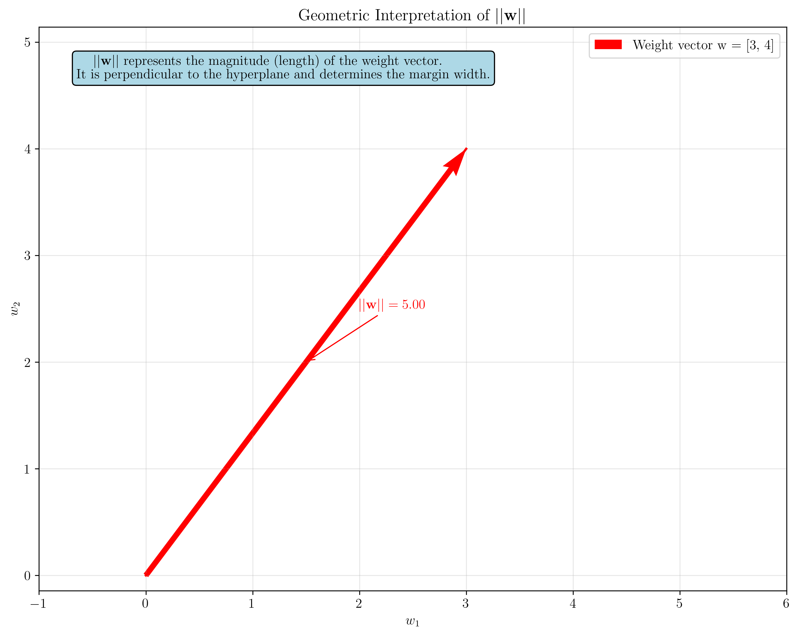
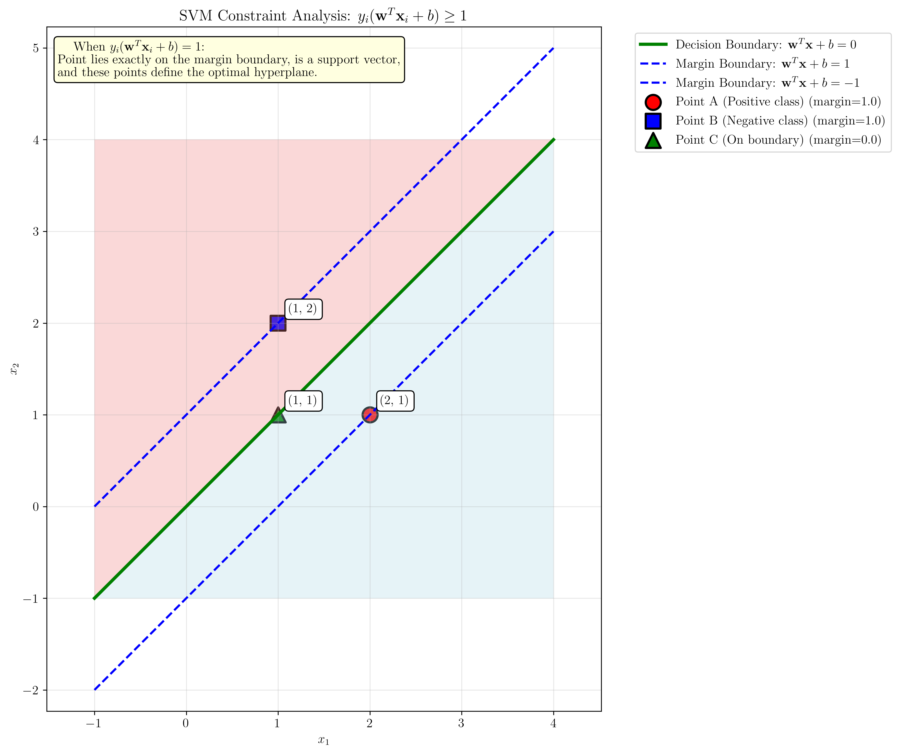
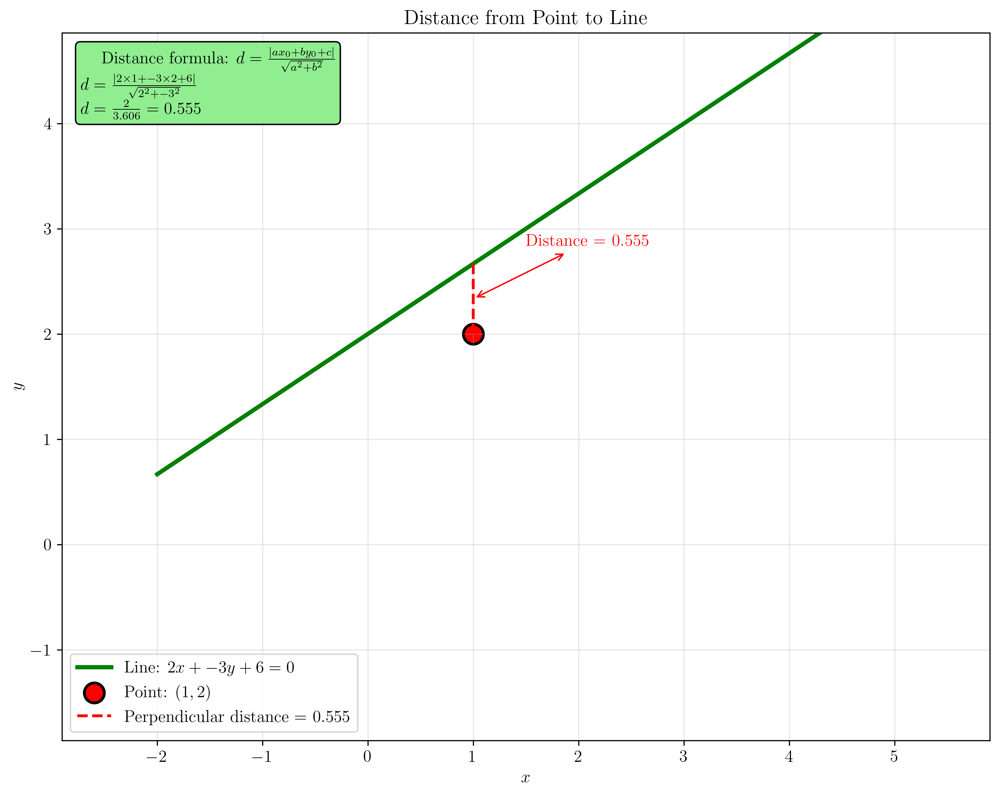
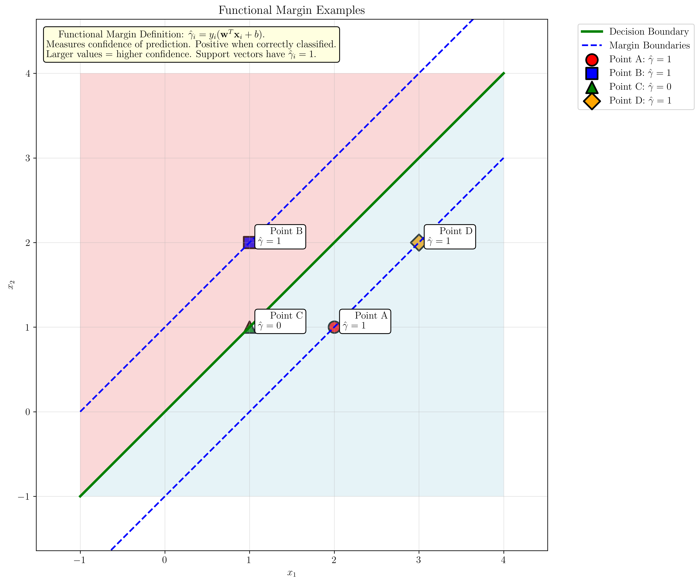
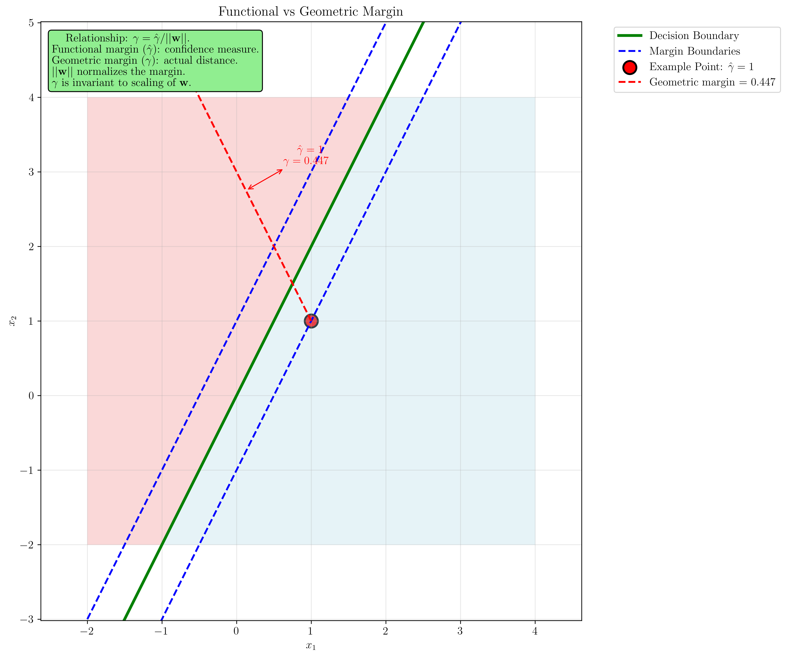

# Question 27: Basic Formula Understanding

## Problem Statement
Answer these basic questions about SVM formulas and terminology.

### Task
1. In the SVM objective function $\min \frac{1}{2}||\mathbf{w}||^2$, what does $||\mathbf{w}||$ represent geometrically?
2. For the constraint $y_i(\mathbf{w}^T\mathbf{x}_i + b) \geq 1$, explain what happens when this value equals exactly 1.
3. What is the formula for the distance from a point $(x_0, y_0)$ to the line $ax + by + c = 0$?
4. Define "functional margin" in your own words and write its formula.
5. What is the relationship between functional margin and geometric margin?

## Understanding the Problem
Support Vector Machines (SVMs) are powerful classification algorithms that find optimal separating hyperplanes by maximizing the margin between classes. This problem tests fundamental understanding of SVM terminology, geometric interpretations, and mathematical relationships between key concepts like weight vectors, margins, and distance formulas.

## Solution

### Step 1: Geometric Interpretation of $||\mathbf{w}||$

The weight vector $\mathbf{w}$ in SVM represents the normal vector to the decision boundary. The magnitude $||\mathbf{w}||$ has important geometric significance:

**Mathematical Definition:**
$$||\mathbf{w}|| = \sqrt{w_1^2 + w_2^2 + \cdots + w_d^2}$$

**Step-by-Step Calculation:**
Given: Weight vector $\mathbf{w} = [w_1, w_2] = [3, 4]$

**Step 1:** Write the formula for $||\mathbf{w}||$
$$||\mathbf{w}|| = \sqrt{w_1^2 + w_2^2}$$

**Step 2:** Substitute the values
$$||\mathbf{w}|| = \sqrt{3^2 + 4^2}$$
$$||\mathbf{w}|| = \sqrt{9 + 16}$$
$$||\mathbf{w}|| = \sqrt{25}$$
$$||\mathbf{w}|| = 5$$

**Step 3:** Geometric interpretation
- $||\mathbf{w}||$ represents the magnitude (length) of the weight vector
- The weight vector $\mathbf{w}$ is perpendicular to the decision boundary
- In SVM objective function $\min \frac{1}{2}||\mathbf{w}||^2$, minimizing $||\mathbf{w}||$ maximizes the margin
- The direction of $\mathbf{w}$ points toward the positive class

**Result:** $||\mathbf{w}|| = 5.00$

The visualization shows that $||\mathbf{w}||$ represents the magnitude of the weight vector, which is perpendicular to the decision boundary and determines the margin width.

### Step 2: Constraint Analysis - When $y_i(\mathbf{w}^T\mathbf{x}_i + b) = 1$

The constraint $y_i(\mathbf{w}^T\mathbf{x}_i + b) \geq 1$ ensures that all training points are correctly classified with a margin of at least 1. When this value equals exactly 1, it has special significance:

**What happens when $y_i(\mathbf{w}^T\mathbf{x}_i + b) = 1$:**
- The point lies exactly on the margin boundary
- The point is a **support vector**
- These points define the optimal hyperplane

**Step-by-Step Analysis:**
Given: $\mathbf{w} = [1, -1]$, $b = 0$

**Point A (Positive class):**
Given: $\mathbf{x} = [2, 1]$, $y = 1$

**Step 1:** Calculate $\mathbf{w}^T\mathbf{x} + b$
$$\mathbf{w}^T\mathbf{x} + b = [1, -1] \cdot [2, 1] + 0$$
$$\mathbf{w}^T\mathbf{x} + b = 1 \times 2 + (-1) \times 1 + 0$$
$$\mathbf{w}^T\mathbf{x} + b = 2 - 1 + 0 = 1$$

**Step 2:** Calculate $y(\mathbf{w}^T\mathbf{x} + b)$
$$y(\mathbf{w}^T\mathbf{x} + b) = 1 \times 1 = 1$$

**Result:** ✓ This is a support vector (margin = 1)

**Point B (Negative class):**
Given: $\mathbf{x} = [1, 2]$, $y = -1$

**Step 1:** Calculate $\mathbf{w}^T\mathbf{x} + b$
$$\mathbf{w}^T\mathbf{x} + b = [1, -1] \cdot [1, 2] + 0$$
$$\mathbf{w}^T\mathbf{x} + b = 1 \times 1 + (-1) \times 2 + 0$$
$$\mathbf{w}^T\mathbf{x} + b = 1 - 2 + 0 = -1$$

**Step 2:** Calculate $y(\mathbf{w}^T\mathbf{x} + b)$
$$y(\mathbf{w}^T\mathbf{x} + b) = (-1) \times (-1) = 1$$

**Result:** ✓ This is a support vector (margin = 1)

**Point C (On boundary):**
Given: $\mathbf{x} = [1, 1]$, $y = 1$

**Step 1:** Calculate $\mathbf{w}^T\mathbf{x} + b$
$$\mathbf{w}^T\mathbf{x} + b = [1, -1] \cdot [1, 1] + 0$$
$$\mathbf{w}^T\mathbf{x} + b = 1 \times 1 + (-1) \times 1 + 0$$
$$\mathbf{w}^T\mathbf{x} + b = 1 - 1 + 0 = 0$$

**Step 2:** Calculate $y(\mathbf{w}^T\mathbf{x} + b)$
$$y(\mathbf{w}^T\mathbf{x} + b) = 1 \times 0 = 0$$

**Result:** ✗ Violates constraint (margin < 1)

The visualization shows the decision boundary and margin boundaries. Points with functional margin exactly equal to 1 lie on the dashed margin boundaries and are support vectors.

### Step 3: Distance from Point to Line Formula

The distance from a point $(x_0, y_0)$ to a line $ax + by + c = 0$ is given by:

$$d = \frac{|ax_0 + by_0 + c|}{\sqrt{a^2 + b^2}}$$

**Step-by-Step Calculation:**
Given: Line $ax + by + c = 0$ where $a = 2$, $b = -3$, $c = 6$
Point $(x_0, y_0) = (1, 2)$

**Step 1:** Write the distance formula
$$d = \frac{|ax_0 + by_0 + c|}{\sqrt{a^2 + b^2}}$$

**Step 2:** Substitute the values
$$d = \frac{|2 \times 1 + (-3) \times 2 + 6|}{\sqrt{2^2 + (-3)^2}}$$
$$d = \frac{|2 - 6 + 6|}{\sqrt{4 + 9}}$$
$$d = \frac{|2|}{\sqrt{13}}$$
$$d = \frac{2}{\sqrt{13}}$$

**Step 3:** Calculate the final value
$$d = \frac{2}{3.606}$$
$$d \approx 0.555$$

**Step 4:** Geometric interpretation
- This is the shortest distance from the point to the line
- The distance is measured along the perpendicular direction
- The formula works for any line in the form $ax + by + c = 0$

**Result:** $d = 0.555$

**Derivation:**
This formula comes from the fact that the shortest distance from a point to a line is along the perpendicular direction. The numerator represents the signed distance, and the denominator normalizes by the magnitude of the normal vector $[a, b]^T$.

The visualization shows the perpendicular distance from the point to the line, demonstrating the geometric interpretation of the distance formula.

### Step 4: Functional Margin Definition and Formula

**Definition:** The functional margin measures the confidence of the classifier's prediction for a given data point. It indicates how far a point is from the decision boundary in terms of the classifier's confidence.

**Formula:**
$$\hat{\gamma}_i = y_i(\mathbf{w}^T\mathbf{x}_i + b)$$

**Key Properties:**
- Positive when the point is correctly classified
- Larger values indicate higher confidence
- Support vectors have functional margin equal to 1
- Invariant to scaling of the weight vector

**Step-by-Step Analysis:**
Given: $\mathbf{w} = [1, -1]$, $b = 0$

**Point A:**
Given: $\mathbf{x} = [2, 1]$, $y = 1$

**Step 1:** Calculate $\mathbf{w}^T\mathbf{x} + b$
$$\mathbf{w}^T\mathbf{x} + b = [1, -1] \cdot [2, 1] + 0$$
$$\mathbf{w}^T\mathbf{x} + b = 1 \times 2 + (-1) \times 1 + 0$$
$$\mathbf{w}^T\mathbf{x} + b = 2 - 1 + 0 = 1$$

**Step 2:** Calculate $\hat{\gamma}_i = y(\mathbf{w}^T\mathbf{x} + b)$
$$\hat{\gamma}_i = 1 \times 1 = 1$$

**Result:** ✓ Correctly classified with confidence 1

**Point B:**
Given: $\mathbf{x} = [1, 2]$, $y = -1$

**Step 1:** Calculate $\mathbf{w}^T\mathbf{x} + b$
$$\mathbf{w}^T\mathbf{x} + b = [1, -1] \cdot [1, 2] + 0$$
$$\mathbf{w}^T\mathbf{x} + b = 1 \times 1 + (-1) \times 2 + 0$$
$$\mathbf{w}^T\mathbf{x} + b = 1 - 2 + 0 = -1$$

**Step 2:** Calculate $\hat{\gamma}_i = y(\mathbf{w}^T\mathbf{x} + b)$
$$\hat{\gamma}_i = (-1) \times (-1) = 1$$

**Result:** ✓ Correctly classified with confidence 1

**Point C:**
Given: $\mathbf{x} = [1, 1]$, $y = 1$

**Step 1:** Calculate $\mathbf{w}^T\mathbf{x} + b$
$$\mathbf{w}^T\mathbf{x} + b = [1, -1] \cdot [1, 1] + 0$$
$$\mathbf{w}^T\mathbf{x} + b = 1 \times 1 + (-1) \times 1 + 0$$
$$\mathbf{w}^T\mathbf{x} + b = 1 - 1 + 0 = 0$$

**Step 2:** Calculate $\hat{\gamma}_i = y(\mathbf{w}^T\mathbf{x} + b)$
$$\hat{\gamma}_i = 1 \times 0 = 0$$

**Result:** ⚠ On decision boundary (margin = 0)

**Point D:**
Given: $\mathbf{x} = [3, 2]$, $y = 1$

**Step 1:** Calculate $\mathbf{w}^T\mathbf{x} + b$
$$\mathbf{w}^T\mathbf{x} + b = [1, -1] \cdot [3, 2] + 0$$
$$\mathbf{w}^T\mathbf{x} + b = 1 \times 3 + (-1) \times 2 + 0$$
$$\mathbf{w}^T\mathbf{x} + b = 3 - 2 + 0 = 1$$

**Step 2:** Calculate $\hat{\gamma}_i = y(\mathbf{w}^T\mathbf{x} + b)$
$$\hat{\gamma}_i = 1 \times 1 = 1$$

**Result:** ✓ Correctly classified with confidence 1

The visualization shows different points with their functional margins, demonstrating how this measure indicates classification confidence.

### Step 5: Relationship Between Functional and Geometric Margin

**Relationship Formula:**
$$\gamma = \frac{\hat{\gamma}}{||\mathbf{w}||}$$

**Key Insights:**
- **Functional margin ($\hat{\gamma}$)**: Measures confidence of prediction
- **Geometric margin ($\gamma$)**: Actual Euclidean distance from point to decision boundary
- **Weight norm ($||\mathbf{w}||$)**: Normalizes the margin
- **Invariance**: Geometric margin is invariant to scaling of the weight vector

**Step-by-Step Analysis:**
Given: $\mathbf{w} = [2, -1]$, $b = 0$, $\mathbf{x} = [1, 1]$, $y = 1$

**Step 1:** Calculate functional margin $\hat{\gamma}$
$$\hat{\gamma} = y(\mathbf{w}^T\mathbf{x} + b)$$
$$\hat{\gamma} = 1 \times ([2, -1] \cdot [1, 1] + 0)$$
$$\hat{\gamma} = 1 \times (2 \times 1 + (-1) \times 1 + 0)$$
$$\hat{\gamma} = 1 \times (2 - 1 + 0)$$
$$\hat{\gamma} = 1 \times 1$$
$$\hat{\gamma} = 1$$

**Step 2:** Calculate weight norm $||\mathbf{w}||$
$$||\mathbf{w}|| = \sqrt{w_1^2 + w_2^2}$$
$$||\mathbf{w}|| = \sqrt{2^2 + (-1)^2}$$
$$||\mathbf{w}|| = \sqrt{4 + 1}$$
$$||\mathbf{w}|| = \sqrt{5}$$
$$||\mathbf{w}|| = 2.236$$

**Step 3:** Calculate geometric margin $\gamma$
$$\gamma = \frac{\hat{\gamma}}{||\mathbf{w}||}$$
$$\gamma = \frac{1}{2.236}$$
$$\gamma = 0.447$$

**Step 4:** Interpretation
- Functional margin $\hat{\gamma} = 1$ (confidence measure)
- Geometric margin $\gamma = 0.447$ (actual distance)
- The point is 0.447 units away from the decision boundary

The visualization shows both the functional margin (confidence measure) and geometric margin (actual distance) for a point, illustrating their relationship.

## Visual Explanations

### Weight Vector Geometry

The weight vector $\mathbf{w}$ is fundamental to SVM geometry:
- It's perpendicular to the decision boundary
- Its magnitude determines the margin width
- Minimizing $||\mathbf{w}||$ maximizes the geometric margin
- The direction of $\mathbf{w}$ points toward the positive class

### Support Vector Identification

Support vectors are the most important training points:
- They lie exactly on the margin boundaries
- They have functional margin equal to 1
- They define the optimal hyperplane
- Removing them changes the decision boundary

### Distance Formula Derivation

The distance formula $d = \frac{|ax_0 + by_0 + c|}{\sqrt{a^2 + b^2}}$ can be derived by:
1. Finding the perpendicular line from the point to the given line
2. Computing the intersection point
3. Calculating the Euclidean distance between the point and intersection

### Margin Types Comparison

**Functional Margin ($\hat{\gamma}$):**
- Measures prediction confidence
- Depends on the scale of the weight vector
- Used in the optimization objective

**Geometric Margin ($\gamma$):**
- Measures actual Euclidean distance
- Invariant to weight vector scaling
- More meaningful for generalization

## Key Insights

### Theoretical Foundations
- The weight vector $\mathbf{w}$ is the normal vector to the decision boundary
- Support vectors are the "hardest" points to classify correctly
- The margin is the key concept that makes SVMs robust
- Functional and geometric margins provide different perspectives on classification confidence

### Practical Applications
- Understanding these formulas is crucial for implementing SVMs
- The distance formula is used in many machine learning algorithms
- Margin concepts apply to other classification methods
- These geometric insights help with hyperparameter tuning

### Common Pitfalls
- Confusing functional and geometric margins
- Forgetting that support vectors have functional margin exactly equal to 1
- Not understanding the geometric interpretation of the weight vector
- Ignoring the invariance properties of geometric margin

### Extensions
- These concepts extend to kernel SVMs in higher-dimensional spaces
- The margin concept is fundamental to many other algorithms (AdaBoost, etc.)
- Distance formulas generalize to higher dimensions
- Margin-based approaches are used in deep learning

## Conclusion
- $||\mathbf{w}||$ represents the magnitude of the weight vector, which is perpendicular to the decision boundary
- When $y_i(\mathbf{w}^T\mathbf{x}_i + b) = 1$, the point is a support vector lying exactly on the margin boundary
- The distance from point $(x_0, y_0)$ to line $ax + by + c = 0$ is $d = \frac{|ax_0 + by_0 + c|}{\sqrt{a^2 + b^2}}$
- Functional margin $\hat{\gamma}_i = y_i(\mathbf{w}^T\mathbf{x}_i + b)$ measures classification confidence
- Geometric margin $\gamma = \frac{\hat{\gamma}}{||\mathbf{w}||}$ represents actual distance and is invariant to weight scaling

These fundamental concepts form the mathematical foundation of Support Vector Machines and are essential for understanding their theoretical properties and practical implementation.
