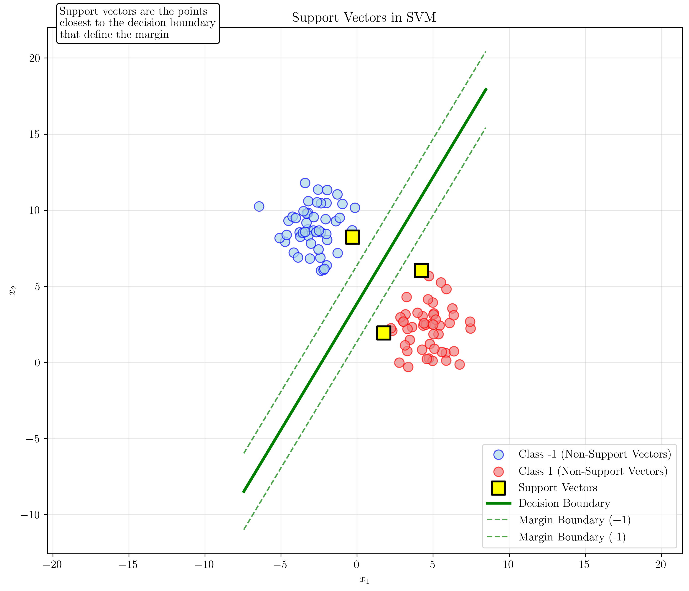
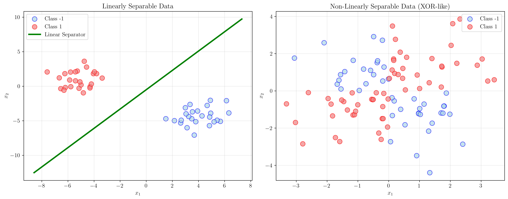
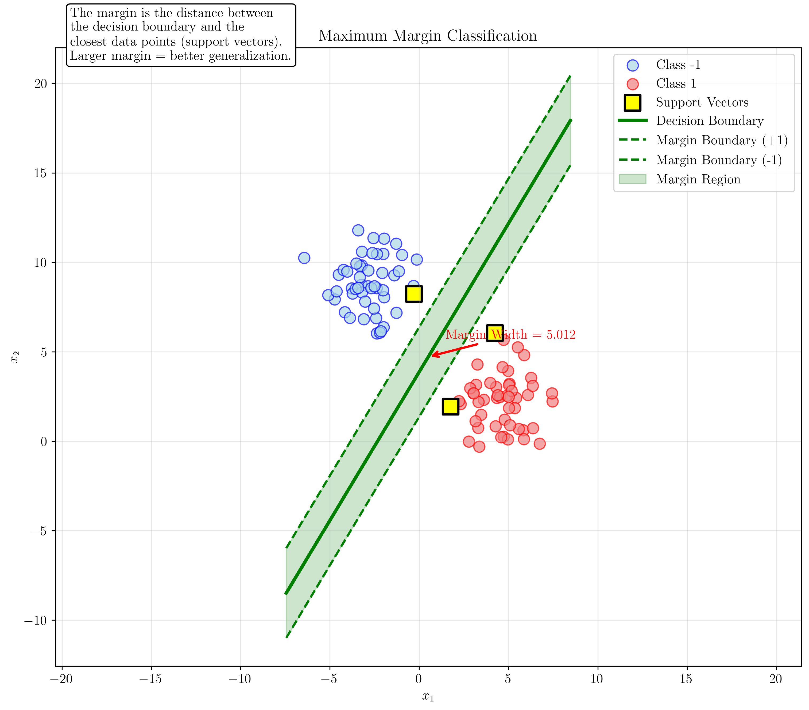
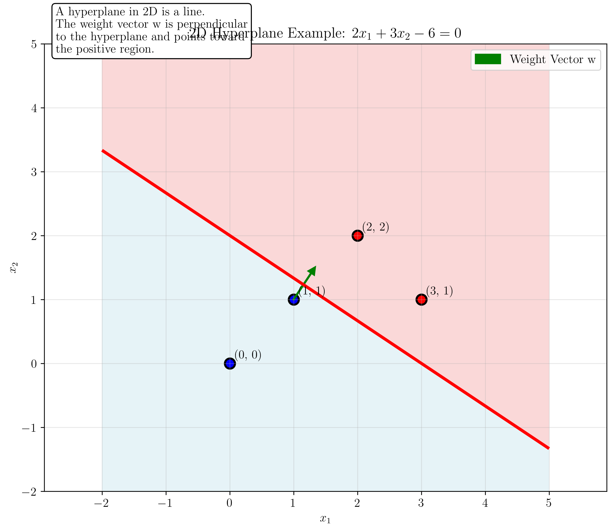
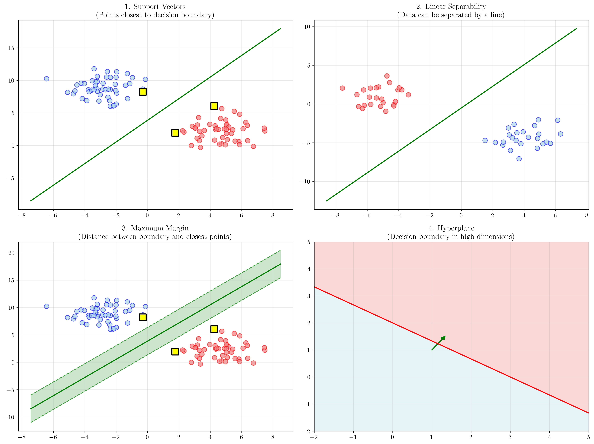

# Question 28: Key SVM Terminology

## Problem Statement
Define and explain key SVM terminology.

### Task
1. What is a "support vector"? How can you identify them?
2. What does "linearly separable" mean for a dataset?
3. Explain the difference between "primal" and "dual" formulations.
4. What is the "margin" in maximum margin classification?
5. Define "hyperplane" and give an example equation in 2D.

## Understanding the Problem
Support Vector Machines (SVMs) are powerful supervised learning algorithms used for classification and regression. Understanding the key terminology is essential for grasping how SVMs work and why they are effective. This question tests fundamental knowledge of SVM concepts including support vectors, linear separability, mathematical formulations, margins, and hyperplanes.

## Solution

### Step 1: Support Vectors

**Definition**: Support vectors are the data points that lie closest to the decision boundary and are critical in defining the optimal separating hyperplane. They are the "support" that determines the position and orientation of the decision boundary.

**Identification**: Support vectors can be identified as the training points that satisfy the constraint $y_i(\mathbf{w}^T\mathbf{x}_i + b) = 1$ in the hard-margin SVM formulation. These are the points that lie exactly on the margin boundaries.

From our demonstration:
- Total training points: $100$
- Number of support vectors: $3$
- Support vector indices: $[45, 29, 63]$
- Support vectors: $\begin{bmatrix} -0.29235656 & 8.2368808 \\ 4.24289359 & 6.05342343 \\ 1.76172201 & 1.93339887 \end{bmatrix}$

The yellow squares in the visualization represent the support vectors. These are the points closest to the decision boundary (green line) that define the margin (dashed green lines).

### Step 2: Linear Separability

**Definition**: A dataset is linearly separable if there exists a hyperplane (a line in 2D, plane in 3D, etc.) that can perfectly separate the data points belonging to different classes without any misclassification.

**Mathematical Definition**: For a binary classification problem with classes $+1$ and $-1$, a dataset is linearly separable if there exists a weight vector $\mathbf{w}$ and bias $b$ such that:
$$y_i(\mathbf{w}^T\mathbf{x}_i + b) > 0 \quad \forall i = 1, 2, \ldots, n$$

The left plot shows linearly separable data where a straight line can perfectly separate the two classes. The right plot shows non-linearly separable data (XOR-like pattern) where no straight line can separate the classes perfectly.

**Key Insight**: Linear separability is a fundamental assumption for hard-margin SVMs. When data is not linearly separable, we need soft-margin SVMs or kernel methods.

### Step 3: Primal vs Dual Formulation

**Primal Formulation**: The original optimization problem that directly optimizes the weight vector $\mathbf{w}$ and bias $b$.

**Primal Problem**:
$$\min_{\mathbf{w}, b} \frac{1}{2}\|\mathbf{w}\|^2$$
subject to: $y_i(\mathbf{w}^T\mathbf{x}_i + b) \geq 1 \quad \forall i = 1, 2, \ldots, n$

**Dual Formulation**: The Lagrangian dual problem that optimizes the Lagrange multipliers $\alpha_i$.

**Dual Problem**:
$$\max_{\boldsymbol{\alpha}} \sum_{i=1}^{n} \alpha_i - \frac{1}{2}\sum_{i=1}^{n}\sum_{j=1}^{n} \alpha_i \alpha_j y_i y_j \mathbf{x}_i^T\mathbf{x}_j$$
subject to: $\sum_{i=1}^{n} \alpha_i y_i = 0$ and $\alpha_i \geq 0 \quad \forall i = 1, 2, \ldots, n$

**Relationship**: The weight vector can be recovered from the dual solution:
$$\mathbf{w} = \sum_{i=1}^{n} \alpha_i y_i \mathbf{x}_i$$

From our demonstration:
- **Primal**: Weight vector $\mathbf{w} = [0.34185493, -0.20591293]$, Bias $b = 0.7959688649147761$
- **Dual**: $3$ support vectors with Lagrange multipliers $\boldsymbol{\alpha} = [-0.07963183, 0.07185512, 0.00777671]$
- **Verification**: The weight vector computed from dual formulation closely matches the primal solution

**Advantages of Dual Formulation**:
1. Only support vectors ($\alpha_i > 0$) contribute to the solution
2. Easier to extend to kernel methods
3. More efficient for high-dimensional data

### Step 4: Margin in Maximum Margin Classification

**Definition**: The margin is the distance between the decision boundary and the closest data points from each class. In maximum margin classification, we seek to maximize this distance.

**Mathematical Definition**: For a hyperplane defined by $\mathbf{w}^T\mathbf{x} + b = 0$, the margin is:
$$\text{Margin} = \frac{2}{\|\mathbf{w}\|}$$

**Geometric Interpretation**: The margin represents the "safety zone" around the decision boundary. A larger margin means the classifier is more robust to noise and has better generalization.

From our demonstration:
- Margin width = $\frac{2}{\|\mathbf{w}\|} = 5.0115$

The visualization shows:
- Green solid line: Decision boundary
- Green dashed lines: Margin boundaries
- Shaded green region: The margin area
- Yellow squares: Support vectors (points on margin boundaries)

**Why Maximize Margin?**
1. **Better Generalization**: Larger margin reduces overfitting
2. **Robustness**: More tolerant to noise in training data
3. **Theoretical Guarantees**: Bounded generalization error based on margin size

### Step 5: Hyperplane Definition

**Definition**: A hyperplane is a flat subspace of dimension $n-1$ in an $n$-dimensional space. In $2$D, a hyperplane is a line; in $3$D, it's a plane; in higher dimensions, it's a generalization of these concepts.

**Mathematical Form**: A hyperplane is defined by the equation:
$$\mathbf{w}^T\mathbf{x} + b = 0$$
where $\mathbf{w}$ is the normal vector (perpendicular to the hyperplane) and $b$ is the bias term.

**2D Example**: Consider the hyperplane $2x_1 + 3x_2 - 6 = 0$

From our demonstration:
- Weight vector $\mathbf{w} = [2, 3]$
- Bias term $b = -6$
- $\|\mathbf{w}\| = 3.6056$

**Key Properties**:
1. The weight vector $\mathbf{w}$ is perpendicular to the hyperplane
2. The bias $b$ determines the distance from the origin
3. Points on one side satisfy $\mathbf{w}^T\mathbf{x} + b > 0$
4. Points on the other side satisfy $\mathbf{w}^T\mathbf{x} + b < 0$

## Visual Explanations

### Comprehensive Overview

This comprehensive visualization shows all four key concepts:
1. **Support Vectors**: Yellow squares marking the critical points
2. **Linear Separability**: Clean separation by a straight line
3. **Maximum Margin**: Shaded region showing the safety zone
4. **Hyperplane**: Decision boundary with normal vector

### Geometric Relationships

The visualizations demonstrate several important geometric relationships:
- Support vectors lie exactly on the margin boundaries
- The weight vector $\mathbf{w}$ is perpendicular to the decision boundary
- The margin width is inversely proportional to $\|\mathbf{w}\|$
- Linear separability allows for perfect classification with a straight line

## Key Insights

### Theoretical Foundations
- **Support vectors are sparse**: Only a small subset of training points are support vectors
- **Margin maximization principle**: Larger margins lead to better generalization
- **Dual formulation efficiency**: Only support vectors ($\alpha_i > 0$) contribute to the final solution
- **Linear separability assumption**: Fundamental requirement for hard-margin SVMs

### Practical Applications
- **Feature selection**: Support vectors indicate which training points are most important
- **Model interpretability**: The weight vector shows feature importance
- **Computational efficiency**: Dual formulation enables kernel methods
- **Robustness**: Maximum margin provides tolerance to noise

### Common Pitfalls
- **Overfitting**: Very small margins can lead to poor generalization
- **Non-separable data**: Hard-margin SVMs fail when data is not linearly separable
- **Scale sensitivity**: SVM performance depends on feature scaling
- **Kernel selection**: Choice of kernel function significantly affects performance

## Conclusion
- **Support vectors** are the critical training points that define the decision boundary and margin
- **Linear separability** means data can be perfectly separated by a hyperplane
- **Primal and dual formulations** are equivalent but offer different computational advantages
- **Margin maximization** is the core principle that provides good generalization
- **Hyperplanes** are the fundamental geometric objects that separate classes in SVM

Understanding these key terms provides the foundation for comprehending how SVMs work, why they are effective, and how to apply them in practice. The visual demonstrations show how these abstract concepts manifest in real data and help build intuition for SVM behavior.
