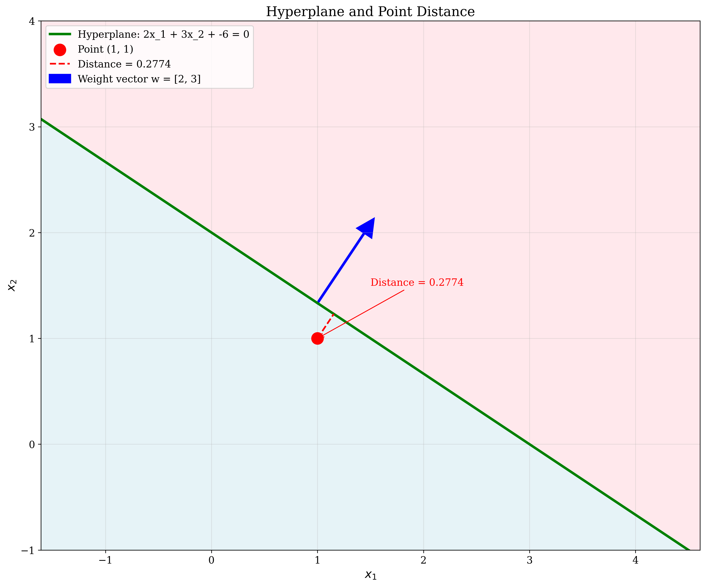
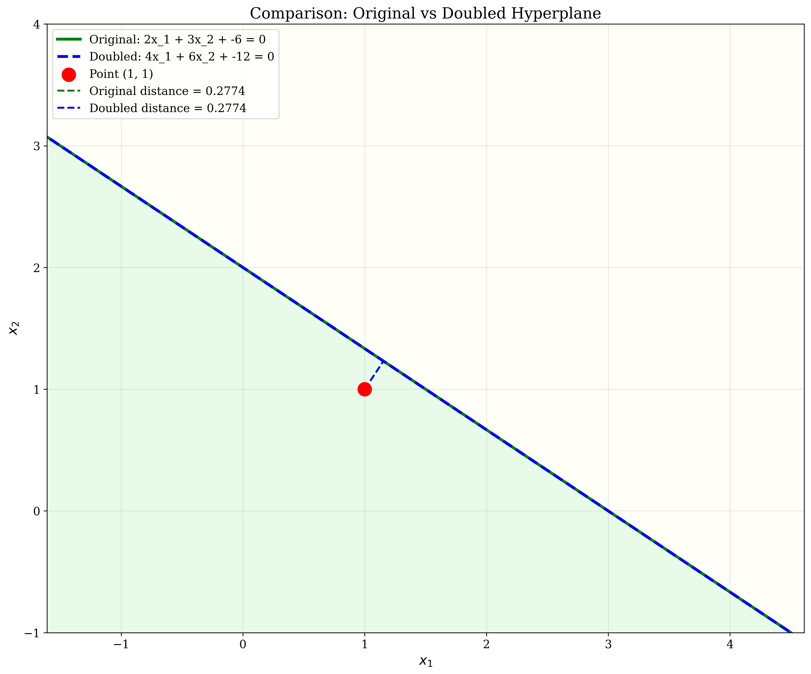
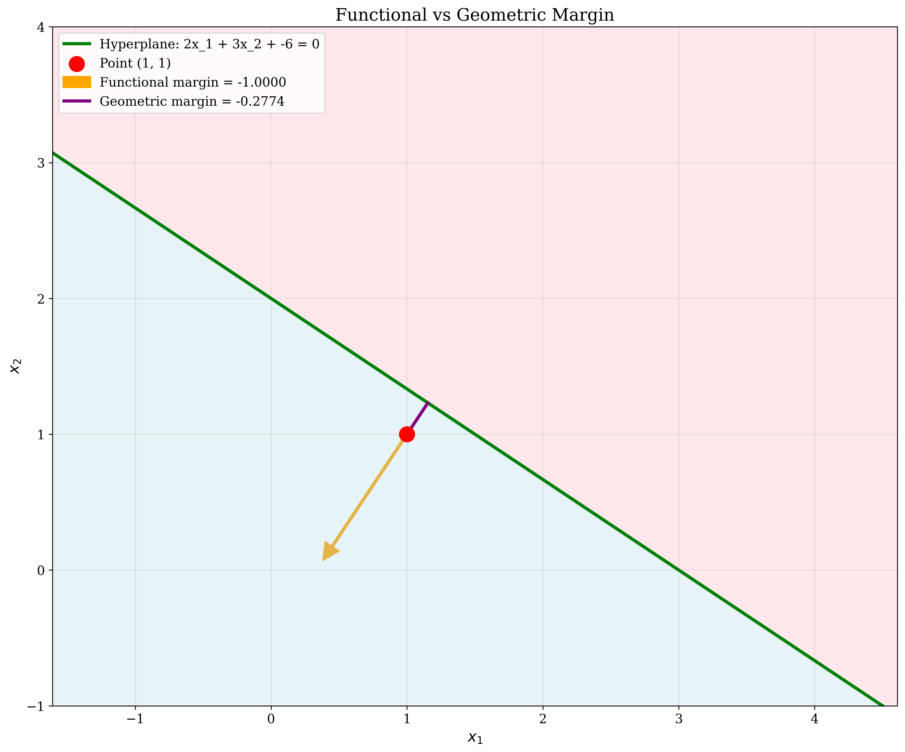

# Question 29: Hyperplane Calculations

## Problem Statement
Given the hyperplane $2x_1 + 3x_2 - 6 = 0$:

### Task
1. Calculate the distance from point $(1, 1)$ to this hyperplane.
2. If point $(1, 1)$ has label $y = +1$, what is its functional margin?
3. What is the magnitude of the weight vector $||\mathbf{w}||$?
4. Write the hyperplane equation in the form $\mathbf{w}^T\mathbf{x} + b = 0$.
5. If you double all coefficients to get $4x_1 + 6x_2 - 12 = 0$, how does the geometric margin change?

## Understanding the Problem
This problem tests fundamental concepts in Support Vector Machines (SVMs) and linear classification. A hyperplane in 2D space is a line that divides the space into two regions. The distance from a point to a hyperplane is crucial for understanding margins in SVMs. The functional margin measures how well a point is classified, while the geometric margin provides a scale-invariant measure of the margin size.

Key concepts involved:
- **Hyperplane**: A linear decision boundary in the form $ax_1 + bx_2 + c = 0$
- **Distance formula**: $|ax_0 + by_0 + c| / \sqrt{a^2 + b^2}$ for point $(x_0, y_0)$
- **Functional margin**: $y \cdot (\mathbf{w}^T\mathbf{x} + b)$ where $y$ is the true label
- **Geometric margin**: Functional margin divided by $||\mathbf{w}||$

## Solution

### Step 1: Calculate Distance from Point (1,1) to Hyperplane

The distance from a point $(x_0, y_0)$ to a hyperplane $ax_1 + bx_2 + c = 0$ is given by:
$$d = \frac{|ax_0 + by_0 + c|}{\sqrt{a^2 + b^2}}$$

For our hyperplane $2x_1 + 3x_2 - 6 = 0$ and point $(1, 1)$:
- $a = 2$, $b = 3$, $c = -6$
- $x_0 = 1$, $y_0 = 1$

Substituting into the formula:
$$\begin{align}
d &= \frac{|2 \times 1 + 3 \times 1 + (-6)|}{\sqrt{2^2 + 3^2}} \\
&= \frac{|2 + 3 - 6|}{\sqrt{4 + 9}} \\
&= \frac{|5 - 6|}{\sqrt{13}} \\
&= \frac{|-1|}{\sqrt{13}} \\
&= \frac{1}{\sqrt{13}} \\
&= \frac{1}{3.6056} \\
&= 0.2774
\end{align}$$

**Answer**: The distance from point $(1, 1)$ to the hyperplane is $0.2774$ units.

### Step 2: Functional Margin

The functional margin is defined as:
$$\text{Functional margin} = y \cdot (\mathbf{w}^T\mathbf{x} + b)$$

First, we need to express the hyperplane in the form $\mathbf{w}^T\mathbf{x} + b = 0$:
- $\mathbf{w} = [2, 3]^T$ (weight vector)
- $b = -6$ (bias term)

For point $(1, 1)$ with label $y = +1$:
$$\begin{align}
\text{Functional margin} &= 1 \cdot ([2, 3] \cdot [1, 1] + (-6)) \\
&= 1 \cdot (2 \times 1 + 3 \times 1 - 6) \\
&= 1 \cdot (2 + 3 - 6) \\
&= 1 \cdot (5 - 6) \\
&= 1 \cdot (-1) \\
&= -1
\end{align}$$

**Answer**: The functional margin is $-1$.

### Step 3: Magnitude of Weight Vector

The magnitude of the weight vector $\mathbf{w} = [2, 3]^T$ is:
$$\begin{align}
||\mathbf{w}|| &= \sqrt{w_1^2 + w_2^2} \\
&= \sqrt{2^2 + 3^2} \\
&= \sqrt{4 + 9} \\
&= \sqrt{13} \\
&= 3.6056
\end{align}$$

**Answer**: The magnitude of the weight vector is $3.6056$.

### Step 4: Hyperplane in Standard Form

The hyperplane $2x_1 + 3x_2 - 6 = 0$ is already in the standard form $\mathbf{w}^T\mathbf{x} + b = 0$ where:
- $\mathbf{w} = [2, 3]^T$
- $b = -6$

**Answer**: The hyperplane in standard form is $[2, 3]^T \cdot [x_1, x_2] + (-6) = 0$ or $2x_1 + 3x_2 - 6 = 0$.

### Step 5: Effect of Doubling Coefficients

When we double all coefficients, the hyperplane becomes $4x_1 + 6x_2 - 12 = 0$.

**New distance calculation:**
$$\begin{align}
d_{\text{new}} &= \frac{|4 \times 1 + 6 \times 1 + (-12)|}{\sqrt{4^2 + 6^2}} \\
&= \frac{|4 + 6 - 12|}{\sqrt{16 + 36}} \\
&= \frac{|10 - 12|}{\sqrt{52}} \\
&= \frac{|-2|}{\sqrt{52}} \\
&= \frac{2}{7.2111} \\
&= 0.2774
\end{align}$$

**Geometric margin analysis:**
- Original geometric margin = $\frac{\text{Functional margin}}{||\mathbf{w}||} = \frac{-1}{3.6056} = -0.2774$
- New functional margin = $1 \cdot (4 \times 1 + 6 \times 1 - 12) = 1 \cdot (10 - 12) = -2$
- New weight magnitude = $\sqrt{4^2 + 6^2} = \sqrt{52} = 7.2111$
- New geometric margin = $\frac{-2}{7.2111} = -0.2774$

**Answer**: The geometric margin remains unchanged at $-0.2774$. This is because both the functional margin and the weight magnitude are scaled by the same factor (2), so their ratio remains constant.

## Visual Explanations

### Hyperplane and Point Distance

This visualization shows:
- The green line represents the hyperplane $2x_1 + 3x_2 - 6 = 0$
- The red point represents $(1, 1)$
- The red dashed line shows the perpendicular distance from the point to the hyperplane
- The blue arrow represents the weight vector $\mathbf{w} = [2, 3]^T$
- The shaded regions indicate the positive (light pink) and negative (light blue) sides of the hyperplane

The distance calculation shows that the point $(1, 1)$ is $0.2774$ units away from the hyperplane.

### Comparison: Original vs Doubled Hyperplane

This visualization compares:
- The original hyperplane $2x_1 + 3x_2 - 6 = 0$ (green solid line)
- The doubled hyperplane $4x_1 + 6x_2 - 12 = 0$ (blue dashed line)
- Both hyperplanes pass through the same point $(1, 1)$
- The distances from the point to both hyperplanes are identical ($0.2774$)

This demonstrates that scaling the hyperplane coefficients by a constant factor doesn't change the geometric relationships.

### Functional vs Geometric Margin

This visualization illustrates:
- The functional margin (orange arrow) represents the raw output of the classifier
- The geometric margin (purple line) represents the perpendicular distance scaled by the weight magnitude
- The functional margin is $-1$, indicating the point is on the negative side of the hyperplane
- The geometric margin is $-0.2774$, providing a scale-invariant measure

## Key Insights

### Geometric Interpretation
- The distance from a point to a hyperplane is always measured along the direction perpendicular to the hyperplane
- The weight vector $\mathbf{w}$ is perpendicular to the hyperplane and points toward the positive region
- The functional margin can be positive or negative, indicating whether a point is correctly classified
- The geometric margin provides a scale-invariant measure that doesn't change when the hyperplane is scaled

### Mathematical Properties
- The distance formula $|ax_0 + by_0 + c| / \sqrt{a^2 + b^2}$ gives the shortest distance from a point to a line
- The functional margin $y \cdot (\mathbf{w}^T\mathbf{x} + b)$ measures the confidence of classification
- The geometric margin $\frac{y \cdot (\mathbf{w}^T\mathbf{x} + b)}{||\mathbf{w}||}$ is invariant to scaling of the weight vector
- Scaling all coefficients of a hyperplane by a constant factor doesn't change the geometric margin

### Practical Applications
- Understanding these concepts is crucial for SVM optimization, where we maximize the geometric margin
- The distance calculation is used in various machine learning algorithms for outlier detection
- The functional margin helps in understanding classification confidence and decision boundaries
- These calculations form the foundation for more advanced concepts like soft margins and kernel methods

## Conclusion
- The distance from point $(1, 1)$ to the hyperplane $2x_1 + 3x_2 - 6 = 0$ is $0.2774$ units
- The functional margin for this point with label $y = +1$ is $-1$, indicating misclassification
- The magnitude of the weight vector $[2, 3]^T$ is $3.6056$
- The hyperplane is already in standard form: $2x_1 + 3x_2 - 6 = 0$
- Doubling all coefficients results in the same geometric margin ($-0.2774$), demonstrating the scale invariance of geometric margins

This problem reinforces the fundamental relationship between functional and geometric margins in SVM theory and demonstrates how geometric properties remain invariant under scaling transformations.
