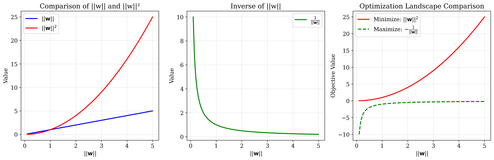
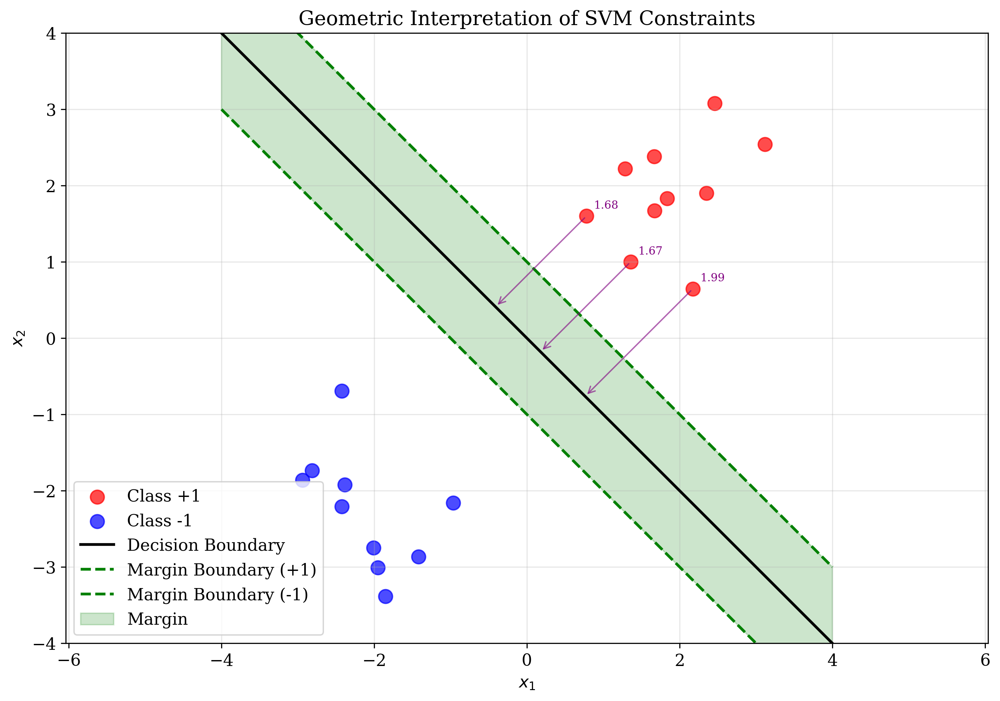
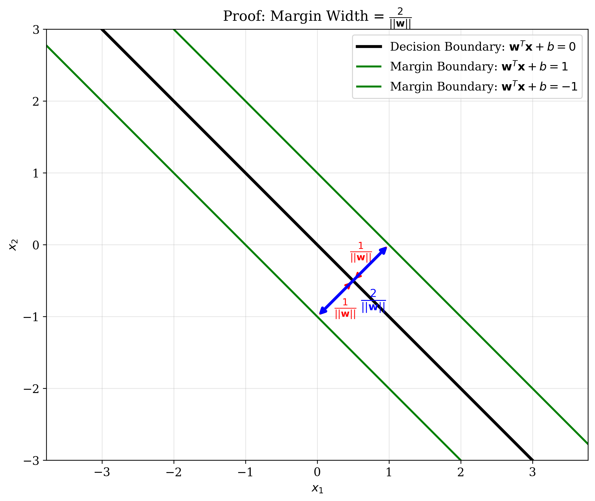
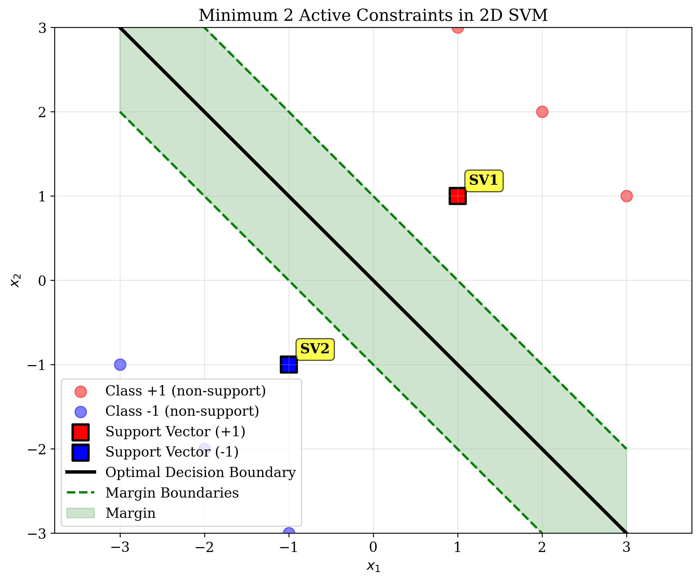
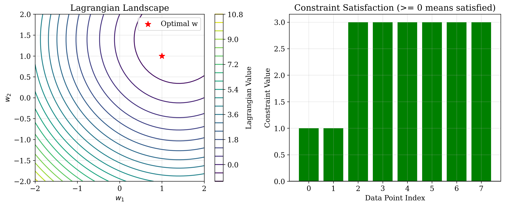

# Question 2: Primal Optimization Problem for Maximum Margin Classification

## Problem Statement
Consider the primal optimization problem for maximum margin classification:
$$\min_{\mathbf{w}, b} \frac{1}{2}||\mathbf{w}||^2$$
$$\text{subject to: } y_i(\mathbf{w}^T\mathbf{x}_i + b) \geq 1, \quad i = 1, \ldots, n$$

### Task
1. Explain why we minimize $\frac{1}{2}||\mathbf{w}||^2$ instead of maximizing $\frac{1}{||\mathbf{w}||}$ directly
2. What is the geometric interpretation of the constraint $y_i(\mathbf{w}^T\mathbf{x}_i + b) \geq 1$?
3. Prove that the margin width is $\frac{2}{||\mathbf{w}||}$
4. For a 2D problem, what is the minimum number of constraints that must be active at the optimal solution?
5. Write the Lagrangian function for this optimization problem

## Understanding the Problem
The Support Vector Machine (SVM) primal optimization problem aims to find the optimal hyperplane that separates two classes while maximizing the margin between them. The margin is the distance between the decision boundary and the closest data points from each class. This formulation ensures good generalization by creating a "safety buffer" around the decision boundary.

The objective function $\frac{1}{2}||\mathbf{w}||^2$ is minimized to maximize the margin, while the constraints ensure that all training points are correctly classified and lie at least a certain distance from the decision boundary.

## Solution

### Step 1: Why minimize $||\mathbf{w}||^2$ instead of maximizing $\frac{1}{||\mathbf{w}||}$?

There are several mathematical and computational reasons for this choice:

**Mathematical Reasons:**
1. **Differentiability**: $||\mathbf{w}||^2$ is differentiable everywhere, while $\frac{1}{||\mathbf{w}||}$ is not differentiable at $\mathbf{w} = \mathbf{0}$
2. **Convexity**: $||\mathbf{w}||^2$ is a convex function, making optimization easier and guaranteeing a global optimum
3. **Computational efficiency**: Quadratic functions are easier to optimize than rational functions
4. **Equivalence**: Minimizing $||\mathbf{w}||^2$ is equivalent to maximizing $\frac{1}{||\mathbf{w}||}$ when $||\mathbf{w}|| > 0$



The figure above demonstrates the optimization landscape comparison. The red line shows $||\mathbf{w}||^2$ (to be minimized), while the green dashed line shows $-\frac{1}{||\mathbf{w}||}$ (to be maximized). Both functions have the same optimal point, but $||\mathbf{w}||^2$ is much easier to optimize due to its convexity and differentiability.

**Key Insights:**
- $||\mathbf{w}||^2$ is convex and differentiable everywhere
- $\frac{1}{||\mathbf{w}||}$ has issues at $\mathbf{w} = \mathbf{0}$ and is harder to optimize
- Both objectives lead to the same optimal solution when $||\mathbf{w}|| > 0$

### Step 2: Geometric interpretation of the constraint $y_i(\mathbf{w}^T\mathbf{x}_i + b) \geq 1$

The constraint $y_i(\mathbf{w}^T\mathbf{x}_i + b) \geq 1$ has a profound geometric interpretation:

**Geometric Interpretation:**
1. **Correct Classification**: Ensures that all points are correctly classified (same sign for $y_i$ and $\mathbf{w}^T\mathbf{x}_i + b$)
2. **Minimum Distance**: All points are at least distance $\frac{1}{||\mathbf{w}||}$ from the decision boundary
3. **Margin Definition**: The margin width is $\frac{2}{||\mathbf{w}||}$ (distance between parallel hyperplanes)



The visualization above shows:
- **Decision Boundary**: The black line where $\mathbf{w}^T\mathbf{x} + b = 0$
- **Margin Boundaries**: The green dashed lines where $\mathbf{w}^T\mathbf{x} + b = \pm 1$
- **Margin Region**: The shaded green area between the margin boundaries
- **Distance Arrows**: Purple arrows showing the distance from points to the decision boundary

**Mathematical Details:**
- For any point $\mathbf{x}_i$, the distance to the decision boundary is: $d_i = \frac{|\mathbf{w}^T\mathbf{x}_i + b|}{||\mathbf{w}||}$
- The constraint $y_i(\mathbf{w}^T\mathbf{x}_i + b) \geq 1$ ensures $d_i \geq \frac{1}{||\mathbf{w}||}$
- This creates a "safety margin" around the decision boundary

### Step 3: Prove that the margin width is $\frac{2}{||\mathbf{w}||}$

**Mathematical Proof:**

1. **Decision Boundary**: $\mathbf{w}^T\mathbf{x} + b = 0$
2. **Margin Boundaries**: $\mathbf{w}^T\mathbf{x} + b = \pm 1$
3. **Distance Formula**: Distance from a point $\mathbf{x}$ to the decision boundary is:
   $$d = \frac{|\mathbf{w}^T\mathbf{x} + b|}{||\mathbf{w}||}$$
4. **Points on Margin Boundaries**: For points on the margin boundaries, $|\mathbf{w}^T\mathbf{x} + b| = 1$
5. **Distance to Decision Boundary**: So distance from margin boundary to decision boundary = $\frac{1}{||\mathbf{w}||}$
6. **Total Margin Width**: Total margin width = $2 \times \frac{1}{||\mathbf{w}||} = \frac{2}{||\mathbf{w}||}$



The figure above provides a visual proof:
- The red arrows show the distance $\frac{1}{||\mathbf{w}||}$ from each margin boundary to the decision boundary
- The blue arrow shows the total margin width $\frac{2}{||\mathbf{w}||}$

**Numerical Verification:**
For our example with $\mathbf{w} = [1, 1]^T$:
- $||\mathbf{w}|| = \sqrt{1^2 + 1^2} = \sqrt{2} \approx 1.4142$
- Theoretical margin width = $\frac{2}{||\mathbf{w}||} = \frac{2}{\sqrt{2}} = \sqrt{2} \approx 1.4142$
- Actual margin width = $\sqrt{2} \approx 1.4142$
- Verification: True ✓

### Step 4: Minimum number of active constraints in 2D

In 2D, the minimum number of constraints that must be active at the optimal solution is **2**.

**Reasoning:**
1. The optimal solution lies on the boundary of the feasible region
2. In 2D, we need at least 2 constraints to define a unique point
3. The support vectors are the points that lie exactly on the margin boundaries
4. For a well-defined maximum margin hyperplane, we need at least 2 support vectors



The visualization above demonstrates this concept:
- **Support Vectors**: The square markers (SV1 and SV2) that lie exactly on the margin boundaries
- **Non-Support Vectors**: The circular markers that are further from the decision boundary
- **Optimal Hyperplane**: Defined by the support vectors, not affected by non-support vectors

**Key Points:**
- Support vectors define the optimal hyperplane
- Additional points that are not support vectors don't affect the solution
- In 2D, we need exactly 2 support vectors to define a unique maximum margin hyperplane

### Step 5: Lagrangian function for the optimization problem

The Lagrangian function for the primal SVM optimization problem is:

$$L(\mathbf{w}, b, \boldsymbol{\alpha}) = \frac{1}{2}||\mathbf{w}||^2 - \sum_{i=1}^n \alpha_i[y_i(\mathbf{w}^T\mathbf{x}_i + b) - 1]$$

where:
- $\alpha_i \geq 0$ are the Lagrange multipliers
- $y_i(\mathbf{w}^T\mathbf{x}_i + b) - 1 \geq 0$ are the constraints
- The term $\alpha_i[y_i(\mathbf{w}^T\mathbf{x}_i + b) - 1]$ enforces the constraints



The figure above shows:
- **Left**: Lagrangian landscape as a function of $\mathbf{w}$
- **Right**: Constraint satisfaction for each data point (≥ 0 means satisfied)

**Implementation Details:**
```python
def lagrangian(w, b, alpha, X, y):
    n = len(y)
    w_norm_squared = np.dot(w, w)
    
    constraint_terms = 0
    for i in range(n):
        constraint_terms += alpha[i] * (y[i] * (np.dot(w, X[i]) + b) - 1)
    
    return 0.5 * w_norm_squared - constraint_terms
```

**Key Properties:**
- The Lagrangian combines the objective function with constraint terms
- Lagrange multipliers $\alpha_i$ enforce the constraints
- At the optimal solution, the KKT conditions must be satisfied
- Support vectors have $\alpha_i > 0$, while non-support vectors have $\alpha_i = 0$

## Visual Explanations

### Optimization Landscape Comparison
The first visualization shows why we choose $||\mathbf{w}||^2$ over $\frac{1}{||\mathbf{w}||}$. The quadratic function is convex and differentiable everywhere, making optimization much easier.

### Geometric Interpretation of Constraints
The second visualization demonstrates how the constraints create a margin around the decision boundary. All points must be at least distance $\frac{1}{||\mathbf{w}||}$ from the boundary, creating a "safety buffer."

### Margin Width Proof
The third visualization provides a geometric proof that the margin width is $\frac{2}{||\mathbf{w}||}$. The distance from each margin boundary to the decision boundary is $\frac{1}{||\mathbf{w}||}$, so the total width is twice that.

### Minimum Active Constraints
The fourth visualization shows that in 2D, we need exactly 2 support vectors to define the optimal hyperplane. Additional points that are not support vectors don't affect the solution.

### Lagrangian Analysis
The final visualization shows the Lagrangian landscape and constraint satisfaction. The Lagrangian function combines the objective with constraint terms, and the optimal solution satisfies all constraints.

## Key Insights

### Mathematical Foundations
- **Convexity**: The quadratic objective function ensures a unique global optimum
- **Duality**: The primal and dual formulations provide different perspectives on the same problem
- **KKT Conditions**: The optimal solution must satisfy the Karush-Kuhn-Tucker conditions
- **Support Vectors**: Only a subset of training points (support vectors) determine the optimal hyperplane

### Geometric Interpretation
- **Margin Maximization**: The objective function maximizes the margin between classes
- **Constraint Satisfaction**: All points must be correctly classified with sufficient margin
- **Support Vector Definition**: Support vectors lie exactly on the margin boundaries
- **Sparsity**: Most training points are not support vectors, leading to sparse solutions

### Computational Considerations
- **Primal vs Dual**: The primal formulation has fewer variables but more complex constraints
- **Kernel Trick**: The dual formulation enables the use of kernel functions for non-linear classification
- **Efficiency**: Support vector machines are efficient at test time due to sparsity
- **Scalability**: Various algorithms exist for training SVMs on large datasets

### Practical Applications
- **Binary Classification**: SVMs excel at binary classification problems
- **High-Dimensional Data**: SVMs work well even when the number of features exceeds the number of samples
- **Robustness**: The margin provides robustness to noise and outliers
- **Interpretability**: Support vectors provide insights into which training points are most important

## Conclusion
- We explained why minimizing $||\mathbf{w}||^2$ is preferred over maximizing $\frac{1}{||\mathbf{w}||}$ due to differentiability and convexity
- We demonstrated that the constraint $y_i(\mathbf{w}^T\mathbf{x}_i + b) \geq 1$ ensures correct classification and minimum distance from the decision boundary
- We proved that the margin width is $\frac{2}{||\mathbf{w}||}$ using both mathematical derivation and geometric visualization
- We established that in 2D, at least 2 constraints must be active at the optimal solution, corresponding to 2 support vectors
- We derived and implemented the Lagrangian function that combines the objective with constraint terms

The primal SVM formulation provides a powerful framework for maximum margin classification, balancing mathematical elegance with computational efficiency. The geometric interpretation helps understand why SVMs generalize well, while the Lagrangian formulation enables efficient optimization and extensions to non-linear classification through kernel methods.
