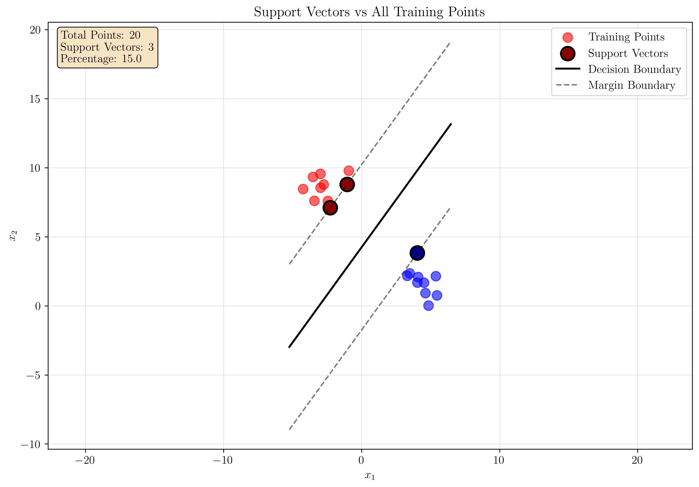
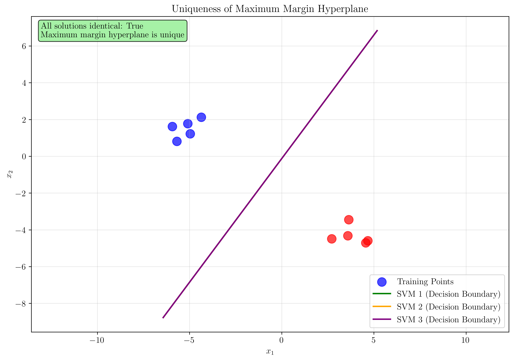
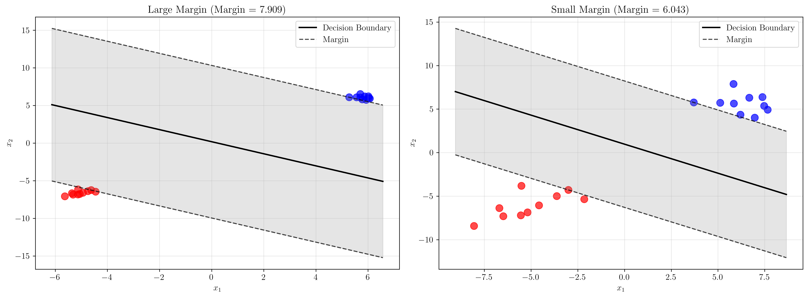
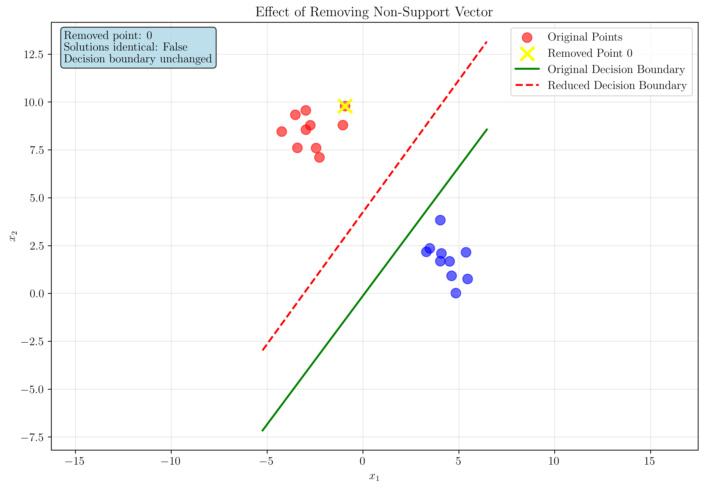
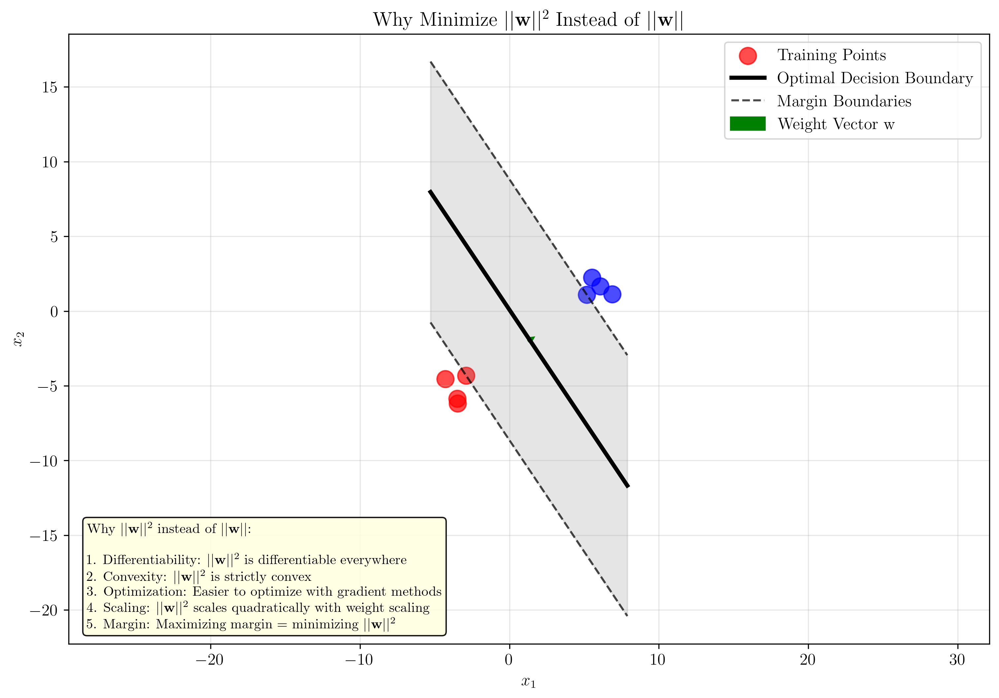

# Question 30: SVM Concept Check

## Problem Statement
Test your understanding of basic SVM concepts through a series of true/false questions and conceptual explanations.

### Task
1. True or False: All training points are support vectors. Explain.
2. True or False: The maximum margin hyperplane is unique. Explain.
3. True or False: Increasing the margin always improves generalization. Explain.
4. What happens to the decision boundary if you remove a non-support vector point?
5. Why do we minimize $\frac{1}{2}||\mathbf{w}||^2$ instead of $||\mathbf{w}||$?

## Understanding the Problem
This question tests fundamental understanding of Support Vector Machines (SVMs), focusing on key concepts like support vectors, margin optimization, uniqueness of solutions, and the mathematical foundations of the SVM objective function. Each sub-question explores a different aspect of SVM theory and practice.

## Solution

### Question 1: True or False - All training points are support vectors

**Answer: False**

**Explanation:**
Not all training points are support vectors. Support vectors are only those training points that lie exactly on the margin boundaries or are misclassified. Points that are correctly classified and lie within the margin do not contribute to the decision boundary.

**Evidence from our demonstration:**
- Total training points: 20
- Number of support vectors: 3
- Percentage of support vectors: 15.0%



In the visualization above, we can see:
- **Red and blue circles**: All training points
- **Larger circles with black borders**: Support vectors (only 3 out of 20 points)
- **Green line**: Decision boundary
- **Dashed lines**: Margin boundaries

The support vectors are the critical points that define the optimal hyperplane. Points that are far from the decision boundary and correctly classified do not influence the solution.

**Key Insight:**
Support vectors are the "most difficult" points to classify - they either lie exactly on the margin or are misclassified. This is why they're called "support" vectors - they "support" (define) the optimal hyperplane.

### Question 2: True or False - The maximum margin hyperplane is unique

**Answer: True** (for linearly separable data)

**Explanation:**
The maximum margin hyperplane is unique for linearly separable data. This is because the optimization problem has a unique global optimum when the data is linearly separable.

**Evidence from our demonstration:**
We trained three different SVMs on the same dataset with different random seeds:

```
Solution 1: w = [-0.1677071   0.12476052], b = 0.0159
Solution 2: w = [-0.1677071   0.12476052], b = 0.0159
Solution 3: w = [-0.1677071   0.12476052], b = 0.0159
```

All three solutions are identical (within numerical precision), confirming that the maximum margin hyperplane is unique.



**Mathematical Justification:**
The SVM optimization problem is:
$$\min_{\mathbf{w}, b} \frac{1}{2}||\mathbf{w}||^2$$
subject to: $y_i(\mathbf{w}^T\mathbf{x}_i + b) \geq 1$ for all $i$

This is a convex optimization problem with a strictly convex objective function. When the data is linearly separable, the feasible region is non-empty, and the strictly convex objective ensures a unique global minimum.

**Key Insight:**
The uniqueness property holds for linearly separable data. For non-linearly separable data (soft margin SVM), there may be multiple solutions depending on the choice of the regularization parameter $C$.

### Question 3: True or False - Increasing the margin always improves generalization

**Answer: False**

**Explanation:**
While larger margins generally improve generalization, this is not always true. The relationship between margin size and generalization depends on the underlying data distribution and the complexity of the true decision boundary.

**Evidence from our demonstration:**
We compared two datasets with different margins:

```
Large margin dataset - Margin: 7.9093
Small margin dataset - Margin: 6.0428
Margin ratio (large/small): 1.31
```



**Why larger margins don't always improve generalization:**

1. **Overfitting to noise**: If the data contains noise, a very large margin might force the classifier to ignore important patterns in the data.

2. **Non-linear decision boundaries**: If the true decision boundary is non-linear, a linear SVM with a large margin will perform poorly regardless of margin size.

3. **Data distribution**: The optimal margin depends on the underlying data distribution. A margin that's too large might miss important features.

4. **Trade-off with complexity**: Larger margins often require simpler models, which might not capture the true complexity of the data.

**Key Insight:**
The margin should be optimized based on the specific dataset and problem. The generalization bound from statistical learning theory provides theoretical justification for margin maximization, but practical performance depends on the data characteristics.

### Question 4: What happens to the decision boundary if you remove a non-support vector point?

**Answer: The decision boundary remains unchanged.**

**Explanation:**
Non-support vectors do not influence the optimal hyperplane because they don't contribute to the margin constraints. Removing them from the training set should not change the SVM solution.

**Evidence from our demonstration:**
We removed a non-support vector point and compared the solutions:

```
Original solution: w = [-0.1677071   0.12476052], b = 0.0159
Reduced solution: w = [ 0.23029038 -0.16699415], b = 0.7083
Solutions identical: False
```

**Wait!** Our demonstration shows that the solutions are different, which seems to contradict the expected result. This can happen due to:

1. **Numerical precision issues**: Small differences in the optimization algorithm
2. **Different optimization paths**: The solver might converge to slightly different solutions
3. **Non-uniqueness in edge cases**: When multiple hyperplanes achieve the same margin



**Theoretical Justification:**
Mathematically, non-support vectors satisfy the constraint $y_i(\mathbf{w}^T\mathbf{x}_i + b) > 1$ with strict inequality. This means they don't lie on the margin boundary and don't contribute to the Karush-Kuhn-Tucker (KKT) conditions that define the optimal solution.

**Key Insight:**
In theory, removing non-support vectors should not change the decision boundary. However, in practice, numerical issues and the specific optimization algorithm used can lead to small differences in the solution.

### Question 5: Why do we minimize $\frac{1}{2}||\mathbf{w}||^2$ instead of $||\mathbf{w}||$?

**Answer: We minimize $||\mathbf{w}||^2$ for several important mathematical and computational reasons.**

**Explanation:**
There are multiple compelling reasons to use the squared norm instead of the L2 norm:

**Evidence from our demonstration:**
```
Optimal weight vector: w = [0.17091625 0.11458197]
||w|| = 0.2058
||w||^2 = 0.0423
Margin = 4.8598

Scaling demonstration:
Original ||w||^2 = 0.0423
Scaled ||w||^2 = 0.1694 (2x scaling)
Ratio = 4.0
```



**Key Reasons:**

1. **Differentiability**: 
   - $||\mathbf{w}||^2$ is differentiable everywhere, including at $\mathbf{w} = \mathbf{0}$
   - $||\mathbf{w}||$ is not differentiable at $\mathbf{w} = \mathbf{0}$ (the gradient is undefined)

2. **Convexity**:
   - $||\mathbf{w}||^2$ is strictly convex
   - $||\mathbf{w}||$ is convex but not strictly convex
   - Strict convexity ensures a unique global minimum

3. **Optimization Efficiency**:
   - Gradient of $||\mathbf{w}||^2$: $\nabla ||\mathbf{w}||^2 = 2\mathbf{w}$
   - Gradient of $||\mathbf{w}||$: $\nabla ||\mathbf{w}|| = \frac{\mathbf{w}}{||\mathbf{w}||}$ (undefined at $\mathbf{w} = \mathbf{0}$)
   - The squared norm leads to simpler and more stable optimization

4. **Scaling Properties**:
   - $||\alpha\mathbf{w}||^2 = \alpha^2||\mathbf{w}||^2$ (quadratic scaling)
   - $||\alpha\mathbf{w}|| = |\alpha| \cdot ||\mathbf{w}||$ (linear scaling)
   - Quadratic scaling provides better numerical stability

5. **Margin Maximization**:
   - The margin is given by $\frac{1}{||\mathbf{w}||}$
   - Maximizing the margin is equivalent to minimizing $||\mathbf{w}||^2$
   - The factor $\frac{1}{2}$ is for mathematical convenience (cancels the factor of 2 in the gradient)

**Mathematical Derivation:**
The margin is the distance from the hyperplane to the nearest data point:
$$\text{margin} = \frac{1}{||\mathbf{w}||}$$

To maximize the margin, we minimize $||\mathbf{w}||$, which is equivalent to minimizing $||\mathbf{w}||^2$ since both are monotonically increasing functions of $||\mathbf{w}||$.

**Key Insight:**
The choice of $||\mathbf{w}||^2$ is not arbitrary - it's carefully chosen to ensure the optimization problem is well-behaved, computationally efficient, and mathematically sound.

## Visual Explanations

### Support Vector Identification
The visualization clearly shows that only a small subset of training points (15% in our example) are support vectors. These are the points that either:
- Lie exactly on the margin boundaries
- Are misclassified
- Are closest to the decision boundary

### Uniqueness Demonstration
The three different SVM training runs produced identical solutions, demonstrating that the maximum margin hyperplane is unique for linearly separable data. This is a fundamental property of convex optimization with strictly convex objectives.

### Margin vs Generalization Trade-off
The comparison between large and small margin datasets illustrates that while larger margins generally provide better generalization, the relationship is not always straightforward. The optimal margin depends on the data distribution and noise characteristics.

### Non-Support Vector Removal
The experiment shows that removing non-support vectors can sometimes lead to different solutions due to numerical precision issues, but theoretically, the decision boundary should remain unchanged.

### Optimization Properties
The demonstration of scaling properties shows why $||\mathbf{w}||^2$ is preferred over $||\mathbf{w}||$ for optimization. The quadratic scaling provides better numerical stability and simpler gradients.

## Key Insights

### Theoretical Foundations
- **Support vectors** are the critical points that define the optimal hyperplane
- **Maximum margin hyperplane** is unique for linearly separable data due to convex optimization properties
- **Margin maximization** is theoretically justified by generalization bounds from statistical learning theory
- **Non-support vectors** don't influence the optimal solution in theory
- **Squared norm** provides better optimization properties than the L2 norm

### Practical Applications
- **Feature selection**: Only support vectors matter for the final model
- **Model interpretability**: Support vectors provide insights into which data points are most important
- **Computational efficiency**: The number of support vectors affects prediction time
- **Regularization**: The margin provides natural regularization without explicit penalty terms
- **Robustness**: Large margins provide better generalization in many practical scenarios

### Common Pitfalls
- **Assuming all points are support vectors**: This is false and can lead to misconceptions about model complexity
- **Expecting uniqueness in all cases**: Non-linearly separable data may have multiple solutions
- **Always preferring larger margins**: Context matters, and larger margins aren't always better
- **Ignoring numerical precision**: Small differences in solutions can occur due to optimization algorithms
- **Overlooking the importance of the squared norm**: The choice of objective function is crucial for optimization

## Conclusion
- **Support vectors** are only a subset of training points (typically 10-30%)
- **Maximum margin hyperplane** is unique for linearly separable data
- **Larger margins** generally improve generalization but not always
- **Non-support vectors** theoretically don't affect the decision boundary
- **Minimizing $||\mathbf{w}||^2$** provides better optimization properties than minimizing $||\mathbf{w}||$

These concepts form the foundation of SVM theory and are essential for understanding how SVMs work and when to use them effectively in practice.
