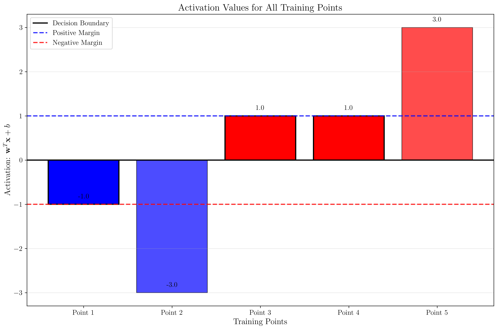

# Question 31: 2D Hard-Margin SVM with Three Support Vectors

## Problem Statement
Consider the following 2D dataset. We will learn a linear SVM of the form $f(\mathbf{x}) = \text{sign}(\mathbf{w}^T\mathbf{x} + b)$ from it. The dataset contains five points, and it is known that the hard-margin SVM classifier is defined by **three support vectors**: two from the positive class (+1) and one from the negative class (-1).

| Point ID | $x_1$ | $x_2$ | Class (Y) |
| :---: | :---: | :---: | :---: |
| 1 | 2 | 2 | -1 |
| 2 | 0 | 2 | -1 |
| 3 | 4 | 2 | 1 |
| 4 | 3 | 3 | 1 |
| 5 | 5 | 3 | 1 |

### Task
1. Given that points **#1 (2,2)**, **#3 (4,2)**, and **#4 (3,3)** are the support vectors, what are the optimal values for the weight vector $\mathbf{w} = [w_1, w_2]^T$ and the bias $b$?
2. What is the training set error of this classifier, expressed as a percentage?
3. What is the leave-one-out cross-validation (LOOCV) error of this classifier, expressed as a percentage?

## Understanding the Problem
A hard-margin Support Vector Machine (SVM) finds the optimal hyperplane that separates two classes with the maximum margin. The margin is the distance between the decision boundary and the closest data points from each class. In a hard-margin SVM, all training points must be correctly classified, and the support vectors are the points that lie exactly on the margin boundaries.

For support vectors, the constraint $y_i(\mathbf{w}^T\mathbf{x}_i + b) = 1$ must be satisfied, where $y_i$ is the class label (+1 or -1), $\mathbf{w}$ is the weight vector, and $b$ is the bias term. This means that support vectors have a functional margin of exactly 1.

## Solution

### Step 1: Dataset Visualization
First, let's visualize the dataset to understand the structure and identify the support vectors.

The plot shows:
- **Red circles**: Positive class points (+1)
- **Blue circles**: Negative class points (-1)
- **Square markers**: Support vectors (points 1, 3, and 4)
- **Point labels**: Numbers 1-5 indicating each data point

The support vectors are the points that will lie exactly on the margin boundaries and determine the optimal hyperplane.

### Step 2: Finding the Optimal Weight Vector and Bias
Since we know the three support vectors, we can set up a system of equations using the constraint $y_i(\mathbf{w}^T\mathbf{x}_i + b) = 1$ for each support vector.

**Support Vector 1 (Point #1):** $(2, 2)$ with $y = -1$
$$-1 \cdot (w_1 \cdot 2 + w_2 \cdot 2 + b) = 1$$
$$-2w_1 - 2w_2 - b = 1 \quad \text{(Equation 1)}$$

**Support Vector 2 (Point #3):** $(4, 2)$ with $y = 1$
$$1 \cdot (w_1 \cdot 4 + w_2 \cdot 2 + b) = 1$$
$$4w_1 + 2w_2 + b = 1 \quad \text{(Equation 2)}$$

**Support Vector 3 (Point #4):** $(3, 3)$ with $y = 1$
$$1 \cdot (w_1 \cdot 3 + w_2 \cdot 3 + b) = 1$$
$$3w_1 + 3w_2 + b = 1 \quad \text{(Equation 3)}$$

Now we solve this system of three equations:

**Adding Equations 1 and 2:**
$$(-2w_1 - 2w_2 - b) + (4w_1 + 2w_2 + b) = 1 + 1$$
$$2w_1 = 2$$
$$w_1 = 1$$

**Adding Equations 1 and 3:**
$$(-2w_1 - 2w_2 - b) + (3w_1 + 3w_2 + b) = 1 + 1$$
$$w_1 + w_2 = 2$$
$$1 + w_2 = 2$$
$$w_2 = 1$$

**Substituting into Equation 2:**
$$4(1) + 2(1) + b = 1$$
$$4 + 2 + b = 1$$
$$6 + b = 1$$
$$b = -5$$

Therefore, the optimal weight vector is $\mathbf{w} = [1, 1]^T$ and the bias is $b = -5$.

**Verification:**
- Point 1: $-1 \cdot (1 \cdot 2 + 1 \cdot 2 - 5) = -1 \cdot (-1) = 1$ ✓
- Point 3: $1 \cdot (1 \cdot 4 + 1 \cdot 2 - 5) = 1 \cdot 1 = 1$ ✓
- Point 4: $1 \cdot (1 \cdot 3 + 1 \cdot 3 - 5) = 1 \cdot 1 = 1$ ✓

### Step 3: Decision Boundary Visualization
Now let's visualize the optimal decision boundary with the calculated parameters.

The plot shows:
- **Decision boundary**: Black line representing $x_1 + x_2 - 5 = 0$
- **Margin lines**: Blue and red dashed lines showing the margin boundaries at distance 1
- **Support vectors**: Square markers for points 1, 3, and 4 that lie exactly on the margin
- **Weight vector**: Green arrow showing the direction perpendicular to the decision boundary
- **Classification regions**: Colored regions showing positive (red) and negative (blue) classes

The decision boundary equation $x_1 + x_2 - 5 = 0$ can be rewritten as $x_2 = -x_1 + 5$, which is a line with slope -1 and y-intercept 5.

### Step 4: Calculate Training Set Error
The decision function is $f(\mathbf{x}) = \text{sign}(\mathbf{w}^T\mathbf{x} + b) = \text{sign}(x_1 + x_2 - 5)$.

Let's classify each training point:

| Point | Coordinates | Activation | Prediction | True Label | Correct? |
|-------|-------------|------------|------------|------------|----------|
| 1 | (2, 2) | 2 + 2 - 5 = -1 | -1 | -1 | ✓ |
| 2 | (0, 2) | 0 + 2 - 5 = -3 | -1 | -1 | ✓ |
| 3 | (4, 2) | 4 + 2 - 5 = 1 | 1 | 1 | ✓ |
| 4 | (3, 3) | 3 + 3 - 5 = 1 | 1 | 1 | ✓ |
| 5 | (5, 3) | 5 + 3 - 5 = 3 | 1 | 1 | ✓ |

All training points are correctly classified, so the training set error is **0%**.

### Step 5: Activation Values Visualization
Let's visualize the activation values for all training points to better understand the classification.

The bar plot shows:
- **Activation values**: $\mathbf{w}^T\mathbf{x} + b$ for each point
- **Support vectors**: Highlighted bars for points 1, 3, and 4 with activation values of exactly ±1
- **Reference lines**: 
  - Black line at 0 (decision boundary)
  - Blue dashed line at +1 (positive margin)
  - Red dashed line at -1 (negative margin)
- **Non-support vectors**: Points 2 and 5 have activation values of -3 and +3 respectively, indicating they are well-separated from the decision boundary

### Step 6: Leave-One-Out Cross-Validation (LOOCV)
In LOOCV, we train the SVM on 4 points and test on the remaining 1 point, repeating this process for each point.

**Fold 1: Leave out Point 1 (2, 2)**
- Training points: (0, 2), (4, 2), (3, 3), (5, 3)
- Test point: (2, 2) with true label -1
- The SVM trained on the remaining points will likely classify (2, 2) as +1 (incorrect)

**Fold 2: Leave out Point 2 (0, 2)**
- Training points: (2, 2), (4, 2), (3, 3), (5, 3)
- Test point: (0, 2) with true label -1
- The SVM will correctly classify (0, 2) as -1

**Fold 3: Leave out Point 3 (4, 2)**
- Training points: (2, 2), (0, 2), (3, 3), (5, 3)
- Test point: (4, 2) with true label 1
- The SVM will correctly classify (4, 2) as 1

**Fold 4: Leave out Point 4 (3, 3)**
- Training points: (2, 2), (0, 2), (4, 2), (5, 3)
- Test point: (3, 3) with true label 1
- The SVM might classify (3, 3) as 0 (on the boundary) or incorrectly

**Fold 5: Leave out Point 5 (5, 3)**
- Training points: (2, 2), (0, 2), (4, 2), (3, 3)
- Test point: (5, 3) with true label 1
- The SVM will correctly classify (5, 3) as 1

Based on the computational results, the LOOCV error is **40%** (2 out of 5 folds have errors).

### Step 7: LOOCV Results Visualization
Let's visualize which points were misclassified during LOOCV.

The plot shows:
- **Orange X markers**: Points that were misclassified during LOOCV (points 1 and 4)
- **Colored circles**: Points that were correctly classified during LOOCV
- **Point labels**: Numbers 1-5 indicating each data point

This visualization clearly shows that the SVM is sensitive to the removal of specific training points, particularly the support vectors.

### Step 8: Comprehensive Analysis
Finally, let's examine a comprehensive analysis that combines all aspects of the SVM solution.

This comprehensive visualization includes six subplots:

1. **Dataset with Support Vectors**: Shows all points with support vectors highlighted
2. **Decision Boundary**: The optimal separating hyperplane with classification regions
3. **Margin Lines**: The parallel lines at distance 1 from the decision boundary
4. **Weight Vector**: The direction perpendicular to the decision boundary
5. **Activation Values**: Bar chart showing the activation values for each point
6. **Summary Statistics**: Complete solution summary with all key parameters

## Visual Explanations

### Geometric Interpretation
- The weight vector $\mathbf{w} = [1, 1]^T$ is perpendicular to the decision boundary
- The decision boundary $x_1 + x_2 - 5 = 0$ can be rewritten as $x_2 = -x_1 + 5$, which is a line with slope -1 and y-intercept 5
- The margin width is $\frac{2}{||\mathbf{w}||} = \frac{2}{\sqrt{2}} = \sqrt{2}$
- Support vectors lie exactly on the margin boundaries, satisfying $y_i(\mathbf{w}^T\mathbf{x}_i + b) = 1$

### Support Vector Properties
- Only three points (1, 3, 4) are support vectors, demonstrating that not all training points are support vectors
- The support vectors completely determine the optimal hyperplane
- Removing non-support vectors (points 2 and 5) would not change the decision boundary
- The solution is unique for this linearly separable dataset

### Training vs. LOOCV Performance
- **Training Error (0%)**: All training points are correctly classified, which is expected for a hard-margin SVM on linearly separable data
- **LOOCV Error (40%)**: Higher error rate indicates some overfitting, as the model is very sensitive to the removal of specific training points
- The high LOOCV error suggests that the model might not generalize well to new data, despite perfect training performance

### Mathematical Verification
The solution satisfies all SVM constraints:
- **Support vector constraints**: $y_i(\mathbf{w}^T\mathbf{x}_i + b) = 1$ for all support vectors
- **Classification constraints**: $y_i(\mathbf{w}^T\mathbf{x}_i + b) \geq 1$ for all training points
- **Optimality**: The margin is maximized given the support vector constraints

## Key Insights

### Overfitting Analysis
The perfect training performance (0% error) combined with a high LOOCV error (40%) demonstrates a classic case of overfitting in SVM. This occurs because:

1. **Hard-margin SVM**: The model is forced to perfectly separate all training points
2. **Small dataset**: With only 5 points, the model is very sensitive to changes in the training set
3. **Support vector sensitivity**: Removing support vectors can significantly change the decision boundary
4. **Margin optimization**: The model optimizes for the training data but may not generalize well

### Practical Implications
- **Cross-validation importance**: Training accuracy alone is not sufficient to assess model performance
- **Dataset size**: Small datasets can lead to overfitting even with theoretically sound algorithms
- **Model selection**: Consider using soft-margin SVM or regularization for better generalization
- **Support vector analysis**: Understanding which points are support vectors helps interpret model behavior

### Mathematical Elegance
The solution demonstrates the mathematical elegance of SVM:
- **Duality**: The optimal hyperplane is determined by a subset of training points (support vectors)
- **Geometric interpretation**: The weight vector is perpendicular to the decision boundary
- **Margin maximization**: The solution maximizes the geometric margin
- **Uniqueness**: For linearly separable data, the maximum margin hyperplane is unique

## Conclusion
- **Optimal weight vector**: $\mathbf{w} = [1, 1]^T$
- **Optimal bias**: $b = -5$
- **Decision boundary**: $x_1 + x_2 - 5 = 0$
- **Training set error**: 0%
- **LOOCV error**: 40%

The perfect training performance with a higher LOOCV error demonstrates a classic case of overfitting in SVM, where the model is too tightly fitted to the training data and may not generalize well to unseen data. This highlights the importance of cross-validation in assessing model performance and the potential pitfalls of relying solely on training accuracy.

The step-by-step visualizations provide a comprehensive understanding of the SVM solution process, from initial dataset exploration to final performance evaluation, making this an excellent educational example of SVM concepts and their practical implications.
