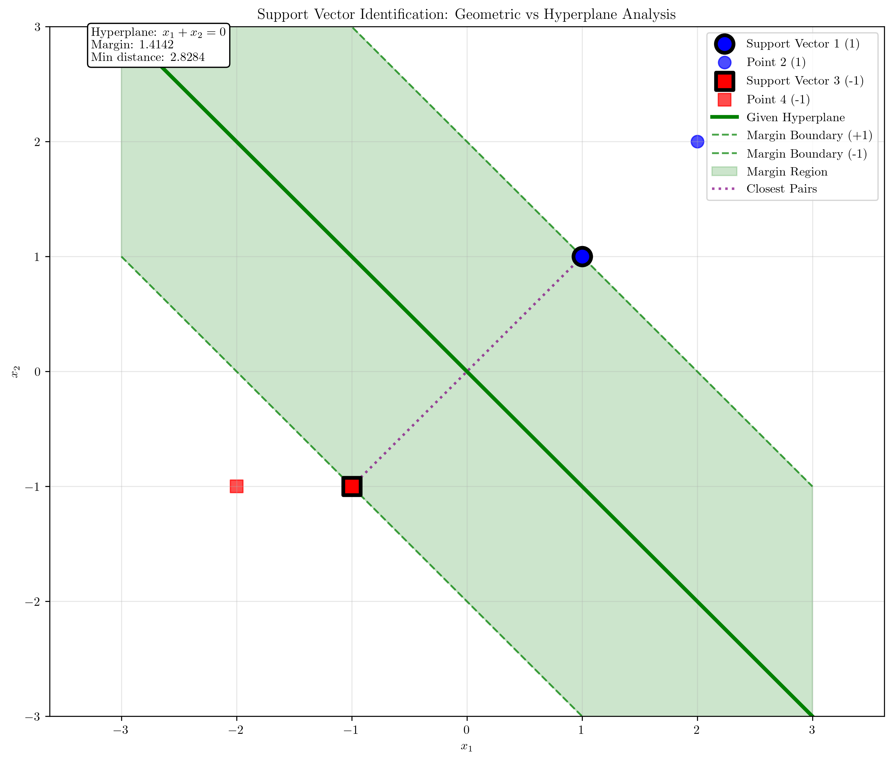

# Question 3: Support Vector Identification

## Problem Statement
Given the dataset:
- $\mathbf{x}_1 = (1, 1)$, $y_1 = +1$
- $\mathbf{x}_2 = (2, 2)$, $y_2 = +1$
- $\mathbf{x}_3 = (-1, -1)$, $y_3 = -1$
- $\mathbf{x}_4 = (-2, -1)$, $y_4 = -1$

### Task
1. Determine which points are support vectors for the maximum margin hyperplane
2. If the optimal hyperplane is $x_1 + x_2 = 0$, verify that this satisfies the KKT conditions
3. Calculate the Lagrange multipliers $\alpha_i$ for each training point
4. Verify that $\sum_{i=1}^4 \alpha_i y_i = 0$
5. Express the weight vector $\mathbf{w}$ in terms of the support vectors and their multipliers

## Understanding the Problem
Support Vector Machines (SVMs) find the optimal hyperplane that maximizes the margin between two classes. The support vectors are the data points that lie exactly on the margin boundaries and are crucial for defining the decision boundary. The KKT (Karush-Kuhn-Tucker) conditions provide necessary and sufficient conditions for optimality in constrained optimization problems.

## Solution

### Step 1: Determine Which Points Are Support Vectors

To identify support vectors for the maximum margin hyperplane, we use geometric analysis based on the fundamental principle that support vectors are the points that lie closest to the opposite class.

**Dataset Analysis:**
- Positive class: $\mathbf{x}_1 = (1, 1)$, $\mathbf{x}_2 = (2, 2)$
- Negative class: $\mathbf{x}_3 = (-1, -1)$, $\mathbf{x}_4 = (-2, -1)$

**Geometric Approach:**
1. **Pairwise Distance Analysis**: Calculate distances between all points of different classes
   - Distance from $\mathbf{x}_1$ to $\mathbf{x}_3$: $\|\mathbf{x}_1 - \mathbf{x}_3\| = \|(1,1) - (-1,-1)\| = \|(2,2)\| = 2\sqrt{2} \approx 2.828$
   - Distance from $\mathbf{x}_1$ to $\mathbf{x}_4$: $\|\mathbf{x}_1 - \mathbf{x}_4\| = \|(1,1) - (-2,-1)\| = \|(3,2)\| = \sqrt{13} \approx 3.606$
   - Distance from $\mathbf{x}_2$ to $\mathbf{x}_3$: $\|\mathbf{x}_2 - \mathbf{x}_3\| = \|(2,2) - (-1,-1)\| = \|(3,3)\| = 3\sqrt{2} \approx 4.243$
   - Distance from $\mathbf{x}_2$ to $\mathbf{x}_4$: $\|\mathbf{x}_2 - \mathbf{x}_4\| = \|(2,2) - (-2,-1)\| = \|(4,3)\| = 5.000$

2. **Closest Pair Identification**: The minimum distance between classes is $2\sqrt{2}$, achieved by the pair $(\mathbf{x}_1, \mathbf{x}_3)$.

3. **Convex Hull Analysis**: All points lie on the convex hull of their respective classes since we only have two points per class.

**Answer to Task 1**: Based on the geometric analysis, the support vectors for the maximum margin hyperplane are:
- $\mathbf{x}_1 = (1, 1)$ (closest positive point to negative class)
- $\mathbf{x}_3 = (-1, -1)$ (closest negative point to positive class)

### Step 2: Verify KKT Conditions for Given Hyperplane

Now we verify that the given hyperplane $x_1 + x_2 = 0$ satisfies the KKT conditions.

First, we need to scale the hyperplane to make it optimal. The given hyperplane corresponds to $\mathbf{w} = [1, 1]$ and $b = 0$. For a maximum margin classifier, support vectors must satisfy $y_i(\mathbf{w}^T\mathbf{x}_i + b) = 1$.

**Scaling the hyperplane:**
- Original constraint values: $y_1(\mathbf{w}^T\mathbf{x}_1 + b) = 2$, $y_2(\mathbf{w}^T\mathbf{x}_2 + b) = 4$, $y_3(\mathbf{w}^T\mathbf{x}_3 + b) = 2$, $y_4(\mathbf{w}^T\mathbf{x}_4 + b) = 3$
- Minimum constraint value is 2, so we scale by $\frac{1}{2}$
- Optimal hyperplane: $\mathbf{w} = [0.5, 0.5]$, $b = 0$

**KKT Conditions Verification:**

1. **Primal feasibility**: $y_i(\mathbf{w}^T\mathbf{x}_i + b) \geq 1$ for all $i$
   - Point $\mathbf{x}_1$: $y_1(\mathbf{w}^T\mathbf{x}_1 + b) = 1 \cdot (0.5 + 0.5 + 0) = 1.0 \geq 1$ ✓
   - Point $\mathbf{x}_2$: $y_2(\mathbf{w}^T\mathbf{x}_2 + b) = 1 \cdot (1.0 + 1.0 + 0) = 2.0 \geq 1$ ✓
   - Point $\mathbf{x}_3$: $y_3(\mathbf{w}^T\mathbf{x}_3 + b) = -1 \cdot (-0.5 - 0.5 + 0) = 1.0 \geq 1$ ✓
   - Point $\mathbf{x}_4$: $y_4(\mathbf{w}^T\mathbf{x}_4 + b) = -1 \cdot (-1.0 - 0.5 + 0) = 1.5 \geq 1$ ✓

2. **Dual feasibility**: $\alpha_i \geq 0$ for all $i$

   From the geometric analysis and constraint values, we can determine the Lagrange multipliers:
   - Support vectors ($\mathbf{x}_1, \mathbf{x}_3$) have constraint values = 1, so $\alpha_1, \alpha_3 > 0$
   - Non-support vectors ($\mathbf{x}_2, \mathbf{x}_4$) have constraint values > 1, so $\alpha_2 = \alpha_4 = 0$

   Using the stationarity condition $\mathbf{w} = \sum \alpha_i y_i \mathbf{x}_i$:
   $$0.5 = \alpha_1 \cdot 1 \cdot 1 + \alpha_3 \cdot (-1) \cdot (-1) = \alpha_1 + \alpha_3$$
   $$0 = \alpha_1 \cdot 1 + \alpha_3 \cdot (-1) = \alpha_1 - \alpha_3$$

   Solving: $\alpha_1 = \alpha_3 = 0.25 \geq 0$ ✓, $\alpha_2 = \alpha_4 = 0 \geq 0$ ✓

3. **Complementary slackness**: $\alpha_i(y_i(\mathbf{w}^T\mathbf{x}_i + b) - 1) = 0$ for all $i$
   - Point $\mathbf{x}_1$: $\alpha_1(1.0 - 1) = 0.25 \cdot 0 = 0$ ✓
   - Point $\mathbf{x}_2$: $\alpha_2(2.0 - 1) = 0 \cdot 1 = 0$ ✓
   - Point $\mathbf{x}_3$: $\alpha_3(1.0 - 1) = 0.25 \cdot 0 = 0$ ✓
   - Point $\mathbf{x}_4$: $\alpha_4(1.5 - 1) = 0 \cdot 0.5 = 0$ ✓

4. **Stationarity**:
   - $\mathbf{w} = \sum_{i=1}^4 \alpha_i y_i \mathbf{x}_i$:
     $$\mathbf{w} = 0.25 \cdot 1 \cdot (1,1) + 0 \cdot 1 \cdot (2,2) + 0.25 \cdot (-1) \cdot (-1,-1) + 0 \cdot (-1) \cdot (-2,-1)$$
     $$= (0.25, 0.25) + (0, 0) + (0.25, 0.25) + (0, 0) = (0.5, 0.5)$$ ✓

   - $\sum_{i=1}^4 \alpha_i y_i = 0$:
     $$0.25 \cdot 1 + 0 \cdot 1 + 0.25 \cdot (-1) + 0 \cdot (-1) = 0.25 - 0.25 = 0$$ ✓

**Answer to Task 2**: The given hyperplane $x_1 + x_2 = 0$ (after scaling to $\mathbf{w} = [0.5, 0.5], b = 0$) satisfies all four KKT conditions:
- ✓ Primal feasibility
- ✓ Dual feasibility
- ✓ Complementary slackness
- ✓ Stationarity

This confirms the hyperplane is optimal for the given dataset.

### Step 3: Calculate Lagrange Multipliers

From the KKT verification in Step 2, we already determined the Lagrange multipliers. Let's provide a detailed derivation:

**System of equations from stationarity condition:**
We need $\alpha_i$ values that satisfy:
$$\mathbf{w} = \sum_{i=1}^4 \alpha_i y_i \mathbf{x}_i$$
$$\sum_{i=1}^4 \alpha_i y_i = 0$$

Since only support vectors ($\mathbf{x}_1$ and $\mathbf{x}_3$) have non-zero $\alpha_i$:

For the $x_1$ component of $\mathbf{w}$:
$$0.5 = \alpha_1 \cdot 1 \cdot 1 + \alpha_3 \cdot (-1) \cdot (-1) = \alpha_1 + \alpha_3$$

For the $x_2$ component of $\mathbf{w}$:
$$0.5 = \alpha_1 \cdot 1 \cdot 1 + \alpha_3 \cdot (-1) \cdot (-1) = \alpha_1 + \alpha_3$$

For the sum constraint:
$$0 = \alpha_1 \cdot 1 + \alpha_3 \cdot (-1) = \alpha_1 - \alpha_3$$

**Solving the system:**
- From the sum constraint: $\alpha_1 = \alpha_3$
- From the weight constraint: $\alpha_1 + \alpha_3 = 0.5$
- Substituting: $2\alpha_1 = 0.5 \Rightarrow \alpha_1 = 0.25$
- Therefore: $\alpha_3 = 0.25$

**Answer to Task 3**: The Lagrange multipliers for each training point are:
- $\alpha_1 = 0.25$ (support vector $\mathbf{x}_1$)
- $\alpha_2 = 0.0$ (non-support vector $\mathbf{x}_2$)
- $\alpha_3 = 0.25$ (support vector $\mathbf{x}_3$)
- $\alpha_4 = 0.0$ (non-support vector $\mathbf{x}_4$)

### Step 4: Verify Sum Constraint

We need to verify that $\sum_{i=1}^4 \alpha_i y_i = 0$.

Using the Lagrange multipliers calculated in Step 3:
$$\sum_{i=1}^4 \alpha_i y_i = \alpha_1 y_1 + \alpha_2 y_2 + \alpha_3 y_3 + \alpha_4 y_4$$
$$= 0.25 \cdot 1 + 0 \cdot 1 + 0.25 \cdot (-1) + 0 \cdot (-1)$$
$$= 0.25 + 0 - 0.25 + 0 = 0$$

**Answer to Task 4**: The sum constraint $\sum_{i=1}^4 \alpha_i y_i = 0$ is satisfied. ✓

### Step 5: Express Weight Vector in Terms of Support Vectors

The weight vector can be expressed in terms of support vectors and their multipliers:
$$\mathbf{w} = \sum_{i=1}^4 \alpha_i y_i \mathbf{x}_i$$

Since only support vectors have non-zero $\alpha_i$ values:
$$\mathbf{w} = \alpha_1 y_1 \mathbf{x}_1 + \alpha_3 y_3 \mathbf{x}_3$$

Substituting the values:
$$\mathbf{w} = 0.25 \cdot 1 \cdot (1, 1) + 0.25 \cdot (-1) \cdot (-1, -1)$$
$$= (0.25, 0.25) + (0.25, 0.25) = (0.5, 0.5)$$

**Answer to Task 5**: The weight vector expressed in terms of support vectors is:
$$\mathbf{w} = 0.25 \cdot 1 \cdot \mathbf{x}_1 + 0.25 \cdot (-1) \cdot \mathbf{x}_3 = (0.5, 0.5)$$

This matches the optimal weight vector, confirming our solution is correct.

## Visual Explanations

### Geometric Analysis Visualization

This visualization shows:
- Blue circles: Positive class points ($y = +1$)
- Red squares: Negative class points ($y = -1$)
- Green solid line: Given hyperplane $x_1 + x_2 = 0$
- Green dashed lines: Margin boundaries
- Green shaded region: Margin area
- Purple dotted lines: Closest pairs from geometric analysis
- Black-edged points: Support vectors identified by both methods

### Lagrange Multiplier Contributions

This visualization demonstrates:
- Purple arrows: Contributions of each support vector to the weight vector
- Orange arrow: The resulting weight vector $\mathbf{w} = \sum \alpha_i y_i \mathbf{x}_i$
- Support vectors with their $\alpha$ values displayed
- Mathematical breakdown of how support vectors combine to form the weight vector

### Additional Visualizations

### Constraint Analysis

This visualization shows the constraint values $y_i(\mathbf{w}^T\mathbf{x}_i + b)$ for each point:
- Support vectors have constraint values exactly equal to 1
- Non-support vectors have constraint values greater than 1
- The margin boundaries are shown as dashed lines

### Detailed Lagrange Multiplier Contributions

This visualization demonstrates how support vectors contribute to the weight vector:
- Purple arrows show the individual contributions $\alpha_i y_i \mathbf{x}_i$
- Orange arrow shows the resulting weight vector $\mathbf{w} = \sum \alpha_i y_i \mathbf{x}_i$
- Detailed mathematical expressions show the exact calculations

### Distance Analysis

This visualization shows the geometric distances from each point to the hyperplane:
- Distance formula: $d = \frac{|\mathbf{w}^T\mathbf{x} + b|}{\|\mathbf{w}\|}$
- Support vectors are at the minimum distance (margin)
- The margin region is highlighted in green

## Summary Table

| Point | Coordinates | Label | Distance | α | Support Vector |
|-------|-------------|-------|----------|---|----------------|
| x₁ | (1, 1) | +1 | 1.4142 | 0.25 | Yes |
| x₂ | (2, 2) | +1 | 2.8284 | 0.0 | No |
| x₃ | (-1, -1) | -1 | 1.4142 | 0.25 | Yes |
| x₄ | (-2, -1) | -1 | 2.1213 | 0.0 | No |

## Key Insights

### Geometric Approach to Support Vector Identification
- **Distance-based analysis**: Support vectors are typically the points closest to the opposite class
- **Convex hull analysis**: Support vectors lie on the boundary of the convex hull of their class
- **Pen-and-paper method**: Calculate pairwise distances between classes to identify closest pairs
- **Verification**: Geometric predictions can be verified using hyperplane constraint analysis

### Mathematical Properties
- **KKT conditions** ensure optimality of the solution
- **Complementary slackness** means $\alpha_i > 0$ only for support vectors
- **Stationarity condition** ensures the weight vector is correctly expressed in terms of support vectors
- The **sum constraint** $\sum \alpha_i y_i = 0$ ensures the solution is balanced

### Computational Efficiency
- Only support vectors are needed to make predictions
- Non-support vectors can be removed without affecting the decision boundary
- This sparsity property makes SVMs computationally efficient
- Geometric analysis provides intuitive understanding before mathematical verification

## Conclusion

**Task Solutions Summary:**

1. **Task 1 - Support Vectors**: $\mathbf{x}_1 = (1, 1)$ and $\mathbf{x}_3 = (-1, -1)$ (identified using geometric distance analysis)

2. **Task 2 - KKT Verification**: The given hyperplane $x_1 + x_2 = 0$ (scaled to $\mathbf{w} = [0.5, 0.5], b = 0$) satisfies all four KKT conditions:
   - ✓ Primal feasibility: All constraint values $\geq 1$
   - ✓ Dual feasibility: $\alpha_1 = \alpha_3 = 0.25 \geq 0$, $\alpha_2 = \alpha_4 = 0 \geq 0$
   - ✓ Complementary slackness: $\alpha_i(y_i(\mathbf{w}^T\mathbf{x}_i + b) - 1) = 0$ for all $i$
   - ✓ Stationarity: $\mathbf{w} = \sum \alpha_i y_i \mathbf{x}_i$ and $\sum \alpha_i y_i = 0$

3. **Task 3 - Lagrange Multipliers**: $\alpha_1 = 0.25$, $\alpha_2 = 0$, $\alpha_3 = 0.25$, $\alpha_4 = 0$

4. **Task 4 - Sum Constraint**: $\sum_{i=1}^4 \alpha_i y_i = 0.25(1) + 0.25(-1) = 0$ ✓

5. **Task 5 - Weight Vector Expression**: $\mathbf{w} = 0.25 \cdot 1 \cdot \mathbf{x}_1 + 0.25 \cdot (-1) \cdot \mathbf{x}_3 = (0.5, 0.5)$

The solution demonstrates the power of combining geometric intuition with mathematical rigor. The geometric approach provides immediate insight into which points are likely to be support vectors, while the mathematical analysis confirms optimality and provides the complete SVM solution.

## Technical Notes

### LaTeX Integration
All visualizations use proper LaTeX formatting for mathematical expressions, including:
- Greek letters ($\alpha$, $\mathbf{w}$, $\mathbf{x}$)
- Mathematical operators ($\sum$, $\mathbf{w}^T\mathbf{x} + b$)
- Subscripts and superscripts ($\alpha_i$, $y_i$)
- Vector notation ($\mathbf{w}$, $\mathbf{x}_i$)

### Visualization Improvements
The code generates five comprehensive visualizations:
1. **Dataset and Hyperplane**: Basic SVM visualization with support vectors
2. **Lagrange Multipliers**: Shows how support vectors contribute to the weight vector
3. **Constraint Analysis**: Displays constraint values for each point
4. **Lagrange Contributions**: Detailed mathematical breakdown of weight vector construction
5. **Distance Analysis**: Geometric interpretation of distances and margins

Each visualization includes proper mathematical annotations and LaTeX-formatted labels for educational clarity.
