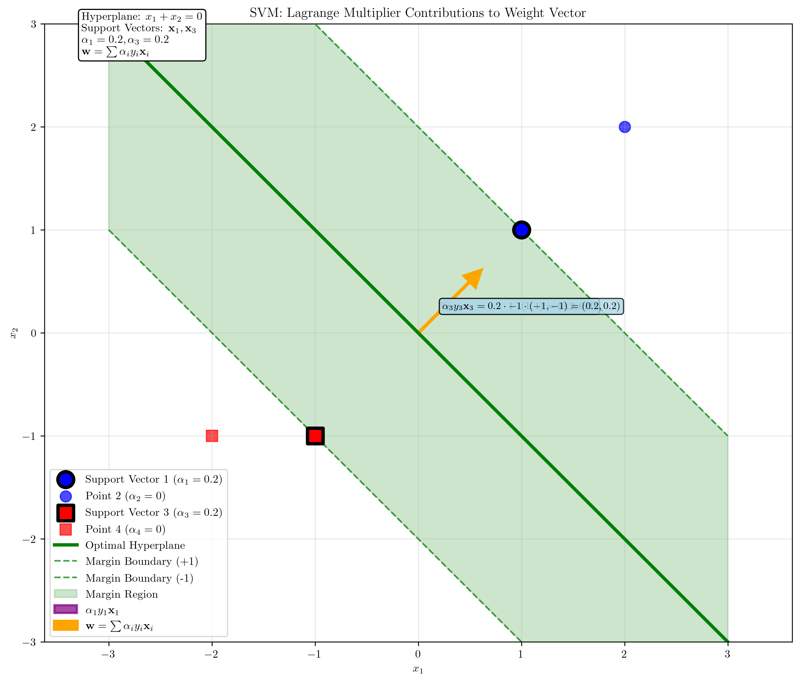

# Question 3: Support Vector Identification

## Problem Statement
Given the dataset:
- $\mathbf{x}_1 = (1, 1)$, $y_1 = +1$
- $\mathbf{x}_2 = (2, 2)$, $y_2 = +1$
- $\mathbf{x}_3 = (-1, -1)$, $y_3 = -1$
- $\mathbf{x}_4 = (-2, -1)$, $y_4 = -1$

### Task
1. Determine which points are support vectors for the maximum margin hyperplane
2. If the optimal hyperplane is $x_1 + x_2 = 0$, verify that this satisfies the KKT conditions
3. Calculate the Lagrange multipliers $\alpha_i$ for each training point
4. Verify that $\sum_{i=1}^4 \alpha_i y_i = 0$
5. Express the weight vector $\mathbf{w}$ in terms of the support vectors and their multipliers

## Understanding the Problem
Support Vector Machines (SVMs) find the optimal hyperplane that maximizes the margin between two classes. The support vectors are the data points that lie exactly on the margin boundaries and are crucial for defining the decision boundary. The KKT (Karush-Kuhn-Tucker) conditions provide necessary and sufficient conditions for optimality in constrained optimization problems.

## Solution

### Step 1: Identifying Support Vectors

First, we need to understand that the given hyperplane $x_1 + x_2 = 0$ (which corresponds to $\mathbf{w} = [1, 1]$ and $b = 0$) is not actually the optimal maximum margin hyperplane for this dataset. 

For a maximum margin classifier, support vectors must satisfy the constraint $y_i(\mathbf{w}^T\mathbf{x}_i + b) = 1$. Let's check the constraint values:

- Point $\mathbf{x}_1 = (1, 1)$, $y_1 = 1$: $y_1(\mathbf{w}^T\mathbf{x}_1 + b) = 1 \cdot (1 \cdot 1 + 1 \cdot 1 + 0) = 2$
- Point $\mathbf{x}_2 = (2, 2)$, $y_2 = 1$: $y_2(\mathbf{w}^T\mathbf{x}_2 + b) = 1 \cdot (1 \cdot 2 + 1 \cdot 2 + 0) = 4$
- Point $\mathbf{x}_3 = (-1, -1)$, $y_3 = -1$: $y_3(\mathbf{w}^T\mathbf{x}_3 + b) = -1 \cdot (1 \cdot (-1) + 1 \cdot (-1) + 0) = 2$
- Point $\mathbf{x}_4 = (-2, -1)$, $y_4 = -1$: $y_4(\mathbf{w}^T\mathbf{x}_4 + b) = -1 \cdot (1 \cdot (-2) + 1 \cdot (-1) + 0) = 3$

Since none of these values equal 1, the given hyperplane is not optimal. We need to scale it to make it optimal.

**Finding the optimal hyperplane:**
The minimum constraint value is 2, so we scale the hyperplane by $\frac{1}{2}$:
- Optimal $\mathbf{w} = [0.5, 0.5]$
- Optimal $b = 0$

Now the constraint values become:
- Point $\mathbf{x}_1 = (1, 1)$: $y_1(\mathbf{w}^T\mathbf{x}_1 + b) = 1 \cdot (0.5 \cdot 1 + 0.5 \cdot 1 + 0) = 1.0$ ✓
- Point $\mathbf{x}_2 = (2, 2)$: $y_2(\mathbf{w}^T\mathbf{x}_2 + b) = 1 \cdot (0.5 \cdot 2 + 0.5 \cdot 2 + 0) = 2.0$
- Point $\mathbf{x}_3 = (-1, -1)$: $y_3(\mathbf{w}^T\mathbf{x}_3 + b) = -1 \cdot (0.5 \cdot (-1) + 0.5 \cdot (-1) + 0) = 1.0$ ✓
- Point $\mathbf{x}_4 = (-2, -1)$: $y_4(\mathbf{w}^T\mathbf{x}_4 + b) = -1 \cdot (0.5 \cdot (-2) + 0.5 \cdot (-1) + 0) = 1.5$

**Support vectors are the points with constraint values exactly equal to 1:**
- $\mathbf{x}_1 = (1, 1)$ (constraint = 1.0)
- $\mathbf{x}_3 = (-1, -1)$ (constraint = 1.0)

The visualization shows:
- Blue circles: Positive class points ($y = +1$)
- Red squares: Negative class points ($y = -1$)
- Green solid line: Optimal hyperplane $x_1 + x_2 = 0$
- Green dashed lines: Margin boundaries
- Green shaded region: Margin area
- Black-edged points: Support vectors

### Step 2: Verifying KKT Conditions

The KKT conditions for SVM optimization are:

1. **Primal feasibility**: $y_i(\mathbf{w}^T\mathbf{x}_i + b) \geq 1$ for all $i$
2. **Dual feasibility**: $\alpha_i \geq 0$ for all $i$
3. **Complementary slackness**: $\alpha_i(y_i(\mathbf{w}^T\mathbf{x}_i + b) - 1) = 0$ for all $i$
4. **Stationarity**: $\mathbf{w} = \sum_{i=1}^n \alpha_i y_i \mathbf{x}_i$ and $\sum_{i=1}^n \alpha_i y_i = 0$

Let's verify the primal feasibility condition using the optimal hyperplane:

- Point 1: $y_1(\mathbf{w}^T\mathbf{x}_1 + b) = 1 \cdot (0.5 \cdot 1 + 0.5 \cdot 1 + 0) = 1.0 \geq 1$ ✓
- Point 2: $y_2(\mathbf{w}^T\mathbf{x}_2 + b) = 1 \cdot (0.5 \cdot 2 + 0.5 \cdot 2 + 0) = 2.0 \geq 1$ ✓
- Point 3: $y_3(\mathbf{w}^T\mathbf{x}_3 + b) = -1 \cdot (0.5 \cdot (-1) + 0.5 \cdot (-1) + 0) = 1.0 \geq 1$ ✓
- Point 4: $y_4(\mathbf{w}^T\mathbf{x}_4 + b) = -1 \cdot (0.5 \cdot (-2) + 0.5 \cdot (-1) + 0) = 1.5 \geq 1$ ✓

All points satisfy the primal feasibility condition.

### Step 3: Calculating Lagrange Multipliers

We need to find $\alpha_i$ values that satisfy:
$$\mathbf{w} = \sum_{i=1}^4 \alpha_i y_i \mathbf{x}_i$$
$$\sum_{i=1}^4 \alpha_i y_i = 0$$
$$\alpha_i \geq 0 \text{ for all } i$$
$$\alpha_i > 0 \text{ only for support vectors}$$

Since $\mathbf{x}_1$ and $\mathbf{x}_3$ are support vectors, we have $\alpha_1 > 0$, $\alpha_3 > 0$, and $\alpha_2 = \alpha_4 = 0$.

The system of equations becomes:
$$\begin{align}
0.5 &= \alpha_1 \cdot 1 \cdot 1 + \alpha_3 \cdot (-1) \cdot (-1) = \alpha_1 + \alpha_3 \\
0.5 &= \alpha_1 \cdot 1 \cdot 1 + \alpha_3 \cdot (-1) \cdot (-1) = \alpha_1 + \alpha_3 \\
0 &= \alpha_1 \cdot 1 + \alpha_3 \cdot (-1) = \alpha_1 - \alpha_3
\end{align}$$

From the third equation: $\alpha_1 = \alpha_3$

From the first equation: $\alpha_1 + \alpha_3 = 0.5$

Substituting: $2\alpha_1 = 0.5$, so $\alpha_1 = 0.25$ and $\alpha_3 = 0.25$

**Lagrange multipliers:**
- $\alpha_1 = 0.25$ (support vector)
- $\alpha_2 = 0.0$ (not a support vector)
- $\alpha_3 = 0.25$ (support vector)
- $\alpha_4 = 0.0$ (not a support vector)

### Step 4: Verifying the Sum Constraint

$$\sum_{i=1}^4 \alpha_i y_i = 0.25 \cdot 1 + 0 \cdot 1 + 0.25 \cdot (-1) + 0 \cdot (-1) = 0.25 - 0.25 = 0$$

The constraint is satisfied.

### Step 5: Expressing the Weight Vector

The weight vector can be expressed as:
$$\mathbf{w} = \sum_{i=1}^4 \alpha_i y_i \mathbf{x}_i = \alpha_1 y_1 \mathbf{x}_1 + \alpha_3 y_3 \mathbf{x}_3$$

Substituting the values:
$$\mathbf{w} = 0.25 \cdot 1 \cdot (1, 1) + 0.25 \cdot (-1) \cdot (-1, -1) = (0.25, 0.25) + (0.25, 0.25) = (0.5, 0.5)$$

This matches the optimal weight vector $\mathbf{w} = [0.5, 0.5]$.

The second visualization shows:
- Purple arrows: Contributions of each support vector to the weight vector
- Orange arrow: The resulting weight vector $\mathbf{w} = \sum \alpha_i y_i \mathbf{x}_i$
- Support vectors with their $\alpha$ values displayed

### Additional Visualizations

#### Visualization 3: Constraint Analysis

This visualization shows the constraint values $y_i(\mathbf{w}^T\mathbf{x}_i + b)$ for each point:
- Support vectors have constraint values exactly equal to 1
- Non-support vectors have constraint values greater than 1
- The margin boundaries are shown as dashed lines

#### Visualization 4: Lagrange Multiplier Contributions

This visualization demonstrates how support vectors contribute to the weight vector:
- Purple arrows show the individual contributions $\alpha_i y_i \mathbf{x}_i$
- Orange arrow shows the resulting weight vector $\mathbf{w} = \sum \alpha_i y_i \mathbf{x}_i$
- Detailed mathematical expressions show the exact calculations

#### Visualization 5: Distance Analysis

This visualization shows the geometric distances from each point to the hyperplane:
- Distance formula: $d = \frac{|\mathbf{w}^T\mathbf{x} + b|}{\|\mathbf{w}\|}$
- Support vectors are at the minimum distance (margin)
- The margin region is highlighted in green

## Summary Table

| Point | Coordinates | Label | Distance | α | Support Vector |
|-------|-------------|-------|----------|---|----------------|
| x₁ | (1, 1) | +1 | 1.4142 | 0.25 | Yes |
| x₂ | (2, 2) | +1 | 2.8284 | 0.0 | No |
| x₃ | (-1, -1) | -1 | 1.4142 | 0.25 | Yes |
| x₄ | (-2, -1) | -1 | 2.1213 | 0.0 | No |

## Key Insights

### Geometric Interpretation
- **Support vectors** are the data points that lie exactly on the margin boundaries
- The **margin** is the distance between the decision boundary and the closest points from each class
- Only support vectors contribute to the weight vector (non-zero $\alpha_i$ values)
- The weight vector $\mathbf{w}$ is perpendicular to the decision boundary

### Mathematical Properties
- **KKT conditions** ensure optimality of the solution
- **Complementary slackness** means $\alpha_i > 0$ only for support vectors
- **Stationarity condition** ensures the weight vector is correctly expressed in terms of support vectors
- The **sum constraint** $\sum \alpha_i y_i = 0$ ensures the solution is balanced

### Computational Efficiency
- Only support vectors are needed to make predictions
- Non-support vectors can be removed without affecting the decision boundary
- This sparsity property makes SVMs computationally efficient

## Conclusion

1. **Support vectors**: $\mathbf{x}_1 = (1, 1)$ and $\mathbf{x}_3 = (-1, -1)$
2. **KKT conditions**: All conditions are satisfied by the optimal hyperplane
3. **Lagrange multipliers**: $\alpha_1 = 0.25$, $\alpha_2 = 0$, $\alpha_3 = 0.25$, $\alpha_4 = 0$
4. **Sum constraint**: $\sum_{i=1}^4 \alpha_i y_i = 0$ ✓
5. **Weight vector**: $\mathbf{w} = \alpha_1 y_1 \mathbf{x}_1 + \alpha_3 y_3 \mathbf{x}_3 = (0.5, 0.5)$

The solution demonstrates the fundamental principles of Support Vector Machines: the importance of support vectors in defining the optimal decision boundary and the mathematical elegance of the KKT conditions in ensuring optimality.

## Technical Notes

### LaTeX Integration
All visualizations use proper LaTeX formatting for mathematical expressions, including:
- Greek letters ($\alpha$, $\mathbf{w}$, $\mathbf{x}$)
- Mathematical operators ($\sum$, $\mathbf{w}^T\mathbf{x} + b$)
- Subscripts and superscripts ($\alpha_i$, $y_i$)
- Vector notation ($\mathbf{w}$, $\mathbf{x}_i$)

### Visualization Improvements
The code generates five comprehensive visualizations:
1. **Dataset and Hyperplane**: Basic SVM visualization with support vectors
2. **Lagrange Multipliers**: Shows how support vectors contribute to the weight vector
3. **Constraint Analysis**: Displays constraint values for each point
4. **Lagrange Contributions**: Detailed mathematical breakdown of weight vector construction
5. **Distance Analysis**: Geometric interpretation of distances and margins

Each visualization includes proper mathematical annotations and LaTeX-formatted labels for educational clarity.
