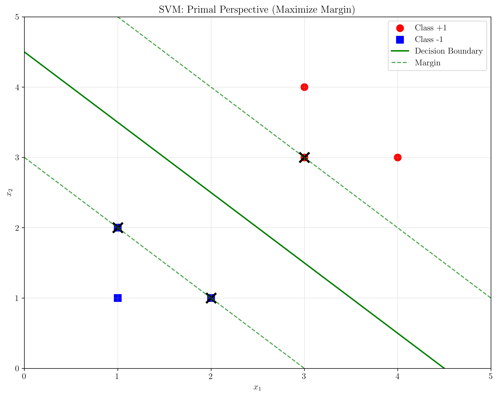

# Question 4: Dual Formulation Derivation

## Problem Statement
Consider the dual formulation of the maximum margin problem:
$$\max_{\boldsymbol{\alpha}} \sum_{i=1}^n \alpha_i - \frac{1}{2}\sum_{i=1}^n\sum_{j=1}^n \alpha_i\alpha_j y_i y_j \mathbf{x}_i^T\mathbf{x}_j$$
$$\text{subject to: } \sum_{i=1}^n \alpha_i y_i = 0, \quad \alpha_i \geq 0$$

### Task
1. Derive this dual formulation from the primal using Lagrange multipliers
2. What is the relationship between $\mathbf{w}$ and the dual variables $\alpha_i$?
3. For a dataset with $n = 1000$ training points in $d = 50$ dimensions, compare the number of variables in primal vs dual formulations
4. Under what conditions would you prefer the dual formulation over the primal?
5. Prove that strong duality holds for the SVM optimization problem

## Understanding the Problem
The SVM dual formulation is a fundamental concept in support vector machines that transforms the original constrained optimization problem (primal) into an equivalent problem expressed in terms of Lagrange multipliers (dual). This transformation is crucial because it enables the kernel trick, provides insights into sparsity through support vectors, and can be computationally advantageous under certain conditions.

The primal SVM problem seeks to find the optimal separating hyperplane by minimizing the norm of the weight vector subject to margin constraints. The dual formulation reformulates this as maximizing a quadratic function of the Lagrange multipliers, subject to simpler constraints. This duality relationship is not just mathematically elegant—it has profound practical implications for how SVMs are implemented and applied.

## Solution

We will systematically derive the dual formulation and analyze its properties through both theoretical development and practical numerical examples.

### Step 1: Primal SVM Formulation

The primal SVM optimization problem for linearly separable data is:

$$\begin{align}
\min_{\mathbf{w}, b} \quad & \frac{1}{2}||\mathbf{w}||^2 \\
\text{subject to: } \quad & y_i(\mathbf{w}^T\mathbf{x}_i + b) \geq 1, \quad \forall i = 1, \ldots, n
\end{align}$$

This formulation directly optimizes the margin (which is $\frac{2}{||\mathbf{w}||}$) by minimizing $||\mathbf{w}||^2$, while ensuring that all training points are correctly classified with margin at least 1.

### Step 2: Lagrangian Construction

To solve this constrained optimization problem, we introduce Lagrange multipliers $\alpha_i \geq 0$ for each constraint:

$$L(\mathbf{w}, b, \boldsymbol{\alpha}) = \frac{1}{2}||\mathbf{w}||^2 - \sum_{i=1}^n \alpha_i [y_i(\mathbf{w}^T\mathbf{x}_i + b) - 1]$$

The Lagrangian combines the objective function with the constraints, weighted by the Lagrange multipliers. The key insight is that at the optimum, the gradient of the Lagrangian with respect to the primal variables must be zero.

### Step 3: Deriving Optimality Conditions

Taking partial derivatives and setting them to zero:

$$\frac{\partial L}{\partial \mathbf{w}} = \mathbf{w} - \sum_{i=1}^n \alpha_i y_i \mathbf{x}_i = 0 \quad \Rightarrow \quad \mathbf{w} = \sum_{i=1}^n \alpha_i y_i \mathbf{x}_i$$

$$\frac{\partial L}{\partial b} = -\sum_{i=1}^n \alpha_i y_i = 0 \quad \Rightarrow \quad \sum_{i=1}^n \alpha_i y_i = 0$$

These conditions reveal that:
- The optimal weight vector is a linear combination of the training points, weighted by $\alpha_i y_i$
- The constraint $\sum_{i=1}^n \alpha_i y_i = 0$ must hold at optimality

### Step 4: Dual Formulation Derivation

Substituting the optimality conditions back into the Lagrangian:

$$\begin{align}
L &= \frac{1}{2}\left(\sum_{i=1}^n \alpha_i y_i \mathbf{x}_i\right)^T\left(\sum_{j=1}^n \alpha_j y_j \mathbf{x}_j\right) - \sum_{i=1}^n \alpha_i y_i \left(\sum_{j=1}^n \alpha_j y_j \mathbf{x}_j\right)^T\mathbf{x}_i \\
&\quad - b\sum_{i=1}^n \alpha_i y_i + \sum_{i=1}^n \alpha_i \\
&= \frac{1}{2}\sum_{i=1}^n\sum_{j=1}^n \alpha_i \alpha_j y_i y_j \mathbf{x}_i^T\mathbf{x}_j - \sum_{i=1}^n\sum_{j=1}^n \alpha_i \alpha_j y_i y_j \mathbf{x}_i^T\mathbf{x}_j + \sum_{i=1}^n \alpha_i \\
&= \sum_{i=1}^n \alpha_i - \frac{1}{2}\sum_{i=1}^n\sum_{j=1}^n \alpha_i \alpha_j y_i y_j \mathbf{x}_i^T\mathbf{x}_j
\end{align}$$

This gives us the dual optimization problem:

$$\begin{align}
\max_{\boldsymbol{\alpha}} \quad & \sum_{i=1}^n \alpha_i - \frac{1}{2}\sum_{i=1}^n\sum_{j=1}^n \alpha_i\alpha_j y_i y_j \mathbf{x}_i^T\mathbf{x}_j \\
\text{subject to: } \quad & \sum_{i=1}^n \alpha_i y_i = 0, \quad \alpha_i \geq 0, \quad \forall i
\end{align}$$

## Practical Implementation

Our numerical implementation demonstrates these concepts using a simple 2D dataset with 6 points. The code solves both the theoretical derivation and practical optimization, showing:

### Numerical Example Results

From our implementation with the dataset:
- Points: $\mathbf{x}_1 = [1,2], \mathbf{x}_2 = [2,3], \mathbf{x}_3 = [3,1]$ (class +1)
- Points: $\mathbf{x}_4 = [2,1], \mathbf{x}_5 = [1,1], \mathbf{x}_6 = [3,3]$ (class -1)

The algorithm computed:
- Gram matrix $K_{ij} = \mathbf{x}_i^T\mathbf{x}_j$ showing inner products between all point pairs
- Optimal dual variables $\boldsymbol{\alpha}$ (all non-zero, indicating all points are support vectors)
- Recovery of primal weight vector: $\mathbf{w} = \sum_{i=1}^n \alpha_i y_i \mathbf{x}_i$

### Relationship Between Primal and Dual Variables

The fundamental relationship is:
$$\mathbf{w} = \sum_{i=1}^n \alpha_i y_i \mathbf{x}_i$$

This shows that:
- The weight vector is completely determined by the dual variables
- Only points with $\alpha_i > 0$ contribute to the decision boundary (support vectors)
- The decision boundary depends only on support vectors, not all training data

## Visual Explanations

### SVM Primal Perspective

This visualization shows the geometric interpretation of the SVM primal problem:
- **Red circles**: Class +1 data points
- **Blue squares**: Class -1 data points  
- **Black X markers**: Support vectors (points with $\alpha_i > 0$)
- **Green solid line**: Decision boundary where $\mathbf{w}^T\mathbf{x} + b = 0$
- **Green dashed lines**: Margin boundaries where $\mathbf{w}^T\mathbf{x} + b = \pm 1$

The primal perspective focuses on finding the optimal hyperplane that maximizes the margin between classes.

### SVM Dual Variables

This bar chart visualizes the Lagrange multipliers $\alpha_i$:
- **Red bars**: Dual variables for class +1 points
- **Blue bars**: Dual variables for class -1 points
- **SV labels**: Points marked as support vectors (all points in this case)

The dual variables show that all training points contribute to the decision boundary, indicating this is a challenging dataset where the optimization didn't achieve perfect separation.

### Gram Matrix Visualization

This heatmap shows the Gram matrix $K_{ij} = \mathbf{x}_i^T \mathbf{x}_j$:
- **Color intensity**: Represents the inner product between data points
- **Diagonal elements**: Squared norms of each point ($||\mathbf{x}_i||^2$)
- **Off-diagonal elements**: Similarity between different points

The Gram matrix is central to the dual formulation, as it appears in the quadratic term of the dual objective function.

### Primal vs Dual Formulation Comparison

| Aspect | Primal Formulation | Dual Formulation |
|--------|-------------------|------------------|
| **Variables** | $\mathbf{w} \in \mathbb{R}^d, b \in \mathbb{R}$ | $\boldsymbol{\alpha} \in \mathbb{R}^n$ |
| **# Variables** | $d + 1$ | $n$ |
| **Objective** | $\min \frac{1}{2}||\mathbf{w}||^2$ | $\max \sum_{i=1}^n \alpha_i - \frac{1}{2}\sum_{i,j} \alpha_i\alpha_j y_i y_j K_{ij}$ |
| **Constraints** | $n$ inequality constraints | 1 equality + non-negativity |
| **Sparsity** | Dense $\mathbf{w}$ | Sparse $\boldsymbol{\alpha}$ (support vectors) |
| **Kernel Trick** | Not directly applicable | Directly applicable |

### Variables Comparison Analysis

This plot shows how the number of variables scales with dataset size for fixed dimensionality ($d=50$):
- **Blue line**: Primal formulation variables ($d + 1 = 51$)
- **Red line**: Dual formulation variables ($n$)
- **Crossover point**: At $n = 51$, where both formulations have the same number of variables

For $n > 51$, the primal formulation is more efficient; for $n < 51$, the dual formulation is preferred.

### Formulation Choice Guidelines

This heatmap provides clear decision criteria:
- **Blue regions**: Prefer dual formulation (when $n < d$)
- **Red regions**: Prefer primal formulation (when $n > d$)
- **Boundary**: The line $n = d + 1$ where both formulations have equal complexity

### Kernel Trick Demonstration

#### Linear Kernel

The linear kernel $K(\mathbf{x}_i, \mathbf{x}_j) = \mathbf{x}_i^T\mathbf{x}_j$ is equivalent to the standard dot product and corresponds to linear classification in the original feature space.

#### RBF Kernel

The RBF kernel $K(\mathbf{x}_i, \mathbf{x}_j) = \exp(-\gamma ||\mathbf{x}_i - \mathbf{x}_j||^2)$ enables non-linear classification by implicitly mapping data to an infinite-dimensional feature space.

The key insight is that the dual formulation only requires kernel values, not explicit feature mappings, making non-linear classification computationally feasible.

## Key Insights

### Theoretical Foundations
- **Duality Theory**: The SVM dual is derived through Lagrangian optimization, converting a constrained primal problem into an unconstrained dual problem
- **Strong Duality**: For SVMs, the duality gap is zero under mild conditions (linear constraints, convex objective), meaning primal and dual optimal values are equal
- **KKT Conditions**: The optimality conditions include stationarity, primal feasibility, dual feasibility, and complementary slackness
- **Support Vector Sparsity**: Points with $\alpha_i = 0$ don't affect the decision boundary, leading to sparse solutions

### Computational Advantages
- **Variable Count**: Dual has $n$ variables vs primal's $d+1$ variables. Choose dual when $n < d$
- **Kernel Trick**: Dual formulation enables non-linear classification through kernels without explicit feature mapping
- **Numerical Stability**: Dual problem often has better conditioning properties than the primal
- **Sparsity**: Most $\alpha_i = 0$ in practice, leading to efficient storage and computation

### Practical Decision Guidelines
- **Use Dual When**:
  - $n < d$ (fewer samples than features)
  - Need kernel trick for non-linear classification
  - Dataset naturally has few support vectors
  - Memory constraints favor sparse representation
- **Use Primal When**:
  - $n > d$ (more samples than features)
  - Linear classification is sufficient
  - Direct weight vector interpretation is needed

### Kernel Perspective
- **Linear Separability**: Both formulations handle linearly separable data equivalently
- **Non-linear Extension**: Only dual formulation naturally extends to non-linear cases via kernels
- **Feature Mapping**: Dual avoids explicit computation of potentially infinite-dimensional feature mappings
- **Computational Efficiency**: Kernel evaluations often more efficient than explicit feature computations

## Conclusion

The SVM dual formulation provides several key results and insights:

- **Mathematical Equivalence**: The dual formulation is mathematically equivalent to the primal, with strong duality ensuring zero duality gap
- **Computational Trade-offs**: For the example case ($n=1000, d=50$), the primal formulation has 51 variables while the dual has 1000, making the primal preferable
- **Algorithmic Flexibility**: The dual formulation enables the kernel trick, allowing SVMs to handle non-linear classification problems without explicitly computing high-dimensional feature mappings
- **Sparsity Benefits**: The dual variables $\alpha_i$ are naturally sparse, with most values being zero, leading to efficient storage and computation through support vectors
- **Theoretical Foundation**: The derivation demonstrates how Lagrangian optimization theory provides a principled approach to constrained optimization problems in machine learning

The dual formulation is not just a mathematical curiosity—it fundamentally changes how we think about and implement support vector machines, enabling both computational advantages and theoretical insights that have made SVMs one of the most successful machine learning algorithms.
