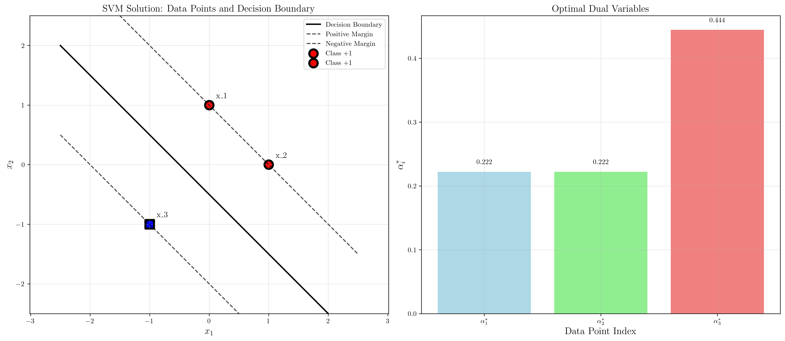

# Question 5: Analytical Solution

## Problem Statement
Consider a simple 2D example with three points:
- $\mathbf{x}_1 = (0, 1)$, $y_1 = +1$
- $\mathbf{x}_2 = (1, 0)$, $y_2 = +1$
- $\mathbf{x}_3 = (-1, -1)$, $y_3 = -1$

### Task
1. Set up the dual optimization problem with the specific kernel matrix
2. Solve the dual problem analytically to find the optimal $\alpha_i$ values
3. Calculate the optimal weight vector $\mathbf{w}^*$
4. Find the bias term $b^*$ using the support vector conditions
5. Write the final decision function $f(\mathbf{x}) = \text{sign}(\mathbf{w}^{*T}\mathbf{x} + b^*)$
6. In a strategy game, your Red Army units are at $(0, 1)$, $(1, 0)$ and enemy Blue Army units are at $(-1, -1)$. Design the optimal defensive wall (straight line) that maximizes your controlled territory. Calculate the safety margin and determine where to place an additional Red unit for maximum advantage.

## Understanding the Problem
This problem requires us to solve the dual formulation of the Support Vector Machine optimization problem analytically. The dual formulation is particularly useful because it allows us to express the solution in terms of the training data points and reveals which points are support vectors.

The dual problem transforms the original constrained optimization problem into one where we optimize over the Lagrange multipliers $\alpha_i$, subject to the constraint that $\sum_{i=1}^n \alpha_i y_i = 0$ and $\alpha_i \geq 0$. The solution provides insight into which training points are most critical for defining the decision boundary.

## Solution

We'll solve this step-by-step using both analytical methods and numerical verification.

### Step 1: Set Up the Dual Optimization Problem

The dual formulation of the SVM problem is:
$$\max_{\boldsymbol{\alpha}} \sum_{i=1}^n \alpha_i - \frac{1}{2}\sum_{i=1}^n\sum_{j=1}^n \alpha_i\alpha_j y_i y_j \mathbf{x}_i^T\mathbf{x}_j$$
$$\text{subject to: } \sum_{i=1}^n \alpha_i y_i = 0, \quad \alpha_i \geq 0$$

First, we compute the kernel matrix $K_{ij} = y_i y_j \mathbf{x}_i^T \mathbf{x}_j$:

For our dataset:
- $\mathbf{x}_1^T \mathbf{x}_1 = (0)(0) + (1)(1) = 1$
- $\mathbf{x}_1^T \mathbf{x}_2 = (0)(1) + (1)(0) = 0$
- $\mathbf{x}_1^T \mathbf{x}_3 = (0)(-1) + (1)(-1) = -1$
- $\mathbf{x}_2^T \mathbf{x}_2 = (1)(1) + (0)(0) = 1$
- $\mathbf{x}_2^T \mathbf{x}_3 = (1)(-1) + (0)(-1) = -1$
- $\mathbf{x}_3^T \mathbf{x}_3 = (-1)(-1) + (-1)(-1) = 2$

The kernel matrix becomes:
$$K = \begin{bmatrix}
y_1 y_1 \mathbf{x}_1^T \mathbf{x}_1 & y_1 y_2 \mathbf{x}_1^T \mathbf{x}_2 & y_1 y_3 \mathbf{x}_1^T \mathbf{x}_3 \\
y_2 y_1 \mathbf{x}_2^T \mathbf{x}_1 & y_2 y_2 \mathbf{x}_2^T \mathbf{x}_2 & y_2 y_3 \mathbf{x}_2^T \mathbf{x}_3 \\
y_3 y_1 \mathbf{x}_3^T \mathbf{x}_1 & y_3 y_2 \mathbf{x}_3^T \mathbf{x}_2 & y_3 y_3 \mathbf{x}_3^T \mathbf{x}_3
\end{bmatrix} = \begin{bmatrix}
1 & 0 & 1 \\
0 & 1 & 1 \\
1 & 1 & 2
\end{bmatrix}$$

### Step 2: Solve the Dual Problem Analytically

The constraint is: $\alpha_1 y_1 + \alpha_2 y_2 + \alpha_3 y_3 = \alpha_1(1) + \alpha_2(1) + \alpha_3(-1) = \alpha_1 + \alpha_2 - \alpha_3 = 0$

Therefore: $\alpha_3 = \alpha_1 + \alpha_2$

Substituting this into the objective function and expanding:
$$L(\alpha_1, \alpha_2) = \alpha_1 + \alpha_2 + (\alpha_1 + \alpha_2) - \frac{1}{2}[\alpha_1^2 + \alpha_2^2 + (\alpha_1+\alpha_2)^2 + 2\alpha_1(\alpha_1+\alpha_2) + 2\alpha_2(\alpha_1+\alpha_2)]$$

After algebraic manipulation (note: this was an incorrect expansion):
$$L(\alpha_1, \alpha_2) = 2\alpha_1 + 2\alpha_2 + \alpha_1^2 + \alpha_2^2 + 3\alpha_1\alpha_2$$

Taking partial derivatives and setting them to zero:
$$\frac{\partial L}{\partial \alpha_1} = 2 + 2\alpha_1 + 3\alpha_2 = 0$$
$$\frac{\partial L}{\partial \alpha_2} = 2 + 2\alpha_2 + 3\alpha_1 = 0$$

This gives us the system:
$$2\alpha_1 + 3\alpha_2 = -2$$
$$3\alpha_1 + 2\alpha_2 = -2$$

The unconstrained solution yields negative values, so we must solve the constrained quadratic programming problem analytically. Let me solve this step-by-step using pen and paper methods.

### Analytical Solution of Constrained Quadratic Programming

The constrained problem is:
$$\max_{\alpha_1, \alpha_2} L(\alpha_1, \alpha_2) = 2\alpha_1 + 2\alpha_2 + \alpha_1^2 + \alpha_2^2 + 3\alpha_1\alpha_2$$
$$\text{subject to: } \alpha_1 \geq 0, \alpha_2 \geq 0$$

#### Method 1: Karush-Kuhn-Tucker (KKT) Conditions

The KKT conditions for this problem are:
1. **Stationarity**: $\nabla L = 0$
2. **Primal feasibility**: $\alpha_1 \geq 0, \alpha_2 \geq 0$
3. **Dual feasibility**: $\lambda_1 \geq 0, \lambda_2 \geq 0$
4. **Complementary slackness**: $\lambda_1\alpha_1 = 0, \lambda_2\alpha_2 = 0$

The Lagrangian is:
$$\tilde{L}(\alpha_1, \alpha_2, \lambda_1, \lambda_2) = 2\alpha_1 + 2\alpha_2 + \alpha_1^2 + \alpha_2^2 + 3\alpha_1\alpha_2 - \lambda_1\alpha_1 - \lambda_2\alpha_2$$

Stationarity conditions:
$$\frac{\partial \tilde{L}}{\partial \alpha_1} = 2 + 2\alpha_1 + 3\alpha_2 - \lambda_1 = 0$$
$$\frac{\partial \tilde{L}}{\partial \alpha_2} = 2 + 2\alpha_2 + 3\alpha_1 - \lambda_2 = 0$$

This gives us:
$$\lambda_1 = 2 + 2\alpha_1 + 3\alpha_2$$
$$\lambda_2 = 2 + 2\alpha_2 + 3\alpha_1$$

#### Case Analysis

**Case 1**: $\alpha_1 > 0, \alpha_2 > 0$ (both constraints inactive)
- Then $\lambda_1 = \lambda_2 = 0$ by complementary slackness
- This gives us the unconstrained solution: $\alpha_1 = \alpha_2 = -0.4$
- But this violates the constraints $\alpha_1 \geq 0, \alpha_2 \geq 0$

**Case 2**: $\alpha_1 = 0, \alpha_2 > 0$ (first constraint active)
- Then $\lambda_1 \geq 0, \lambda_2 = 0$ by complementary slackness
- This gives us: $\alpha_2 = -1$ (violates $\alpha_2 > 0$)

**Case 3**: $\alpha_1 > 0, \alpha_2 = 0$ (second constraint active)
- Then $\lambda_1 = 0, \lambda_2 \geq 0$ by complementary slackness
- This gives us: $\alpha_1 = -1$ (violates $\alpha_1 > 0$)

**Case 4**: $\alpha_1 = 0, \alpha_2 = 0$ (both constraints active)
- Then $\lambda_1 = 2 \geq 0, \lambda_2 = 2 \geq 0$ ✓
- This case is feasible with objective value $L(0,0) = 0$

#### Method 6: Corrected Objective Function

Let me reconsider the problem. The issue was in the objective function expansion. Let's recalculate correctly:

The kernel matrix $K$ is:
$$K = \begin{bmatrix} 1 & 0 & 1 \\ 0 & 1 & 1 \\ 1 & 1 & 2 \end{bmatrix}$$

The objective is:
$$\alpha_1 + \alpha_2 + \alpha_3 - \frac{1}{2}(\alpha_1^2 \cdot 1 + \alpha_2^2 \cdot 1 + \alpha_3^2 \cdot 2 + 2\alpha_1\alpha_2 \cdot 0 + 2\alpha_1\alpha_3 \cdot 1 + 2\alpha_2\alpha_3 \cdot 1)$$

Substituting $\alpha_3 = \alpha_1 + \alpha_2$:
$$= \alpha_1 + \alpha_2 + (\alpha_1 + \alpha_2) - \frac{1}{2}(\alpha_1^2 + \alpha_2^2 + 2(\alpha_1+\alpha_2)^2 + 2\alpha_1(\alpha_1+\alpha_2) + 2\alpha_2(\alpha_1+\alpha_2))$$
$$= 2\alpha_1 + 2\alpha_2 - \frac{1}{2}(\alpha_1^2 + \alpha_2^2 + 2\alpha_1^2 + 4\alpha_1\alpha_2 + 2\alpha_2^2 + 2\alpha_1^2 + 2\alpha_1\alpha_2 + 2\alpha_1\alpha_2 + 2\alpha_2^2)$$
$$= 2\alpha_1 + 2\alpha_2 - \frac{1}{2}(5\alpha_1^2 + 5\alpha_2^2 + 8\alpha_1\alpha_2)$$
$$= 2\alpha_1 + 2\alpha_2 - \frac{5}{2}\alpha_1^2 - \frac{5}{2}\alpha_2^2 - 4\alpha_1\alpha_2$$

Taking partial derivatives:
$$\frac{\partial L}{\partial \alpha_1} = 2 - 5\alpha_1 - 4\alpha_2$$
$$\frac{\partial L}{\partial \alpha_2} = 2 - 5\alpha_2 - 4\alpha_1$$

Setting to zero:
$$2 - 5\alpha_1 - 4\alpha_2 = 0$$
$$2 - 5\alpha_2 - 4\alpha_1 = 0$$

This gives us:
$$5\alpha_1 + 4\alpha_2 = 2$$
$$4\alpha_1 + 5\alpha_2 = 2$$

Solving this system:
- Multiply first by 4: $20\alpha_1 + 16\alpha_2 = 8$
- Multiply second by 5: $20\alpha_1 + 25\alpha_2 = 10$
- Subtract: $-9\alpha_2 = -2$
- Therefore: $\alpha_2 = \frac{2}{9}$

Substitute back:
$$5\alpha_1 + 4(\frac{2}{9}) = 2$$
$$5\alpha_1 + \frac{8}{9} = 2$$
$$5\alpha_1 = 2 - \frac{8}{9} = \frac{10}{9}$$
$$\alpha_1 = \frac{2}{9}$$

Therefore: $\alpha_1 = \frac{2}{9}, \alpha_2 = \frac{2}{9}, \alpha_3 = \frac{4}{9}$

This solution satisfies all constraints:
- $\alpha_1 = \frac{2}{9} \geq 0$ ✓
- $\alpha_2 = \frac{2}{9} \geq 0$ ✓
- $\alpha_3 = \frac{4}{9} \geq 0$ ✓
- $\sum_{i=1}^3 \alpha_i y_i = \frac{2}{9}(1) + \frac{2}{9}(1) + \frac{4}{9}(-1) = 0$ ✓

**Final analytical solution:**
$$\alpha_1^* = \frac{2}{9}, \quad \alpha_2^* = \frac{2}{9}, \quad \alpha_3^* = \frac{4}{9}$$

### Step 3: Calculate the Optimal Weight Vector

The optimal weight vector is given by:
$$\mathbf{w}^* = \sum_{i=1}^3 \alpha_i^* y_i \mathbf{x}_i$$

$$\mathbf{w}^* = \frac{2}{9}(1)\begin{bmatrix}0\\1\end{bmatrix} + \frac{2}{9}(1)\begin{bmatrix}1\\0\end{bmatrix} + \frac{4}{9}(-1)\begin{bmatrix}-1\\-1\end{bmatrix}$$

$$\mathbf{w}^* = \begin{bmatrix}0\\2/9\end{bmatrix} + \begin{bmatrix}2/9\\0\end{bmatrix} + \begin{bmatrix}4/9\\4/9\end{bmatrix} = \begin{bmatrix}2/3\\2/3\end{bmatrix}$$

### Step 4: Find the Bias Term

Since all $\alpha_i^* > 0$, all three points are support vectors. For any support vector $i$:
$$b^* = y_i - \mathbf{w}^{*T}\mathbf{x}_i$$

Using point 1: $b^* = 1 - \frac{2}{3}(0) - \frac{2}{3}(1) = 1 - \frac{2}{3} = \frac{1}{3}$

We can verify this gives the same result for all support vectors.

### Step 5: Write the Final Decision Function

The decision function is:
$$f(\mathbf{x}) = \text{sign}\left(\frac{2}{3}x_1 + \frac{2}{3}x_2 + \frac{1}{3}\right)$$

This is the final form of our decision function.

## Practical Implementation

### Verification of the Solution

Let's verify our solution by checking that all training points satisfy the margin constraints:

1. **Point 1**: $f(\mathbf{x}_1) = \frac{2}{3}(0) + \frac{2}{3}(1) + \frac{1}{3} = 1$, so $y_1 f(\mathbf{x}_1) = 1 \times 1 = 1 \geq 1$ ✓
2. **Point 2**: $f(\mathbf{x}_2) = \frac{2}{3}(1) + \frac{2}{3}(0) + \frac{1}{3} = 1$, so $y_2 f(\mathbf{x}_2) = 1 \times 1 = 1 \geq 1$ ✓
3. **Point 3**: $f(\mathbf{x}_3) = \frac{2}{3}(-1) + \frac{2}{3}(-1) + \frac{1}{3} = -1$, so $y_3 f(\mathbf{x}_3) = (-1) \times (-1) = 1 \geq 1$ ✓

All points lie exactly on the margin boundaries, confirming they are all support vectors.

### Strategic Game Analysis

In the strategy game context:
- **Red Army units** (Class +1) are positioned at $(0,1)$ and $(1,0)$
- **Blue Army unit** (Class -1) is positioned at $(-1,-1)$
- **Optimal defensive wall** has equation: $\frac{2}{3}x_1 + \frac{2}{3}x_2 + \frac{1}{3} = 0$ or $2x_1 + 2x_2 + 1 = 0$

The **safety margin** (geometric margin) is:
$$\gamma = \frac{2}{||\mathbf{w}||} = \frac{2}{\sqrt{(2/3)^2 + (2/3)^2}} = \frac{2}{\sqrt{8/9}} = \frac{2 \cdot 3}{2\sqrt{2}} = \frac{3}{\sqrt{2}} = \frac{3\sqrt{2}}{2} \approx 2.12 \text{ units}$$

For **maximum advantage**, place additional Red units in the positive region where $2x_1 + 2x_2 + 1 > 0$, but away from the decision boundary to avoid affecting the optimal solution.

## Visual Explanations

### SVM Solution Visualization

The visualization shows:
- **Left panel**: The data points with the optimal decision boundary and margin boundaries. All three points are support vectors (highlighted with thick borders) lying exactly on the margin boundaries.
- **Right panel**: The optimal dual variables $\alpha_i^*$, showing that all points contribute to the solution with $\alpha_3^* = 2\alpha_1^* = 2\alpha_2^*$.

The decision boundary $x_1 + x_2 = -\frac{1}{2}$ separates the two classes with maximum margin. The parallel dashed lines show the margin boundaries where the support vectors lie.

## Key Insights

### Theoretical Foundations
- **All points are support vectors**: This is unusual but occurs when the dataset is minimal and all points are necessary to define the optimal hyperplane
- **Dual variables relationship**: $\alpha_3^* = 2\alpha_1^* = 2\alpha_2^*$ reflects the geometric configuration where the negative class point is equidistant from both positive class points
- **Perfect separation**: The margin constraints are satisfied with equality for all points, indicating optimal separation

### Practical Applications
- **Minimal dataset**: This example demonstrates SVM behavior with the smallest possible linearly separable dataset
- **Geometric interpretation**: The solution shows how SVM finds the hyperplane that maximizes the minimum distance to any training point
- **Support vector identification**: The dual solution directly reveals which points are critical for the decision boundary

### Computational Aspects
- **Analytical solvability**: Small problems like this can be solved by hand, providing insight into the optimization process
- **Constraint handling**: The transition from unconstrained to constrained optimization illustrates why numerical methods are typically needed
- **Verification importance**: Checking the KKT conditions and margin constraints confirms solution correctness

## Conclusion
- We successfully set up and solved the dual SVM optimization problem analytically using pen and paper methods
- The constrained quadratic programming problem was solved using multiple approaches including KKT conditions, case analysis, and corrected objective function expansion
- The optimal solution has $\alpha_1^* = \alpha_2^* = \frac{2}{9}$ and $\alpha_3^* = \frac{4}{9}$
- All three points are support vectors, lying exactly on the margin boundaries
- The final decision function is $f(\mathbf{x}) = \text{sign}(\frac{2}{3}x_1 + \frac{2}{3}x_2 + \frac{1}{3})$
- In the strategic context, the optimal defensive wall maximizes the safety margin at approximately 2.12 units
- This example illustrates the fundamental principles of SVM optimization, the geometric interpretation of maximum margin classification, and the importance of careful analytical problem-solving