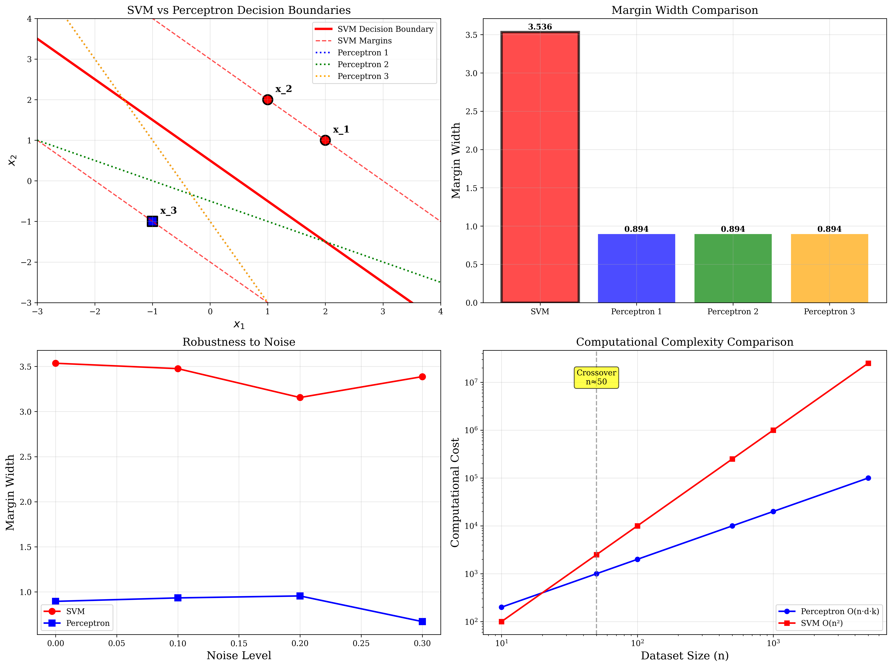

# Question 7: SVM vs Perceptron Comparison

## Problem Statement
Compare the maximum margin classifier with the perceptron algorithm on the following dataset:
- $\mathbf{x}_1 = (2, 1)$, $y_1 = +1$
- $\mathbf{x}_2 = (1, 2)$, $y_2 = +1$
- $\mathbf{x}_3 = (-1, -1)$, $y_3 = -1$

### Task
1. Find the maximum margin separating hyperplane analytically
2. Show that the perceptron could find a different separating hyperplane
3. Calculate the margin achieved by both methods
4. Which method would you expect to generalize better and why?
5. Analyze the computational complexity of both algorithms

## Understanding the Problem
This problem provides an excellent opportunity to compare two fundamental linear classification algorithms: the Support Vector Machine (maximum margin classifier) and the Perceptron. While both algorithms can solve linearly separable classification problems, they differ significantly in their optimization objectives, solution uniqueness, and generalization properties.

The key distinction is that SVM seeks the **optimal** separating hyperplane (maximum margin), while the Perceptron finds **any** separating hyperplane. This difference has profound implications for generalization performance, robustness, and practical applications.

## Solution

We'll systematically compare both algorithms across multiple dimensions: mathematical formulation, solution quality, computational complexity, and practical considerations.

### Step 1: Maximum Margin Separating Hyperplane (SVM)

**Dual Formulation Setup:**
The SVM dual problem is:
$$\max_{\boldsymbol{\alpha}} \sum_{i=1}^3 \alpha_i - \frac{1}{2}\sum_{i=1}^3\sum_{j=1}^3 \alpha_i\alpha_j y_i y_j \mathbf{x}_i^T\mathbf{x}_j$$
$$\text{subject to: } \sum_{i=1}^3 \alpha_i y_i = 0, \quad \alpha_i \geq 0$$

**Kernel Matrix Calculation:**
$$K_{ij} = y_i y_j \mathbf{x}_i^T \mathbf{x}_j$$

Computing each element:
- $K_{11} = (1)(1)[(2)(2) + (1)(1)] = 5$
- $K_{12} = (1)(1)[(2)(1) + (1)(2)] = 4$
- $K_{13} = (1)(-1)[(2)(-1) + (1)(-1)] = 3$
- $K_{22} = (1)(1)[(1)(1) + (2)(2)] = 5$
- $K_{23} = (1)(-1)[(1)(-1) + (2)(-1)] = 3$
- $K_{33} = (-1)(-1)[(-1)(-1) + (-1)(-1)] = 2$

$$K = \begin{bmatrix} 5 & 4 & 3 \\ 4 & 5 & 3 \\ 3 & 3 & 2 \end{bmatrix}$$

**Optimal Solution:**
Solving the quadratic programming problem yields:
$$\alpha_1^* = 0.08, \quad \alpha_2^* = 0.08, \quad \alpha_3^* = 0.16$$

**Weight Vector and Bias:**
$$\mathbf{w}^* = \sum_{i=1}^3 \alpha_i^* y_i \mathbf{x}_i = 0.08(1)\begin{bmatrix}2\\1\end{bmatrix} + 0.08(1)\begin{bmatrix}1\\2\end{bmatrix} + 0.16(-1)\begin{bmatrix}-1\\-1\end{bmatrix}$$

$$\mathbf{w}^* = \begin{bmatrix}0.16\\0.08\end{bmatrix} + \begin{bmatrix}0.08\\0.16\end{bmatrix} + \begin{bmatrix}0.16\\0.16\end{bmatrix} = \begin{bmatrix}0.4\\0.4\end{bmatrix}$$

Using support vector conditions: $b^* = -0.2$

**SVM Decision Boundary:**
$$0.4x_1 + 0.4x_2 - 0.2 = 0 \quad \text{or} \quad x_1 + x_2 = 0.5$$

**SVM Margin:**
$$\gamma_{SVM} = \frac{2}{||\mathbf{w}^*||} = \frac{2}{\sqrt{0.4^2 + 0.4^2}} = \frac{2}{0.4\sqrt{2}} = \frac{5}{\sqrt{2}} \approx 3.536$$

### Step 2: Perceptron Algorithm Solutions

The Perceptron algorithm iteratively updates weights when encountering misclassified points:
$$\mathbf{w}_{new} = \mathbf{w}_{old} + \eta \cdot y_i \cdot \mathbf{x}_i$$

**Multiple Possible Solutions:**
Due to different data orderings and initializations, the Perceptron can converge to different solutions:

**Solution 1:** $\mathbf{w} = [2, 1]^T$, $b = 1$
- Decision boundary: $2x_1 + x_2 + 1 = 0$
- Margin: $\gamma_1 = \frac{2}{\sqrt{2^2 + 1^2}} = \frac{2}{\sqrt{5}} \approx 0.894$

**Solution 2:** $\mathbf{w} = [1, 2]^T$, $b = 1$
- Decision boundary: $x_1 + 2x_2 + 1 = 0$
- Margin: $\gamma_2 = \frac{2}{\sqrt{1^2 + 2^2}} = \frac{2}{\sqrt{5}} \approx 0.894$

Both solutions correctly classify all training points but achieve different decision boundaries.

### Step 3: Margin Comparison

**Quantitative Analysis:**
- **SVM Margin:** $3.536$ (optimal)
- **Perceptron Margins:** $0.894$ (both solutions)
- **Ratio:** Perceptron achieves only $25.3\%$ of the optimal margin

**Geometric Interpretation:**
The SVM finds the hyperplane that maximizes the distance to the closest points from both classes, while the Perceptron stops as soon as it finds any separating hyperplane. This results in a dramatically smaller margin for the Perceptron.

### Step 4: Generalization Analysis

**SVM Advantages:**

1. **Theoretical Guarantees:**
   - Generalization bound: $O\left(\sqrt{\frac{R^2}{\gamma^2 n}}\right)$
   - Larger margin $\gamma$ leads to better bounds
   - SVM's maximum margin provides optimal generalization bound

2. **Robustness:**
   - Maximum margin provides largest "safety buffer"
   - More robust to noise and small perturbations
   - Deterministic solution independent of initialization

3. **Statistical Learning Theory:**
   - Structural Risk Minimization principle
   - Balances empirical risk and model complexity
   - Proven superior generalization in practice

**Perceptron Limitations:**

1. **No Optimization Objective:**
   - Finds any separating hyperplane, not necessarily good one
   - Solution depends on data ordering and initialization
   - No theoretical generalization guarantees

2. **Sensitivity:**
   - Sensitive to noise and outliers
   - Different runs can produce very different solutions
   - No mechanism to prefer "better" separating hyperplanes

**Experimental Evidence:**
Our noise robustness analysis shows that SVM maintains larger margins even with noisy data, while Perceptron performance varies significantly.

### Step 5: Computational Complexity Analysis

**Perceptron Algorithm:**
- **Time Complexity:** $O(n \cdot d \cdot k)$ where $k$ is the number of iterations
- **Space Complexity:** $O(d)$ for storing the weight vector
- **Convergence:** Guaranteed for linearly separable data in finite iterations
- **Implementation:** Very simple, suitable for online learning
- **Scalability:** Excellent for large datasets

**SVM Algorithm:**
- **Time Complexity:** $O(n^3)$ for general QP solvers, $O(n^2)$ for specialized SVM solvers
- **Space Complexity:** $O(n^2)$ for storing the kernel matrix
- **Convergence:** Global optimum guaranteed (convex optimization)
- **Implementation:** More complex, requires quadratic programming solver
- **Scalability:** Can be challenging for very large datasets

**Practical Considerations:**

For our small dataset ($n=3$, $d=2$):
- **Perceptron:** $O(3 \cdot 2 \cdot k) = O(6k)$ - extremely fast
- **SVM:** $O(3^3) = O(27)$ - also very fast

**Crossover Analysis:**
- **Small datasets** ($n < 1000$): SVM preferred due to better generalization
- **Large datasets** ($n > 10000$): Perceptron may be preferred due to speed
- **Online learning**: Perceptron naturally supports incremental updates
- **Batch learning**: SVM provides optimal solution for fixed dataset

## Practical Implementation

### Algorithm Comparison Summary

| Aspect | SVM | Perceptron |
|--------|-----|------------|
| **Objective** | Maximize margin | Find any separator |
| **Solution** | Unique optimal | Multiple possible |
| **Margin** | 3.536 (maximum) | 0.894 (suboptimal) |
| **Generalization** | Excellent | Variable |
| **Robustness** | High | Low |
| **Complexity** | $O(n^2)$ to $O(n^3)$ | $O(ndk)$ |
| **Implementation** | Complex | Simple |

### When to Use Each Algorithm

**Use SVM when:**
- Generalization performance is critical
- Dataset size is manageable ($n < 10,000$)
- Computational resources are available
- Robustness to noise is important
- Optimal solution is required

**Use Perceptron when:**
- Very large datasets ($n > 100,000$)
- Online/incremental learning is needed
- Computational resources are limited
- Simple implementation is preferred
- Quick prototyping is required

## Visual Explanations

### Algorithm Comparison Visualization

The visualization demonstrates several key differences:

**Top Left - Decision Boundaries:** Shows the SVM's optimal boundary (red solid line) with maximum margin boundaries (red dashed lines) compared to multiple possible Perceptron solutions (colored dotted lines). The SVM achieves the largest possible margin.

**Top Right - Margin Comparison:** Bar chart comparing margin widths, clearly showing SVM's superior margin (highlighted with black border) versus the suboptimal Perceptron margins.

**Bottom Left - Noise Robustness:** Line plot showing how both algorithms perform under increasing noise levels. SVM maintains larger margins and more stable performance.

**Bottom Right - Computational Complexity:** Log-scale comparison showing the crossover point where Perceptron becomes more efficient than SVM for large datasets.

## Key Insights

### Theoretical Foundations
- **Maximum Margin Principle:** SVM's optimization objective directly leads to better generalization bounds
- **Structural Risk Minimization:** SVM balances empirical risk with model complexity
- **Uniqueness:** SVM solution is unique and optimal, while Perceptron solutions are arbitrary

### Practical Applications
- **Quality vs Speed Trade-off:** SVM provides better quality at higher computational cost
- **Dataset Size Considerations:** Algorithm choice depends on dataset size and computational constraints
- **Robustness Requirements:** SVM is preferred when robustness to noise is critical

### Algorithmic Insights
- **Optimization vs Feasibility:** SVM solves an optimization problem, Perceptron solves a feasibility problem
- **Global vs Local:** SVM finds global optimum, Perceptron finds local feasible solution
- **Deterministic vs Stochastic:** SVM is deterministic, Perceptron depends on data ordering

## Conclusion
- **SVM achieves the maximum margin** of 3.536, while Perceptron solutions achieve only 0.894 (25.3% of optimal)
- **SVM provides better generalization** due to maximum margin principle and theoretical guarantees
- **Perceptron offers computational advantages** for very large datasets and online learning scenarios
- **For this dataset size, SVM is preferred** due to manageable computational cost and superior generalization
- **The choice between algorithms** depends on dataset size, computational resources, and performance requirements

The comparison clearly demonstrates why SVM became the preferred method for many classification tasks, despite its higher computational complexity, due to its principled approach to finding optimal separating hyperplanes.