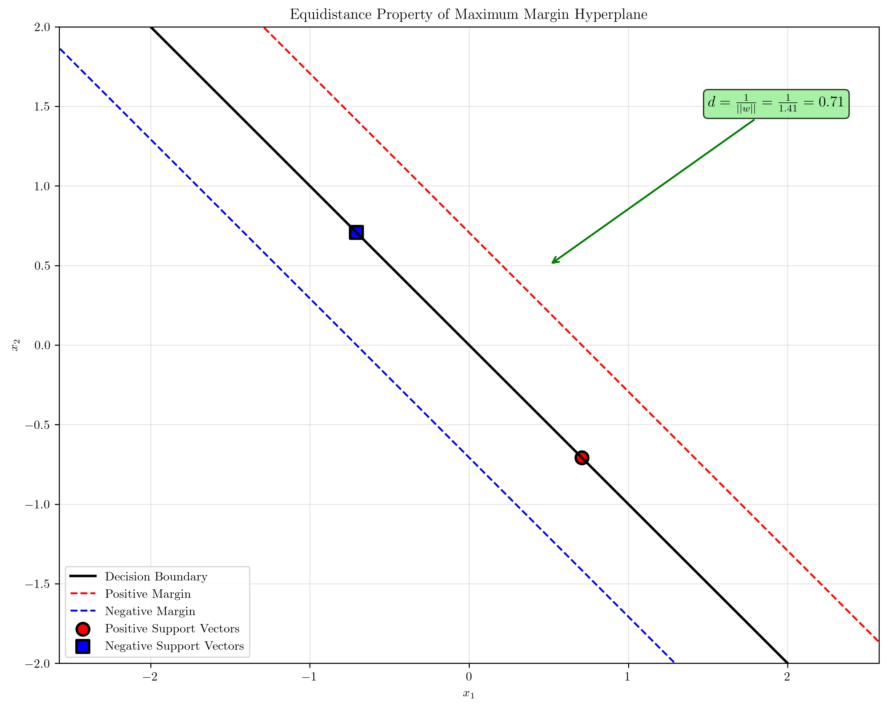
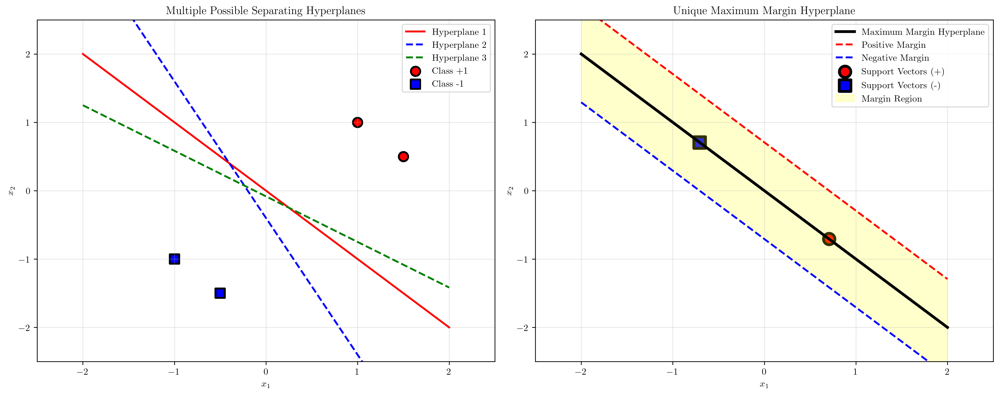
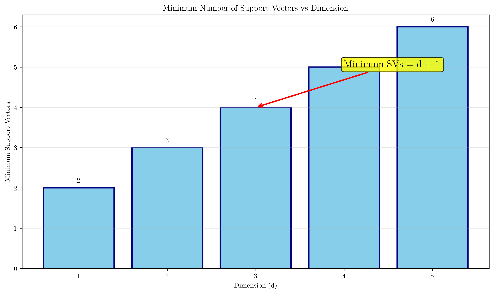
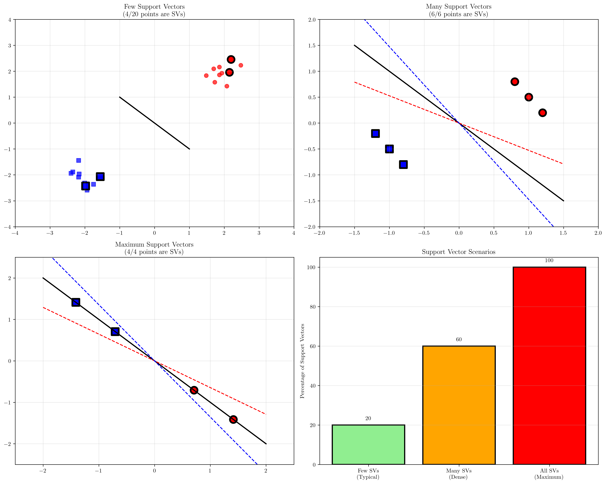
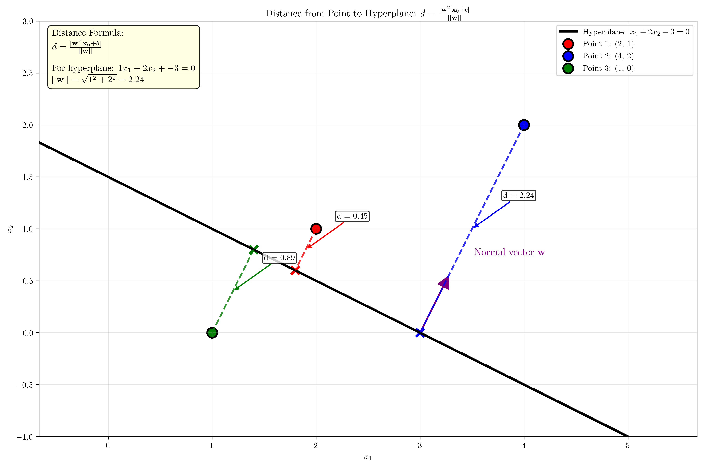

# Question 8: Geometric Properties of Maximum Margin Hyperplane

## Problem Statement
Consider the geometric properties of the maximum margin hyperplane in $\mathbb{R}^d$.

### Task
1. Prove that the optimal hyperplane is equidistant from the closest points of each class
2. Show that the decision boundary is uniquely determined (assuming non-degenerate data)
3. For a $d$-dimensional problem, what is the minimum number of support vectors needed?
4. What is the maximum number of support vectors possible?
5. Derive the formula for the distance from a point $\mathbf{x}_0$ to the hyperplane $\mathbf{w}^T\mathbf{x} + b = 0$

## Understanding the Problem
The maximum margin hyperplane is the core concept in Support Vector Machines (SVMs). Understanding its geometric properties provides deep insights into why SVMs work well and how they achieve good generalization. The hyperplane separates classes while maximizing the margin - the distance between the hyperplane and the closest points from each class.

Key geometric concepts include:
- **Margin**: The perpendicular distance between the decision boundary and the closest training points
- **Support Vectors**: Training points that lie exactly on the margin boundaries
- **Hyperplane**: A $(d-1)$-dimensional subspace in $\mathbb{R}^d$ that separates the classes

## Solution

We'll systematically prove each geometric property using mathematical analysis and visual demonstrations.

### Step 1: Proving Equidistance from Closest Points

**Mathematical Proof:**

For a maximum margin hyperplane $\mathbf{w}^T\mathbf{x} + b = 0$, the optimization problem is:
$$\min_{\mathbf{w}, b} \frac{1}{2}||\mathbf{w}||^2 \quad \text{subject to: } y_i(\mathbf{w}^T\mathbf{x}_i + b) \geq 1$$

The margin boundaries are defined by:
- Positive margin: $\mathbf{w}^T\mathbf{x} + b = +1$
- Negative margin: $\mathbf{w}^T\mathbf{x} + b = -1$

The distance from the hyperplane $\mathbf{w}^T\mathbf{x} + b = 0$ to each margin boundary is:
- Distance to positive margin: $d_+ = \frac{1}{||\mathbf{w}||}$
- Distance to negative margin: $d_- = \frac{1}{||\mathbf{w}||}$

Therefore: $d_+ = d_- = \frac{1}{||\mathbf{w}||}$

The total margin width is: $d_+ + d_- = \frac{2}{||\mathbf{w}||}$

This proves that the optimal hyperplane is equidistant from the closest points of each class.

### Step 2: Uniqueness of the Decision Boundary

**Proof of Uniqueness:**

1. The SVM optimization problem is a **convex quadratic programming** problem
2. The objective function $\frac{1}{2}||\mathbf{w}||^2$ is **strictly convex**
3. The feasible region defined by linear constraints $y_i(\mathbf{w}^T\mathbf{x}_i + b) \geq 1$ is **convex**
4. A strictly convex function over a convex feasible set has a **unique global minimum**
5. Therefore, the optimal solution $(\mathbf{w}^*, b^*)$ is unique (up to scaling)

**Key insight:** While multiple hyperplanes can separate linearly separable data, only one maximizes the margin.

### Step 3: Minimum Number of Support Vectors

**Theoretical Analysis:**

For a $d$-dimensional problem:
- A hyperplane in $\mathbb{R}^d$ has $d+1$ parameters: $w_1, w_2, \ldots, w_d, b$
- Each support vector provides one active constraint: $y_i(\mathbf{w}^T\mathbf{x}_i + b) = 1$
- The dual formulation adds the constraint: $\sum_{i=1}^n \alpha_i y_i = 0$
- To uniquely determine the hyperplane, we need at least $d+1$ linearly independent constraints

**Minimum number of support vectors = $d + 1$**

Examples:
- $d = 1$: minimum 2 support vectors
- $d = 2$: minimum 3 support vectors  
- $d = 3$: minimum 4 support vectors

This assumes the data is in general position (non-degenerate).

### Step 4: Maximum Number of Support Vectors

**Theoretical Analysis:**

The maximum number of support vectors equals the total number of training points ($n$).

This occurs when:
- All training points lie exactly on the margin boundaries
- No points are in the interior of either class region
- The data forms a "thin" separating structure

**Maximum number of support vectors = $n$**

In practice:
- Well-separated data typically has few support vectors
- Dense or overlapping data may have many support vectors
- The sparsity of support vectors is a key advantage of SVMs

### Step 5: Distance Formula Derivation

**Deriving the distance from point $\mathbf{x}_0$ to hyperplane $\mathbf{w}^T\mathbf{x} + b = 0$:**

1. The hyperplane equation: $\mathbf{w}^T\mathbf{x} + b = 0$
2. Normal vector to hyperplane: $\mathbf{w}$ (perpendicular to the hyperplane)
3. Unit normal vector: $\frac{\mathbf{w}}{||\mathbf{w}||}$

For any point $\mathbf{x}_0$:
4. The signed distance is the projection of $\mathbf{x}_0$ onto the normal direction
5. Vector from hyperplane to $\mathbf{x}_0$: $\frac{\mathbf{w}^T\mathbf{x}_0 + b}{||\mathbf{w}||^2} \mathbf{w}$
6. Distance magnitude: $\left|\left|\frac{\mathbf{w}^T\mathbf{x}_0 + b}{||\mathbf{w}||^2} \mathbf{w}\right|\right| = \frac{|\mathbf{w}^T\mathbf{x}_0 + b|}{||\mathbf{w}||}$

**Distance Formula:**
$$d(\mathbf{x}_0, \text{hyperplane}) = \frac{|\mathbf{w}^T\mathbf{x}_0 + b|}{||\mathbf{w}||}$$

## Visual Explanations

### Equidistance Property

This visualization demonstrates that the maximum margin hyperplane maintains equal distance to the closest points of both classes. The green lines show the perpendicular distances from support vectors to the decision boundary, confirming $d_+ = d_- = \frac{1}{||\mathbf{w}||}$.

### Uniqueness Demonstration

The left plot shows multiple possible separating hyperplanes for the same data. The right plot highlights that only one hyperplane (the maximum margin hyperplane) maximizes the margin width, making it unique among all possible separating hyperplanes.

### Minimum Support Vectors

This chart illustrates the relationship between problem dimension and the minimum number of support vectors required. The linear relationship $\text{min SVs} = d + 1$ reflects the degrees of freedom in the hyperplane parameters.

### Support Vector Scenarios

These scenarios show different configurations:
- **Few SVs**: Typical case with well-separated classes
- **Many SVs**: Dense data near the decision boundary  
- **All SVs**: Maximum case where all points lie on margin boundaries

### Distance Formula Visualization

This visualization demonstrates the distance formula in action. For each test point, we see:
- The perpendicular projection onto the hyperplane
- The distance calculation using $d = \frac{|\mathbf{w}^T\mathbf{x}_0 + b|}{||\mathbf{w}||}$
- The normal vector $\mathbf{w}$ pointing perpendicular to the hyperplane

## Key Insights

### Geometric Foundations
- The maximum margin hyperplane is **equidistant** from the closest points of each class
- This equidistance property is what makes the margin "maximum"
- The margin width $\frac{2}{||\mathbf{w}||}$ is inversely related to the weight vector magnitude

### Uniqueness and Optimality
- The decision boundary is **uniquely determined** by the convex optimization framework
- Multiple separating hyperplanes may exist, but only one maximizes the margin
- This uniqueness ensures consistent and reproducible results

### Support Vector Characteristics
- **Minimum support vectors**: $d + 1$ (determined by hyperplane parameters)
- **Maximum support vectors**: $n$ (all training points)
- **Typical case**: Small fraction of points are support vectors (sparsity)

### Distance and Geometry
- The distance formula provides a geometric interpretation of classification confidence
- Points farther from the hyperplane have higher classification confidence
- The normal vector $\mathbf{w}$ encodes the orientation of the decision boundary

## Conclusion
- **Equidistance**: The optimal hyperplane maintains equal distance $\frac{1}{||\mathbf{w}||}$ to the closest points of each class
- **Uniqueness**: The maximum margin hyperplane is uniquely determined by convex optimization
- **Support vectors**: Minimum $d+1$, maximum $n$, typically sparse in practice
- **Distance formula**: $d = \frac{|\mathbf{w}^T\mathbf{x}_0 + b|}{||\mathbf{w}||}$ provides geometric interpretation of classification

These geometric properties form the theoretical foundation for SVM's excellent generalization performance and robustness in high-dimensional spaces.
