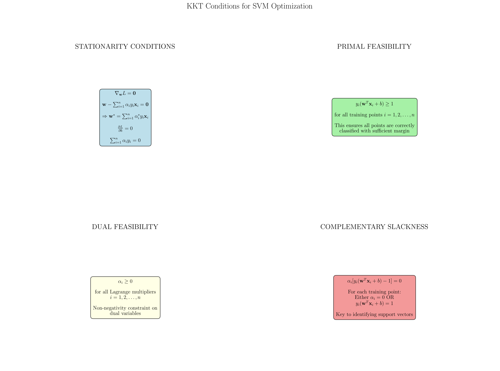
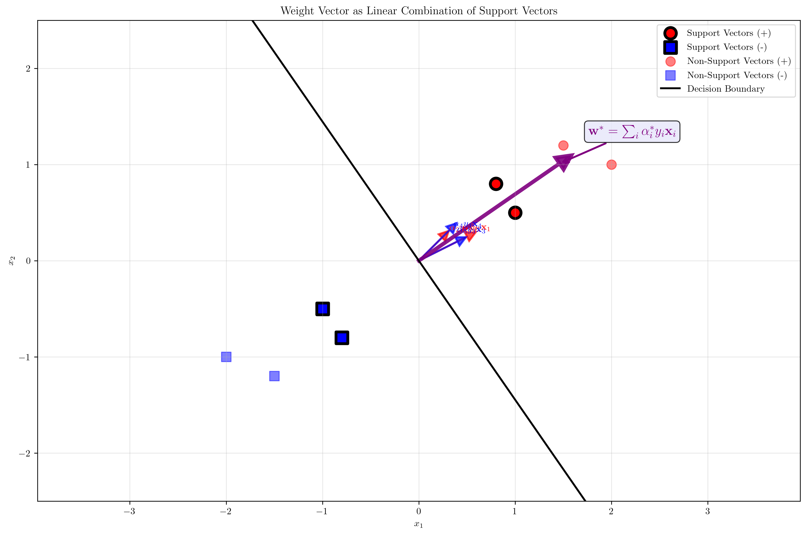
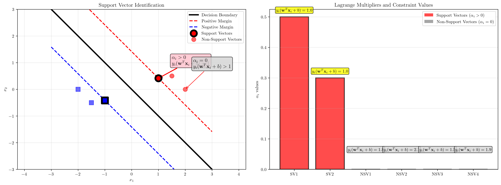
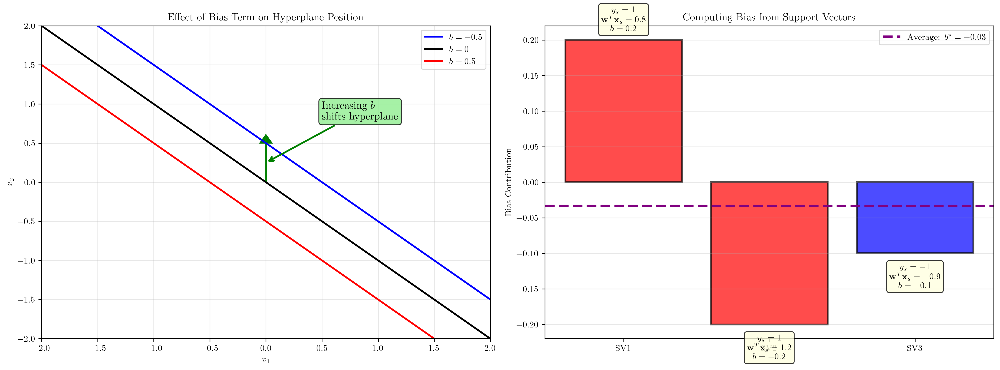

# Question 9: KKT Conditions Analysis

## Problem Statement
Given the constraint optimization problem for SVM, analyze the KKT conditions:
$$L(\mathbf{w}, b, \boldsymbol{\alpha}) = \frac{1}{2}||\mathbf{w}||^2 - \sum_{i=1}^n \alpha_i [y_i(\mathbf{w}^T\mathbf{x}_i + b) - 1]$$

### Task
1. Write out all the KKT conditions for optimality
2. Show that $\mathbf{w}^* = \sum_{i=1}^n \alpha_i^* y_i \mathbf{x}_i$
3. Prove that $\alpha_i^* > 0$ only for support vectors
4. For non-support vectors, show that $\alpha_i^* = 0$
5. Derive the condition for computing the bias term $b^*$

## Understanding the Problem
The Karush-Kuhn-Tucker (KKT) conditions are necessary and sufficient conditions for optimality in constrained optimization problems. For SVMs, these conditions provide crucial insights into:

- **Support Vector Identification**: Which training points determine the decision boundary
- **Optimal Solution Structure**: How the weight vector relates to training data
- **Sparsity**: Why most Lagrange multipliers are zero
- **Bias Computation**: How to calculate the optimal bias term

The SVM optimization problem is a convex quadratic program with inequality constraints, making the KKT conditions both necessary and sufficient for optimality.

## Solution

We'll systematically analyze each KKT condition and derive the key properties of the SVM solution.

### Step 1: Complete KKT Conditions for SVM

For the SVM optimization problem with Lagrangian:
$$L(\mathbf{w}, b, \boldsymbol{\alpha}) = \frac{1}{2}||\mathbf{w}||^2 - \sum_{i=1}^n \alpha_i [y_i(\mathbf{w}^T\mathbf{x}_i + b) - 1]$$

The **four KKT conditions** are:

**1. Stationarity Conditions:**
$$\nabla_{\mathbf{w}} L = \mathbf{0} \Rightarrow \mathbf{w} - \sum_{i=1}^n \alpha_i y_i \mathbf{x}_i = \mathbf{0}$$
$$\frac{\partial L}{\partial b} = 0 \Rightarrow \sum_{i=1}^n \alpha_i y_i = 0$$

**2. Primal Feasibility:**
$$y_i(\mathbf{w}^T\mathbf{x}_i + b) \geq 1 \quad \text{for all } i = 1, 2, \ldots, n$$

**3. Dual Feasibility:**
$$\alpha_i \geq 0 \quad \text{for all } i = 1, 2, \ldots, n$$

**4. Complementary Slackness:**
$$\alpha_i [y_i(\mathbf{w}^T\mathbf{x}_i + b) - 1] = 0 \quad \text{for all } i = 1, 2, \ldots, n$$

### Step 2: Derivation of Optimal Weight Vector

From the **stationarity condition** $\nabla_{\mathbf{w}} L = \mathbf{0}$:

$$\nabla_{\mathbf{w}} L = \nabla_{\mathbf{w}} \left[\frac{1}{2}||\mathbf{w}||^2 - \sum_{i=1}^n \alpha_i [y_i(\mathbf{w}^T\mathbf{x}_i + b) - 1]\right]$$

$$= \mathbf{w} - \sum_{i=1}^n \alpha_i y_i \mathbf{x}_i = \mathbf{0}$$

Therefore:
$$\boxed{\mathbf{w}^* = \sum_{i=1}^n \alpha_i^* y_i \mathbf{x}_i}$$

**Key Insight:** The optimal weight vector is a **linear combination** of the training points, weighted by $\alpha_i^* y_i$. This is the foundation of the "kernel trick" and shows that the solution depends only on inner products between data points.

### Step 3: Support Vector Identification

From **complementary slackness**: $\alpha_i [y_i(\mathbf{w}^T\mathbf{x}_i + b) - 1] = 0$

This condition means that for each training point $i$, **exactly one** of the following must be true:

1. $\alpha_i = 0$ (the constraint is inactive)
2. $y_i(\mathbf{w}^T\mathbf{x}_i + b) - 1 = 0$ (the constraint is active)

**For Support Vectors:**
- $\alpha_i^* > 0$ (Lagrange multiplier is positive)
- $y_i(\mathbf{w}^T\mathbf{x}_i + b) = 1$ (point lies exactly on the margin boundary)
- These points **determine** the decision boundary

**For Non-Support Vectors:**
- $\alpha_i^* = 0$ (Lagrange multiplier is zero)
- $y_i(\mathbf{w}^T\mathbf{x}_i + b) > 1$ (point lies beyond the margin boundary)
- These points **do not affect** the decision boundary

### Step 4: Proof of Sparsity

**Theorem:** $\alpha_i^* = 0$ for all non-support vectors.

**Proof:**
1. From complementary slackness: $\alpha_i [y_i(\mathbf{w}^T\mathbf{x}_i + b) - 1] = 0$
2. For non-support vectors: $y_i(\mathbf{w}^T\mathbf{x}_i + b) > 1$
3. This implies: $y_i(\mathbf{w}^T\mathbf{x}_i + b) - 1 > 0$
4. For the product to equal zero: $\alpha_i = 0$

Therefore, only support vectors (points on the margin boundary) have non-zero Lagrange multipliers.

### Step 5: Bias Term Computation

For any support vector $\mathbf{x}_s$ (where $\alpha_s > 0$):

From complementary slackness: $y_s(\mathbf{w}^{*T}\mathbf{x}_s + b^*) = 1$

Solving for $b^*$:
$$b^* = y_s - \mathbf{w}^{*T}\mathbf{x}_s$$

Substituting $\mathbf{w}^* = \sum_{i=1}^n \alpha_i^* y_i \mathbf{x}_i$:
$$b^* = y_s - \left(\sum_{i=1}^n \alpha_i^* y_i \mathbf{x}_i\right)^T \mathbf{x}_s$$
$$b^* = y_s - \sum_{i=1}^n \alpha_i^* y_i (\mathbf{x}_i^T \mathbf{x}_s)$$

**For numerical stability**, average over all support vectors:
$$\boxed{b^* = \frac{1}{|S|} \sum_{s \in S} \left[y_s - \sum_{i=1}^n \alpha_i^* y_i (\mathbf{x}_i^T \mathbf{x}_s)\right]}$$

where $S$ is the set of support vector indices.

## Visual Explanations

### KKT Conditions Overview

This visualization presents all four KKT conditions in a structured format, showing how each condition contributes to the optimal SVM solution. The color coding helps distinguish between different types of conditions.

### Weight Vector Decomposition

This plot demonstrates how the optimal weight vector $\mathbf{w}^*$ is constructed as a linear combination of support vectors. Each colored arrow represents a component $\alpha_i^* y_i \mathbf{x}_i$, and the purple arrow shows the final weight vector. Note how only support vectors contribute to the weight vector.

### Support Vector Identification

The left plot shows the geometric interpretation of support vector identification, while the right plot displays the relationship between Lagrange multipliers and constraint values. Support vectors have $\alpha_i > 0$ and lie exactly on the margin boundaries.

### Bias Computation

These visualizations show how the bias term affects hyperplane position (left) and how it's computed from support vectors (right). The averaging process ensures numerical stability when multiple support vectors are available.

### KKT Analysis Summary

This comprehensive flowchart summarizes the complete KKT analysis, showing the relationships between conditions, support vector identification, weight vector computation, and bias calculation.

## Key Insights

### Mathematical Foundations
- **KKT conditions** provide necessary and sufficient optimality conditions for the convex SVM problem
- **Stationarity** gives us the optimal weight vector as a linear combination of training points
- **Complementary slackness** is the key to identifying support vectors

### Support Vector Properties
- **Sparsity**: Most training points have $\alpha_i = 0$ (non-support vectors)
- **Active constraints**: Only support vectors satisfy $y_i(\mathbf{w}^T\mathbf{x}_i + b) = 1$
- **Decision boundary**: Determined entirely by support vectors

### Computational Implications
- **Efficiency**: Solution depends only on support vectors, not all training data
- **Kernel trick**: Weight vector formula enables non-linear extensions
- **Robustness**: Removing non-support vectors doesn't change the solution

### Practical Applications
- **Model interpretation**: Support vectors are the "critical" training examples
- **Memory efficiency**: Only support vectors need to be stored for prediction
- **Incremental learning**: New points far from boundary don't affect existing solution

## Conclusion
- **Complete KKT conditions**: Stationarity, primal feasibility, dual feasibility, and complementary slackness
- **Optimal weight vector**: $\mathbf{w}^* = \sum_{i=1}^n \alpha_i^* y_i \mathbf{x}_i$ (linear combination of training points)
- **Support vector identification**: $\alpha_i^* > 0$ if and only if $y_i(\mathbf{w}^T\mathbf{x}_i + b) = 1$
- **Sparsity property**: $\alpha_i^* = 0$ for all non-support vectors
- **Bias computation**: $b^* = \frac{1}{|S|} \sum_{s \in S} [y_s - \mathbf{w}^{*T}\mathbf{x}_s]$

The KKT conditions provide the theoretical foundation for understanding SVM's sparsity, efficiency, and geometric interpretation, making them essential for both theoretical analysis and practical implementation.
