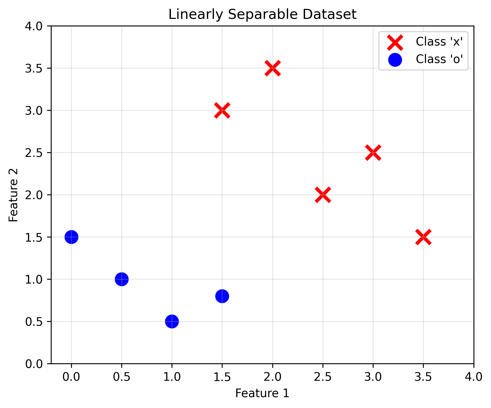
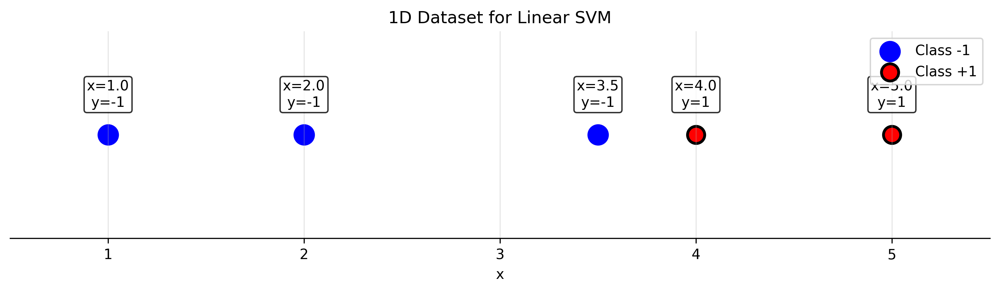

# Lecture 5.1: Maximum Margin Classifiers Quiz

## Overview
This quiz contains 26 questions covering different topics from section 5.1 of the lectures on Maximum Margin Theory, Geometric Interpretation, Linear Separability, Support Vectors, Dual Formulation, and Decision Functions.

## Question 1

### Problem Statement
Consider a linearly separable dataset in $\mathbb{R}^2$ with the following points:
- Class $+1$: $(2, 3)$, $(3, 4)$, $(4, 2)$
- Class $-1$: $(0, 1)$, $(1, 0)$, $(0, 0)$

#### Task
1. Draw these points on a coordinate system and sketch a possible separating hyperplane
2. For the hyperplane $w_1 x_1 + w_2 x_2 + b = 0$ with $w_1 = 1$, $w_2 = 1$, $b = -2$, verify that this hyperplane separates the two classes
3. Calculate the functional margin for each training point using this hyperplane
4. Calculate the geometric margin for the point $(2, 3)$
5. Is th
6. You are a city planner designing a neighborhood with two residential zones. Zone A houses are at $(2, 3)$, $(3, 4)$, $(4, 2)$ and Zone B houses are at $(0, 1)$, $(1, 0)$, $(0, 0)$. Design a straight road boundary that maximizes the minimum distance from any house to the road. If a new house is placed at $(2.5, 2.5)$, which zone should it belong to?

For a detailed explanation of this problem, see [Question 1: Separating Hyperplane Analysis](L5_1_1_explanation.md).

## Question 2

### Problem Statement
Consider the primal optimization problem for maximum margin classification:
$$\min_{\mathbf{w}, b} \frac{1}{2}||\mathbf{w}||^2$$
$$\text{subject to: } y_i(\mathbf{w}^T\mathbf{x}_i + b) \geq 1, \quad i = 1, \ldots, n$$

#### Task
1. Explain why we minimize $\frac{1}{2}||\mathbf{w}||^2$ instead of maximizing $\frac{1}{||\mathbf{w}||}$ directly
2. What is the geometric interpretation of the constraint $y_i(\mathbf{w}^T\mathbf{x}_i + b) \geq 1$?
3. Prove that the margin width is $\frac{2}{||\mathbf{w}||}$
4. For a 2D problem, what is the minimum number of constraints that must be active at the optimal solution?
5. Write the Lagrangian function for this optimization problem

For a detailed explanation of this problem, see [Question 2: Primal Optimization Problem](L5_1_2_explanation.md).

## Question 3

### Problem Statement
Given the dataset:
- $\mathbf{x}_1 = (1, 1)$, $y_1 = +1$
- $\mathbf{x}_2 = (2, 2)$, $y_2 = +1$
- $\mathbf{x}_3 = (-1, -1)$, $y_3 = -1$
- $\mathbf{x}_4 = (-2, -1)$, $y_4 = -1$

#### Task
1. Determine which points are support vectors for the maximum margin hyperplane
2. If the optimal hyperplane is $x_1 + x_2 = 0$, verify that this satisfies the KKT conditions
3. Calculate the Lagrange multipliers $\alpha_i$ for each training point
4. Verify that $\sum_{i=1}^4 \alpha_i y_i = 0$
5. Express the weight vector $\mathbf{w}$ in terms of the support vectors and their multipliers

For a detailed explanation of this problem, see [Question 3: Support Vector Identification](L5_1_3_explanation.md).

## Question 4

### Problem Statement
Consider the dual formulation of the maximum margin problem:
$$\max_{\boldsymbol{\alpha}} \sum_{i=1}^n \alpha_i - \frac{1}{2}\sum_{i=1}^n\sum_{j=1}^n \alpha_i\alpha_j y_i y_j \mathbf{x}_i^T\mathbf{x}_j$$
$$\text{subject to: } \sum_{i=1}^n \alpha_i y_i = 0, \quad \alpha_i \geq 0$$

#### Task
1. Derive this dual formulation from the primal using Lagrange multipliers
2. What is the relationship between $\mathbf{w}$ and the dual variables $\alpha_i$?
3. For a dataset with $n = 1000$ training points in $d = 50$ dimensions, compare the number of variables in primal vs dual formulations
4. Under what conditions would you prefer the dual formulation over the primal?
5. Prove that strong duality holds for the SVM optimization problem

For a detailed explanation of this problem, see [Question 4: Dual Formulation Derivation](L5_1_4_explanation.md).

## Question 5

### Problem Statement
Consider a simple 2D example with three points:
- $\mathbf{x}_1 = (0, 1)$, $y_1 = +1$
- $\mathbf{x}_2 = (1, 0)$, $y_2 = +1$
- $\mathbf{x}_3 = (-1, -1)$, $y_3 = -1$

#### Task
1. Set up the dual optimization problem with the specific kernel matrix
2. Solve the dual problem analytically to find the optimal $\alpha_i$ values
3. Calculate the optimal weight vector $\mathbf{w}^*$
4. Find the bias term $b^*$ using the support vector conditions
5. Write the final decision function $f(\mathbf{x}) = \text{sign}(\mathbf{w}^{*T}\mathbf{x} + b^*)$
6. In a strategy game, your Red Army units are at $(0, 1)$, $(1, 0)$ and enemy Blue Army units are at $(-1, -1)$. Design the optimal defensive wall (straight line) that maximizes your controlled territory. Calculate the safety margin and determine where to place an additional Red unit for maximum advantage.

For a detailed explanation of this problem, see [Question 5: Analytical Solution](L5_1_5_explanation.md).

## Question 6

### Problem Statement
A dataset has $n = 500$ training points in $\mathbb{R}^{10}$. After training a maximum margin classifier, you find that only $k = 50$ points are support vectors.

#### Task
1. What does this tell you about the remaining $450$ points?
2. If you remove $100$ non-support vector points and retrain, how will this affect the decision boundary?
3. Calculate the sparsity ratio of the solution
4. If you add $50$ new training points that are far from the decision boundary, how many support vectors would you expect?
5. Explain why SVMs are called "sparse" classifiers

For a detailed explanation of this problem, see [Question 6: Support Vector Sparsity](L5_1_6_explanation.md).

## Question 7

### Problem Statement
Compare the maximum margin classifier with the perceptron algorithm on the following dataset:
- $\mathbf{x}_1 = (2, 1)$, $y_1 = +1$
- $\mathbf{x}_2 = (1, 2)$, $y_2 = +1$
- $\mathbf{x}_3 = (-1, -1)$, $y_3 = -1$

#### Task
1. Find the maximum margin separating hyperplane analytically
2. Show that the perceptron could find a different separating hyperplane
3. Calculate the margin achieved by both methods
4. Which method would you expect to generalize better and why?
5. Analyze the computational complexity of both algorithms

For a detailed explanation of this problem, see [Question 7: SVM vs Perceptron Comparison](L5_1_7_explanation.md).

## Question 8

### Problem Statement
Consider the geometric properties of the maximum margin hyperplane in $\mathbb{R}^d$.

#### Task
1. Prove that the optimal hyperplane is equidistant from the closest points of each class
2. Show that the decision boundary is uniquely determined (assuming non-degenerate data)
3. For a $d$-dimensional problem, what is the minimum number of support vectors needed?
4. What is the maximum number of support vectors possible?
5. Derive the formula for the distance from a point $\mathbf{x}_0$ to the hyperplane $\mathbf{w}^T\mathbf{x} + b = 0$

For a detailed explanation of this problem, see [Question 8: Geometric Properties](L5_1_8_explanation.md).

## Question 9

### Problem Statement
Given the constraint optimization problem for SVM, analyze the KKT conditions:
$$L(\mathbf{w}, b, \boldsymbol{\alpha}) = \frac{1}{2}||\mathbf{w}||^2 - \sum_{i=1}^n \alpha_i [y_i(\mathbf{w}^T\mathbf{x}_i + b) - 1]$$

#### Task
1. Write out all the KKT conditions for optimality
2. Show that $\mathbf{w}^* = \sum_{i=1}^n \alpha_i^* y_i \mathbf{x}_i$
3. Prove that $\alpha_i^* > 0$ only for support vectors
4. For non-support vectors, show that $\alpha_i^* = 0$
5. Derive the condition for computing the bias term $b^*$

For a detailed explanation of this problem, see [Question 9: KKT Conditions Analysis](L5_1_9_explanation.md).

## Question 10

### Problem Statement
Consider a linearly separable dataset where the optimal hyperplane is $2x_1 + 3x_2 - 6 = 0$.

#### Task
1. Calculate the distance from the point $(1, 2)$ to this hyperplane
2. If $(1, 2)$ has label $y = +1$, what is its functional margin?
3. Normalize the hyperplane equation so that the closest points have functional margin $\pm 1$
4. Calculate the geometric margin of the normalized hyperplane
5. If you scale the entire dataset by a factor of $2$, how does the margin change?

For a detailed explanation of this problem, see [Question 10: Margin Calculations](L5_1_10_explanation.md).

## Question 11

### Problem Statement
Analyze the computational aspects of the maximum margin formulation.

#### Task
1. What type of optimization problem is the SVM primal formulation (linear, quadratic, convex)?
2. Prove that the feasible region is convex
3. Show that the objective function is strictly convex
4. What is the time complexity of solving the primal problem using standard QP solvers?
5. Under what conditions does the problem have a unique solution?

For a detailed explanation of this problem, see [Question 11: Optimization Theory](L5_1_11_explanation.md).

## Question 12

### Problem Statement
Consider the decision function and classification confidence in maximum margin classifiers.

#### Task
1. For the decision function $f(\mathbf{x}) = \mathbf{w}^T\mathbf{x} + b$, what does the magnitude $|f(\mathbf{x})|$ represent?
2. Derive the relationship between $|f(\mathbf{x})|$ and the distance to the hyperplane
3. Given two test points with $f(\mathbf{x}_1) = 0.1$ and $f(\mathbf{x}_2) = 2.5$, which classification is more confident?
4. How would you convert the decision values into probabilistic outputs?
5. What happens to the confidence measure when you scale the weight vector?

For a detailed explanation of this problem, see [Question 12: Decision Function Analysis](L5_1_12_explanation.md).

## Question 13

### Problem Statement
Prove key theoretical properties of the maximum margin classifier.

#### Task
1. Prove that if the training data is linearly separable, then the SVM optimization problem has a solution
2. Show that the solution is unique (up to scaling)
3. Prove that removing non-support vectors doesn't change the solution
4. Demonstrate that adding a new point far from the boundary doesn't affect the solution
5. Prove the representer theorem for the maximum margin classifier

For a detailed explanation of this problem, see [Question 13: Theoretical Properties](L5_1_13_explanation.md).

## Question 14

### Problem Statement
Consider scaling and normalization effects on the maximum margin classifier.

#### Task
1. If you multiply all feature values by a constant $c > 0$, how does this affect $\mathbf{w}^*$ and $b^*$?
2. If you add a constant to all labels ($y_i \rightarrow y_i + k$), what happens to the problem?
3. How does standardizing features (zero mean, unit variance) affect the SVM solution?
4. Why is feature scaling important for SVMs compared to some other algorithms?
5. Derive the invariance properties of the SVM under affine transformations

For a detailed explanation of this problem, see [Question 14: Scaling and Invariance](L5_1_14_explanation.md).

## Question 15

### Problem Statement
Design and analyze a complete maximum margin classification example.

#### Task
1. Create a 2D dataset with 6 points (3 per class) that requires exactly 3 support vectors
2. Solve the optimization problem analytically to find the optimal hyperplane
3. Verify your solution satisfies all KKT conditions
4. Calculate the generalization bound using VC dimension theory
5. Compare your analytical solution with the geometric construction

For a detailed explanation of this problem, see [Question 15: Complete Example Design](L5_1_15_explanation.md).

## Question 16

### Problem Statement
Consider a 2D dataset with training points:
- Class +1: $\mathbf{x}_1 = (2, 1)$, $\mathbf{x}_2 = (3, 3)$
- Class -1: $\mathbf{x}_3 = (0, 0)$, $\mathbf{x}_4 = (1, 2)$

The optimal hyperplane is $w_1 x_1 + w_2 x_2 + b = 0$ with $\mathbf{w} = (1, -1)^T$ and $b = 0.5$.

#### Task
1. Calculate $y_i(\mathbf{w}^T\mathbf{x}_i + b)$ for each point and verify the margin constraints
2. Identify which points are support vectors (constraints satisfied with equality)
3. Calculate the geometric margin $\gamma = \frac{1}{||\mathbf{w}||}$
4. Find the distance from test point $(1.5, 1.5)$ to the hyperplane
5. Write equations for the positive and negative margin boundaries

For a detailed explanation of this problem, see [Question 16: Numerical Hyperplane Analysis](L5_1_16_explanation.md).

## Question 17

### Problem Statement
For the dataset:
- $\mathbf{x}_1 = (1, 0)$, $y_1 = +1$
- $\mathbf{x}_2 = (0, 1)$, $y_2 = +1$  
- $\mathbf{x}_3 = (-1, -1)$, $y_3 = -1$

#### Task
1. Compute $G_{ij} = y_i y_j \mathbf{x}_i^T\mathbf{x}_j$ for all pairs $(i,j)$
2. Write the dual objective $\sum_i \alpha_i - \frac{1}{2}\sum_{i,j} \alpha_i \alpha_j G_{ij}$ explicitly
3. Express the constraint $\sum_i \alpha_i y_i = 0$ numerically
4. For $\alpha_1 = 0.5, \alpha_2 = 0.5, \alpha_3 = 1.0$, verify constraint satisfaction and compute objective value
5. Calculate $\mathbf{w} = \sum_i \alpha_i y_i \mathbf{x}_i$ and determine $b$ using support vector conditions

For a detailed explanation of this problem, see [Question 17: Complete Dual Solution](L5_1_17_explanation.md).

## Question 18

### Problem Statement
Consider a 3D maximum margin problem with hyperplane $2x_1 - x_2 + 3x_3 = 6$.

#### Task
1. Identify $\mathbf{w}$ and $b$ from the hyperplane equation
2. Compute the margin width $\frac{2}{||\mathbf{w}||}$
3. Classify points $\mathbf{a} = (1, 0, 2)$, $\mathbf{b} = (3, 1, 1)$, $\mathbf{c} = (0, -2, 2)$
4. Calculate signed distance from each point using $d = \frac{\mathbf{w}^T\mathbf{x} - 6}{||\mathbf{w}||}$
5. Write equations for $\mathbf{w}^T\mathbf{x} - 6 = \pm ||\mathbf{w}||$

For a detailed explanation of this problem, see [Question 18: 3D Geometric Analysis](L5_1_18_explanation.md).

## Question 19

### Problem Statement
A solved SVM has Lagrange multipliers $\alpha_1 = 0.3$, $\alpha_2 = 0$, $\alpha_3 = 0.7$, $\alpha_4 = 0$.

#### Task
1. Which points are support vectors? Which are non-support vectors?
2. For each point, state the applicable KKT condition
3. Verify $\alpha_i[y_i(\mathbf{w}^T\mathbf{x}_i + b) - 1] = 0$ implications
4. What are the functional margins for points 2 and 4?
5. Prove that the optimal hyperplane is uniquely determined by these $\alpha$ values

For a detailed explanation of this problem, see [Question 19: KKT Optimality Analysis](L5_1_19_explanation.md).

## Question 20

### Problem Statement
Two linear classifiers on the same dataset:
- **Perceptron**: $\mathbf{w}_P = (2, 1)^T$, $b_P = -3$
- **Max Margin**: $\mathbf{w}_M = (1, 0.5)^T$, $b_M = -1.5$

#### Task
1. Calculate and compare margin widths
2. For test point $(4, 2)$, compute $f_P(\mathbf{x})$ and $f_M(\mathbf{x})$
3. Normalize both $\mathbf{w}$ vectors and recalculate decision values
4. Which classifier is more confident about the test point classification?
5. Using margin theory, explain expected generalization performance differences

For a detailed explanation of this problem, see [Question 20: Algorithm Comparison](L5_1_20_explanation.md).

## Question 21

### Problem Statement
From first principles, derive the dual problem for the dataset:
- $\mathbf{x}_1 = (1, 1)$, $y_1 = +1$; $\mathbf{x}_2 = (2, 2)$, $y_2 = +1$
- $\mathbf{x}_3 = (-1, 0)$, $y_3 = -1$; $\mathbf{x}_4 = (0, -1)$, $y_4 = -1$

#### Task
1. Write the complete primal optimization problem
2. Form $L(\mathbf{w}, b, \boldsymbol{\alpha}) = \frac{1}{2}||\mathbf{w}||^2 - \sum_i \alpha_i[y_i(\mathbf{w}^T\mathbf{x}_i + b) - 1]$
3. Derive $\nabla_\mathbf{w} L = 0$ and $\frac{\partial L}{\partial b} = 0$
4. Substitute stationarity conditions into Lagrangian
5. Obtain the dual problem with explicit kernel matrix entries

For a detailed explanation of this problem, see [Question 21: Complete Derivation](L5_1_21_explanation.md).

## Question 22

### Problem Statement
The objective of a hard-margin SVM is to maximize the geometric margin, which is given by the expression $\frac{2}{||\mathbf{w}||}$.

#### Task
1.  Start with the equation of a hyperplane $\mathbf{w}^T\mathbf{x} + b = 0$.
2.  Consider the two parallel hyperplanes that form the margin boundaries: $\mathbf{w}^T\mathbf{x} + b = 1$ and $\mathbf{w}^T\mathbf{x} + b = -1$.
3.  Derive the formula for the perpendicular distance between these two hyperplanes to show that the margin width is indeed $\frac{2}{||\mathbf{w}||}$.

For a detailed explanation of this problem, see [Question 22: Deriving the Geometric Margin](L5_1_22_explanation.md).

## [⭐] Question 23

### Problem Statement
Evaluate whether each of the following statements is TRUE or FALSE. Justify your answer with a brief explanation.

#### Task
1. Support vector machines, like logistic regression models, give a probability distribution over the possible labels given an input example.
2. The maximum margin decision boundaries that support vector machines construct have the lowest generalization error among all linear classifiers.
3. We would expect the support vectors to remain the same in general as we move from a linear kernel to higher order polynomial kernels.

For a detailed explanation of this problem, see [Question 23: SVM Output Properties](L5_1_23_explanation.md).

## [⭐] Question 24

### Problem Statement
Consider the dataset and the maximum margin separating hyperplane shown in the figure below.

*The figure displays two classes of data points ('x' and 'o') that are linearly separable. A solid line represents the optimal decision boundary, and two dashed lines represent the margins. The support vectors, which lie on the margin lines, are highlighted with circles.*

#### Task
1. What is the leave-one-out cross-validation (LOOCV) error estimate for this maximum margin classifier?
2. Provide a brief justification for your answer.

For a detailed explanation of this problem, see [Question 24: LOOCV for Hard-Margin SVM](L5_1_24_explanation.md).

## [⭐] Question 25

### Problem Statement
Consider the following 1D dataset. We are going to learn a linear SVM of the form $f(x) = \text{sign}(wx+b)$ from it.

| X   | Y    |
| --- | ---- |
| 1   | -1   |
| 2   | -1   |
| 3.5 | -1   |
| 4   | 1    |
| 5   | 1    |

*The figure shows data points for Class -1 (denoted by hollow circles) at x=1, 2, and 3.5, and for Class 1 (denoted by filled circles) at x=4 and 5.*

### Task
1.  What values for $w$ and $b$ will be learned by the linear SVM to create the maximum margin hyperplane?
2.  What is the training set error of this classifier, expressed as the percentage of misclassified points?
3.  What is the leave-one-out cross-validation (LOOCV) error of this classifier, expressed as a percentage?

For a detailed explanation of this problem, see [Question 25: 1D Hard-Margin SVM Analysis](L5_1_25_explanation.md).

## Question 26

### Problem Statement
The central idea of a Support Vector Machine is to find a separating hyperplane that is "optimal" in some sense.

#### Task
1.  Define the "margin" of a separating hyperplane in the context of a linearly separable dataset.
2.  Explain intuitively why a hyperplane with a larger margin is generally preferred over one with a smaller margin.
3.  How does the concept of maximizing the margin relate to the model's generalization capability on unseen data?

For a detailed explanation of this problem, see [Question 26: The Margin and Generalization](L5_1_26_explanation.md).