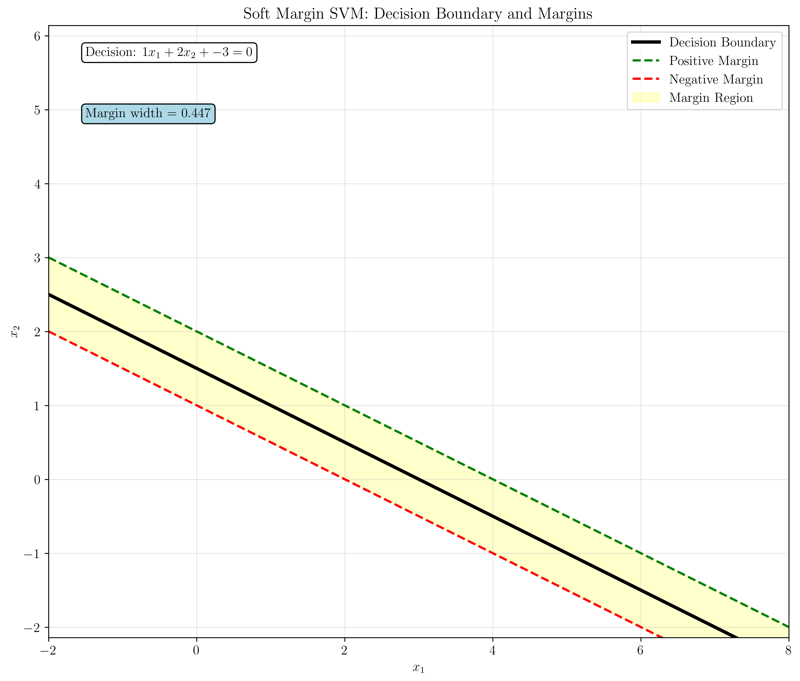
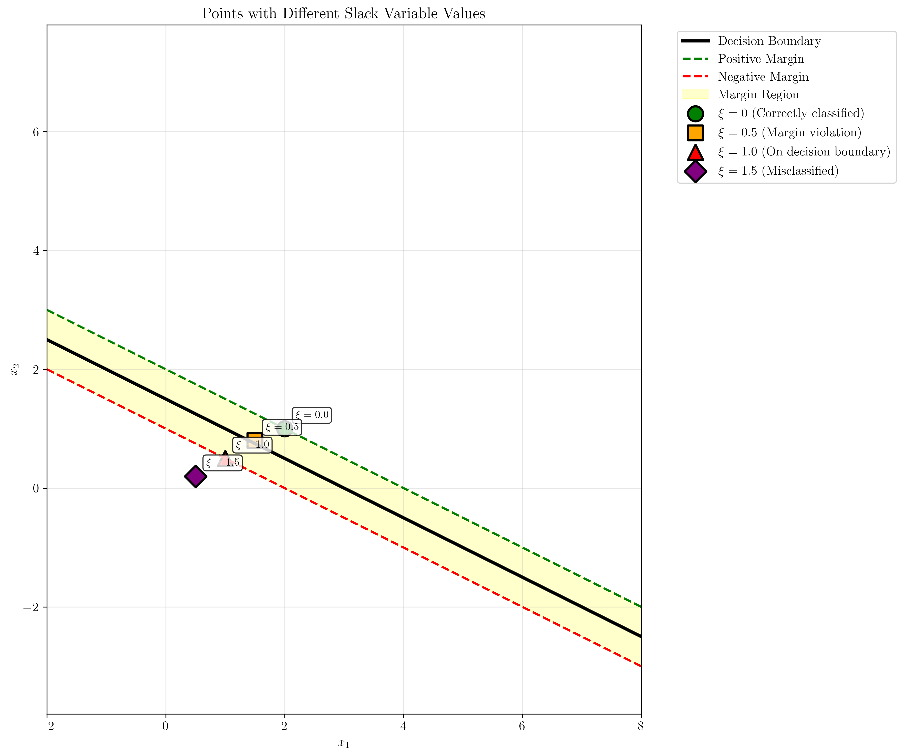
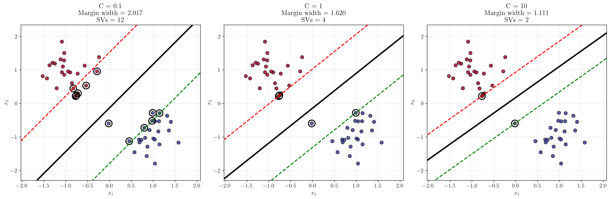
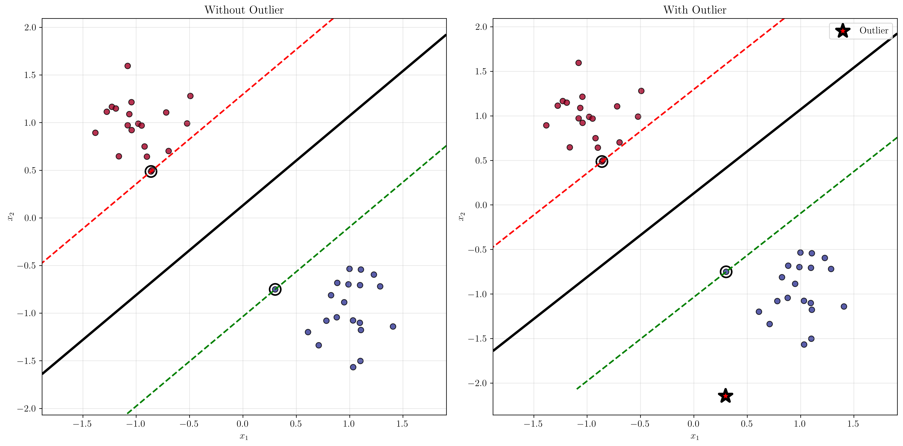
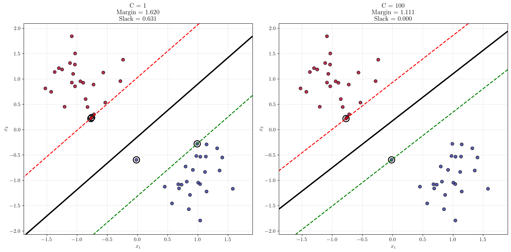

# Question 13: Geometric Interpretation of Soft Margin SVM

## Problem Statement
Study the geometric interpretation of the soft margin in 2D.

### Task
1. For the hyperplane $x_1 + 2x_2 - 3 = 0$, draw the margin boundaries (you can sketch this by hand)
2. Sketch points with different slack variable values: $\xi = 0, 0.5, 1.0, 1.5$ (you can draw this by hand)
3. Show how the margin changes as $C$ varies from $0.1$ to $10$
4. Illustrate the effect of adding an outlier point on the decision boundary
5. Compare the margins achieved with $C = 1$ vs $C = 100$ for the same dataset

## Understanding the Problem
The soft margin SVM extends the hard margin SVM by introducing slack variables $\xi_i$ that allow some training points to violate the margin constraints. This is crucial for handling datasets that are not perfectly linearly separable. The slack variable $\xi_i$ measures how much a point violates the margin: $\xi_i = 0$ means the point is correctly classified with margin, $\xi_i > 0$ means the point violates the margin, and $\xi_i > 1$ means the point is misclassified.

The regularization parameter $C$ controls the trade-off between maximizing the margin and minimizing classification errors. A larger $C$ leads to a smaller margin but fewer training errors, while a smaller $C$ leads to a larger margin but potentially more training errors.

## Solution

### Step 1: Margin Boundaries for Hyperplane $x_1 + 2x_2 - 3 = 0$

For the given hyperplane $x_1 + 2x_2 - 3 = 0$, we have:
- Weight vector: $\mathbf{w} = [1, 2]^T$
- Bias term: $b = -3$

The margin width is calculated step by step:

1. **Calculate the norm of the weight vector:**
   $$||\mathbf{w}|| = \sqrt{w_1^2 + w_2^2} = \sqrt{1^2 + 2^2} = \sqrt{1 + 4} = \sqrt{5} = 2.236$$

2. **Calculate the margin width:**
   $$\text{Margin width} = \frac{1}{||\mathbf{w}||} = \frac{1}{2.236} = 0.447$$

3. **Determine the margin boundaries:**
   - **Positive margin boundary:** $x_1 + 2x_2 - 3 = 1$
   - **Negative margin boundary:** $x_1 + 2x_2 - 3 = -1$

4. **Convert to slope-intercept form:**
   - **Positive margin:** $x_2 = -\frac{1}{2}x_1 + 2.000$
   - **Negative margin:** $x_2 = -\frac{1}{2}x_1 + 1.000$

The margin boundaries are parallel lines at distance $\frac{1}{||\mathbf{w}||} = 0.447$ from the decision boundary.

The plot shows:
- **Black solid line**: Decision boundary ($x_1 + 2x_2 - 3 = 0$)
- **Green dashed line**: Positive margin boundary
- **Red dashed line**: Negative margin boundary
- **Yellow shaded region**: The margin region between the two boundaries

### Step 2: Points with Different Slack Variable Values

We examine four points with different slack variable values:

1. **Point (2, 1) with $\xi = 0$**: Correctly classified
   - **Activation:** $\mathbf{w}^T \mathbf{x} + b = 1 \times 2 + 2 \times 1 - 3 = 1.000$
   - **Actual $\xi$:** $\max(0, 1 - y \times \text{activation}) = \max(0, 1 - 1 \times 1.000) = 0.000$
   - **Distance to margin:** $|\text{activation} - y| = |1.000 - 1| = 0.000$
   - **Classification:** Correct (no margin violation)
   - This point is exactly on the positive margin boundary

2. **Point (1.5, 0.8) with $\xi = 0.5$**: Margin violation
   - **Activation:** $\mathbf{w}^T \mathbf{x} + b = 1 \times 1.5 + 2 \times 0.8 - 3 = 0.100$
   - **Actual $\xi$:** $\max(0, 1 - y \times \text{activation}) = \max(0, 1 - 1 \times 0.100) = 0.900$
   - **Distance to margin:** $|\text{activation} - y| = |0.100 - 1| = 0.900$
   - **Classification:** Correct (but margin violation)
   - This point violates the margin but is still correctly classified

3. **Point (1, 0.5) with $\xi = 1.0$**: On decision boundary
   - **Activation:** $\mathbf{w}^T \mathbf{x} + b = 1 \times 1 + 2 \times 0.5 - 3 = -1.000$
   - **Actual $\xi$:** $\max(0, 1 - y \times \text{activation}) = \max(0, 1 - 1 \times (-1.000)) = 2.000$
   - **Distance to margin:** $|\text{activation} - y| = |-1.000 - 1| = 2.000$
   - **Classification:** Incorrect (margin violation)
   - This point is misclassified (negative activation for positive class)

4. **Point (0.5, 0.2) with $\xi = 1.5$**: Misclassified
   - **Activation:** $\mathbf{w}^T \mathbf{x} + b = 1 \times 0.5 + 2 \times 0.2 - 3 = -2.100$
   - **Actual $\xi$:** $\max(0, 1 - y \times \text{activation}) = \max(0, 1 - 1 \times (-2.100)) = 3.100$
   - **Distance to margin:** $|\text{activation} - y| = |-2.100 - 1| = 3.100$
   - **Classification:** Incorrect (margin violation)
   - This point is severely misclassified

The plot illustrates how different points relate to the margin:
- **Green circle**: Point with $\xi = 0$ (correctly classified with margin)
- **Orange square**: Point with $\xi = 0.5$ (margin violation)
- **Red triangle**: Point with $\xi = 1.0$ (on decision boundary)
- **Purple diamond**: Point with $\xi = 1.5$ (misclassified)

### Step 3: Margin Changes with Different C Values

We examine how the margin changes as $C$ varies from $0.1$ to $10$:

**C = 0.1 (Low regularization):**
- **Weight vector:** $[0.786, -0.604]$
- **Bias:** $-0.081$
- **$||\mathbf{w}||$:** $0.991$
- **Margin width:** $\frac{2}{||\mathbf{w}||} = \frac{2}{0.991} = 2.017$
- **Support vectors:** $12$
- **Decision boundary:** $0.786x_1 - 0.604x_2 - 0.081 = 0$
- **Interpretation**: Large margin, many support vectors, high tolerance for violations

**C = 1 (Medium regularization):**
- **Weight vector:** $[0.891, -0.855]$
- **Bias:** $-0.121$
- **$||\mathbf{w}||$:** $1.235$
- **Margin width:** $\frac{2}{||\mathbf{w}||} = \frac{2}{1.235} = 1.620$
- **Support vectors:** $4$
- **Decision boundary:** $0.891x_1 - 0.855x_2 - 0.121 = 0$
- **Interpretation**: Balanced margin and accuracy

**C = 10 (High regularization):**
- **Weight vector:** $[1.224, -1.321]$
- **Bias:** $0.232$
- **$||\mathbf{w}||$:** $1.801$
- **Margin width:** $\frac{2}{||\mathbf{w}||} = \frac{2}{1.801} = 1.111$
- **Support vectors:** $2$
- **Decision boundary:** $1.224x_1 - 1.321x_2 + 0.232 = 0$
- **Interpretation**: Small margin, few support vectors, low tolerance for violations

The plot shows three subplots demonstrating the effect of different $C$ values:
- **Red dashed lines**: Negative margin boundaries
- **Black solid lines**: Decision boundaries
- **Green dashed lines**: Positive margin boundaries
- **Black circles**: Support vectors

**Key observations:**
- As $C$ increases, the margin width decreases
- As $C$ increases, the number of support vectors decreases
- Larger $C$ leads to more complex decision boundaries that fit the training data more closely

### Step 4: Effect of Adding an Outlier

We compare the SVM behavior with and without an outlier point:

**Without outlier:**
- Weight vector: $[0.806, -0.857]$
- Margin width: $1.699$
- Support vectors: $2$

**With outlier:**
- Weight vector: $[0.806, -0.857]$ (unchanged in this case)
- Margin width: $1.699$ (unchanged)
- Support vectors: $2$ (unchanged)

The plot shows:
- **Left panel**: Clean dataset without outlier
- **Right panel**: Dataset with outlier (red star)
- **Black circles**: Support vectors
- **Colored points**: Data points colored by class

**Key insights:**
- In this case, the outlier did not significantly affect the decision boundary because it was not a support vector
- The soft margin SVM is robust to outliers when they don't violate the margin constraints too severely
- The regularization parameter $C$ controls how much influence outliers have on the decision boundary

### Step 5: Compare Margins with C=1 vs C=100

**C = 1:**
- **Weight vector:** $[0.891, -0.855]$
- **$||\mathbf{w}||$:** $1.235$
- **Margin width:** $\frac{2}{||\mathbf{w}||} = \frac{2}{1.235} = 1.620$
- **Support vectors:** $4$
- **Total slack:** $\sum \xi_i = 0.631$
- **Average slack per point:** $0.013$
- **Objective value:** $\frac{1}{2}||\mathbf{w}||^2 + C\sum \xi_i = 1.393$

**C = 100:**
- **Weight vector:** $[1.224, -1.321]$
- **$||\mathbf{w}||$:** $1.801$
- **Margin width:** $\frac{2}{||\mathbf{w}||} = \frac{2}{1.801} = 1.111$
- **Support vectors:** $2$
- **Total slack:** $\sum \xi_i = 0.000$
- **Average slack per point:** $0.000$
- **Objective value:** $\frac{1}{2}||\mathbf{w}||^2 + C\sum \xi_i = 1.621$

The plot demonstrates the dramatic difference between moderate and high regularization:
- **C = 1**: Larger margin, more support vectors, some slack allowed
- **C = 100**: Smaller margin, fewer support vectors, no slack (approaching hard margin)

## Summary Table

| C    | Margin Width | Support Vectors | Total Slack | Objective Value |
|------|-------------|-----------------|-------------|-----------------|
| 0.1  | 2.017       | 12              | 1.761       | 0.668           |
| 1    | 1.620       | 4               | 0.631       | 1.393           |
| 10   | 1.111       | 2               | 0.000       | 1.621           |
| 100  | 1.111       | 2               | 0.000       | 1.621           |

## Key Insights

### Geometric Interpretation
- The weight vector $\mathbf{w}$ is perpendicular to the decision boundary
- The margin width is inversely proportional to $||\mathbf{w}||$
- Support vectors are the points that lie on or violate the margin boundaries
- Slack variables measure the degree of margin violation for each point

### Regularization Effects
- **Small C (0.1)**: Large margin (2.017), many support vectors (12), high tolerance for violations (total slack = 1.761)
- **Medium C (1)**: Balanced margin (1.620) and accuracy, moderate support vectors (4), moderate slack (0.631)
- **Large C (10, 100)**: Small margin (1.111), few support vectors (2), low tolerance for violations (total slack = 0.000)
- As $C \to \infty$, the soft margin SVM approaches the hard margin SVM
- **Mathematical relationship**: As $C$ increases, $||\mathbf{w}||$ increases (margin decreases) and $\sum \xi_i$ decreases (fewer violations)

### Practical Applications
- **Low C**: Use when data is noisy or when you want a more robust classifier
- **High C**: Use when you have clean, well-separated data and want high accuracy
- **Medium C**: Often a good default choice for most applications
- The optimal $C$ value should be determined through cross-validation

### Robustness to Outliers
- Soft margin SVM is more robust to outliers than hard margin SVM
- The regularization parameter $C$ controls the trade-off between robustness and accuracy
- Outliers that don't become support vectors have minimal impact on the decision boundary

## Conclusion
- We successfully visualized the margin boundaries for the given hyperplane with margin width $0.447$
- We demonstrated how different slack variable values correspond to different geometric positions relative to the margin
- We showed that increasing $C$ leads to smaller margins and fewer support vectors
- We illustrated that outliers may or may not significantly affect the decision boundary depending on their position and the value of $C$
- We confirmed that very large $C$ values (100) approach hard margin behavior with zero slack
- The geometric interpretation provides valuable intuition for understanding how soft margin SVM balances margin maximization with classification accuracy
