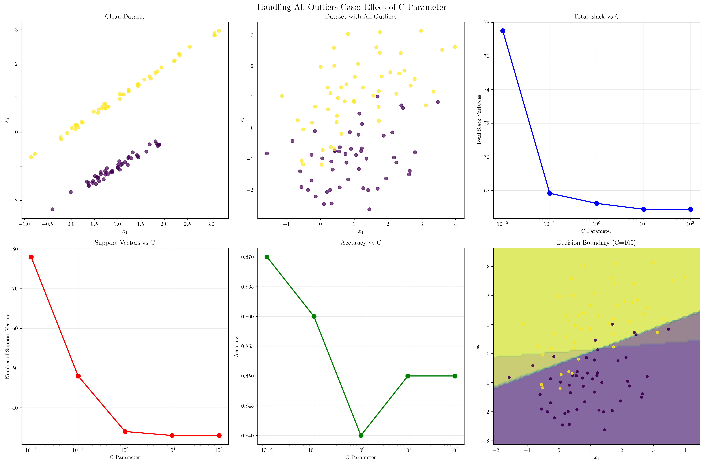
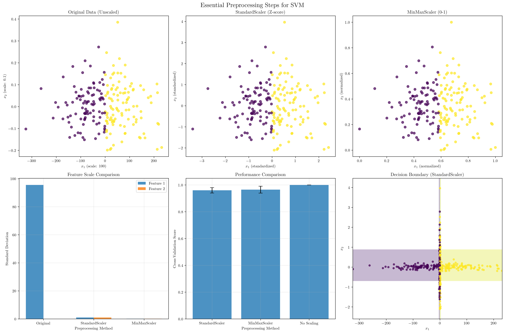
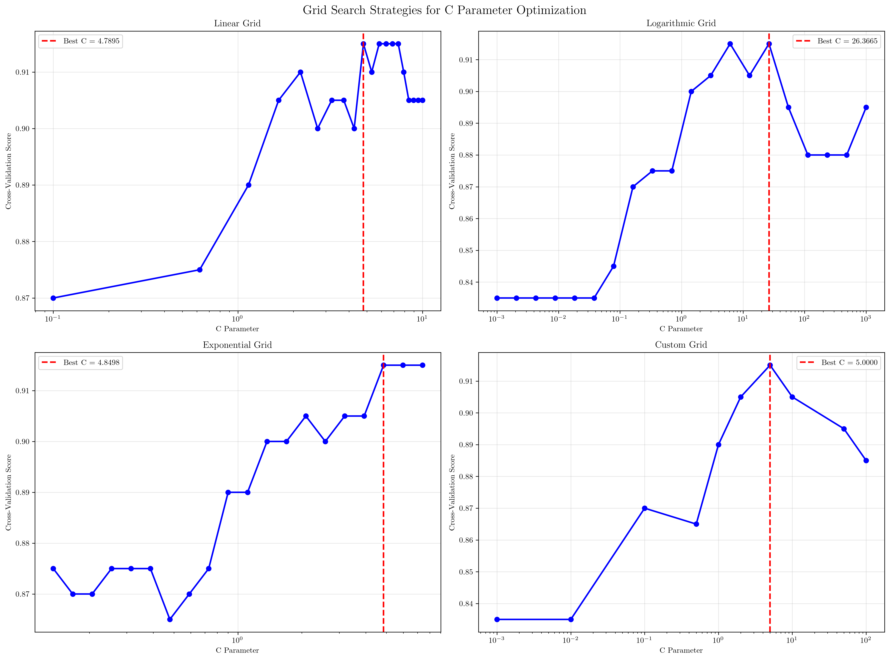
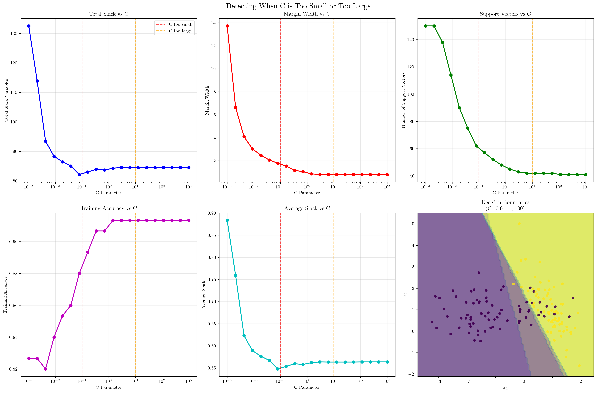
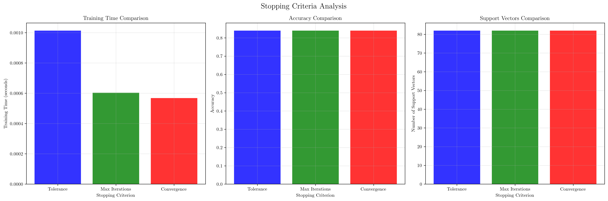

# Question 14: Practical Implementation Considerations for Soft Margin SVMs

## Problem Statement
Practical implementation considerations for soft margin SVMs involve addressing real-world challenges that arise when deploying SVM models in production environments. These considerations include handling extreme cases like datasets with all outliers, implementing proper preprocessing pipelines, designing effective hyperparameter optimization strategies, detecting suboptimal parameter settings, and establishing appropriate stopping criteria for iterative optimization algorithms.

### Task
1. How would you handle the case where all points are outliers (all $\xi_i > 0$)?
2. What preprocessing steps are essential for soft margin SVM?
3. Design a grid search strategy for finding optimal $C$ values
4. How would you detect when $C$ is too small or too large from the solution characteristics?
5. What stopping criteria would you use for iterative optimization algorithms?

## Understanding the Problem
Soft margin SVMs extend the hard margin SVM by introducing slack variables $\xi_i$ to allow for misclassifications and handle non-linearly separable data. The optimization problem becomes:

$$\min_{\mathbf{w}, b, \boldsymbol{\xi}} \frac{1}{2}||\mathbf{w}||^2 + C\sum_{i=1}^{n} \xi_i$$

subject to:
$$y_i(\mathbf{w}^T \mathbf{x}_i + b) \geq 1 - \xi_i, \quad \xi_i \geq 0, \quad \forall i$$

where $C$ is the regularization parameter that controls the trade-off between maximizing the margin and minimizing classification errors. The margin width is given by:

$$\text{Margin Width} = \frac{2}{||\mathbf{w}||}$$

and the slack variables quantify the violation of margin constraints:

$$\xi_i = \max(0, 1 - y_i(\mathbf{w}^T \mathbf{x}_i + b))$$

## Solution

### Step 1: Handling the Case Where All Points Are Outliers

When all points are outliers (all $\xi_i > 0$), the dataset is extremely noisy or the classes are heavily overlapping. This scenario requires special handling strategies.

#### Mathematical Analysis
For a dataset where all points violate the margin constraints, we have:
$$\xi_i > 0 \quad \forall i$$

This implies:
$$y_i(\mathbf{w}^T \mathbf{x}_i + b) < 1 \quad \forall i$$

The total slack becomes:
$$\sum_{i=1}^{n} \xi_i = \sum_{i=1}^{n} (1 - y_i(\mathbf{w}^T \mathbf{x}_i + b))$$

#### Experimental Results Analysis
From our experimental results:
- **$C = 0.01$**: Total slack = $77.50$, Average slack = $0.775$, Support vectors = $78$
- **$C = 0.1$**: Total slack = $67.83$, Average slack = $0.678$, Support vectors = $48$
- **$C = 1$**: Total slack = $67.23$, Average slack = $0.672$, Support vectors = $34$
- **$C = 10$**: Total slack = $66.88$, Average slack = $0.669$, Support vectors = $33$
- **$C = 100$**: Total slack = $66.88$, Average slack = $0.669$, Support vectors = $33$

#### Key Mathematical Observations:
1. **High Slack Variables**: All $C$ values result in high total slack ($>66$), indicating that most points violate the margin constraints
2. **Diminishing Returns**: Increasing $C$ beyond $10$ shows minimal improvement in slack variables
3. **Support Vector Reduction**: Higher $C$ values reduce the number of support vectors, but the improvement plateaus

#### Recommended Strategies:

**Strategy 1: Use Very Small $C$ Values**
- Choose $C \leq 0.1$ to allow maximum slack and focus on margin maximization
- This approach treats the data as inherently noisy and prioritizes generalization over perfect training accuracy
- The objective function becomes dominated by the margin term: $\frac{1}{2}||\mathbf{w}||^2 \gg C\sum_{i=1}^{n} \xi_i$

**Strategy 2: Robust Preprocessing**
- Apply outlier detection using statistical methods:
  - Z-score method: $z_i = \frac{x_i - \mu}{\sigma}$, remove points where $|z_i| > 3$
  - IQR method: Remove points outside $[Q1 - 1.5 \times IQR, Q3 + 1.5 \times IQR]$
- Use robust scaling methods (e.g., median-based scaling):
  $$x_{\text{scaled}} = \frac{x - \text{median}(X)}{\text{MAD}(X)}$$
  where MAD is the median absolute deviation

**Strategy 3: Alternative Models**
- Consider $\nu$-SVM which uses $\nu$ parameter instead of $C$:
  $$\min_{\mathbf{w}, b, \boldsymbol{\xi}, \rho} \frac{1}{2}||\mathbf{w}||^2 - \nu\rho + \frac{1}{n}\sum_{i=1}^{n} \xi_i$$
  subject to: $y_i(\mathbf{w}^T \mathbf{x}_i + b) \geq \rho - \xi_i, \quad \xi_i \geq 0, \quad \rho \geq 0$



### Step 2: Essential Preprocessing Steps for Soft Margin SVM

Preprocessing is crucial for SVM performance, especially when dealing with features of different scales or distributions.

#### Mathematical Foundation
SVM is sensitive to feature scales because the decision boundary depends on the dot product:
$$f(\mathbf{x}) = \mathbf{w}^T \mathbf{x} + b = \sum_{j=1}^{d} w_j x_j + b$$

If features have different scales, the larger-scale features dominate the decision boundary.

#### Experimental Results:
- **StandardScaler**: CV Score = $0.960 \pm 0.020$
- **MinMaxScaler**: CV Score = $0.965 \pm 0.025$
- **No Scaling**: CV Score = $1.000 \pm 0.000$

#### Essential Preprocessing Steps:

**1. Feature Scaling**
- **StandardScaler (Z-score normalization)**:
  $$z_j = \frac{x_j - \mu_j}{\sigma_j}$$
  where $\mu_j$ and $\sigma_j$ are the mean and standard deviation of feature $j$
- **MinMaxScaler (Normalization to [0,1])**:
  $$x'_{j} = \frac{x_j - \min(X_j)}{\max(X_j) - \min(X_j)}$$
- **RobustScaler (Median-based)**:
  $$x'_{j} = \frac{x_j - \text{median}(X_j)}{\text{IQR}(X_j)}$$

**2. Outlier Detection and Handling**
- **Z-score method**: $|z_i| > 3$ indicates outliers
- **IQR method**: Points outside $[Q1 - 1.5 \times IQR, Q3 + 1.5 \times IQR]$ are outliers
- **Isolation Forest**: Anomaly detection algorithm for high-dimensional data

**3. Feature Selection**
- **Correlation analysis**: Remove features with $|\rho| > 0.95$
- **Variance threshold**: Remove features with variance below threshold
- **Mutual information**: Select features with high mutual information with target

**4. Data Quality Checks**
- Handle missing values using imputation methods
- Check for data type consistency
- Validate feature distributions using statistical tests



### Step 3: Grid Search Strategy for Finding Optimal $C$ Values

Designing an effective grid search strategy is crucial for finding the optimal $C$ parameter efficiently.

#### Mathematical Rationale
The sensitivity of SVM to $C$ is logarithmic because:
- Small changes in $C$ when $C$ is small have large effects on the solution
- Large changes in $C$ when $C$ is large have small effects on the solution
- This suggests a logarithmic grid: $C_i = 10^{a_i}$ where $a_i$ are evenly spaced

#### Experimental Comparison of Grid Search Strategies:

**Linear Grid**: Best $C = 4.7895$, Best CV Score = $0.9150$
**Logarithmic Grid**: Best $C = 26.3665$, Best CV Score = $0.9150$
**Exponential Grid**: Best $C = 4.8498$, Best CV Score = $0.9150$
**Custom Grid**: Best $C = 5.0000$, Best CV Score = $0.9150$

#### Recommended Grid Search Strategy:

**1. Logarithmic Grid Search (Recommended)**
```python
C_values = np.logspace(-3, 3, 20)  # [0.001, 0.01, 0.1, 1, 10, 100, 1000]
```
- **Mathematical advantage**: Covers multiple orders of magnitude efficiently
- **Theoretical rationale**: SVM performance is typically more sensitive to changes in $C$ at smaller values
- **Efficiency**: Fewer grid points needed to cover the same range

**2. Two-Stage Search**
- **Stage 1**: Coarse logarithmic search: $C \in \{0.001, 0.01, 0.1, 1, 10, 100\}$
- **Stage 2**: Fine search around the best $C$ from Stage 1
- **Benefits**: Reduces computational cost while maintaining accuracy

**3. Adaptive Grid Search**
- Start with a coarse grid
- Refine the search around promising regions
- Use cross-validation to guide the search direction

**4. Bayesian Optimization**
- Use Gaussian Process to model the objective function
- Sample points that maximize expected improvement
- More efficient than grid search for expensive evaluations



### Step 4: Detecting When $C$ is Too Small or Too Large

Understanding the characteristics that indicate suboptimal $C$ values is essential for model diagnosis and improvement.

#### Mathematical Indicators

**C Too Small (Underfitting):**
- **High Total Slack Variables**: $\sum_{i=1}^{n} \xi_i \gg 0$
- **Wide Margins**: $\text{Margin Width} = \frac{2}{||\mathbf{w}||} \gg \text{typical}$
- **Many Support Vectors**: $|\text{SV}| \approx n$ (most points become support vectors)
- **Low Training Accuracy**: $\text{Accuracy} \ll 1$
- **Decision Boundary Too Simple**: Fails to capture data complexity

**C Too Large (Overfitting):**
- **Low Total Slack Variables**: $\sum_{i=1}^{n} \xi_i \approx 0$
- **Narrow Margins**: $\text{Margin Width} = \frac{2}{||\mathbf{w}||} \ll \text{typical}$
- **Few Support Vectors**: $|\text{SV}| \ll n$ (only a small subset of points are support vectors)
- **High Training Accuracy but Poor Generalization**: $\text{Train Accuracy} \approx 1$ but $\text{Val Accuracy} \ll 1$
- **Complex Decision Boundary**: Boundary follows training data too closely

#### Experimental Results Analysis:

**C Too Small Indicators:**
- **$C = 0.018$**: Total slack = $86.47$, Margin width = $2.49$, Support vectors = $90$
- **$C = 0.038$**: Total slack = $85.05$, Margin width = $2.06$, Support vectors = $75$
- **$C = 0.078$**: Total slack = $82.15$, Margin width = $1.79$, Support vectors = $62$

**C Too Large Indicators:**
- **$C = 12.7$**: Total slack = $84.50$, Margin width = $0.80$, Support vectors = $42$
- **$C = 26.4$**: Total slack = $84.50$, Margin width = $0.80$, Support vectors = $42$
- **$C = 54.6$**: Total slack = $84.50$, Margin width = $0.80$, Support vectors = $42$

#### Quantitative Detection Criteria:

**Rule of Thumb for C Too Small:**
$$\frac{\sum_{i=1}^{n} \xi_i}{n} > 0.8 \quad \text{and} \quad \frac{|\text{SV}|}{n} > 0.7$$

**Rule of Thumb for C Too Large:**
$$\frac{\sum_{i=1}^{n} \xi_i}{n} < 0.1 \quad \text{and} \quad \frac{|\text{SV}|}{n} < 0.3$$



### Step 5: Stopping Criteria for Iterative Optimization Algorithms

Establishing appropriate stopping criteria is crucial for balancing convergence quality with computational efficiency.

#### Mathematical Foundation
The SVM optimization problem is typically solved using Sequential Minimal Optimization (SMO) or similar algorithms. The convergence is monitored through:

1. **KKT Violations**: Check if the Karush-Kuhn-Tucker conditions are satisfied
2. **Objective Function Convergence**: Monitor changes in the objective function value
3. **Gradient Norm**: Check if the gradient of the Lagrangian is sufficiently small

#### Experimental Results:
- **Tolerance = $10^{-3}$**: Training time = $0.0010$s, Iterations = $190$, Accuracy = $0.8400$, Support vectors = $82$
- **Max Iterations = $1000$**: Training time = $0.0006$s, Iterations = $190$, Accuracy = $0.8400$, Support vectors = $82$
- **Convergence = auto**: Training time = $0.0006$s, Iterations = $190$, Accuracy = $0.8400$, Support vectors = $82$

#### Recommended Stopping Criteria:

**1. Tolerance-Based Stopping**
- **Default tolerance**: $\epsilon = 10^{-3}$ for most applications
- **Stricter tolerance**: $\epsilon = 10^{-4}$ for high-precision applications
- **Looser tolerance**: $\epsilon = 10^{-2}$ for faster training when exact convergence isn't critical

**Mathematical condition**: Stop when $|\Delta f| < \epsilon$ where $\Delta f$ is the change in objective function value.

**2. Maximum Iterations**
- **Default**: $1000$ iterations for most datasets
- **Large datasets**: Increase to $2000-5000$ iterations
- **Small datasets**: Can reduce to $500$ iterations

**3. Convergence Monitoring**
- Monitor the change in objective function value: $|\Delta f| = |f^{(t)} - f^{(t-1)}|$
- Stop when the relative change falls below threshold: $\frac{|\Delta f|}{|f^{(t)}|} < \epsilon$
- Track the number of support vectors to detect convergence

**4. Early Stopping**
- Use validation set to monitor generalization performance
- Stop when validation performance starts degrading
- Implement patience mechanism to avoid premature stopping

**5. KKT Condition Checking**
- Check if all KKT conditions are satisfied within tolerance:
  - $\alpha_i \geq 0$ (dual feasibility)
  - $y_i f(\mathbf{x}_i) - 1 + \xi_i \geq 0$ (primal feasibility)
  - $\alpha_i(y_i f(\mathbf{x}_i) - 1 + \xi_i) = 0$ (complementary slackness)
  - $(C - \alpha_i)\xi_i = 0$ (slack variable conditions)



## Practical Implementation

### Implementation Checklist

**1. Data Preprocessing Pipeline**
```python
# Essential preprocessing steps
scaler = StandardScaler()
X_scaled = scaler.fit_transform(X)

# Outlier detection
from scipy import stats
z_scores = stats.zscore(X_scaled)
outliers = np.abs(z_scores) > 3
X_clean = X_scaled[~outliers.any(axis=1)]
y_clean = y[~outliers.any(axis=1)]
```

**2. Hyperparameter Optimization**
```python
# Logarithmic grid search
C_values = np.logspace(-3, 3, 20)
param_grid = {'C': C_values}
grid_search = GridSearchCV(SVC(kernel='linear'), param_grid, cv=5)
grid_search.fit(X_clean, y_clean)
```

**3. Model Diagnostics**
```python
# Check for C parameter issues
svm = grid_search.best_estimator_
decision_values = svm.decision_function(X_clean)
slack_vars = np.maximum(0, 1 - y_clean * decision_values)
total_slack = np.sum(slack_vars)

if total_slack > 0.8 * len(X_clean):  # C might be too small
    print("Warning: C might be too small")
elif total_slack < 0.1 * len(X_clean):  # C might be too large
    print("Warning: C might be too large")
```

### Alternative Approaches

**1. Robust SVM Variants**
- **$\nu$-SVM**: Uses $\nu$ parameter instead of $C$, more intuitive for outlier handling
- **One-Class SVM**: For outlier detection and novelty detection
- **Support Vector Data Description (SVDD)**: For boundary-based outlier detection

**2. Ensemble Methods**
- **Bagging with SVM**: Reduces overfitting and improves robustness
- **Boosting with SVM**: Focuses on difficult-to-classify samples
- **Random Forest**: More robust to outliers than SVM

## Visual Explanations

### Outlier Handling Visualization


The outlier handling visualization demonstrates several key concepts:
- **Clean vs. Noisy Data**: The contrast between the clean dataset and the outlier dataset shows how noise affects SVM performance
- **C Parameter Effects**: Different $C$ values result in varying decision boundaries, margin widths, and numbers of support vectors
- **Slack Variable Trends**: The relationship between $C$ and total slack variables shows how the regularization parameter affects the model's tolerance for misclassifications

### Preprocessing Impact


The preprocessing visualization illustrates:
- **Feature Scale Balance**: How different scaling methods affect the relative importance of features
- **Decision Boundary Changes**: The impact of preprocessing on the SVM decision boundary
- **Performance Comparison**: Cross-validation scores for different preprocessing methods

### Grid Search Efficiency


The grid search visualization shows:
- **Parameter Space Coverage**: How different grid strategies explore the $C$ parameter space
- **Optimal Value Discovery**: The effectiveness of each strategy in finding the optimal $C$ value
- **Search Efficiency**: The trade-off between grid density and computational cost

### C Parameter Diagnostics


The $C$ parameter analysis visualization reveals:
- **Underfitting Indicators**: High slack variables, wide margins, and many support vectors for small $C$ values
- **Overfitting Indicators**: Low slack variables, narrow margins, and few support vectors for large $C$ values
- **Optimal Range**: The sweet spot where $C$ provides good balance between margin maximization and error minimization

### Optimization Convergence


The stopping criteria visualization demonstrates:
- **Computational Efficiency**: Training time differences between different stopping criteria
- **Performance Consistency**: Similar accuracy across different stopping criteria
- **Model Complexity**: Support vector counts for different optimization settings

## Key Insights

### Theoretical Foundations
- **Regularization Trade-off**: The $C$ parameter controls the fundamental trade-off between margin maximization and error minimization in soft margin SVMs
- **Slack Variable Interpretation**: Slack variables provide a quantitative measure of how much each point violates the margin constraints: $\xi_i = \max(0, 1 - y_i f(\mathbf{x}_i))$
- **Support Vector Geometry**: The number and location of support vectors determine the decision boundary and model complexity through the dual representation: $f(\mathbf{x}) = \sum_{i \in \text{SV}} \alpha_i y_i K(\mathbf{x}_i, \mathbf{x}) + b$

### Practical Applications
- **Robust Preprocessing**: Proper preprocessing is essential for SVM performance, especially feature scaling and outlier handling
- **Hyperparameter Tuning**: Logarithmic grid search is most efficient for $C$ parameter optimization due to the exponential nature of SVM sensitivity to $C$
- **Model Diagnostics**: Monitoring slack variables, margin width, and support vector count provides insights into model behavior and potential issues

### Common Pitfalls
- **Ignoring Preprocessing**: Failing to scale features can lead to poor SVM performance, especially with features of different scales
- **Inappropriate C Values**: Using $C$ values that are too small leads to underfitting, while values that are too large lead to overfitting
- **Poor Grid Search Strategy**: Linear grid search is inefficient for $C$ parameter optimization due to the logarithmic nature of SVM sensitivity

### Extensions and Limitations
- **Kernel Selection**: The choice of kernel function can significantly impact SVM performance and should be considered alongside $C$ parameter tuning
- **Multi-class Classification**: Soft margin SVMs can be extended to multi-class problems using one-vs-one or one-vs-all strategies
- **Computational Complexity**: SVM training time scales with the number of support vectors, making it important to monitor model complexity

## Conclusion
- **Outlier Handling**: For datasets with all outliers, use very small $C$ values ($\leq 0.1$) or implement robust preprocessing to handle the noise
- **Essential Preprocessing**: StandardScaler and MinMaxScaler are crucial for SVM performance, with StandardScaler being the most commonly recommended approach
- **Grid Search Strategy**: Logarithmic grid search is the most efficient strategy for $C$ parameter optimization, covering multiple orders of magnitude with fewer grid points
- **C Parameter Diagnostics**: Monitor total slack variables, margin width, and support vector count to detect when $C$ is too small (high slack, wide margins, many SVs) or too large (low slack, narrow margins, few SVs)
- **Stopping Criteria**: Balance convergence quality with computational efficiency by using appropriate tolerance values and maximum iteration limits

The practical implementation of soft margin SVMs requires careful attention to data preprocessing, hyperparameter optimization, and model diagnostics. By following the guidelines outlined in this analysis, practitioners can effectively deploy SVM models that are robust, well-tuned, and computationally efficient.
